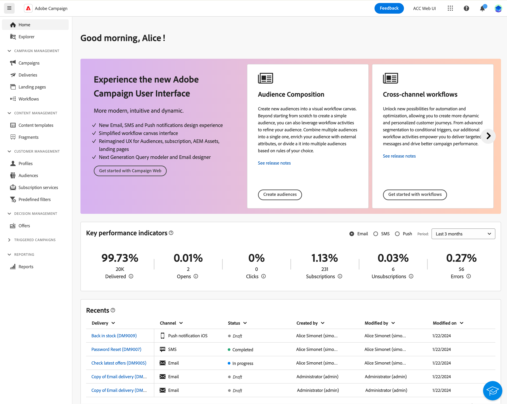
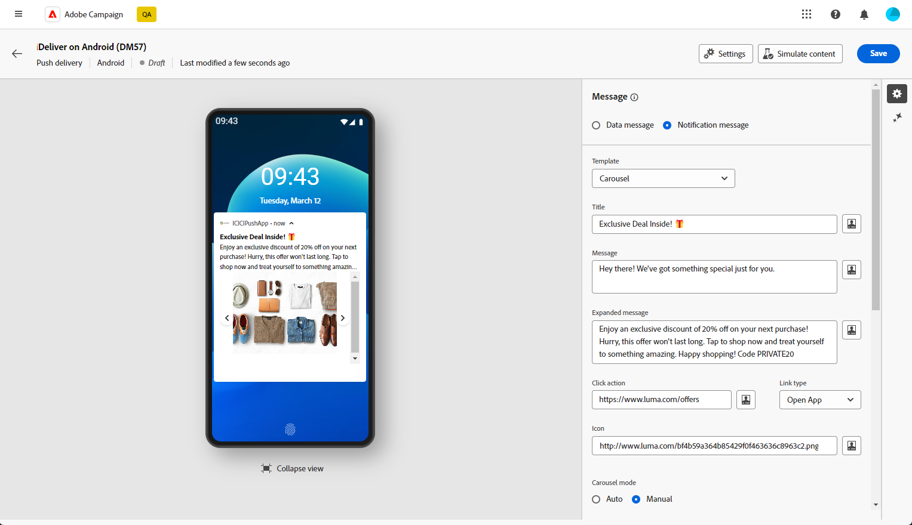

# Da Campaign Standard a v8 {#ac-acs}

Benvenuti in Adobe Campaign v8!

In qualità di utente che passa da Campaign Standard a Campaign v8, questa guida di riferimento è stata progettata per te. Consente di acquisire familiarità con il nuovo ambiente Campaign e di eseguire i passaggi necessari per iniziare a svolgere il ruolo.

1. Inizia imparando [le novità di Adobe Campaign v8](#new).

1. Comprendi [le differenze di esperienza tra Adobe Campaign Standard e Adobe Campaign v8 in base al tuo ruolo](#experiences).

## Novità {#new}

Dai un’occhiata ai miglioramenti più recenti nell’interfaccia utente web di Adobe Campaign in questa pagina. Per un elenco completo delle funzionalità chiave e degli aggiornamenti delle versioni, vedi [questa sezione](../../v8/rn/whats-new.md).

### Miglioramenti con Campaign v8 {#ac-enhancements}

I miglioramenti principali in arrivo con Adobe Campaign v8 sono elencati di seguito.

* **Interfaccia utente Web**

  Adobe Campaign v8 offre sia una console client che un’interfaccia utente web, in base a preferenze ed esigenze diverse. La console client offre una potente esperienza di applicazione desktop, mentre l’interfaccia utente web è progettata per essere intuitiva e accessibile, rendendola una scelta ideale per gli esperti di marketing che hanno familiarità con Adobe Campaign Standard.

  L’interfaccia utente web ha molte somiglianze con Adobe Campaign Standard, anche se alcune terminologie possono essere diverse.

  Puoi [ulteriori informazioni sull&#39;interfaccia utente di Adobe Campaign Web qui](../../v8/campaign-web-home.md).

  {zoomable="yes"}

  Tutte le nuove funzionalità e i miglioramenti sono elencati nelle [Note sulla versione](../../v8/rn/release-notes.md). Le versioni dell’interfaccia utente web di Adobe Campaign funzionano secondo un modello di consegna continua che consente un approccio più scalabile e graduale alla distribuzione delle funzioni. Di conseguenza, queste note sulla versione vengono aggiornate più volte al mese. Consultale regolarmente.

* **Prestazioni**

  Adobe Campaign v8 sfrutta tecnologie di database avanzate su scala cloud, con conseguente miglioramento significativo delle prestazioni e dell’efficienza. Questa architettura riprogettata offre diversi vantaggi chiave:

   * *Scala*: il sistema ora supporta un aumento sostanziale delle funzionalità di elaborazione, con un throughput di elaborazione batch che raggiunge fino a **20 milioni di operazioni all&#39;ora**. Con questa nuova architettura, profili ancora più elevati possono essere gestiti con prestazioni prevedibili.
   * *Velocità*: il sistema è stato migliorato per qualsiasi attività di marketing: segmentazione, preparazione della consegna o velocità effettiva per i messaggi transazionali, attualmente pari a **1 milioni all&#39;ora**.

  I servizi cloud completamente gestiti offrono all&#39;utente:

   * Esplorazione dei dati in tempo reale: accedi e analizza immediatamente i dati per ottenere informazioni approfondite e processi decisionali più informati.

   * Creazione rapida di tipi di pubblico: crea facilmente tipi di pubblico mirati in pochi minuti, per una segmentazione più efficiente delle campagne.

  Nel complesso, la solida architettura di Adobe Campaign v8 fornisce una base potente per la gestione di campagne di marketing estese e complesse con velocità ed efficienza migliorate.

### Nuove funzioni di Adobe Campaign v8 {#ac-new-features}

In qualità di utente Campaign Standard che passa ad Adobe Campaign v8, ora sono disponibili le seguenti funzioni:

* **Push avanzato**

  Adobe Campaign v8 offre la possibilità di inviare notifiche push potenziate, che possono catturare l’attenzione degli utenti e incoraggiarli a intraprendere azioni. Queste notifiche possono includere diversi elementi come testo, immagini, pulsanti, timer di conto alla rovescia, suoni e così via.

  {zoomable="yes"}

  Per facilitare la creazione di queste notifiche avanzate, Adobe Campaign v8 fornisce vari modelli che consentono di progettare e personalizzare il contenuto di notifiche complesse, come caroselli o timer.

  Puoi personalizzare le notifiche in base al sistema del cliente:

   * Per [modelli Android](../../v8/push/rich-push.md)

   * Per i modelli [iOs](../../v8/push/rich-push.md)

  Le notifiche push sono uno strumento fondamentale per coinvolgere gli utenti delle app mobili, consentendoti di raggiungerli anche quando non utilizzano attivamente l’app.

* **Adobe Experience Manager as a Cloud Service**

  Adobe Campaign v8 è perfettamente integrato con Adobe Experience Manager as a Cloud Service, per consentirti di offrire ai clienti esperienze personalizzate e ricche di contenuti. Questa integrazione nativa semplifica la gestione dei contenuti e sfrutta le solide funzionalità di Adobe Experience Manager per ottimizzare le attività di marketing.

  Di seguito sono riportate le funzioni chiave abilitate da questa integrazione:

   * *Gestione risorse*: in Adobe Campaign v8, e-mail designer fornisce un selettore per accedere e gestire le risorse. Questa funzione semplifica l’integrazione di elementi da Adobe Experience Manager nella distribuzione, rendendo più efficiente la gestione dei contenuti. [Ulteriori informazioni sulla gestione delle risorse](../../v8/integrations/aem-assets.md)

     {zoomable="yes"}

   * *Importazione modello e-mail*: Adobe Campaign v8 consente di sfogliare e importare modelli e-mail da Adobe Experience Manager direttamente in Campaign. [Ulteriori informazioni sull&#39;importazione di modelli e-mail](../../v8/integrations/aem-content.md)

     {zoomable="yes"}

  Adobe Experience Manager as a Cloud Service offre un’agilità nativa per il cloud, che consente di accelerare il time-to-value e adattarsi alle esigenze aziendali in evoluzione. Questa integrazione non solo migliora le funzionalità di gestione dei contenuti, ma ti consente anche di fornire esperienze più personalizzate e coinvolgenti ai clienti in tutti i punti di contatto.

* **Assistente IA - Acceleratore contenuto**

  L’Assistente all’intelligenza artificiale di Campaign rende la creazione e l’esecuzione di campagne di marketing su canali diversi, come e-mail, SMS e push intuitivi, semplici e senza problemi, risparmiando tempo, migliorando l’efficienza e ottenendo risultati migliori.

  {zoomable="yes"}

  L’Assistente AI rivoluziona il modo in cui crei contenuti professionali e coerenti con il brand su tutti i canali. Con modelli GenAI avanzati e una profonda comprensione delle linee guida del brand, AI Assistant genera automaticamente contenuti personalizzati, coinvolgenti ed efficaci in base all’obiettivo di marketing, con contenuti ottimizzati per stili, layout, toni e altro ancora delineati dal brand.

  Ai Assistant rende la creazione e l’esecuzione di campagne di marketing intuitiva, semplice e senza problemi, risparmiando tempo, migliorando l’efficienza e ottenendo risultati migliori.

  {zoomable="yes"}

  Fornisce una variante di modelli e-mail e genera e rigenera le immagini. Ulteriori informazioni sull&#39;Assistente IA - Acceleratore contenuto in [questa sezione](../../v8/email/generative-content.md). In Adobe Campaign v8 è disponibile l&#39;assistente di intelligenza artificiale per [E-mail](../../v8/email/generative-content.md), [SMS](../../v8/email/generative-sms.md) e [Push](../../v8/email/generative-push.md).

* **Infrastruttura SMS aggiornata - SMS v2.0**

  La semplicità e la facilità d&#39;uso degli SMS lo rendono un canale di comunicazione molto utile, oltre alla sua robustezza e compatibilità ineguagliabile su miliardi di terminali.

  Adobe Campaign v8 viene fornito con una nuova infrastruttura che migliora l’invio di SMS. [Ulteriori informazioni sulle nuove impostazioni SMS](https://experienceleague.adobe.com/en/docs/campaign/campaign-v8/send/sms/sms){target="_blank"}.

* **Infrastruttura push aggiornata**

  Adobe Campaign v8 introduce il servizio di notifica push più recente, basato su un solido framework basato su una tecnologia all’avanguardia. Questo servizio è progettato per sbloccare nuovi livelli di scalabilità, garantendo che le notifiche possano raggiungere un pubblico più ampio con una perfetta efficienza. Con la nostra infrastruttura migliorata e i nostri processi ottimizzati, puoi aspettarti maggiore scalabilità e affidabilità, consentendoti di interagire e connettersi con gli utenti delle app mobili come mai prima d’ora.

  [Ulteriori informazioni sull&#39;infrastruttura push aggiornata](https://experienceleague.adobe.com/en/docs/campaign/campaign-v8/send/push/push-data-collection){target="_blank"}.

## Managed Services {#ac-managed-services}

Adobe Campaign v8 è disponibile come Cloud Services gestito, fornisce supervisione proattiva, avvisi tempestivi e governance dei servizi. Il Cloud Service gestito da Adobe offre agli addetti al marketing una soluzione di gestione delle campagne cross-channel più agile, sicura e scalabile con un basso costo totale di proprietà. La nuova offerta unisce i servizi a una sorveglianza proattiva e a un avviso tempestivo.

## Funzionalità di Campaign Standard aggiunte a v8 {#ac-v8-added}

Le funzionalità principali di Campaign Standard sono state aggiunte a Campaign v8, per una transizione fluida. Queste sono descritte nel dettaglio in [questa documentazione](https://experienceleague.adobe.com/docs/experience-cloud/campaign/campaign-standard-migration-home.html?lang=it){target="_blank"}.

* **Reporting dinamico**: il reporting dinamico fornisce rapporti completamente personalizzabili e in tempo reale per misurare l’impatto delle attività di marketing. In più, questa funzione consente anche di accedere ai dati del profilo, abilitando l’analisi demografica per dimensioni come genere, città ed età, oltre ai dati funzionali delle campagne e-mail come aperture e clic. [Ulteriori informazioni](https://experienceleague.adobe.com/docs/experience-cloud/campaign/reporting/get-started-reporting.html?lang=it){target="_blank"}.

* **Branding centralizzato**: ogni azienda dispone di linee guida visive e tecniche per il brand. Con Adobe Campaign, puoi definire una serie di specifiche per presentare ai clienti un brand coerente, dai loghi agli aspetti tecnici, come il mittente dell’e-mail, l’URL o i domini. [Ulteriori informazioni](https://experienceleague.adobe.com/docs/experience-cloud/campaign/branding/branding-gs.html?lang=it)

* **API REST**: in qualità di utente di Campaign Standard che ha eseguito la migrazione, puoi utilizzare le API Rest per creare integrazioni per Adobe Campaign e costruire il tuo ecosistema interfacciandoti con il pannello di tecnologie utilizzato. [Ulteriori informazioni](https://experienceleague.adobe.com/docs/experience-cloud/campaign/apis/get-started-apis.html?lang=it){target="_blank"}.

* **Pagine di destinazione**: sono stati apportati alcuni miglioramenti alle pagine di destinazione di Campaign v8 per garantire la parità delle funzionalità con Campaign Standard. Per ulteriori informazioni, consulta le [note sulla versione](../../v8/rn/release-notes.md#new-24-4) e la pagina di destinazione della [documentazione](../../v8/landing-pages/get-started-lp.md).

* **Frammenti visivi**: i frammenti visivi sono componenti visivi riutilizzabili a cui è possibile fare riferimento in una o più consegne e-mail o in modelli di contenuto. Quando si modifica un frammento, viene aggiornato ogni contenuto che lo utilizza. Questa funzionalità consente di precreare più blocchi di contenuto personalizzati che possono essere utilizzati dagli utenti di marketing per assemblare rapidamente i contenuti dei messaggi in un processo di progettazione migliorato. [Ulteriori informazioni](../../v8//content/use-visual-fragments.md)

## Differenze chiave tra Campaign Standard e Campaign v8 {#experiences}

La maggior parte dei concetti di Adobe Campaign v8 e Adobe Campaign Standard sono simili. Tuttavia, esistono alcune differenze, come descritto di seguito.

### Modifiche terminologiche {#terminology-changes}

Di seguito sono riportate alcune differenze terminologiche tra Campaign Standard e Campaign v8.

* Le risorse personalizzate sono **Schemi**
* I messaggi sono indicati come **Consegne**
* Gli utenti del prodotto sono **Operatori**
* I ruoli sono configurati con **Diritti denominati**
* I gruppi di sicurezza sono **Gruppi di operatori**
* Le unità organizzative sono gestite attraverso le **Autorizzazioni cartella**

Inoltre, in qualità di utente esistente di Campaign, tieni presente che alcuni concetti sono stati rinominati per allinearsi ai più recenti standard terminologici. Queste modifiche si applicano solo all’interfaccia utente di Campaign Web e non vengono riportate nella console client. Tali modifiche sono riepilogate di seguito.

* I destinatari sono ora **Profili**. [Ulteriori informazioni](../../v8/audience/gs-audiences-recipients.md).
* Gli indirizzi seed sono ora **Profili di test**. [Ulteriori informazioni](../../v8/preview-test/test-deliveries.md).
* L’analisi della consegna ora si chiama **preparazione della consegna**. Per avviare la preparazione di un messaggio, fai clic sul pulsante **Prepara**. [Ulteriori informazioni](../../v8/monitor/prepare-send.md).
* L’anteprima e-mail è ora disponibile tramite il pulsante **Simula contenuto.** [Ulteriori informazioni](../../v8/preview-test/preview-test.md)
* Gli elenchi ora sono **Tipi di pubblico**. [Ulteriori informazioni](../../v8/audience/gs-audiences-recipients.md).

## Nuova esperienza utente

Per scoprire la nuova esperienza utente con Adobe Campaign v8, accedi alla guida di riferimento pertinente per il tuo ruolo.

<table>
<tr>
  <td>
    
    

  </td>
  <td>
  
    

  </td>
  </tr>
  <tr>
    <td>
    <a href="marketers.md">
    <strong>Addetto marketing</strong>
    </a>
    </td>
    <td>
      <a href="admin-developers.md">
      <strong>Amministratore o sviluppatore</strong>
      </a>
    </td>
  </tr>
    <td>
    <em>Gestione campagne, Specialista marketing multimediale</em>
    </td>
    <td>
      <em> amministratore di sistema, specialista di marketing tecnico</em>
    </td>
  <tr>
    <td>
    <b>Le attività/responsabilità principali includono:</b>
    </td>
      <td>
    <b>Le attività/responsabilità principali includono:</b>
    </td>
  </tr>
  <tr>
    <td>
      <li>Creare campagne di marketing
      <li>Progettazione di flussi di lavoro
      <li>Testare ed eseguire campagne
      <li>Distribuire campagne multicanale
      <li>Ottimizzare le campagne
      <li>Ottimizzare le campagne automatizzate
    </td>
    <td>
        <li>Gestione degli accessi
        <li>Configurazione del sistema
        <li>Personalizzazione del sistema
    </td>
</tr>
</table>

<!--
## Deprecated items

Adobe constantly evaluates product capabilities to identify older features that should be replaced with more modern alternatives to improve overall customer value, always under careful consideration of backward compatibility.

Please refer to [this documentation for information on deprecated items](https://experienceleague.adobe.com/en/docs/campaign-standard/using/release-notes/deprecated-features).-->
