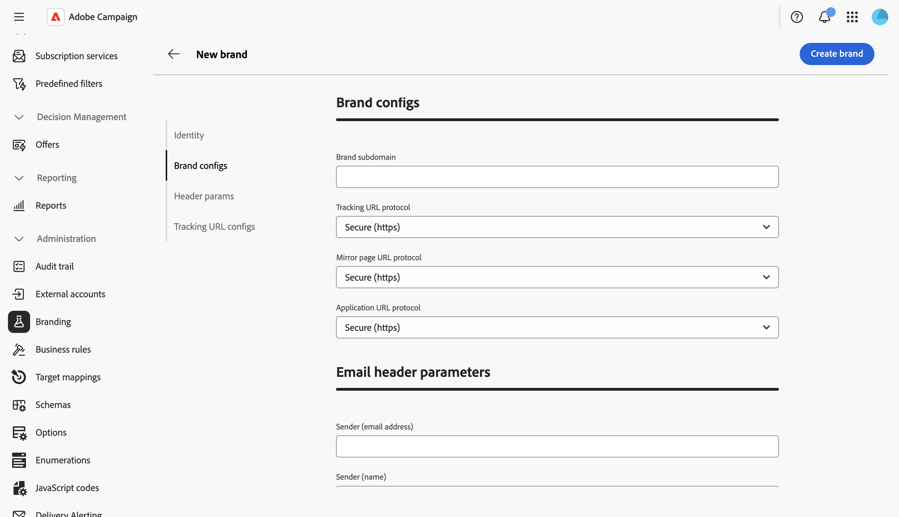

# Configurare i brand {#branding-configure}

Gli amministratori tecnici possono creare e gestire più brand direttamente dall’interfaccia utente web. Questo ti consente di definire tutti gli elementi che compongono la tua brand identity, compresi i loghi e anche le impostazioni di tracciamento delle e-mail.

>[!NOTE]
>
>Questa funzionalità richiede il pacchetto di branding nell’istanza. Se non trovi il menu **Branding**, contatta il rappresentante Adobe.

## Creare o modificare un brand {#create-edit-brand}

>[!CONTEXTUALHELP]
>id="acw_branding_create"
>title="Creare un brand"
>abstract="Fai clic su **Crea marchio** per definire una nuova brand identity. Compila i dettagli del brand nelle schede di configurazione, quindi fai clic su **Crea brand** per salvare. Il brand diventa disponibile per essere collegato a modelli di consegna e consegne autonome."

Per creare un nuovo brand, segui questi passaggi:

1. Passa a **[!UICONTROL Amministrazione > Branding]** dal menu a sinistra oppure a **[!UICONTROL Amministrazione > Piattaforma > Branding]** da **[!UICONTROL Explorer]**.

1. Fai clic sul pulsante **[!UICONTROL Crea marchio]** sopra l&#39;elenco.

   

1. Inserisci i dettagli del brand nelle diverse sezioni. Ogni campo è descritto nella sezione [Attributi del marchio](#brand-attributes) seguente.

   

1. Fai clic su **[!UICONTROL Crea marchio]** per salvare. Il brand è ora disponibile per essere collegato a modelli di consegna e consegne autonome. [Scopri come assegnare un marchio](branding-assign.md).

Per modificare un brand esistente, selezionalo dall’elenco, aggiorna i campi e salva le modifiche.

## Attributi del brand {#brand-attributes}

Un **[!UICONTROL Marchio]** è configurato in quattro sezioni: **[!UICONTROL Identità]**, **[!UICONTROL Configurazioni marchio]**, **[!UICONTROL Parametri intestazione e-mail]** e **[!UICONTROL Parametri di tracciamento URL]**.

### Identità {#identity}

La sezione **[!UICONTROL Identity]** ti consente di definire e personalizzare il brand.

Questa sezione contiene i seguenti campi:

* **[!UICONTROL Marchio]**: il nome del tuo marchio. Questo campo è obbligatorio.
* **[!UICONTROL Etichetta]**: etichetta visibile nell&#39;interfaccia.
* **[!UICONTROL ID]**: identificatore interno generato automaticamente. Puoi cambiarla. Sono consentiti solo lettere, cifre e trattini bassi. I caratteri speciali vengono sostituiti da trattini bassi.
* **[!UICONTROL URL logo]**: l&#39;URL dell&#39;immagine del logo del brand.
* **[!UICONTROL URL sito Web]** e **[!UICONTROL Etichetta sito Web]**: l&#39;URL del sito Web e l&#39;etichetta associati al marchio.

### Configurazioni del brand {#brand-configs}

Nella sezione **[!UICONTROL Configurazioni marchio]** puoi definire il sottodominio e i protocolli URL utilizzati per il tracciamento e l&#39;accesso alle pagine di destinazione.

Questa sezione contiene i seguenti campi:

* **[!UICONTROL Sottodominio marchio]**: l&#39;URL del sottodominio specifico di questo marchio, richiesto per la delega da Adobe.
* **[!UICONTROL Protocollo URL di tracciamento]**, **[!UICONTROL Protocollo URL pagina mirror]** e **[!UICONTROL Protocollo URL applicazione]**: Protocollo utilizzato per ogni tipo di URL, ad esempio **Protetto (https)**.

>[!NOTE]
>
>La configurazione per i server di monitoraggio, mirroring e applicazioni viene memorizzata in account esterni separati associati al routing. Queste impostazioni vengono applicate durante il provisioning e non devono essere modificate. Per visualizzare gli URL, accedi alla scheda **[!UICONTROL Prefissi di branding]** dal tuo account esterno.

### Parametri di intestazione e-mail {#header-param}

I **[!UICONTROL parametri di intestazione e-mail]** ti consentono di personalizzare ciò che i destinatari vedranno nella sezione di intestazione delle campagne.

Questa sezione contiene i seguenti campi:

* **[!UICONTROL Sender (email address)]**: indirizzo e-mail del brand.
* **[!UICONTROL Sender (name)]**: nome del brand.
* **[!UICONTROL Risposta (indirizzo e-mail)]**: l&#39;indirizzo e-mail a cui il cliente può rispondere.
* **[!UICONTROL Rispondi a (nome)]**: nome visualizzato per le risposte.
* **[!UICONTROL Errore (indirizzo e-mail)]**: indirizzo e-mail da utilizzare in caso di errore.

<!--
>[!IMPORTANT]
>
>After having updated the header parameters of the emails, if the name and email address of the sender have not changed in the email created from the template, check the template's advanced settings.
-->

### Parametri di tracciamento URL {#tracking-param}

Nella sezione **[!UICONTROL Parametri di tracciamento URL]** puoi migliorare il tracciamento URL definendo parametri aggiuntivi per l&#39;integrazione con strumenti di analisi web come Adobe Analytics e Google Analytics.

Questa sezione contiene i seguenti campi:

* **[!UICONTROL Parametri URL aggiuntivi]**: aggiungi parametri come coppie chiave-valore insieme alle relative condizioni di applicabilità. Ogni nome di parametro deve essere univoco e non vuoto e ogni valore di parametro non deve essere vuoto. La condizione di applicabilità può essere vuota, ma nessuno di questi valori può includere tag JST.

* **[!UICONTROL Elenco consentiti nomi di dominio]**: aggiungi nomi di dominio o espressioni regolari corrispondenti agli URL a cui verranno aggiunti i parametri di tracciamento.

**Esempio:** Un URL tracciato come `https://www.luma.com` diventerà `https://www.luma.com/?age=21&deliveryName=DM101` quando i parametri aggiuntivi `age=21` e `deliveryName=DM101` saranno configurati per tale dominio.

## Configurare il branding per la messaggistica transazionale {#branding-transactional-config}

>[!IMPORTANT]
>
>Questa sezione si applica solo alla messaggistica transazionale (Centro messaggi).
>
>Anche se le funzionalità transazionali sono disponibili nell’interfaccia utente di Campaign Web, i passaggi seguenti devono essere eseguiti nella console client di Campaign v8 (istanza di controllo).

Se utilizzi la messaggistica transazionale (Centro messaggi) con il branding, è necessaria una configurazione aggiuntiva.

### Tracciamento delle formule per le istanze in tempo reale

Quando si attiva il branding su un’istanza di controllo in tempo reale (RT), vengono utilizzate opzioni di tracciamento specifiche per gestire le formule di tracciamento. Queste formule vengono configurate centralmente nell&#39;istanza di controllo RT anziché singolarmente in ogni istanza di esecuzione RT.

Le seguenti opzioni definiscono le formule di tracciamento utilizzate dalle consegne RT:

* **`NmsTracking_RT_ClickFormula`**: specifica la formula utilizzata per il tracciamento dei clic sulle istanze RT

* **`NmsTracking_RT_OpenFormula`**: specifica la formula utilizzata per il tracciamento delle aperture nelle istanze RT

Se la tua implementazione richiede formule di tracciamento personalizzate per la messaggistica transazionale, utilizza l’opzione seguente:

* **`Branding_RT_ListXtkOptions_toPublish`**: elencare i nomi delle opzioni XTK per le formule personalizzate qui (separati da virgole). In questo modo, le consegne RT possono applicare le formule di tracciamento personalizzate.
