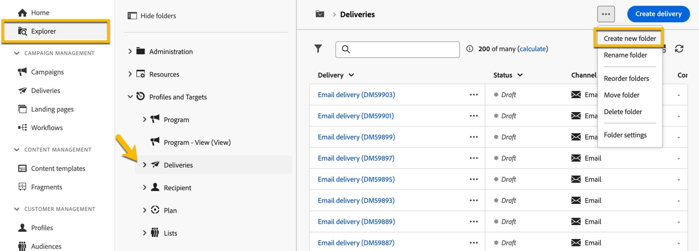
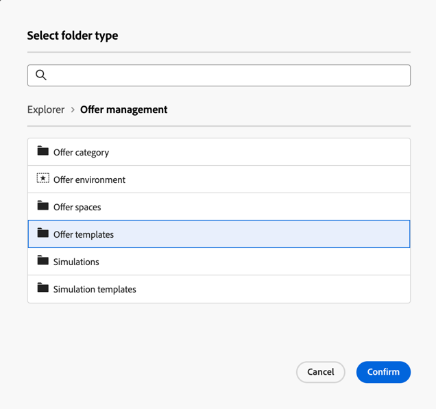

# Creare e gestire una cartella

In Adobe Campaign puoi creare nuove cartelle per gestire la struttura di navigazione. In **[!UICONTROL Explorer]**, passa alla cartella in cui desideri creare la nuova cartella.

Nel pulsante **[!UICONTROL ...]**, seleziona **[!UICONTROL Crea nuova cartella]**.

{zoomable="yes"}

Per impostazione predefinita, quando viene creata una nuova cartella, il tipo di cartella corrisponde a quello della cartella principale.\
In questo esempio viene creata una cartella nella cartella **[!UICONTROL Consegne]**.

{zoomable="yes"}

Per modificare il tipo di cartella, fai clic sull’icona Tipo di cartella e seleziona un tipo dall’elenco presentato.

{zoomable="yes"}

Imposta il tipo di cartella facendo clic sul pulsante **[!UICONTROL Conferma]**.

Per creare una cartella senza un tipo specifico, selezionare il tipo **[!UICONTROL Cartella generica]**.

Nella console di Adobe Campaign, il processo di creazione e gestione delle cartelle è illustrato [qui](https://experienceleague.adobe.com/it/docs/campaign/campaign-v8/config/configuration/folders-and-views). Puoi anche impostare le autorizzazioni per le cartelle. [Ulteriori informazioni](https://experienceleague.adobe.com/it/docs/campaign/campaign-v8/admin/permissions/folder-permissions).