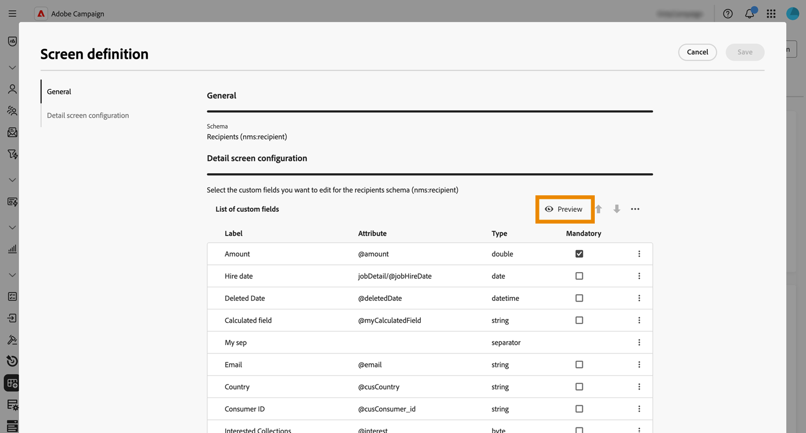

# Configurare i campi personalizzati {#custom-fields}

>[!CONTEXTUALHELP]
>id="acw_schema_editcustomfields"
>title="Modifica dello schermo"
>abstract="Vengono visualizzati tutti i campi dell’interfaccia personalizzati per lo schema selezionato. È possibile modificare l’ordine in cui vengono visualizzati nell’interfaccia tramite le frecce su e giù e raggruppare i campi in sottosezioni mediante l’aggiunta di separatori. Per eliminare un campo personalizzato o modificare impostazioni quali le condizioni di visibilità, fai clic sul pulsante con i puntini di sospensione."

>[!CONTEXTUALHELP]
>id="acw_schema_editcustomfields_settings_general"
>title="Generale"
>abstract="Definisci le impostazioni generali del campo personalizzato. Se non viene specificata un’etichetta, verrà visualizzata quella definita nello schema. Utilizza il campo **Visibile se** per definire una condizione attraverso un’espressione XTK che stabilisce quando viene visualizzato il campo. Puoi anche contrassegnare il campo come obbligatorio o di sola lettura nell’interfaccia."

>[!CONTEXTUALHELP]
>id="acw_schema_editcustomfields_settings_link"
>title="Proprietà collegamento"
>abstract="Utilizza il query modeler per specificare le regole per la visualizzazione di un campo personalizzato di tipo collegamento. Ad esempio, puoi limitare i valori di elenco in base all’input di un altro campo."

>[!CONTEXTUALHELP]
>id="acw_schema_editcustomfields_settings_layout"
>title="Layout"
>abstract="Per impostazione predefinita, i campi personalizzati vengono visualizzati nell’interfaccia su due colonne. Attiva questa opzione per visualizzare i campi personalizzati su tutta la larghezza dello schermo anziché su due colonne."

>[!CONTEXTUALHELP]
>id="acw_schema_editcustomfields_separatorproperties"
>title="Proprietà separatore"
>abstract="Specifica il nome da visualizzare nell’interfaccia per la sottosezione."

<!-- NOT USED IN THE UI?-->

>[!CONTEXTUALHELP]
>id="acw_schema_editcustomfields_settings"
>title="Impostazioni attributo"
>abstract="Impostazioni attributo"

I campi personalizzati sono attributi aggiuntivi aggiunti a schemi predefiniti tramite la console Adobe Campaign. Consentono di personalizzare gli schemi includendo nuovi attributi in base alle esigenze dell’organizzazione. Scopri come estendere uno schema nella [documentazione di Adobe Campaign v8](https://experienceleague.adobe.com/docs/campaign/campaign-v8/developer/shemas-forms/extend-schema.html?lang=it){target="_blank"}.

I campi personalizzati possono essere visualizzati in varie schermate, ad esempio nei dettagli del profilo nell’interfaccia web di Campaign. Gli amministratori possono controllare quali campi sono visibili e come appaiono. Queste modifiche si applicano a tutti gli utenti di Campaign.

>[!NOTE]
>
>Per gestire i campi personalizzati è necessario disporre dei diritti di amministratore.

I campi personalizzati sono disponibili per i seguenti schemi:

* Campagne (nms)
* Piani (nms)
* Programmi (nms)
* Destinatari (nms)
* Indirizzi seed (nms)
* Consegne (nms)

## Aggiungere campi personalizzati all’interfaccia {#add-custom}

>[!CONTEXTUALHELP]
>id="acw_schema_screen_definition"
>title="Definizione della schermata"
>abstract="Definisci l’elenco dei campi personalizzati da modificare per lo schema e le relative proprietà. Fai clic sul pulsante **Anteprima** per visualizzare i campi personalizzati in una schermata di esempio."

Per visualizzare i campi personalizzati nell’interfaccia, effettua le seguenti operazioni:

1. Individuare lo schema desiderato dal menu **[!UICONTROL Schemi]** nel riquadro di navigazione a sinistra.

   Utilizza il filtro **[!UICONTROL Modificabile]** nel riquadro dei filtri per identificare rapidamente gli schemi con campi personalizzati.

   

1. Seleziona il nome dello schema nell’elenco per aprirlo. Viene visualizzata una vista di schema dettagliata. [Ulteriori informazioni sui dettagli dello schema](../administration/schemas.md). Fai clic sul pulsante **[!UICONTROL Screen edition]** per accedere ai campi personalizzati. In questo esempio vengono aggiunti campi per lo schema **[!UICONTROL Destinatari]**.

   

   Viene visualizzato l’elenco dei campi personalizzati visualizzati nell’interfaccia dello schema.

1. Fai clic sul pulsante **[!UICONTROL Anteprima]** per visualizzare i campi personalizzati in una schermata di esempio.

   

   In questo caso, il campo &quot;Importo&quot; è stato contrassegnato come obbligatorio.

   

1. Per aggiungere un campo personalizzato all’interfaccia, fai clic sul pulsante con i puntini di sospensione e scegli una delle seguenti opzioni:

   * **[!UICONTROL Seleziona campi personalizzati]**: seleziona uno o più campi personalizzati da visualizzare nell&#39;interfaccia.
   * **[!UICONTROL Compila automaticamente l&#39;elenco dei campi personalizzati]**: aggiungi all&#39;interfaccia tutti i campi personalizzati definiti per lo schema.

   

1. Una volta aggiunti i campi personalizzati, puoi:

   * **Riordina campi**: usa le frecce su e giù oppure sposta i campi trascinandoli.
   * **Rendi obbligatori i campi**: seleziona la casella di controllo **Obbligatorio**.
   * **Modifica impostazioni campo**: fai clic sul pulsante con i puntini di sospensione e scegli **[!UICONTROL Modifica]**. [Ulteriori informazioni](#settings)
   * **Elimina campi**: fai clic sul pulsante con i puntini di sospensione e scegli **[!UICONTROL Elimina]**.
   * **Organizza i campi in sottosezioni nell&#39;interfaccia**: fai clic sul pulsante con i puntini di sospensione accanto alle frecce su e giù e scegli **[!UICONTROL Aggiungi separatore]**. [Ulteriori informazioni](#separator)

## Configurare le impostazioni dei campi personalizzati {#settings}

Per configurare impostazioni specifiche per ciascun campo personalizzato, fare clic sul pulsante con i puntini di sospensione accanto al campo desiderato e selezionare **[!UICONTROL Modifica]**.

Le impostazioni disponibili sono:

* **[!UICONTROL Attributo]**: nome del campo personalizzato.
* **[!UICONTROL Etichetta (personalizzata)]**: l&#39;etichetta da visualizzare nell&#39;interfaccia. Se non viene fornita alcuna etichetta, verrà visualizzata l’etichetta definita nello schema.
* **[!UICONTROL Visibile se]**: definire una condizione utilizzando un&#39;espressione xtk che controlla quando viene visualizzato il campo. Nascondere ad esempio questo campo se un altro campo è vuoto.
* **[!UICONTROL Obbligatorio]**: rendi obbligatorio il campo nell&#39;interfaccia.
* **[!UICONTROL Sola lettura]**: rendere il campo di sola lettura nell&#39;interfaccia. Gli utenti non potranno modificare il valore del campo.
* **[!UICONTROL Impostazioni filtro]** (per campi di tipo collegamento): utilizzare il modellatore di query per specificare le regole per la visualizzazione di un campo personalizzato di tipo collegamento. Ad esempio, puoi limitare i valori di elenco in base all’input di un altro campo.

  È inoltre possibile fare riferimento al valore immesso in altri campi nelle condizioni utilizzando la sintassi `$(<field-name>)`. Ciò ti consente di fare riferimento al valore corrente di un campo come immesso nel modulo, anche se non è ancora stato salvato nel database.

  Nell’esempio seguente, la condizione controlla se il valore del campo @ref corrisponde al valore immesso nel campo @refCom. Se invece si utilizza `@refCom` invece di `$(@refCom)`, verrà fatto riferimento al valore del campo @ref esistente nel database.

  +++Esempio di visualizzazione

  

  +++

* **[!UICONTROL Estendi due colonne]**: per impostazione predefinita, i campi personalizzati vengono visualizzati nell&#39;interfaccia in due colonne. Attiva questa opzione per visualizzare i campi personalizzati su tutta la larghezza dello schermo anziché su due colonne.

## Organizzare i campi personalizzati in sottosezioni {#separator}

L’interfaccia utente di Campaign Web consente di aggiungere separatori ai campi personalizzati di gruppo nell’interfaccia di per migliorarne la leggibilità. Per farlo, segui questi passaggi:

1. Fai clic sul pulsante con i puntini di sospensione accanto alle frecce su e giù e seleziona **[!UICONTROL Aggiungi separatore]**.

1. All&#39;elenco viene aggiunta una nuova riga che rappresenta il separatore. Fai clic sul pulsante con i puntini di sospensione e scegli **[!UICONTROL Modifica]** per denominare la sottosezione.

1. Utilizzare le frecce su e giù per spostare il separatore nella posizione desiderata. I campi elencati sotto il separatore verranno raggruppati sotto di esso.

   In questo esempio, i campi &quot;Raccolte interessate&quot; e &quot;Marchio&quot; sono raggruppati in una sottosezione &quot;Raccolta&quot;.

   | Configurazione campi personalizzati | Rendering nell’interfaccia |
   |  ---  |  ---  |
   | {zoomable="yes"} | {zoomable="yes"} |