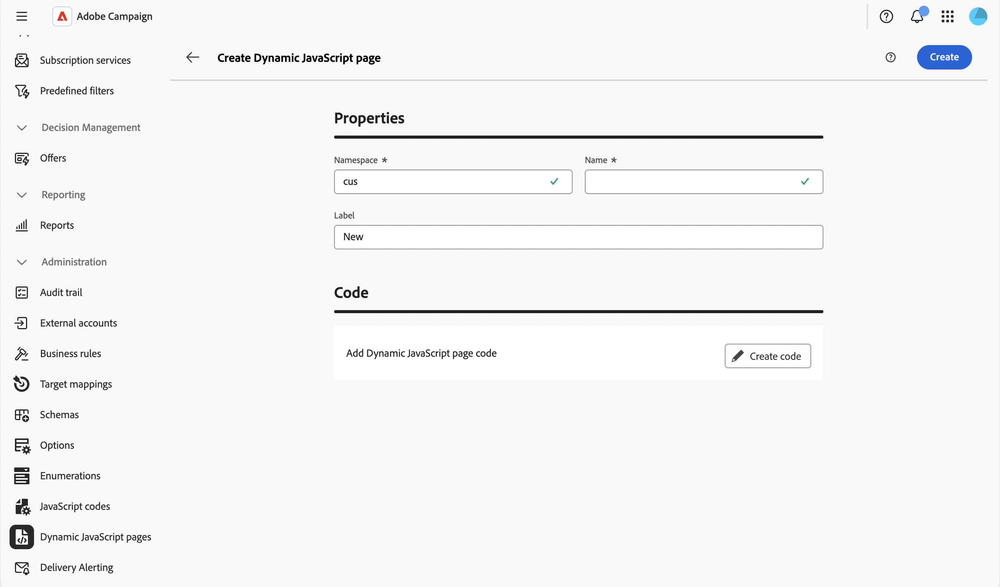

# Utilizzare pagine JavaScript dinamiche {#dynamic-javascript-pages}

>[!CONTEXTUALHELP]
>id="acw_dynamic_javascript_pages_list"
>title="Pagine JavaScript dinamiche"
>abstract="Le pagine JavaScript dinamiche (JSSP) consentono di creare pagine lato server che generano contenuto dinamico quando si accede tramite un URL, ad esempio API personalizzate, esportazioni o logica dell’applicazione web. Da questo elenco è possibile creare, modificare, duplicare o eliminare una pagina JavaScript dinamica."

>[!CONTEXTUALHELP]
>id="acw_dynamic_javascript_pages_create"
>title="Crea pagina JavaScript dinamica"
>abstract="Definisci uno spazio dei nomi, un nome e un’etichetta per la pagina JavaScript dinamica, quindi scrivine il contenuto utilizzando il codice JavaScript. Una volta creati, lo spazio dei nomi e il nome non possono essere modificati."

## Informazioni sulle pagine JavaScript dinamiche {#about}

Le pagine JavaScript dinamiche (JSSP) consentono di creare pagine lato server che generano contenuto dinamico quando si accede tramite un URL, ad esempio API personalizzate, esportazioni o logica dell’applicazione web. Queste pagine sono memorizzate nel menu **[!UICONTROL Amministrazione]** > **[!UICONTROL Pagine JavaScript dinamiche]** nel riquadro di navigazione a sinistra.

Dall’elenco delle pagine JavaScript dinamiche, puoi:

* **Duplicare o eliminare una pagina**: fare clic sul pulsante con i puntini di sospensione e selezionare l&#39;azione desiderata.
* **Modifica una pagina**: fai clic sul nome di una pagina per aprirne le proprietà, apportare le modifiche e salvare.
* **Crea una nuova pagina JavaScript dinamica**: fare clic sul pulsante **[!UICONTROL Crea pagina JavaScript dinamica]**.

<!--
>[!NOTE]
>
>In the Campaign console, dynamic JavaScript pages are available under **[!UICONTROL Administration]** > **[!UICONTROL Configuration]** > **[!UICONTROL Dynamic JavaScript pages]**. Although the menu location differs from the Web user interface, the list is identical and operates like a mirror.
-->

## Creare una pagina JavaScript dinamica {#create}

Per creare una pagina JavaScript dinamica, effettua le seguenti operazioni:

1. Passare al menu **[!UICONTROL Pagine Dynamic JavaScript]** e fare clic sul pulsante **[!UICONTROL Crea pagina Dynamic JavaScript]**.

1. Definisci le proprietà della pagina:

   * **[!UICONTROL Spazio dei nomi]**: specifica lo spazio dei nomi relativo alle risorse personalizzate. Per impostazione predefinita, lo spazio dei nomi è &quot;cus&quot;, ma può variare a seconda dell’implementazione.
   * **[!UICONTROL Nome]**: identificatore univoco utilizzato per fare riferimento alla pagina.
   * **[!UICONTROL Etichetta]**: etichetta descrittiva visualizzata nell&#39;elenco delle pagine JavaScript dinamiche.

   

   >[!NOTE]
   >
   >Una volta creati, i campi **[!UICONTROL Spazio dei nomi]** e **[!UICONTROL Nome]** non possono essere modificati. Per apportare modifiche, duplica la pagina e aggiornala in base alle esigenze.

1. Fai clic sul pulsante **[!UICONTROL Crea codice]** per definire il contenuto della pagina, quindi scrivi il codice JSSP utilizzando `<%@ page %>` direttive e `NL.require()` chiamate per caricare le librerie principali.

   

1. Fai clic su **[!UICONTROL Conferma]** per salvare il codice.

1. Quando la pagina JavaScript dinamica è pronta, fare clic su **[!UICONTROL Crea]**. La pagina è ora accessibile da un URL creato dal relativo spazio dei nomi e nome, nel formato `https://<your-instance>/<namespace>/<name>`. Ad esempio, una pagina denominata `recipientAPI.jssp` nello spazio dei nomi `cus` è accessibile in `https://<your-instance>/cus/recipientAPI.jssp`.

Per ulteriori informazioni sulle funzioni riutilizzabili di JavaScript, fare riferimento a [Operazioni con i codici JavaScript](javascript-codes.md).
