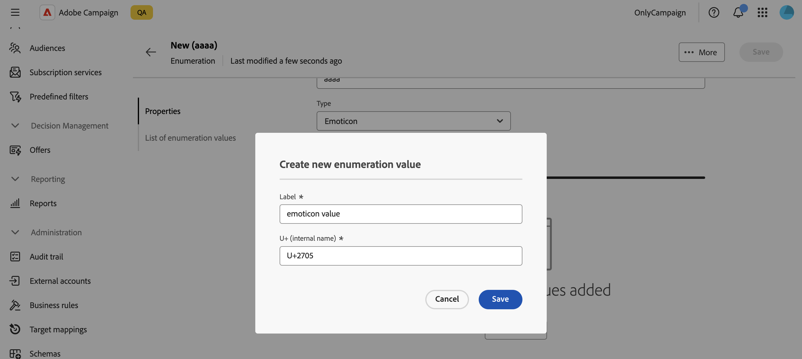
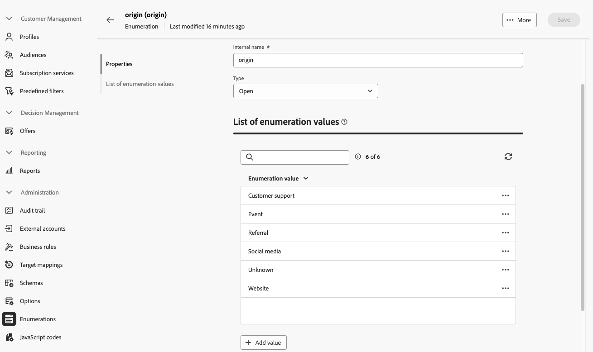

# Gestire le enumerazioni {#enumerations}

>[!CONTEXTUALHELP]
>id="acw_enumerations_list"
>title="Enumerazioni"
>abstract="Un’enumerazione è un elenco di valori suggeriti dal sistema per compilare i campi. Le enumerazioni possono essere utilizzate per standardizzare i valori di tali campi, aiutare con l’input di dati o l’uso all’interno delle query."

>[!CONTEXTUALHELP]
>id="acw_enumerations_properties"
>title="Proprietà"
>abstract="Definisci le proprietà dell’enumerazione, ad esempio il nome, il nome interno e il tipo. Le enumerazioni **[!UICONTROL Closed]** hanno un elenco fisso di valori che possono essere modificati solo dal menu **[!UICONTROL Enumerations]**. Le enumerazioni **[!UICONTROL Open]** consentono agli utenti di aggiungere nuovi valori direttamente nei campi basati su questa enumerazione. Le enumerazioni **[!UICONTROL System]** sono associate ai campi di sistema. Le enumerazioni **[!UICONTROL Emoticon]** vengono utilizzate per aggiornare l&#39;elenco delle emoticon."

>[!CONTEXTUALHELP]
>id="acw_enumerations_values"
>title="Elenco dei valori di enumerazione"
>abstract="Per aggiungere un valore all&#39;enumerazione, fare clic sul pulsante **[!UICONTROL Aggiungi valore]** e configurarlo in base alle esigenze."

## Cosa sono le enumerazioni? {#about}

Un’enumerazione è un elenco di valori suggeriti dal sistema per compilare i campi. Utilizza le enumerazioni per standardizzare i valori di questi campi, aiutarti con l’input di dati o utilizzare all’interno di query. L&#39;elenco di valori viene visualizzato come elenco a discesa dal quale è possibile selezionare il valore da immettere nel campo. L’elenco a discesa consente inoltre l’input predittivo: inserisci le prime lettere e l’applicazione compila le altre.

I valori per questo tipo di campo sono definiti tramite il menu **[!UICONTROL Amministrazione]** / **[!UICONTROL Enumerazioni]** nel riquadro di spostamento a sinistra.

## Creare un’enumerazione {#create}

Per creare un’enumerazione, effettua le seguenti operazioni:

1. Passa al menu **[!UICONTROL Enumerazioni]**, quindi fai clic sul pulsante **[!UICONTROL Crea enumerazione]**.

1. Immettere un **[!UICONTROL etichetta]** e un **[!UICONTROL nome interno]** per l&#39;enumerazione.

   

1. Selezionare l&#39;enumerazione **[!UICONTROL Type]**:

   * Le enumerazioni **[!UICONTROL Closed]** hanno un elenco fisso di valori che possono essere modificati solo dal menu **[!UICONTROL Enumerations]**.
   * Le enumerazioni **[!UICONTROL Open]** consentono agli utenti di aggiungere nuovi valori direttamente nei campi basati su questa enumerazione.
   * Le enumerazioni **[!UICONTROL System]** sono associate ai campi di sistema.
   * Le enumerazioni **[!UICONTROL Emoticon]** vengono utilizzate per aggiornare l&#39;elenco delle emoticon.

1. Fai clic su **[!UICONTROL Crea]**. Vengono visualizzati i dettagli di enumerazione, che consentono di aggiungere valori all’elenco.

   

1. Per aggiungere un valore, fare clic sul pulsante **[!UICONTROL Aggiungi valore]**, quindi configurarlo in base alle esigenze:

   * **[!UICONTROL Etichetta]**: etichetta da visualizzare nell&#39;enumerazione.
   * **[!UICONTROL Nome interno]**: il nome interno del valore (per le enumerazioni di sistema).
   * **[!UICONTROL U+ (nome interno)]** (enumerazioni emoticon): codice unicode per l&#39;emoticon (per le enumerazioni emoticon).

   

1. Salva le modifiche. L’enumerazione viene ora aggiornata nelle schermate in cui viene utilizzata.

## Caso d’uso: aggiungere valori predefiniti a un’enumerazione {#uc}

Per impostazione predefinita, il campo &quot;Origine&quot; nella schermata dei dettagli del profilo consente agli utenti di immettere liberamente qualsiasi valore.

Ogni volta che un utente immette un valore per il campo, questo viene aggiunto automaticamente all’enumerazione &quot;Origin&quot;, che nel tempo può causare valori ridondanti, incoerenti o errati nell’elenco dei valori.

Per garantire la coerenza dei dati e guidare gli utenti durante la compilazione del campo, puoi definire un set di valori predefiniti. Segui questi passaggi:

1. Vai al menu **[!UICONTROL Enumerazioni]** e apri l&#39;enumerazione &quot;Origin&quot;.

2. Rivedi l’elenco dei valori immessi dall’utente e puliscilo. Fai clic sul pulsante con i puntini di sospensione accanto a un valore per eliminarlo. Se l&#39;elenco contiene troppe incoerenze, eliminare l&#39;intera enumerazione e ricrearla da zero.

   

3. Aggiungere valori predefiniti. A tale scopo, fare clic sul pulsante **[!UICONTROL Aggiungi valore]** e immettere i valori predefiniti che gli utenti devono selezionare.

   

4. Per applicare la coerenza, impostare il tipo di enumerazione su **[!UICONTROL Chiuso]**, che limita gli utenti ai valori predefiniti.
Se è necessaria flessibilità, tienilo **[!UICONTROL aperto]** per consentire nuove voci utente.

5. Torna alla schermata dei dettagli del profilo. Nel campo &quot;Origin&quot; vengono ora visualizzati i valori predefiniti per la selezione.

   
