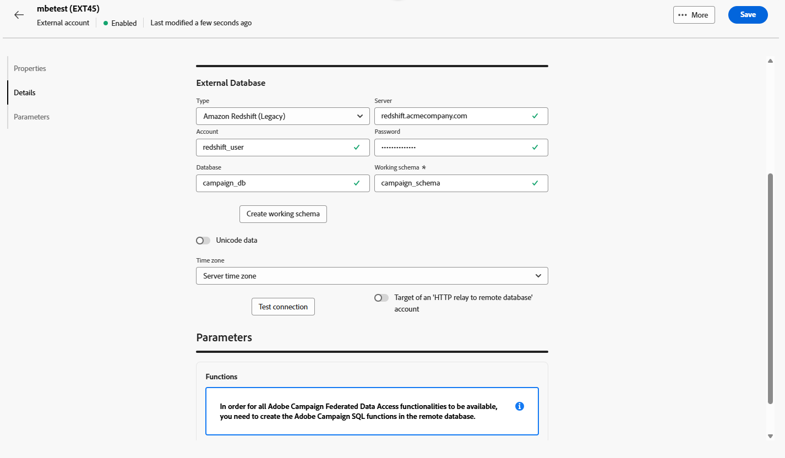
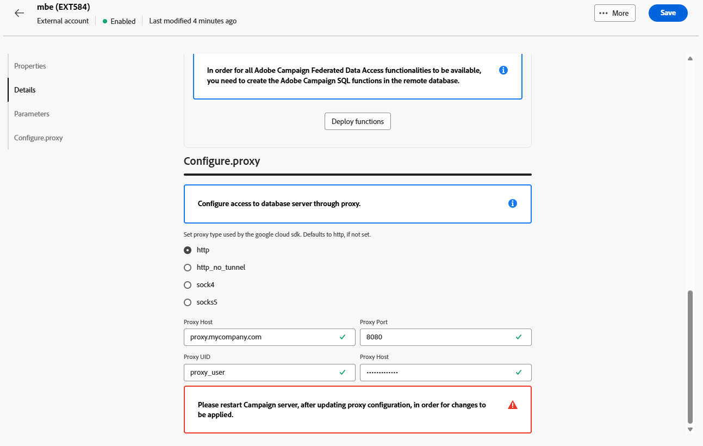
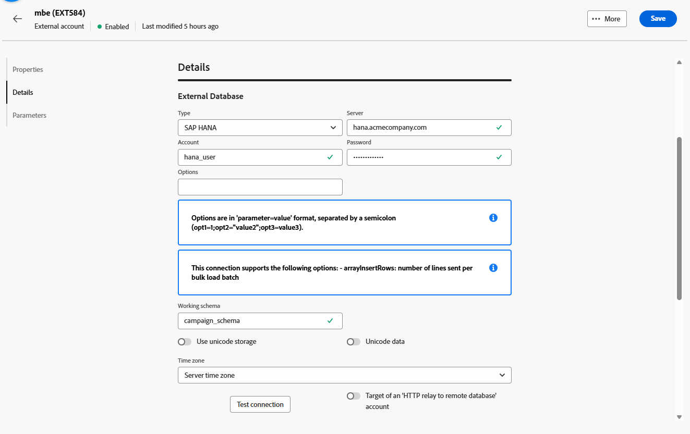
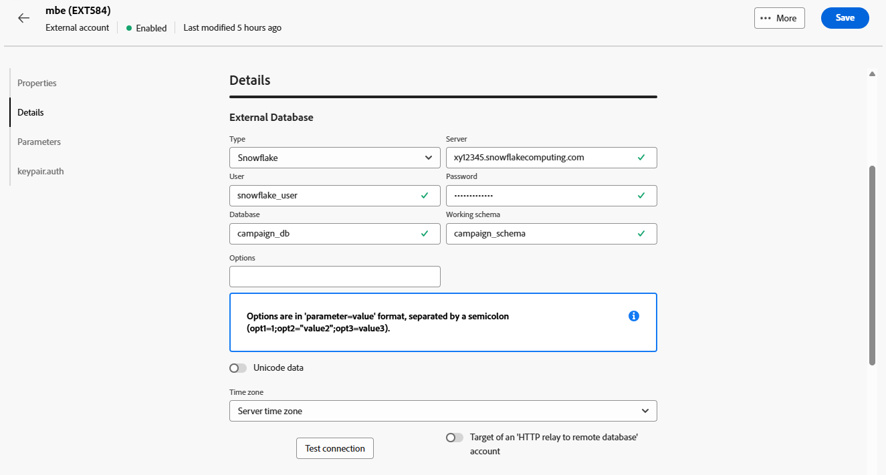

# Account di database esterni {#external-accounts}

Utilizza un account esterno di tipo database esterno per collegare Adobe Campaign a un database di terze parti.

Le impostazioni di configurazione per l’account esterno variano a seconda del motore di database a cui ti stai connettendo. Le istruzioni dettagliate per ciascun database supportato sono disponibili nelle sezioni seguenti.

## Amazon Redshift

L’account esterno Amazon Redshift ti consente di collegare l’istanza Campaign al database esterno Amazon Redshift.

Nell’interfaccia utente di Adobe Campaign Web, configura l’account esterno Amazon Redshift.

1. [Crea il tuo account esterno](external-account.md) e seleziona **[!UICONTROL Database esterno]** come **[!UICONTROL Tipo]** del tuo account esterno e Amazon Redshift come **[!UICONTROL Tipo provider]**.

1. Fai clic su **[!UICONTROL Crea]**.

1. Per configurare l&#39;account esterno **[!UICONTROL Amazon Redshift]**, compilare i campi seguenti:

   * **[!UICONTROL Tipo]**: Amazon Redshift

   * **[!UICONTROL Server]**: immettere il nome DNS del server Redshift.

   * **[!UICONTROL Account]**: fornire il nome utente Redshift che verrà utilizzato per l&#39;autenticazione.

   * **[!UICONTROL Password]**: immettere la password associata all&#39;account utente.

   * **[!UICONTROL Database]**: specificare il nome del database se non è già definito nel DSN. Lasciare vuoto questo campo se il DSN include il database.

   * **[!UICONTROL Schema di lavoro]**: inserisci il nome dello schema in cui funzionerà Adobe Campaign.

   * **[!UICONTROL Opzioni]**: aggiungi tutte le opzioni di configurazione avanzate che potrebbero essere richieste dal tuo ambiente.

   * **[!UICONTROL Fuso orario]**: selezionare o immettere il fuso orario del server per garantire operazioni precise basate sull&#39;ora.

   

1. Dopo aver configurato la connessione, creare le funzioni SQL di Adobe Campaign nel database Redshift remoto. Quando queste funzioni saranno disponibili, fare clic su **[!UICONTROL Distribuisci funzioni]** per attivarle.

1. Collega l&#39;**[!UICONTROL account di archiviazione]** per ottimizzare le prestazioni e consentire processi di caricamento dati più rapidi tra Adobe Campaign e Amazon Redshift.

1. Immetti il **[!UICONTROL ruolo account]** che determina le autorizzazioni che Adobe Campaign utilizzerà quando interagisce con il tuo ambiente Redshift.

## Amazon Redshift (legacy)

L’account esterno Amazon Redshift (legacy) ti consente di collegare l’istanza Campaign al database esterno Amazon Redshift.

Nell’interfaccia utente di Adobe Campaign Web, configura l’account esterno Amazon Redshift (legacy).

1. [Crea il tuo account esterno](external-account.md) e seleziona **[!UICONTROL Database esterno]** come **[!UICONTROL Tipo]** del tuo account esterno e Amazon Redshift (legacy) come **[!UICONTROL Tipo provider]**.

1. Fai clic su **[!UICONTROL Crea]**.

1. Per configurare l&#39;account esterno **[!UICONTROL Amazon Redshift (legacy)]**, compilare i campi seguenti:

   * **[!UICONTROL Tipo]**: Amazon Redshift (legacy)

   * **[!UICONTROL Server]**: immettere il nome DNS del server Redshift.

   * **[!UICONTROL Account]**: fornire il nome utente Redshift che verrà utilizzato per l&#39;autenticazione.

   * **[!UICONTROL Password]**: immettere la password associata all&#39;account utente.

   * **[!UICONTROL Database]**: specificare il nome del database se non è già definito nel DSN. Lasciare vuoto questo campo se il DSN include il database.

   * **[!UICONTROL Schema di lavoro]**: inserisci il nome dello schema in cui funzionerà Adobe Campaign.

   * **[!UICONTROL Fuso orario]**: selezionare o immettere il fuso orario del server per garantire operazioni precise basate sull&#39;ora.

   

1. Dopo aver configurato la connessione, creare le funzioni SQL di Adobe Campaign nel database Redshift remoto. Quando queste funzioni saranno disponibili, fare clic su **[!UICONTROL Distribuisci funzioni]** per attivarle.

## Azure Synapse Analytics

L’account esterno Azure Synapse Analytics ti consente di collegare l’istanza Campaign al database esterno Azure Synapse.

Nell’interfaccia utente di Adobe Campaign Web, configura l’account esterno di Azure Synapse Analytics.

1. [Crea il tuo account esterno](external-account.md) e seleziona **[!UICONTROL Database esterno]** come **[!UICONTROL Tipo]** del tuo account esterno e Amazon Redshift come **[!UICONTROL Tipo provider]**.

1. Fai clic su **[!UICONTROL Crea]**.

1. Per configurare l&#39;account esterno **[!UICONTROL Azure Synapse Analytics]**, compilare i campi seguenti:

   * **[!UICONTROL Tipo]**: Azure Synapse Analytics

   * **[!UICONTROL Server]**: immettere l&#39;URL del server Azure Synapse.

   * **[!UICONTROL Account]**: specificare il nome utente che verrà autenticato con il database Synapse.

   * **[!UICONTROL Password]**: immettere la password associata all&#39;account.

   * **[!UICONTROL Database]**: specificare il database di destinazione a cui si desidera connettere Adobe Campaign.

   * **[!UICONTROL Prefisso tabelle e funzioni]**: per impostazione predefinita, è impostato sul nome account. Puoi modificarlo se preferisci utilizzare un prefisso diverso per identificare gli oggetti correlati a Campaign.

   * **[!UICONTROL Opzioni]**: aggiungi tutte le opzioni di configurazione avanzate che potrebbero essere richieste dal tuo ambiente.

   * **[!UICONTROL Fuso orario]**: selezionare o immettere il fuso orario del server per garantire operazioni precise basate sull&#39;ora.

   

1. È possibile scegliere di abilitare l&#39;opzione **[!UICONTROL Usa una tablespace di lavoro per le tabelle]**, quindi specificare la **[!UICONTROL tablespace delle tabelle]** in cui verranno archiviate le tabelle di lavoro.

1. Se necessario, abilitare l&#39;opzione **[!UICONTROL Usa una tablespace di lavoro per gli indici]**, quindi specificare la tablespace **[!UICONTROL Indici]**.

   

1. Dopo aver configurato la connessione, crea le funzioni SQL di Adobe Campaign nel database remoto di Azure Synapse Analytics. Quando queste funzioni saranno disponibili, fare clic su **[!UICONTROL Distribuisci funzioni]** per attivarle.

## Databricks

L’account esterno Databricks consente di collegare l’istanza Campaign al database esterno Databricks.

Nell’interfaccia utente di Adobe Campaign Web, configura l’account esterno Database.

1. [Crea il tuo account esterno](external-account.md) e seleziona **[!UICONTROL Database esterno]** come **[!UICONTROL Tipo]** del tuo account esterno e Database come **[!UICONTROL Tipo provider]**.

1. Fai clic su **[!UICONTROL Crea]**.

1. Per configurare l&#39;account esterno **[!UICONTROL Database]**, compilare i campi seguenti:

   * **[!UICONTROL Tipo]**: Database

   * **[!UICONTROL Server]**: immettere il nome DNS del server Databricks.

   * **[!UICONTROL Account]**: specifica il nome utente Database che verrà utilizzato per l&#39;autenticazione.

   * **[!UICONTROL Password]**: immettere la password associata all&#39;account utente.

   * **[!UICONTROL Catalogo]**: specificare il catalogo da utilizzare.

   * **[!UICONTROL Schema di lavoro]**: immetti il nome dello schema in cui Adobe Campaign creerà e gestirà i suoi oggetti di lavoro.

   * **[!UICONTROL Opzioni]**: aggiungi tutte le opzioni di configurazione avanzate che potrebbero essere richieste dal tuo ambiente.

   

1. Dopo aver configurato la connessione, creare le funzioni SQL di Adobe Campaign nel database remoto Databricks. Quando queste funzioni saranno disponibili, fare clic su **[!UICONTROL Distribuisci funzioni]** per attivarle.

1. Collega l&#39;**[!UICONTROL account di archiviazione]** per ottimizzare le prestazioni e consentire processi di caricamento dati più rapidi tra Adobe Campaign e Databricks.

## BigQuery Google

L’account esterno Google BigQuery ti consente di collegare l’istanza Campaign al database esterno Google BigQuery.

Nell’interfaccia utente di Adobe Campaign Web, configura l’account esterno Google BigQuery.

1. [Crea il tuo account esterno](external-account.md) e seleziona **[!UICONTROL Database esterno]** come **[!UICONTROL Tipo]** del tuo account esterno e Google BigQuery come **[!UICONTROL Tipo provider]**.

1. Fai clic su **[!UICONTROL Crea]**.

1. Per configurare l&#39;account esterno **[!UICONTROL Google BigQuery]**, compilare i campi seguenti:

   * **[!UICONTROL Tipo]**: BigQuery Google

   * **[!UICONTROL Account]**: immetti il nome utente o l&#39;account di servizio che Adobe Campaign utilizzerà per connettersi a BigQuery.

   * **[!UICONTROL Metodo di caricamento file di accesso]**: scegliere come fornire la chiave dell&#39;account del servizio immettendo manualmente il percorso del file chiave o caricando il file chiave direttamente sul server.

   * **[!UICONTROL Server]**: se si seleziona l&#39;opzione di immissione manuale, specificare l&#39;URL del server.

   * **[!UICONTROL Progetto]**: specifica l&#39;ID progetto Google Cloud associato alla tua istanza BigQuery.

   * **[!UICONTROL Set di dati]**: immettere il nome del set di dati in cui Adobe Campaign memorizzerà ed eseguirà la query dei dati.

   * **[!UICONTROL Opzioni]**: aggiungi tutte le opzioni di configurazione avanzate che potrebbero essere richieste dal tuo ambiente.

   

1. In **[!UICONTROL Parametri]**, incolla il contenuto del file JSON della chiave dell&#39;account del servizio per autenticare Adobe Campaign con Google BigQuery.

1. Dopo aver configurato la connessione, crea le funzioni SQL di Adobe Campaign nel database remoto BigQuery di Google. Quando queste funzioni saranno disponibili, fare clic su **[!UICONTROL Distribuisci funzioni]** per attivarle.

1. Se l’ambiente richiede l’accesso proxy per connettersi al server BigQuery, configura le impostazioni proxy.

   Per iniziare, seleziona il tipo di proxy: http, http_no_tunnel, socks4 o socks5.

1. Compila i seguenti campi di configurazione proxy per stabilire un accesso sicuro:

   * **[!UICONTROL Host proxy]**: indirizzo del server proxy.
   * **[!UICONTROL Porta proxy]**: la porta utilizzata dal server proxy.
   * **[!UICONTROL UID proxy]**: ID utente per l&#39;autenticazione con il server proxy, se necessario.
   * **[!UICONTROL Host proxy]**: password corrispondente all&#39;UID proxy (se applicabile).

   

## Microsoft SQL Server

L&#39;account esterno di Microsoft SQL Server consente di connettere l&#39;istanza Campaign al database esterno di Microsoft SQL Server.

Nell&#39;interfaccia utente di Adobe Campaign Web configurare l&#39;account esterno di Microsoft SQL Server.

1. [Crea il tuo account esterno](external-account.md) e seleziona **[!UICONTROL Database esterno]** come **[!UICONTROL Tipo]** dell&#39;account esterno e Microsoft SQL Server come **[!UICONTROL Tipo provider]**.

1. Fai clic su **[!UICONTROL Crea]**.

1. Per configurare l&#39;account esterno **[!UICONTROL Microsoft SQL Server]**, compilare i campi seguenti:

   * **[!UICONTROL Tipo]**: Microsoft SQL Server

   * **[!UICONTROL Server]**: immettere il nome DNS di Microsoft SQL Server.

   * **[!UICONTROL Account]**: specificare il nome utente di Microsoft SQL Server che verrà utilizzato per l&#39;autenticazione.

   * **[!UICONTROL Password]**: immettere la password associata all&#39;account utente.

   * **[!UICONTROL Database]**: specificare il nome del database se non è già definito nel DSN. Lasciare vuoto questo campo se il DSN include il database.

   * **[!UICONTROL Opzioni]**: aggiungi tutte le opzioni di configurazione avanzate che potrebbero essere richieste dal tuo ambiente.

   * **[!UICONTROL Prefisso tabelle e funzioni]**: per impostazione predefinita, è impostato sul nome account. Puoi modificarlo se preferisci utilizzare un prefisso diverso per identificare gli oggetti correlati a Campaign.

   * **[!UICONTROL Fuso orario]**: selezionare o immettere il fuso orario del server per garantire operazioni precise basate sull&#39;ora.

   

1. È possibile scegliere di abilitare l&#39;opzione **[!UICONTROL Usa una tablespace di lavoro per le tabelle]**, quindi specificare la **[!UICONTROL tablespace delle tabelle]** in cui verranno archiviate le tabelle di lavoro.

1. Se necessario, abilitare l&#39;opzione **[!UICONTROL Usa una tablespace di lavoro per gli indici]**, quindi specificare la tablespace **[!UICONTROL Indici]**.

1. Dopo aver configurato la connessione, creare le funzioni Adobe Campaign SQL nel database remoto di Microsoft SQL Server. Quando queste funzioni saranno disponibili, fare clic su **[!UICONTROL Distribuisci funzioni]** per attivarle.

## MySQL

L’account esterno MySQL consente di connettere l’istanza Campaign al database esterno MySQL.
Nell’interfaccia utente di Adobe Campaign Web, configura l’account esterno MySQL.

1. [Crea il tuo account esterno](external-account.md) e seleziona **[!UICONTROL Database esterno]** come **[!UICONTROL Tipo]** dell&#39;account esterno e MySQL come **[!UICONTROL Tipo provider]**.

1. Fai clic su **[!UICONTROL Crea]**.

1. Per configurare l&#39;account esterno **[!UICONTROL MySQL]**, compilare i campi seguenti:

   * **[!UICONTROL Tipo]**: MySQL

   * **[!UICONTROL Server]**: immettere il nome DNS del server MySQL.

   * **[!UICONTROL Account]**: specificare il nome utente MySQL che verrà utilizzato per l&#39;autenticazione.

   * **[!UICONTROL Password]**: immettere la password associata all&#39;account utente.

   * **[!UICONTROL Database]**: specificare il nome del database se non è già definito nel DSN. Lasciare vuoto questo campo se il DSN include il database.

   * **[!UICONTROL Fuso orario]**: selezionare o immettere il fuso orario del server per garantire operazioni precise basate sull&#39;ora.

   

1. È possibile scegliere di abilitare l&#39;opzione **[!UICONTROL Usa una tablespace di lavoro per le tabelle]**, quindi specificare la **[!UICONTROL tablespace delle tabelle]** in cui verranno archiviate le tabelle di lavoro.

1. Se necessario, abilitare l&#39;opzione **[!UICONTROL Usa una tablespace di lavoro per gli indici]**, quindi specificare la tablespace **[!UICONTROL Indici]**.

1. Dopo aver configurato la connessione, creare le funzioni SQL di Adobe Campaign nel database MySQL remoto. Quando queste funzioni saranno disponibili, fare clic su **[!UICONTROL Distribuisci funzioni]** per attivarle.

## Netezza

L’account esterno Netezza ti consente di collegare l’istanza Campaign al database esterno Netezza.

Nell’interfaccia utente di Adobe Campaign Web, configura l’account esterno Netezza.

1. [Crea il tuo account esterno](external-account.md) e seleziona **[!UICONTROL Database esterno]** come **[!UICONTROL Tipo]** del tuo account esterno e Netezza come **[!UICONTROL Tipo provider]**.

1. Fai clic su **[!UICONTROL Crea]**.

1. Per configurare l&#39;account esterno **[!UICONTROL Netezza]**, compilare i campi seguenti:

   * **[!UICONTROL Tipo]**: Netezza

   * **[!UICONTROL Server]**: immettere il nome DNS del server Netezza.

   * **[!UICONTROL Account]**: specifica il nome utente di Netezza che verrà utilizzato per l&#39;autenticazione.

   * **[!UICONTROL Password]**: immettere la password associata all&#39;account utente.

   * **[!UICONTROL Database]**: specificare il nome del database se non è già definito nel DSN. Lasciare vuoto questo campo se il DSN include il database.

   * **[!UICONTROL Fuso orario]**: selezionare o immettere il fuso orario del server per garantire operazioni precise basate sull&#39;ora.

   

1. È possibile scegliere di abilitare l&#39;opzione **[!UICONTROL Usa una tablespace di lavoro per le tabelle]**, quindi specificare la **[!UICONTROL tablespace delle tabelle]** in cui verranno archiviate le tabelle di lavoro.

1. Se necessario, abilitare l&#39;opzione **[!UICONTROL Usa una tablespace di lavoro per gli indici]**, quindi specificare la tablespace **[!UICONTROL Indici]**.

1. Dopo aver configurato la connessione, creare le funzioni SQL di Adobe Campaign nel database Netezza remoto. Quando queste funzioni saranno disponibili, fare clic su **[!UICONTROL Distribuisci funzioni]** per attivarle.

## ODBC (Sybase ASE, Sybase IQ)

L’account esterno ODBC (Sybase ASE, Sybase IQ) consente di collegare l’istanza Campaign al database esterno ODBC (Sybase ASE, Sybase IQ).
Nell&#39;interfaccia utente di Adobe Campaign Web configurare l&#39;account esterno ODBC (Sybase ASE, Sybase IQ).

1. [Crea il tuo account esterno](external-account.md) e seleziona **[!UICONTROL Database esterno]** come **[!UICONTROL Tipo]** del tuo account esterno e ODBC (Sybase ASE, Sybase IQ) come **[!UICONTROL Tipo provider]**.

1. Fai clic su **[!UICONTROL Crea]**.

1. Per configurare l&#39;account esterno **[!UICONTROL ODBC (Sybase ASE, Sybase IQ)]**, compilare i campi seguenti:

   * **[!UICONTROL Tipo]**: ODBC (Sybase ASE, Sybase IQ)

   * **[!UICONTROL Server]**: immettere il nome DNS del server ODBC (Sybase ASE, Sybase IQ).

   * **[!UICONTROL Account]**: specificare il nome utente del server ODBC (Sybase ASE, Sybase IQ) che verrà utilizzato per l&#39;autenticazione.

   * **[!UICONTROL Password]**: immettere la password associata all&#39;account utente.

   * **[!UICONTROL Database]**: specificare il nome del database se non è già definito nel DSN. Lasciare vuoto questo campo se il DSN include il database.

   * **[!UICONTROL Opzioni]**: aggiungi tutte le opzioni di configurazione avanzate che potrebbero essere richieste dal tuo ambiente.

   * **[!UICONTROL Strumento inserimento di massa]**: specificare il percorso completo dell&#39;eseguibile dello strumento inserimento di massa.

   * **[!UICONTROL Fuso orario]**: selezionare o immettere il fuso orario del server per garantire operazioni precise basate sull&#39;ora.

   

1. È possibile scegliere di abilitare l&#39;opzione **[!UICONTROL Usa una tablespace di lavoro per le tabelle]**, quindi specificare la **[!UICONTROL tablespace delle tabelle]** in cui verranno archiviate le tabelle di lavoro.

1. Se necessario, abilitare l&#39;opzione **[!UICONTROL Usa una tablespace di lavoro per gli indici]**, quindi specificare la tablespace **[!UICONTROL Indici]**.

1. Dopo aver configurato la connessione, creare le funzioni SQL di Adobe Campaign nel database ODBC remoto. Quando queste funzioni saranno disponibili, fare clic su **[!UICONTROL Distribuisci funzioni]** per attivarle.

## Inoltro HTTP al database remoto

L’account esterno Inoltro HTTP al database remoto consente di collegare l’istanza Campaign all’Inoltro HTTP al database esterno del database remoto.

Nell’interfaccia utente di Adobe Campaign Web, configura l’inoltro HTTP all’account esterno remoto del database.

1. [Crea il tuo account esterno](external-account.md) e seleziona **[!UICONTROL Database esterno]** come **[!UICONTROL Tipo]** del tuo account esterno e Amazon Redshift come **[!UICONTROL Tipo provider]**.

1. Fai clic su **[!UICONTROL Crea]**.

1. Per configurare l&#39;inoltro HTTP **[!UICONTROL al database remoto]**, compilare i campi seguenti:

   * **[!UICONTROL Tipo]**: inoltro HTTP al database remoto

   * **[!UICONTROL Server]**: immettere l&#39;URL completo del server di inoltro HTTP che si connette al database remoto.

   * **[!UICONTROL Account]**: fornire il nome utente utilizzato per l&#39;autenticazione con il server di inoltro HTTP.

   * **[!UICONTROL Password]**: immettere la password associata a questo account.

   * **[!UICONTROL Origine dati]**: specificare il database di destinazione a cui Adobe Campaign deve connettersi tramite l&#39;inoltro.

   * **[!UICONTROL Opzioni]**: aggiungi tutte le opzioni di configurazione avanzate che potrebbero essere richieste dal tuo ambiente.

   

1. È possibile scegliere di abilitare l&#39;opzione **[!UICONTROL Usa una tablespace di lavoro per le tabelle]**, quindi specificare la **[!UICONTROL tablespace delle tabelle]** in cui verranno archiviate le tabelle di lavoro.

1. Se necessario, abilitare l&#39;opzione **[!UICONTROL Usa una tablespace di lavoro per gli indici]**, quindi specificare la tablespace **[!UICONTROL Indici]**.

1. Dopo aver configurato la connessione, creare le funzioni SQL di Adobe Campaign nell&#39;inoltro HTTP remoto al database remoto. Quando queste funzioni saranno disponibili, fare clic su **[!UICONTROL Distribuisci funzioni]** per attivarle.

## Oracle

L’account esterno Oracle ti consente di collegare l’istanza Campaign al database esterno Oracle.
Nell’interfaccia utente di Adobe Campaign Web, configura l’account esterno Oracle.

1. [Crea il tuo account esterno](external-account.md) e seleziona **[!UICONTROL Database esterno]** come **[!UICONTROL Tipo]** del tuo account esterno e Oracle come **[!UICONTROL Tipo provider]**.

1. Fai clic su **[!UICONTROL Crea]**.

1. Per configurare l&#39;account esterno **[!UICONTROL Oracle]**, compilare i campi seguenti:

   * **[!UICONTROL Tipo]**: Oracle

   * **[!UICONTROL Server]**: immettere il nome DNS del server Oracle.

   * **[!UICONTROL Account]**: specifica il nome utente Oracle che verrà utilizzato per l&#39;autenticazione.

   * **[!UICONTROL Password]**: immettere la password associata all&#39;account utente.

   * **[!UICONTROL Fuso orario]**: selezionare o immettere il fuso orario del server per garantire operazioni precise basate sull&#39;ora.

   

1. È possibile scegliere di abilitare l&#39;opzione **[!UICONTROL Usa una tablespace di lavoro per le tabelle]**, quindi specificare la **[!UICONTROL tablespace delle tabelle]** in cui verranno archiviate le tabelle di lavoro.

1. Se necessario, abilitare l&#39;opzione **[!UICONTROL Usa una tablespace di lavoro per gli indici]**, quindi specificare la tablespace **[!UICONTROL Indici]**.

1. Dopo aver configurato la connessione, crea le funzioni SQL di Adobe Campaign nel database remoto di Oracle. Quando queste funzioni saranno disponibili, fare clic su **[!UICONTROL Distribuisci funzioni]** per attivarle.

## PostgreSQL

L’account esterno PostgreSQL consente di collegare l’istanza Campaign al database esterno PostgreSQL.
Nell’interfaccia utente di Adobe Campaign Web, configura l’account esterno PostgreSQL.

1. [Crea il tuo account esterno](external-account.md) e seleziona **[!UICONTROL Database esterno]** come **[!UICONTROL Tipo]** del tuo account esterno e PostgreSQL come **[!UICONTROL Tipo provider]**.

1. Fai clic su **[!UICONTROL Crea]**.

1. Per configurare l&#39;account esterno **[!UICONTROL PostgreSQL]**, compilare i campi seguenti:

   * **[!UICONTROL Tipo]**: PostgreSQL

   * **[!UICONTROL Server]**: immettere il nome DNS del server PostgreSQL.

   * **[!UICONTROL Account]**: fornire il nome utente PostgreSQL che verrà utilizzato per l&#39;autenticazione.

   * **[!UICONTROL Password]**: immettere la password associata all&#39;account utente.

   * **[!UICONTROL Database]**: specificare il nome del database se non è già definito nel DSN. Lasciare vuoto questo campo se il DSN include il database.

   * **[!UICONTROL Schema di lavoro]**: immetti il nome dello schema in cui Adobe Campaign creerà e gestirà i suoi oggetti di lavoro.

   * **[!UICONTROL Fuso orario]**: selezionare o immettere il fuso orario del server per garantire operazioni precise basate sull&#39;ora.

   

1. È possibile scegliere di abilitare l&#39;opzione **[!UICONTROL Usa una tablespace di lavoro per le tabelle]**, quindi specificare la **[!UICONTROL tablespace delle tabelle]** in cui verranno archiviate le tabelle di lavoro.

1. Se necessario, abilitare l&#39;opzione **[!UICONTROL Usa una tablespace di lavoro per gli indici]**, quindi specificare la tablespace **[!UICONTROL Indici]**.

1. Dopo aver configurato la connessione, creare le funzioni SQL di Adobe Campaign nel database PostgreSQL remoto. Quando queste funzioni saranno disponibili, fare clic su **[!UICONTROL Distribuisci funzioni]** per attivarle.

## SAP HANA

L’account esterno SAP HANA ti consente di collegare l’istanza Campaign al database esterno SAP HANA.

Nell’interfaccia utente di Adobe Campaign Web, configura l’account esterno SAP HANA.

1. [Crea il tuo account esterno](external-account.md) e seleziona **[!UICONTROL Database esterno]** come **[!UICONTROL Tipo]** del tuo account esterno e SAP HANA come **[!UICONTROL Tipo provider]**.

1. Fai clic su **[!UICONTROL Crea]**.

1. Per configurare l&#39;account esterno **[!UICONTROL SAP HANA]**, compilare i campi seguenti:

   * **[!UICONTROL Tipo]**: SAP HANA

   * **[!UICONTROL Server]**: immettere il nome DNS del server SAP HANA.

   * **[!UICONTROL Account]**: specifica il nome utente di SAP HANA che verrà utilizzato per l&#39;autenticazione.

   * **[!UICONTROL Password]**: immettere la password associata all&#39;account utente.

   * **[!UICONTROL Opzioni]**: aggiungi tutte le opzioni di configurazione avanzate che potrebbero essere richieste dal tuo ambiente.

   * **[!UICONTROL Schema di lavoro]**: immetti il nome dello schema in cui Adobe Campaign creerà e gestirà i suoi oggetti di lavoro.

   * **[!UICONTROL Fuso orario]**: selezionare o immettere il fuso orario del server per garantire operazioni precise basate sull&#39;ora.

   

1. È possibile scegliere di abilitare l&#39;opzione **[!UICONTROL Usa una tablespace di lavoro per le tabelle]**, quindi specificare la **[!UICONTROL tablespace delle tabelle]** in cui verranno archiviate le tabelle di lavoro.

1. Se necessario, abilitare l&#39;opzione **[!UICONTROL Usa una tablespace di lavoro per gli indici]**, quindi specificare la tablespace **[!UICONTROL Indici]**.

1. Dopo aver configurato la connessione, creare le funzioni SQL di Adobe Campaign nel database SAP HANA remoto. Quando queste funzioni saranno disponibili, fare clic su **[!UICONTROL Distribuisci funzioni]** per attivarle.

## Snowflake

L’account esterno Snowflake ti consente di collegare l’istanza Campaign al database esterno Snowflake.

Nell’interfaccia utente di Adobe Campaign Web, configura l’account esterno Snowflake.

1. [Crea il tuo account esterno](external-account.md) e seleziona **[!UICONTROL Database esterno]** come **[!UICONTROL Tipo]** del tuo account esterno e Snowflake come **[!UICONTROL Tipo provider]**.

1. Fai clic su **[!UICONTROL Crea]**.

1. Per configurare l&#39;account esterno **[!UICONTROL Snowflake]**, compilare i campi seguenti:

   * **[!UICONTROL Tipo]**: Snowflake

   * **[!UICONTROL Server]**: immettere il nome DNS del server Snowflake.

   * **[!UICONTROL Account]**: specifica il nome utente di Snowflake che verrà utilizzato per l&#39;autenticazione.

   * **[!UICONTROL Password]**: immettere la password associata all&#39;account utente.

   * **[!UICONTROL Database]**: specificare il nome del database se non è già definito nel DSN. Lasciare vuoto questo campo se il DSN include il database.

   * **[!UICONTROL Schema di lavoro]**: immetti il nome dello schema in cui Adobe Campaign creerà e gestirà i suoi oggetti di lavoro.

   * **[!UICONTROL Opzioni]**: aggiungi tutte le opzioni di configurazione avanzate che potrebbero essere richieste dal tuo ambiente.

   * **[!UICONTROL Fuso orario]**: selezionare o immettere il fuso orario del server per garantire operazioni precise basate sull&#39;ora.

   

1. Dopo aver configurato la connessione, creare le funzioni SQL di Adobe Campaign nel database Snowflake remoto. Quando queste funzioni saranno disponibili, fare clic su **[!UICONTROL Distribuisci funzioni]** per attivarle.

1. Se si utilizza l&#39;autenticazione con coppia di chiavi, dal menu **[!UICONTROL keypair.auth]** immettere i valori richiesti per:

   * **[!UICONTROL Password]**: passphrase di protezione della chiave privata, se applicabile.

   * **[!UICONTROL Chiave privata]**: la chiave privata utilizzata per autenticare l&#39;account Snowflake.

## Teradata

L’account esterno Teradata ti consente di collegare l’istanza Campaign al database esterno Teradata.

Nell’interfaccia utente di Adobe Campaign Web, configura l’account esterno Teradata.

1. [Crea il tuo account esterno](external-account.md) e seleziona **[!UICONTROL Database esterno]** come **[!UICONTROL Tipo]** del tuo account esterno e Teradata come **[!UICONTROL Tipo provider]**.

1. Fai clic su **[!UICONTROL Crea]**.

1. Per configurare l&#39;account esterno **[!UICONTROL Teradata]**, compilare i campi seguenti:

   * **[!UICONTROL Tipo]**: Teradata

   * **[!UICONTROL Server]**: immettere il nome DNS del server Teradata.

   * **[!UICONTROL Account]**: specifica il nome utente di Teradata che verrà utilizzato per l&#39;autenticazione.

   * **[!UICONTROL Password]**: immettere la password associata all&#39;account utente.

   * **[!UICONTROL Database]**: specificare il nome del database se non è già definito nel DSN. Lasciare vuoto questo campo se il DSN include il database.

   * **[!UICONTROL Opzioni]**: aggiungi tutte le opzioni di configurazione avanzate che potrebbero essere richieste dal tuo ambiente.

   * **[!UICONTROL Fuso orario]**: selezionare o immettere il fuso orario del server per garantire operazioni precise basate sull&#39;ora.

   

1. È possibile scegliere di abilitare l&#39;opzione **[!UICONTROL Usa una tablespace di lavoro per le tabelle]**, quindi specificare la **[!UICONTROL tablespace delle tabelle]** in cui verranno archiviate le tabelle di lavoro.

1. Se necessario, abilitare l&#39;opzione **[!UICONTROL Usa una tablespace di lavoro per gli indici]**, quindi specificare la tablespace **[!UICONTROL Indici]**.

1. Dopo aver configurato la connessione, creare le funzioni SQL di Adobe Campaign nel database Teradata remoto. Quando queste funzioni saranno disponibili, fare clic su **[!UICONTROL Distribuisci funzioni]** per attivarle.

1. Se necessario, immettere lo script **[!UICONTROL PostConnect]** se si desidera che uno script venga eseguito automaticamente dopo ogni connessione stabilita. Se desideri che lo script venga eseguito ogni volta, abilita l&#39;opzione **[!UICONTROL Esegui ogni volta]**.

## Vertica Analytics

Nell’interfaccia utente di Adobe Campaign Web, configura l’account esterno Vertica Analytics.

1. [Crea il tuo account esterno](external-account.md) e seleziona **[!UICONTROL Database esterno]** come **[!UICONTROL Tipo]** del tuo account esterno e Vertica Analytics come **[!UICONTROL Tipo provider]**.

1. Fai clic su **[!UICONTROL Crea]**.

1. Per configurare l&#39;account esterno **[!UICONTROL Vertica Analytics]**, compilare i campi seguenti:

   * **[!UICONTROL Tipo]**: Vertica Analytics

   * **[!UICONTROL Server]**: immettere il nome DNS del server Vertica Analytics.

   * **[!UICONTROL Account]**: specifica il nome utente di Vertica Analytics che verrà utilizzato per l&#39;autenticazione.

   * **[!UICONTROL Password]**: immettere la password associata all&#39;account utente.

   * **[!UICONTROL Database]**: specificare il nome del database se non è già definito nel DSN. Lasciare vuoto questo campo se il DSN include il database.

   * **[!UICONTROL Schema di lavoro]**: immetti il nome dello schema in cui Adobe Campaign creerà e gestirà i suoi oggetti di lavoro.

   * **[!UICONTROL Opzioni]**: aggiungi tutte le opzioni di configurazione avanzate che potrebbero essere richieste dal tuo ambiente.

   * **[!UICONTROL Fuso orario]**: selezionare o immettere il fuso orario del server per garantire operazioni precise basate sull&#39;ora.

   

1. Dopo aver configurato la connessione, creare le funzioni SQL di Adobe Campaign nel database Vertica Analytics remoto. Quando queste funzioni saranno disponibili, fare clic su **[!UICONTROL Distribuisci funzioni]** per attivarle.

## Microsoft Fabric {#fabric}

L’account esterno di Microsoft Fabric consente di collegare l’istanza Campaign al database esterno di Microsoft Fabric.

Nell&#39;interfaccia utente di Adobe Campaign Web, configurare l&#39;account esterno di Microsoft Fabric.

1. [Crea il tuo account esterno](external-account.md) e seleziona **[!UICONTROL Database esterno]** come **[!UICONTROL Tipo]** dell&#39;account esterno e Microsoft Fabric come **[!UICONTROL Tipo provider]**.

1. Fai clic su **[!UICONTROL Crea]**.

1. Per configurare l&#39;account esterno **[!UICONTROL Microsoft Fabric]**, compilare i campi seguenti:

   * **[!UICONTROL Tipo]**: Microsoft Fabric

   * **[!UICONTROL Server]**: immettere il nome DNS del server Microsoft Fabric.

   * **[!UICONTROL Account]**: specificare il nome utente (o l&#39;entità servizio) di Microsoft Fabric che verrà utilizzato per l&#39;autenticazione.

   * **[!UICONTROL Password]**: immettere la password o il segreto associato all&#39;account.

   * **[!UICONTROL Opzioni]**: aggiungi tutte le opzioni di configurazione avanzate che potrebbero essere richieste dal tuo ambiente.

   

1. Dopo aver configurato la connessione, creare le funzioni SQL di Adobe Campaign nel database Redshift remoto. Quando queste funzioni saranno disponibili, fare clic su **[!UICONTROL Distribuisci funzioni]** per attivarle.

1. Collega l&#39;**[!UICONTROL account di archiviazione]** per ottimizzare le prestazioni e consentire processi di caricamento dati più rapidi tra Adobe Campaign e Microsoft Fabric.

1. Immetti il **[!UICONTROL ruolo account]** che determina le autorizzazioni che Adobe Campaign utilizzerà quando interagisce con il tuo ambiente Redshift.
