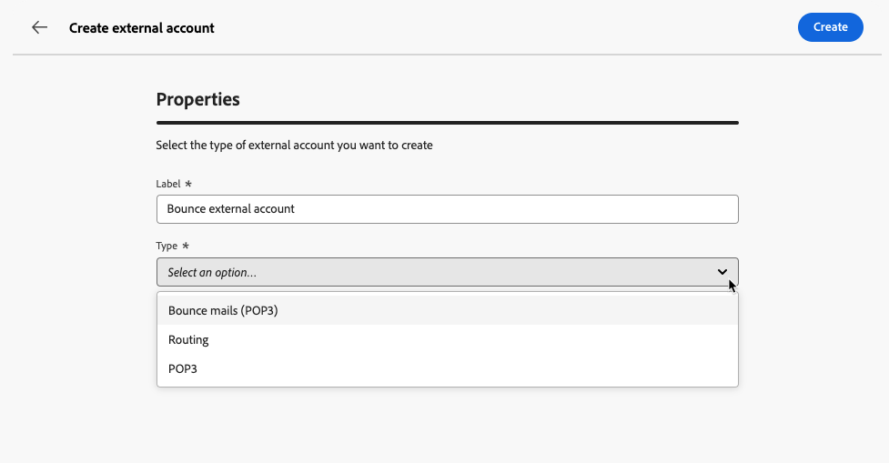
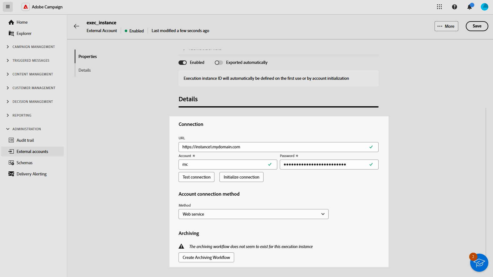

# Gestire account esterni {#external-accounts}

>[!AVAILABILITY]
>
>* Gli account esterni sono attualmente disponibili solo per le e-mail non recapitate (POP3), il routing e l’istanza di esecuzione. Ulteriori tipi di account verranno aggiunti in futuro.
>
>* Gli account esterni non supportati creati nella console di Adobe Campaign sono visibili nell’interfaccia utente web ma non possono essere modificati né utilizzati.

Adobe Campaign viene fornito con un set di account esterni preconfigurati per una facile integrazione con vari sistemi. Se devi connetterti a piattaforme aggiuntive o personalizzare le connessioni in base al tuo flusso di lavoro, ora puoi facilmente creare nuovi account esterni utilizzando l’Interfaccia utente web per soddisfare le tue esigenze specifiche e garantire trasferimenti di dati fluidi.

## Creare un account esterno {#create-ext-account}

Per creare un nuovo account esterno, segui i passaggi indicati di seguito. Le impostazioni dettagliate dipendono dal tipo di account esterno. [Ulteriori informazioni](#campaign-specific)

1. Dal menu del riquadro di sinistra, selezionare **[!UICONTROL Account esterni]** in **[!UICONTROL Amministrazione]**.

1. Fai clic su **[!UICONTROL Crea account esterno]**.

   

1. Immetti la **[!UICONTROL etichetta]** e seleziona l&#39;account esterno **[!UICONTROL Tipo]**.

   >[!NOTE]
   >
   >Le impostazioni per i tipi specifici di Campaign sono descritte in [questa sezione](#campaign-specific).

   

1. Fai clic su **[!UICONTROL Crea]**.

1. Se necessario, puoi modificare il percorso **[!UICONTROL Internal name]** o **[!UICONTROL Folder]** dall&#39;elenco a discesa **[!UICONTROL Additional options]**.

   

1. Abilita l&#39;opzione **[!UICONTROL Esportato automaticamente nei pacchetti]** se desideri che i dati gestiti da questo account esterno vengano esportati automaticamente. <!--Exported where??-->

   

1. Nella sezione **[!UICONTROL Dettagli]** configura l&#39;accesso all&#39;account specificando le credenziali in base al tipo di account esterno scelto. [Ulteriori informazioni](#bounce)

1. Fai clic su **[!UICONTROL Verifica connessione]** per verificare che la configurazione sia corretta.

1. Dal menu **[!UICONTROL Altro...]**, puoi duplicare o eliminare il tuo account esterno.

   

1. Al termine della configurazione, fai clic su **[!UICONTROL Salva]**.

## Account esterni specifici per la campagna {#campaign-specific}

A seconda del tipo di account esterno selezionato, segui i passaggi seguenti per configurare le impostazioni dell’account.

### Messaggi non recapitati (POP3) {#bounce}

>[!AVAILABILITY]
>
> OAuth 2.0 non è attualmente supportato.

L’account esterno Messaggi non recapitati specifica l’account POP3 esterno utilizzato per connettersi al servizio e-mail. Tutti i server configurati per l&#39;accesso POP3 possono ricevere la posta di ritorno.

Per configurare l&#39;account esterno **[!UICONTROL Messaggi non recapitati (POP3)]**, compila i campi seguenti:

* **[!UICONTROL Server]** - URL del server POP3

* **[!UICONTROL Porta]** - Numero porta di connessione POP3 (la porta predefinita è 110)

* **[!UICONTROL Account]** - Nome dell&#39;utente

* **[!UICONTROL Password]** - Password dell&#39;account utente

* **[!UICONTROL Crittografia]** - Tipo di crittografia scelta tra:

   * Per impostazione predefinita (POP3 se porta 110, POP3S se porta 995)
   * POP3 che cambia in SSL dopo l’invio di uno STARTTLS
   * POP3 non sicuro (porta 110 per impostazione predefinita)
   * POP3 sicuro superiore a SSL (porta 995 per impostazione predefinita)

* **[!UICONTROL Funzione]** - E-mail in entrata, quando l&#39;account esterno è configurato per ricevere e-mail in entrata, o router SOAP, per gestire le richieste SOAP.

### Indirizzamento {#routing}

Per configurare un account esterno specifico che verrà utilizzato nelle consegne esterne, segui i passaggi seguenti.

1. Crea un account esterno. [Ulteriori informazioni](../administration/external-account.md#create-ext-account)

1. Selezionare il tipo **[!UICONTROL Indirizzamento]**.

   {zoomable="yes"}

1. Selezionare il canale desiderato e fare clic su **[!UICONTROL Crea]**.

1. Nella sezione **[!UICONTROL Dettagli]** dell&#39;account esterno, **[!UICONTROL Esterno]** è selezionato per impostazione predefinita come **[!UICONTROL Modalità di consegna]**.

   {zoomable="yes"}

   >[!NOTE]
   >
   >Attualmente **[!UICONTROL External]** è l&#39;unica modalità disponibile.

1. Per gestire il processo dopo l’esecuzione della consegna, puoi esternalizzarlo in un flusso di lavoro di post-elaborazione. A tale scopo, è necessario creare un flusso di lavoro con un&#39;attività [External signal](../workflows/activities/external-signal.md) e selezionarla dal campo **[!UICONTROL Post-elaborazione]**.

   {zoomable="yes"}

1. Nel campo **[!UICONTROL Attività]** puoi modificare il nome dell&#39;attività del flusso di lavoro di post-elaborazione che verrà visualizzata nei registri. <!--you can edit the name of the activity that will be created if you add an external or bulk delivery to a workflow-->

### Istanza di esecuzione {#instance-exec}

Se si dispone di un&#39;architettura segmentata, è necessario identificare le istanze di esecuzione associate all&#39;istanza di controllo e stabilire connessioni tra di esse. I modelli di messaggi transazionali vengono distribuiti nell’istanza di esecuzione.

Per configurare l&#39;account esterno **[!UICONTROL Istanza di esecuzione]**:

* **[!UICONTROL URL]**

  URL del server in cui è installata l’istanza di esecuzione.

* **[!UICONTROL Account]**

  Il nome dell&#39;account deve corrispondere all&#39;agente del Centro messaggi definito nella cartella dell&#39;operatore.

* **[!UICONTROL Password]**

  Password dell’account definita nella cartella dell’operatore.

* **[!UICONTROL Metodo]**

  Scegli tra servizio Web o Federated Data Access (FDA).
In caso di metodo FDA, seleziona il tuo account FDA. La connessione di Campaign a sistemi esterni è limitata agli utenti avanzati e disponibile solo dalla console client. [Ulteriori informazioni](https://experienceleague.adobe.com/en/docs/campaign/campaign-v8/connect/fda#_blank)

* **[!UICONTROL Crea flusso di lavoro di archiviazione]**

  Per ogni istanza di esecuzione registrata nel Centro messaggi, indipendentemente dal fatto che si disponga di una o più istanze, è necessario creare un flusso di lavoro di archiviazione separato per ogni account esterno associato all’istanza di esecuzione.
