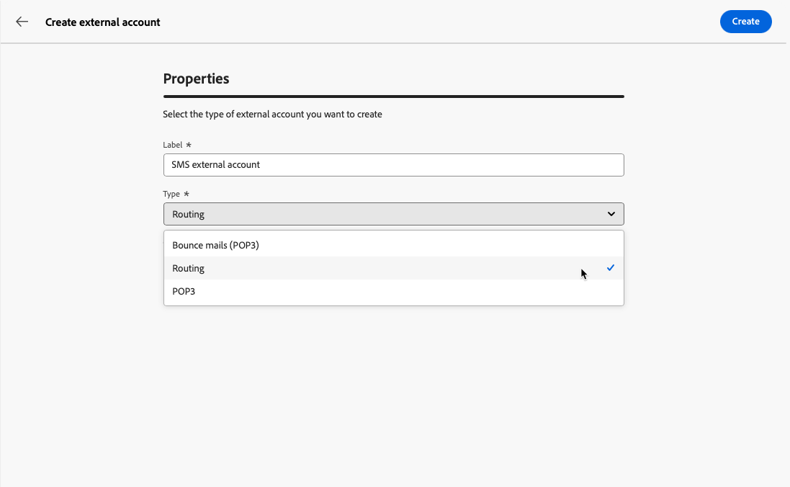

# Configurare account esterni {#external-accounts}

Adobe Campaign include account esterni preconfigurati per una facile integrazione con vari sistemi. Per connettersi a piattaforme aggiuntive o personalizzare le connessioni in base al flusso di lavoro, creare nuovi account esterni utilizzando l&#39;interfaccia utente Web. Questo garantisce trasferimenti di dati senza soluzione di continuità.

## Creare un account esterno {#create-ext-account}

Per creare un nuovo account esterno, segui i passaggi indicati di seguito. Le impostazioni dettagliate dipendono dal tipo di account esterno. [Ulteriori informazioni](#campaign-specific)

1. Dal menu del riquadro di sinistra, selezionare **[!UICONTROL Account esterni]** in **[!UICONTROL Amministrazione]**.

1. Fai clic su **[!UICONTROL Crea account esterno]**.

   

1. Immetti la **[!UICONTROL etichetta]** e seleziona l&#39;account esterno **[!UICONTROL Tipo]**.

   >[!NOTE]
   >
   >Le impostazioni per i tipi specifici di Campaign sono descritte in [questa sezione](#campaign-specific).

   

1. Fai clic su **[!UICONTROL Crea]**.

1. Dall&#39;elenco a discesa **[!UICONTROL Opzioni aggiuntive]**, se necessario, modifica il percorso **[!UICONTROL Internal name]** o **[!UICONTROL Folder]**.

   

1. Abilita l&#39;opzione **[!UICONTROL Esportato automaticamente nei pacchetti]** per esportare automaticamente i dati gestiti da questo account esterno. <!--Exported where??-->

   

1. Nella sezione **[!UICONTROL Dettagli]** configura l&#39;accesso all&#39;account specificando le credenziali in base al tipo di account esterno scelto. [Ulteriori informazioni](#bounce)

1. Fai clic su **[!UICONTROL Verifica connessione]** per verificare che la configurazione sia corretta.

1. Dal menu **[!UICONTROL Altro...]**, duplica o elimina il tuo account esterno.

   

1. Al termine della configurazione, fare clic su **[!UICONTROL Salva]**.

## Account esterni specifici per la campagna {#campaign-specific}

A seconda del tipo di account esterno selezionato, segui i passaggi seguenti per configurare le impostazioni dell’account.

### Messaggi non recapitati (POP3) {#bounce}

L’account esterno Messaggi non recapitati specifica l’account POP3 esterno utilizzato per connettersi al servizio e-mail. Tutti i server configurati per l&#39;accesso POP3 possono ricevere la posta di ritorno.

Per configurare l&#39;account esterno **[!UICONTROL Messaggi non recapitati (POP3)]**, compila i campi seguenti:

* **[!UICONTROL Server]** - URL del server POP3.

* **[!UICONTROL Porta]** - Numero porta di connessione POP3 (la porta predefinita è 110).

* **[!UICONTROL Account]** - Nome utente.

* **[!UICONTROL Password]** - Password dell&#39;account utente.

* **[!UICONTROL Crittografia]** - Tipo di crittografia scelta, inclusi:
   * Per impostazione predefinita (POP3 se porta 110, POP3S se porta 995).
   * POP3 che passa a SSL dopo l’invio di un STARTTLS.
   * POP3 non protetto (porta 110 per impostazione predefinita).
   * POP3 protetto sopra SSL (porta 995 per impostazione predefinita).

* **[!UICONTROL Funzione]** - Selezionare **[!UICONTROL Posta in arrivo]** per configurare l&#39;account per la ricezione delle e-mail in arrivo o **[!UICONTROL router SOAP]** per gestire le richieste SOAP.

>[!IMPORTANT]
>
>Prima di configurare l’account esterno POP3 utilizzando Microsoft OAuth 2.0, è necessario registrare l’applicazione nel portale di Azure. Per ulteriori informazioni, consulta [questa pagina](https://learn.microsoft.com/en-us/entra/identity-platform/quickstart-register-app){target=_blank}.

Per configurare un POP3 esterno tramite Microsoft OAuth 2.0, seleziona l’opzione Microsoft OAuth 2.0 e compila i seguenti campi:

* **[!UICONTROL Tenant Azure]**

  Azure ID (o ID directory (tenant)) si trova nell’elenco a discesa Essentials della panoramica dell’applicazione nel portale di Azure.

* **[!UICONTROL ID client Azure]**

  L’ID client (o ID applicazione (client)) si trova nell’elenco a discesa Essentials della panoramica dell’applicazione nel portale di Azure.

* **[!UICONTROL Segreto client Azure]**

  L’ID del segreto client si trova nella colonna Segreti client dal menu Certificati e segreti dell’applicazione nel portale di Azure.

* **[!UICONTROL URL reindirizzamento Azure]**

  L’URL di reindirizzamento si trova nel menu Autenticazione dell’applicazione nel portale di Azure. Deve terminare con la seguente sintassi nl/jsp/oauth.jsp, ad esempio `https://redirect.adobe.net/nl/jsp/oauth.jsp`.

L’accesso a Internet è necessario per la configurazione e per utilizzare il pulsante Prova connessione nella console client. Dopo la configurazione, il processo inMail può comunicare con i server Microsoft senza Internet.

Dopo aver immesso le diverse credenziali, puoi fare clic su Imposta la connessione per completare la configurazione dell’account esterno.

### Indirizzamento {#routing}

Per configurare un account esterno specifico per le consegne esterne, segui i passaggi seguenti.

1. Crea un account esterno. [Ulteriori informazioni](../administration/external-account.md#create-ext-account)

1. Selezionare il tipo **[!UICONTROL Indirizzamento]**.

   {zoomable="yes"}

1. Selezionare il canale desiderato e fare clic su **[!UICONTROL Crea]**.

1. Nella sezione **[!UICONTROL Dettagli]** dell&#39;account esterno, **[!UICONTROL Esterno]** è selezionato per impostazione predefinita come **[!UICONTROL Modalità di consegna]**.

   {zoomable="yes"}

   >[!NOTE]
   >
   >Attualmente, **[!UICONTROL External]** è l&#39;unica modalità disponibile.

1. Per gestire il processo dopo l’esecuzione della consegna, esternalizzalo in un flusso di lavoro di post-elaborazione. Crea un flusso di lavoro con un&#39;attività [External signal](../workflows/activities/external-signal.md) e selezionala dal campo **[!UICONTROL Post-elaborazione]**.

   {zoomable="yes"}

1. Nel campo **[!UICONTROL Attività]**, modifica il nome dell&#39;attività del flusso di lavoro di post-elaborazione visualizzata nei registri. <!--you can edit the name of the activity that will be created if you add an external or bulk delivery to a workflow-->

### Istanza di esecuzione {#instance-exec}

Se si dispone di un&#39;architettura segmentata, identificare le istanze di esecuzione associate all&#39;istanza di controllo e stabilire connessioni tra di esse. I modelli di messaggi transazionali vengono distribuiti nell’istanza di esecuzione.

Per configurare l&#39;account esterno **[!UICONTROL Istanza di esecuzione]**:

* **[!UICONTROL URL]** - URL del server in cui è installata l&#39;istanza di esecuzione.

* **[!UICONTROL Account]** - Nome dell&#39;account corrispondente all&#39;agente del Centro messaggi definito nella cartella dell&#39;operatore.

* **[!UICONTROL Password]** - Password dell&#39;account definita nella cartella dell&#39;operatore.

* **[!UICONTROL Metodo]** - Scegliere tra servizio Web o Federated Data Access (FDA).

  Per FDA, seleziona il tuo account FDA. La connessione di Campaign a sistemi esterni è limitata agli utenti avanzati e disponibile solo dalla console client. [Ulteriori informazioni](https://experienceleague.adobe.com/it/docs/campaign/campaign-v8/connect/fda#_blank)

* **[!UICONTROL Crea flusso di lavoro di archiviazione]** - Per ogni istanza di esecuzione registrata nel Centro messaggi, indipendentemente dal fatto che siano presenti una o più istanze, crea un flusso di lavoro di archiviazione separato per ogni account esterno associato all&#39;istanza di esecuzione.

## Account esterni di integrazione della soluzione Adobe

### Adobe Experience Cloud

Per connettersi alla console Adobe Campaign utilizzando un Adobe ID, è necessario configurare l’account esterno Adobe Experience Cloud (MAC).

* **[!UICONTROL Server IMS]**

  URL del server IMS. Assicurati che le istanze di stage e produzione puntino allo stesso endpoint di produzione IMS.

* **[!UICONTROL Ambito IMS]**

  Gli ambiti definiti qui devono essere un sottoinsieme di quelli per i quali è stato eseguito il provisioning da IMS.

* **[!UICONTROL Identificatore client IMS]**

  ID del client IMS.

* **[!UICONTROL Segreto client IMS]**

  Credenziali del segreto client IMS.

* **[!UICONTROL Server di richiamata]**

  URL di accesso dell’istanza di Adobe Campaign.

* **[!UICONTROL ID organizzazione IMS]**

  ID della tua organizzazione. Per trovare il tuo ID organizzazione, fai riferimento a [questa pagina](https://experienceleague.adobe.com/docs/core-services/interface/administration/organizations.html?lang=it){target=_blank}.

* **[!UICONTROL Maschera di associazione]**

  Sintassi che consentirà la sincronizzazione dei nomi di configurazione nel dashboard di Enterprise con i gruppi in Adobe Campaign.

* **[!UICONTROL Server]**

  URL dell’istanza di Adobe Experience Cloud.

* **[!UICONTROL Tenant]**

  Nome del tenant Adobe Experience Cloud.

## Trasferisci dati account esterni

### Servizio Amazon Simple Storage (S3) {#amazon-simple-storage-service--s3--external-account}

Il connettore Amazon Simple Storage Service (S3) può essere utilizzato per importare o esportare dati in Adobe Campaign. Può essere impostato in un’attività del flusso di lavoro. Per ulteriori informazioni, consulta [questa pagina](https://experienceleague.adobe.com/it/docs/campaign-web/v8/wf/design-workflows/transfer-file){target=_blank}.

Quando imposti questo nuovo account esterno, dovrai fornire i seguenti dettagli:

* **[!UICONTROL Server account AWS S3]**

  URL del server, deve essere compilato come segue:

  `  <S3bucket name>.s3.amazonaws.com/<s3object path>`

* **[!UICONTROL ID chiave di accesso AWS]**

  Per sapere dove trovare l&#39;ID della chiave di accesso AWS, consulta questa [pagina](https://docs.aws.amazon.com/general/latest/gr/aws-sec-cred-types.html#access-keys-and-secret-access-keys).

* **[!UICONTROL Chiave di accesso segreta ad AWS]**

  Per sapere dove trovare la chiave di accesso segreta ad AWS, consulta questa [pagina](https://aws.amazon.com/fr/blogs/security/wheres-my-secret-access-key/).

* **[!UICONTROL Area geografica AWS]**

  Per ulteriori informazioni sull&#39;area geografica di AWS, consulta questa [pagina](https://aws.amazon.com/about-aws/global-infrastructure/regions_az/).

* La casella di controllo **[!UICONTROL Usa crittografia lato server]** consente di archiviare il file in modalità crittografata S3.

Per informazioni su dove trovare l&#39;ID della chiave di accesso e la chiave di accesso segreta, consulta la [documentazione](https://docs.aws.amazon.com/general/latest/gr/aws-sec-cred-types.html#access-keys-and-secret-access-keys) dei servizi Web Amazon.

### Archiviazione BLOB di Azure {#azure-blob-external-account}

L&#39;account esterno **[!UICONTROL Archiviazione BLOB di Azure]** può essere utilizzato per importare o esportare dati in Adobe Campaign utilizzando un&#39;attività del flusso di lavoro **[!UICONTROL Trasferisci file]**. Per ulteriori informazioni al riguardo, consulta [questa sezione](https://experienceleague.adobe.com/it/docs/campaign-web/v8/wf/design-workflows/transfer-file){target=_blank}.

Per configurare l&#39;**[!UICONTROL account esterno Azure]** per l&#39;utilizzo con Adobe Campaign, è necessario fornire i dettagli seguenti:

* **[!UICONTROL Server]**

  URL del server di archiviazione BLOB di Azure.

* **[!UICONTROL Crittografia]**

  Tipo di crittografia scelta tra **[!UICONTROL Nessuno]** o **[!UICONTROL SSL]**.

* **[!UICONTROL Chiave di accesso]**

  Per sapere dove trovare la tua **[!UICONTROL chiave di accesso]**, fai riferimento a questa [pagina](https://docs.microsoft.com/en-us/azure/storage/common/storage-account-keys-manage?tabs=azure-portal).

## Hadoop

L’account esterno Hadoop ti consente di collegare l’istanza Campaign al database esterno Hadoop. Per ulteriori informazioni su Hadoop, consulta la [documentazione della console di Campaign v7](https://experienceleague.adobe.com/it/docs/campaign-classic/using/installing-campaign-classic/accessing-external-database/configure-fda/config-databases/configure-fda-hadoop){target=_blank}.

* **[!UICONTROL Server]**

  URL del server di archiviazione Hadoop.

* **[!UICONTROL Account]**

  Nome dell&#39;account del server Hadoop.
