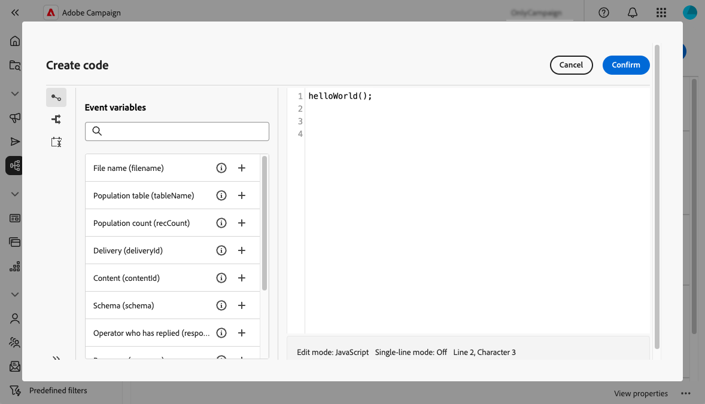

# Utilizzare i codici JavaScript {#javascript-codes}

<!-- JavaScript codes -->

>[!CONTEXTUALHELP]
>id="acw_javascript_codes_list"
>title="Codici JavaScript"
>abstract="Codici JavaScript"

>[!CONTEXTUALHELP]
>id="acw_javascript_codes_create"
>title="Crea codice JavaScript"
>abstract="Crea codice JavaScript"

## Informazioni sui codici JavaScript {#about}

I codici JavaScript ti consentono di creare funzioni riutilizzabili che possono essere utilizzate nei vari flussi di lavoro, in modo simile a una libreria. Queste funzioni sono memorizzate nel menu **[!UICONTROL Amministrazione]** > **[!UICONTROL Codici JavaScript]** nel riquadro di navigazione a sinistra.


Nell&#39;elenco Codici di JavaScript è possibile:

* **Duplicare o eliminare un codice**: fare clic sul pulsante con i puntini di sospensione e selezionare l&#39;azione desiderata.
* **Modificare un codice**: fare clic sul nome di un codice per aprirne le proprietà. Apporta le modifiche e salva.
* **Crea un nuovo codice JavaScript**: fare clic sul pulsante **[!UICONTROL Crea codice JavaScript]**.

>[!NOTE]
>
>Sebbene la posizione del menu dei codici di JavaScript differisca tra la console di Adobe Campaign e l’interfaccia utente Web, l’elenco è identico e funziona come un mirror.

## Creare un codice JavaScript {#create}

Per creare un codice JavaScript, effettua le seguenti operazioni:

1. Passare al menu **[!UICONTROL Codici JavaScript]** e fare clic sul pulsante **[!UICONTROL Crea codice JavaScript]**.

1. Definisci le proprietà del codice:

   * **[!UICONTROL Spazio dei nomi]**: specifica lo spazio dei nomi relativo alle risorse personalizzate. Per impostazione predefinita, lo spazio dei nomi è &quot;cus&quot;, ma può variare a seconda dell’implementazione.
   * **[!UICONTROL Nome]**: identificatore univoco da utilizzare per fare riferimento al codice.
   * **[!UICONTROL Etichetta]**: etichetta descrittiva da visualizzare nell&#39;elenco dei codici di JavaScript.

   

   >[!NOTE]
   >
   >Una volta creati, i campi **[!UICONTROL Spazio dei nomi]** e **[!UICONTROL Nome]** non possono essere modificati. Per apportare modifiche, duplica il codice e aggiornalo in base alle esigenze.
   >
   >Nella console Campaign, il nome del codice JavaScript viene visualizzato come una concatenazione di questi due campi.

1. Fai clic sul pulsante **[!UICONTROL Crea codice]** per definire il codice JavaScript. Il riquadro a sinistra include due menu che consentono di utilizzare funzioni predefinite relative alle condizioni e alla formattazione della data.

   

1. Fai clic su **[!UICONTROL Conferma]** per salvare il codice.

1. Quando il codice JavaScript è pronto, fai clic su **[!UICONTROL Crea]**.  Il codice JavaScript è ora disponibile per l’utilizzo in tutti i flussi di lavoro.

## Utilizzare un codice JavaScript da un flusso di lavoro {#workflow}

### Caricare librerie di codice di JavaScript {#library}

Puoi fare riferimento ai codici JavaScript nei flussi di lavoro per evitare di riscrivere il codice per attività ripetitive. Per utilizzare questi codici, devi innanzitutto caricare la libreria corrispondente nello script di inizializzazione del flusso di lavoro. Ciò ti consente di caricare tutte le librerie contenenti le funzioni che desideri utilizzare nel flusso di lavoro una sola volta.

Per caricare una libreria, effettua le seguenti operazioni:

1. Apri un flusso di lavoro e fai clic sul pulsante **[!UICONTROL Impostazioni]**.
1. Passare alla sezione **[!UICONTROL Script di inizializzazione]** e fare clic su **[!UICONTROL Crea codice]**.

   

1. Utilizza la sintassi seguente nel codice per caricare una libreria:

   ```
   loadLibrary("/<namespace>/<name>")
   ```

   * Sostituisci `<namespace>` con lo spazio dei nomi specificato durante la creazione del codice JavaScript.
   * Sostituisci `<name>` con il nome del codice JavaScript.

1. Fai clic su **[!UICONTROL Conferma]** e salva le impostazioni.

### Funzioni di riferimento nei flussi di lavoro {#reference}

Una volta caricata la libreria JavaScript, puoi fare riferimento alle funzioni definite nel codice JavaScript direttamente all&#39;interno del flusso di lavoro, in genere utilizzando un&#39;attività **[!UICONTROL Codice JavaScript]**.


