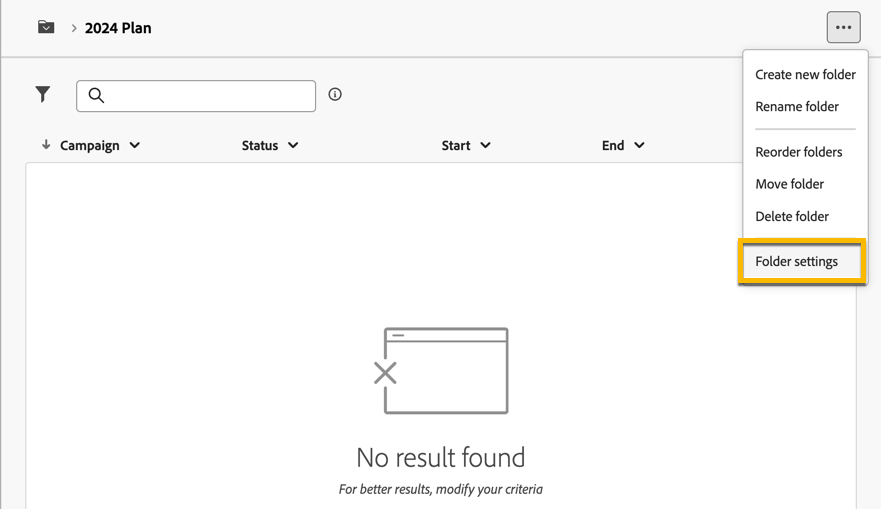
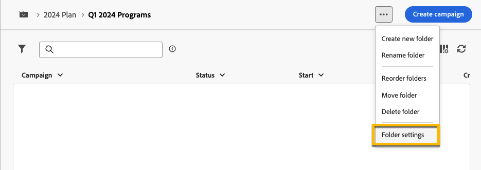
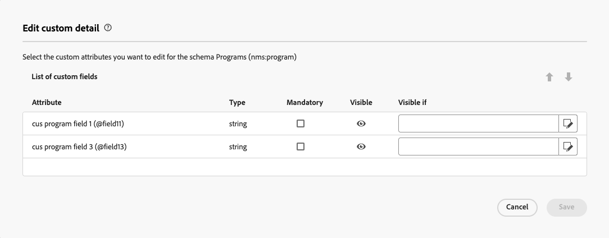
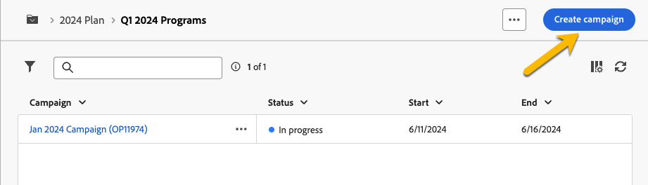

# Piani e programmi {#plan-and-programs}

>[!CONTEXTUALHELP]
>id="acw_homepage_welcome_rn2"
>title="Piani e programmi"
>abstract="Ora puoi configurare la gerarchia di cartelle per i piani e i programmi di marketing nell’interfaccia utente di Campaign Web."
>additional-url="https://experienceleague.adobe.com/docs/campaign-web/v8/release-notes/release-notes.html?lang=it" text="Consulta le note sulla versione"

Adobe Campaign consente di configurare la gerarchia di cartelle per i piani e i programmi di marketing.

Per organizzarle meglio, l’Adobe consiglia la seguente gerarchia: Piano `>` Programmi `>` Campagne

* A **piano** può contenere più programmi. Definisce obiettivi strategici per un certo periodo di tempo.
* A **programma** può contenere altri programmi, oltre a campagne, flussi di lavoro e pagine di destinazione.
* A **campagna** può contenere consegne, flussi di lavoro e pagine di destinazione.

## Creare e configurare un piano {#create-plan}

Per creare un piano, è necessario creare una cartella con il tipo di cartella **[!UICONTROL Piano]** [Ulteriori informazioni sulla creazione di cartelle](create-manage-folder.md).

{zoomable="yes"}

Vai a **[!UICONTROL Impostazioni cartella]** del piano di gestione.

{zoomable="yes"}

Puoi definire **[!UICONTROL Opzioni personalizzate]** e per impostare la data di programmazione del piano.

{zoomable="yes"}

Per gestire  **[!UICONTROL Opzioni personalizzate]**:

1. Accedi a **[!UICONTROL Schemi]**
1. Scegli la **[!UICONTROL Modificabile]** schemi nei filtri
1. Fai clic sull’icona di **[!UICONTROL Modifica dettagli personalizzati]**

{zoomable="yes"}

Puoi configurarli:

{zoomable="yes"}

## Creare e configurare un programma

Per creare un programma nel piano ([Ulteriori informazioni sulla creazione di un piano](#create-plan)), è necessario essere nel piano e creare una cartella con il tipo di cartella **[!UICONTROL Programma]** [Ulteriori informazioni sulla creazione di cartelle](create-manage-folder.md).

{zoomable="yes"}

Vai a **[!UICONTROL Impostazioni cartella]** del programma per gestirlo.

{zoomable="yes"}

Puoi definire **[!UICONTROL Opzioni personalizzate]** e per impostare la data di pianificazione del programma.

{zoomable="yes"}

Per gestire  **[!UICONTROL Opzioni personalizzate]**:

1. Accedi a **[!UICONTROL Schemi]**
1. Scegli la **[!UICONTROL Modificabile]** schemi nei filtri
1. Fai clic sull’icona di **[!UICONTROL Modifica dettagli personalizzati]**

{zoomable="yes"}

Puoi configurarli:

{zoomable="yes"}

## Come collegare una campagna a un programma

Puoi collegare una campagna a un programma in due modi:

### Modo #1 : disponi già di un programma e desideri creare una campagna ad esso collegata

Per collegare una nuova campagna al programma, crea direttamente la campagna nel programma:

{zoomable="yes"}

Il **[!UICONTROL Cartella]** Le impostazioni verranno archiviate automaticamente nel percorso del programma.

{zoomable="yes"}

### Modalità #2 : Disponi già di una campagna e desideri collegarla a un programma esistente

Vai a **[!UICONTROL Impostazioni]** pulsante della campagna da collegare al programma:

{zoomable="yes"}

Nel suo **[!UICONTROL Proprietà]**, fare clic su **[!UICONTROL Cartella]** icona in **[!UICONTROL Cartella]** per scegliere le impostazioni **[!UICONTROL Programma]** cartella.

{zoomable="yes"}

Seleziona il **[!UICONTROL Programma]** cartella e fai clic su **[!UICONTROL Conferma]** e quindi su **[!UICONTROL Salva e chiudi]** pulsante.

{zoomable="yes"}

La campagna è ora elencata nel programma:

{zoomable="yes"}
