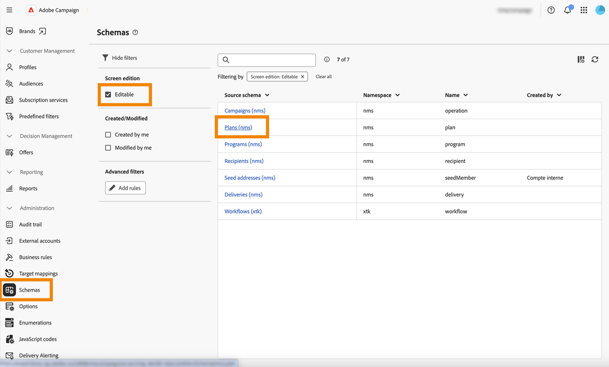
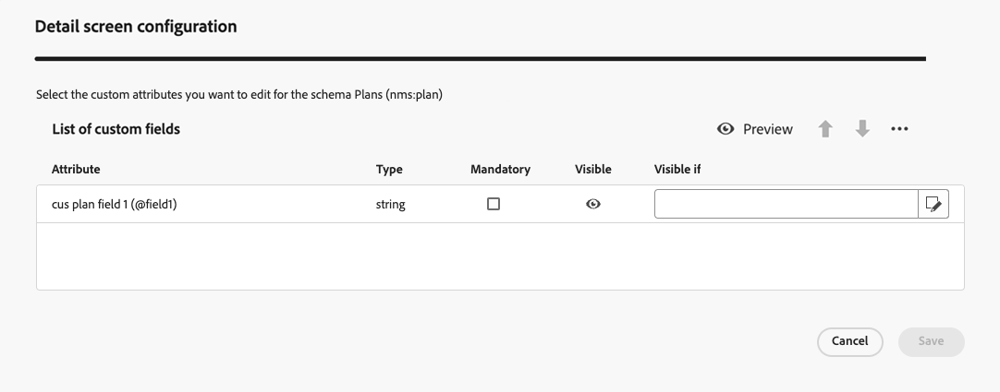

# Piani e programmi {#plan-and-programs}

Adobe Campaign consente di configurare la gerarchia di cartelle per i piani e i programmi di marketing.

Per una migliore organizzazione di questi componenti, Adobe consiglia la seguente gerarchia: Pianificare `>` programmi `>` campagne.

* Un **piano** può contenere più programmi. Definisce obiettivi strategici per un periodo specifico.
* Un **programma** può contenere altri programmi, oltre a campagne, flussi di lavoro e pagine di destinazione.
* Una **campagna** può contenere consegne, flussi di lavoro e pagine di destinazione.

## Creare e configurare un piano {#create-plan}

Per creare un piano, creare una cartella con il tipo di cartella **[!UICONTROL Piano]**. [Ulteriori informazioni sulla creazione di una cartella](../get-started/work-with-folders.md)

{zoomable="yes"}

Vai alle **[!UICONTROL impostazioni cartella]** del piano per gestirlo.

{zoomable="yes"}

Definisci **[!UICONTROL Opzioni personalizzate]** e imposta la data di pianificazione del piano.

{zoomable="yes"}

Per gestire le **[!UICONTROL opzioni personalizzate]**:

1. Individua gli **[!UICONTROL Schemi]**.
1. Scegli gli schemi **[!UICONTROL Modificabili]** nei filtri.
1. Fai clic sull&#39;icona **[!UICONTROL Modifica dettagli personalizzati]**.

{zoomable="yes"}

Configura le opzioni personalizzate:

{zoomable="yes"}

## Creare e configurare un programma

Per creare un programma nel piano ([Ulteriori informazioni sulla creazione di un piano](#create-plan)), passare al piano e creare una cartella con il tipo di cartella **[!UICONTROL Programma]**. [Ulteriori informazioni sulla creazione di una cartella](../get-started/work-with-folders.md).

{zoomable="yes"}

Vai a **[!UICONTROL Impostazioni cartella]** del programma per gestirlo.

{zoomable="yes"}

Definisci **[!UICONTROL Opzioni personalizzate]** e imposta la data di pianificazione del programma.

{zoomable="yes"}

Per gestire le **[!UICONTROL opzioni personalizzate]**:

1. Individua gli **[!UICONTROL Schemi]**.
1. Scegli gli schemi **[!UICONTROL Modificabili]** nei filtri.
1. Fai clic sull&#39;icona **[!UICONTROL Modifica dettagli personalizzati]**.

{zoomable="yes"}

Configura le opzioni personalizzate:

{zoomable="yes"}

## Come collegare una campagna a un programma

Puoi collegare una campagna a un programma in due modi:

### Modo #1: disponi già di un programma e desideri creare una campagna collegata

Per collegare una nuova campagna al programma, creala direttamente all’interno del programma.

{zoomable="yes"}

Le impostazioni di **[!UICONTROL Cartella]** verranno compilate automaticamente con il percorso del programma.

{zoomable="yes"}

### #2: disponi già di una campagna e desideri collegarla a un programma esistente

Passa al pulsante **[!UICONTROL Impostazioni]** della campagna da collegare al programma.

{zoomable="yes"}

Nelle **[!UICONTROL Proprietà]**, fai clic sull&#39;icona **[!UICONTROL Cartella]** nelle impostazioni **[!UICONTROL Cartella]** per scegliere la cartella **[!UICONTROL Programma]**.

{zoomable="yes"}

Seleziona la cartella **[!UICONTROL Programma]**, fai clic sul pulsante **[!UICONTROL Conferma]** e quindi sul pulsante **[!UICONTROL Salva e chiudi]**.

{zoomable="yes"}

La campagna è ora elencata nel programma.

{zoomable="yes"}