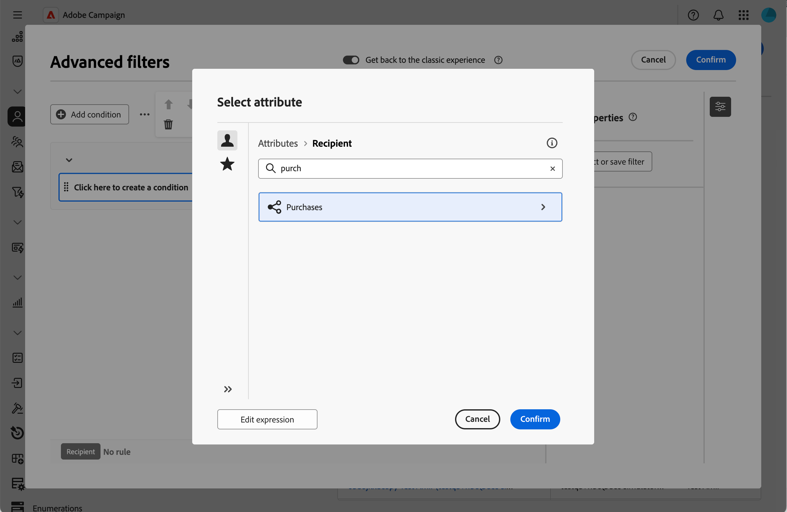

# Aggiungere elenchi di raccolte {#collection-lists}

La sezione **Elenco di elenchi personalizzati** ti consente di definire collegamenti di raccolta, ad esempio acquisti. I dati correlati vengono quindi visualizzati nelle schermate del profilo tramite una scheda dedicata.

Per ulteriori informazioni sulla schermata di definizione dello schermo e su come accedervi, fare riferimento alla sezione [Accedere alla definizione dello schermo](schemas-browse-access.md#screen-def).

>[!NOTE]
>
>Attualmente, questa funzionalità è disponibile solo per lo schema Destinatari.

Per aggiungere elenchi di raccolte:

1. Accedi al menu **[!UICONTROL Schemi]** e individua gli schemi modificabili utilizzando i filtri.

1. Selezionare il nome dello schema nell&#39;elenco per aprirlo e fare clic sul pulsante **[!UICONTROL Screen edition]** nella visualizzazione dei dettagli dello schema per accedere alla definizione dello schermo.

1. Fai clic sull&#39;icona con i puntini di sospensione e scegli **[!UICONTROL Seleziona elenchi personalizzati]**.

   

1. Seleziona uno degli elenchi personalizzati disponibili, ad esempio acquisti, quindi fai clic su **[!UICONTROL Conferma]**.

   

1. Passare al menu **Profili** e filtrare i profili che hanno effettuato acquisti.

   

1. Fai clic su un profilo. Viene visualizzata la nuova scheda. Se necessario, puoi aggiungere altre colonne.

   
