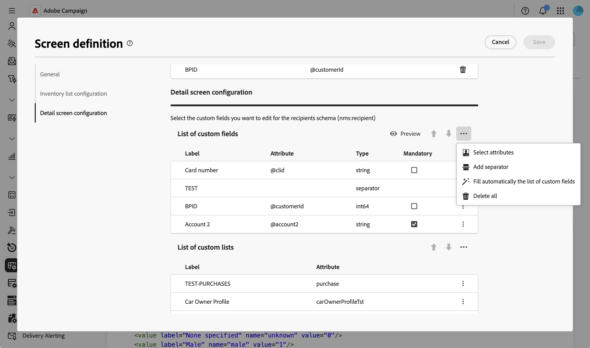
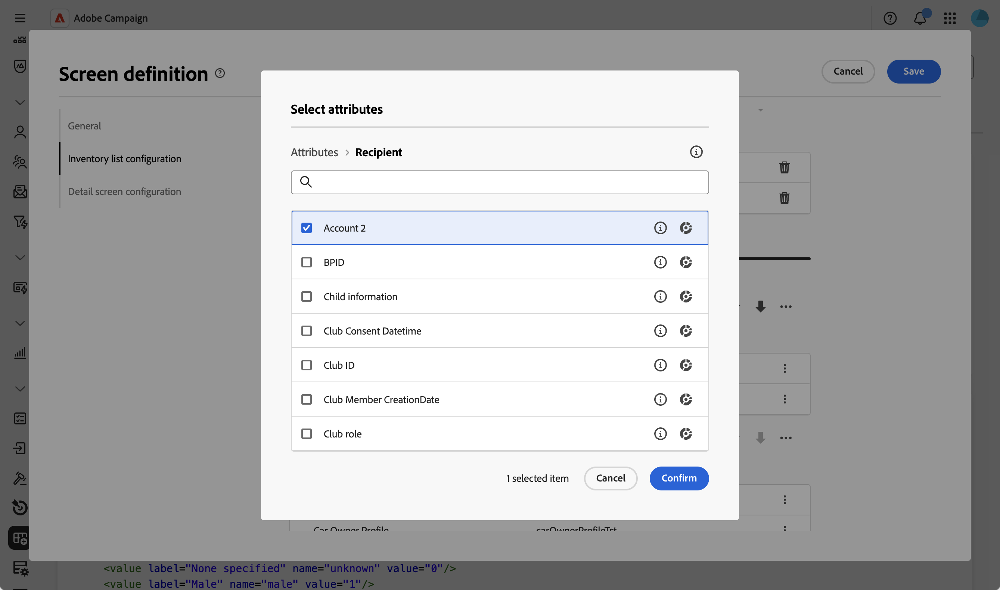
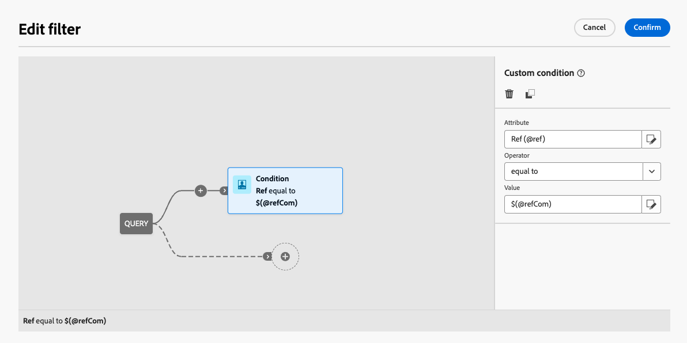
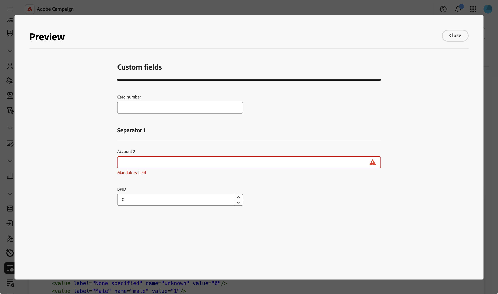
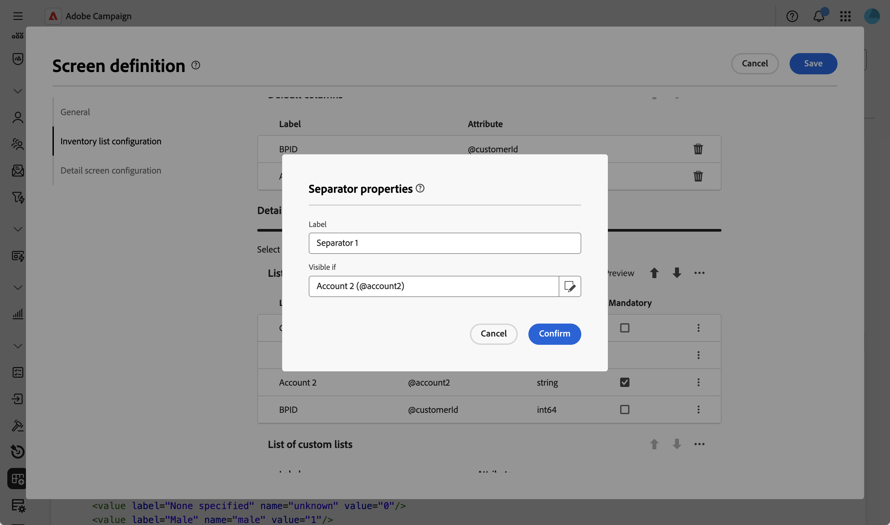
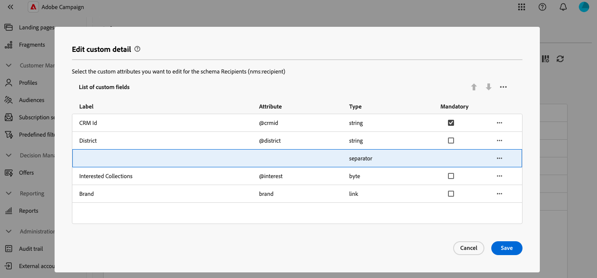

# Modificare i campi personalizzati {#fields}

>[!CONTEXTUALHELP]
>id="acw_schema_detail_screen_configuration"
>title="Configurazione della schermata Dettagli"
>abstract="Configura i campi personalizzati da visualizzare nelle schermate dei dettagli e organizzali in sezioni. Aggiungi elenchi di raccolta per mostrare i dati correlati nelle schermate del profilo."
>additional-url="https://experienceleague.adobe.com/it/docs/campaign-web/v8/conf/schemas/schemas-collection-lists" text="Aggiungere elenchi di raccolte"

I campi personalizzati sono attributi aggiuntivi aggiunti a schemi predefiniti tramite la console Adobe Campaign. Consentono di personalizzare gli schemi includendo nuovi attributi in base alle esigenze dell’organizzazione.

I campi personalizzati possono essere visualizzati in varie schermate, ad esempio i dettagli del profilo nell’interfaccia. Puoi controllare quali campi sono visibili e come appaiono nell’interfaccia.

Per ulteriori informazioni sulla schermata di definizione dello schermo e su come accedervi, fare riferimento alla sezione [Accedere alla definizione dello schermo](schemas-browse-access.md#screen-def).

Per aggiungere campi personalizzati all’elenco:

1. Accedi al menu **[!UICONTROL Schemi]** e individua gli schemi modificabili utilizzando i filtri.

1. Selezionare il nome dello schema nell&#39;elenco per aprirlo e fare clic sul pulsante **[!UICONTROL Screen edition]** nella visualizzazione dei dettagli dello schema per accedere alla definizione dello schermo.

1. Fai clic sull&#39;icona con i puntini di sospensione sopra la tabella **[!UICONTROL Elenco campi personalizzati]** e scegli **[!UICONTROL Seleziona attributi]** per selezionare uno o più campi personalizzati da visualizzare nell&#39;interfaccia.
   
1. Seleziona i campi personalizzati da aggiungere e confermare.

   

   >[!NOTE]
   >
   > Puoi anche selezionare **[!UICONTROL Compila automaticamente l&#39;elenco dei campi personalizzati]** per aggiungere all&#39;interfaccia tutti i campi personalizzati definiti per lo schema.

Una volta aggiunti i campi personalizzati, puoi visualizzarli in anteprima, riordinarli, renderli obbligatori, modificarne le impostazioni o organizzarli in sottosezioni.

## Configurare le impostazioni del campo {#field-settings}

Per configurare impostazioni specifiche per ciascun campo personalizzato, fare clic sull&#39;icona con i puntini di sospensione in una riga del campo nell&#39;elenco e selezionare **[!UICONTROL Modifica]**.

Le impostazioni disponibili sono:

* **[!UICONTROL Attributo]**: nome del campo personalizzato (sola lettura).
* **[!UICONTROL Etichetta (personalizzata)]**: l&#39;etichetta da visualizzare nell&#39;interfaccia. Se non viene specificata un’etichetta, verrà visualizzata quella definita nello schema.
* **[!UICONTROL Visibile se]**: definire una condizione utilizzando un&#39;espressione xtk che controlla quando viene visualizzato il campo. Nascondere ad esempio questo campo se un altro campo è vuoto.
* **[!UICONTROL Obbligatorio]**: rendi obbligatorio il campo nell&#39;interfaccia.
* **[!UICONTROL Sola lettura]**: rendere il campo di sola lettura nell&#39;interfaccia. Gli utenti non potranno modificare il valore del campo.
* **[!UICONTROL Impostazioni filtro]** (per campi di tipo collegamento): utilizzare il modellatore di query per specificare le regole per la visualizzazione di un campo personalizzato di tipo collegamento. Ad esempio, puoi limitare i valori di elenco in base all’input di un altro campo.

  +++Visualizza esempio

  È inoltre possibile fare riferimento al valore immesso in altri campi nelle condizioni utilizzando la sintassi `$(<field-name>)`. Ciò ti consente di fare riferimento al valore corrente di un campo come immesso nel modulo, anche se non è ancora stato salvato nel database.

  Nell’esempio seguente, la condizione controlla se il valore del campo @ref corrisponde al valore immesso nel campo @refCom. Se invece si utilizza `@refCom` invece di `$(@refCom)`, verrà fatto riferimento al valore del campo @ref esistente nel database.

  

  +++

* **[!UICONTROL Estendi due colonne]**: per impostazione predefinita, i campi personalizzati vengono visualizzati nell&#39;interfaccia in due colonne. Attiva questa opzione per visualizzare i campi personalizzati su tutta la larghezza dello schermo anziché su due colonne.

## Anteprima campi personalizzati {#preview}

Fai clic su **[!UICONTROL Anteprima]** per visualizzare i campi personalizzati in una schermata di esempio. Questo consente di vedere come appariranno i campi nell’interfaccia, compresi quelli contrassegnati come obbligatori.

## Organizzare i campi nelle sottosezioni {#separator}

Puoi aggiungere separatori ai campi personalizzati di gruppo nell’interfaccia di per migliorarne la leggibilità. Per farlo, segui questi passaggi:

1. Fai clic sull&#39;icona con i puntini di sospensione sopra la tabella **[!UICONTROL Elenco campi personalizzati]** e scegli **[!UICONTROL Aggiungi separatore]**.

1. All&#39;elenco viene aggiunta una nuova riga che rappresenta il separatore. Fai clic sull&#39;icona dei puntini di sospensione nella riga del separatore e scegli **[!UICONTROL Modifica]**.

1. Immettere un&#39;etichetta **[!UICONTROL Label]** per il separatore e (facoltativo) impostare una condizione **[!UICONTROL Visible if]** da controllare quando viene visualizzato il separatore.

   

1. Utilizzare le frecce su e giù per spostare il separatore nella posizione desiderata. I campi elencati sotto il separatore verranno raggruppati sotto di esso.

   In questo esempio, i campi &quot;Raccolte interessate&quot; e &quot;Marchio&quot; sono raggruppati in una sottosezione &quot;Raccolta&quot;.

   | Configurazione campi personalizzati | Rendering nell’interfaccia |
   |  ---  |  ---  |
   | {zoomable="yes"} | {zoomable="yes"} |
