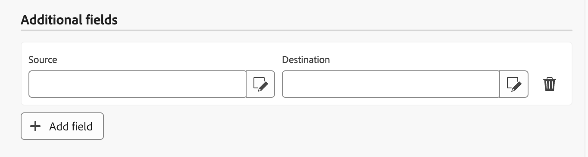

# Gestire le mappature target {#target-mappings}

>[!CONTEXTUALHELP]
>id="acw_homepage_welcome_rn5"
>title="Mappature target"
>abstract="È ora possibile creare mappature target nell’interfaccia utente di Campaign Web. Le mappature target definiscono il modo in cui i diversi canali di consegna (e-mail, SMS, notifiche push) si collegano ai campi dati di uno schema."
>additional-url="https://experienceleague.adobe.com/docs/campaign-web/v8/release-notes/release-notes.html?lang=it" text="Consulta le note sulla versione"

>[!CONTEXTUALHELP]
>id="acw_targetmapping_list"
>title="Mappature target "
>abstract="Mappature target"

## Informazioni sulle mappature di destinazione {#about}

Ogni canale di comunicazione utilizza una mappatura target predefinita per eseguire il targeting dei propri destinatari. Ad esempio, per impostazione predefinita, i modelli di consegna e-mail e SMS sono destinati a **[!UICONTROL Destinatari]**. La mappatura di destinazione utilizza pertanto i campi della tabella **nms:recipient**. Per le notifiche push, il mapping di destinazione predefinito è **Applicazioni sottoscrittore (nms:appSubscriptionRcp)**, che è collegato alla tabella dei destinatari.

I mapping di destinazione sono accessibili dal menu **[!UICONTROL Amministrazione]** > **[!UICONTROL Mapping di destinazione]**. Da questa schermata, puoi accedere ai dettagli su ogni mappatura di destinazione o crearne di nuove in base alle tue esigenze.

Per ulteriori informazioni sui mapping di destinazione incorporati forniti con Adobe Campaign, consulta la [documentazione della console client di Campaign v8](https://experienceleague.adobe.com/docs/campaign/campaign-v8/audience/add-profiles/target-mappings.html?lang=it){target="_blank"}.

## Creare una mappatura target {#create-mapping}

>[!CONTEXTUALHELP]
>id="acw_targetmapping_properties"
>title="Proprietà mappatura target"
>abstract="La sezione **[!UICONTROL Proprietà]** ti consente di definire impostazioni generiche per mappatura e popolazione target."

>[!CONTEXTUALHELP]
>id="acw_targetmapping_mapping"
>title="Mappatura target"
>abstract="La sezione **[!UICONTROL Mappatura]** ti consente di identificare gli attributi dallo schema della mappatura target da utilizzare per i vari campi dell’indirizzo di consegna."

>[!CONTEXTUALHELP]
>id="acw_targetmapping_denylist"
>title="Elenco Bloccati mappatura target"
>abstract="Elenco Bloccati mappatura target"

>[!CONTEXTUALHELP]
>id="acw_targetmapping_storage"
>title="Archiviazione mappatura target"
>abstract="La sezione **[!UICONTROL Archiviazione]** ti consente di identificare dove devono essere archiviati i registri."

Per creare una nuova mappatura di destinazione, accedere al menu **[!UICONTROL Amministrazione]** > **[!UICONTROL Mappature di destinazione]**. Fai clic sul pulsante **[!UICONTROL Crea mappatura]**, quindi segui i passaggi descritti nelle sezioni seguenti.

1. Nella sezione **[!UICONTROL Proprietà]** immettere un **[!UICONTROL Etichetta]** per la mappatura di destinazione.

1. Espandi la sezione **[!UICONTROL Opzioni aggiuntive]** per definire impostazioni avanzate, ad esempio il nome interno della mappatura di destinazione, la cartella di archiviazione e la descrizione.

1. Seleziona la popolazione target. Puoi effettuare le seguenti operazioni:

   * **[!UICONTROL Utilizza direttamente la dimensione di targeting]**: seleziona la dimensione di destinazione direttamente dall&#39;elenco delle dimensioni disponibili.
   * **[!UICONTROL Utilizza dati collegati]**: inizia da una dimensione di targeting (ad esempio sottoscrizioni), quindi passa alla dimensione di targeting di cui desideri eseguire il targeting (ad esempio destinatari).

   

1. Se la dimensione selezionata non è già utilizzata da una mappatura di destinazione esistente, è necessario creare schemi per memorizzare i registri. Sono disponibili opzioni aggiuntive nella sezione **[!UICONTROL Archiviazione]**. Espandi la sezione seguente per ulteriori dettagli.

   +++Opzioni di archiviazione per le nuove dimensioni di targeting

   1. **[!UICONTROL Spazio dei nomi]**: identifica lo spazio dei nomi che verrà utilizzato per creare i registri.
   1. **[!UICONTROL Suffisso dello schema dell&#39;estensione]**: specificare un suffisso per il nuovo schema.

      Nell’esempio seguente, il nome del registro di trasmissione sarà &quot;cusbroadlogSupplier&quot;.

      

   1. **[!UICONTROL Registri di consegna]**: attiva le opzioni in questa sezione per arricchire i registri di invio con un campo del codice segmento o un campo contenente l&#39;indirizzo IP di consegna. Ad esempio, salva un codice di segmento calcolato durante il flusso di lavoro nei registri di invio per perfezionare il target in un secondo momento. Questo consente di eseguire il targeting di profili con questo codice di segmento specifico.

   1. **[!UICONTROL Esclusioni]**: specifica come memorizzare i registri di esclusioni.

   1. **[!UICONTROL Registri di tracciamento]**: attiva l&#39;opzione **[!UICONTROL Genera uno schema per il tracciamento]** per generare uno schema di archiviazione per i registri di tracciamento.

   +++

1. Utilizza la sezione **[!UICONTROL Mapping]** per identificare gli attributi dallo schema della mappatura di destinazione da utilizzare per ciascun campo dell&#39;indirizzo di consegna. Per ogni campo, seleziona l’attributo desiderato da mappare. Puoi anche creare un’espressione per identificare il campo. Ad esempio, applicare una funzione più bassa all&#39;attributo address.

   

1. Quando la mappatura di destinazione è pronta, fai clic sul pulsante **[!UICONTROL Crea]**. Il sistema crea automaticamente la mappatura di destinazione e tutti gli schemi correlati per i registri.

Una volta creata la mappatura di destinazione, sullo schermo vengono visualizzate due sezioni aggiuntive:

* **[!UICONTROL Inserire nell&#39;elenco Bloccati di]**: questa sezione ti consente di identificare gli attributi dallo schema della mappatura di destinazione da utilizzare per i inserisce nell&#39;elenco Bloccati di.

  

* **[!UICONTROL Archiviazione]**: questa sezione ti consente di identificare le tabelle da utilizzare per archiviare i registri.

  

   * **[!UICONTROL Schema messaggio]**: identifica lo schema da utilizzare per memorizzare i registri di invio.
   * **[!UICONTROL Messaggi esclusi]**: specifica come gestire l&#39;archiviazione dei registri di consegna ed esclusione.

      * **[!UICONTROL Memorizza esclusioni e messaggi nella stessa tabella]**
      * **[!UICONTROL Archivia solo i messaggi]**: non archiviare le esclusioni.
      * **[!UICONTROL Memorizzare esclusioni e messaggi in tabelle separate]**: selezionare lo schema da utilizzare per memorizzare i registri di esclusione nel campo **[!UICONTROL Schema di rifiuto]**.

   * **[!UICONTROL Registri di tracciamento]**: scegli dove memorizzare i registri di tracciamento e l&#39;origine del traffico predefinita.
   * **[!UICONTROL Campi aggiuntivi]**: specifica un elenco di campi aggiuntivi da archiviare nei registri di consegna. Questi campi possono memorizzare in modo permanente le informazioni sui singoli membri della destinazione (ad esempio, `recipient/@firstName`) o memorizzare i dati aggiuntivi calcolati durante il flusso di lavoro (ad esempio, `[targetData/@offeCode]`).

     A tale scopo, selezionare **[!UICONTROL Aggiungi campo]**. Identifica le informazioni da salvare nel campo **[!UICONTROL Source]** e l&#39;attributo da utilizzare nei registri di invio per salvare tali informazioni nel campo **[!UICONTROL Destination]**.

     {width="50%" zoomable="yes"}