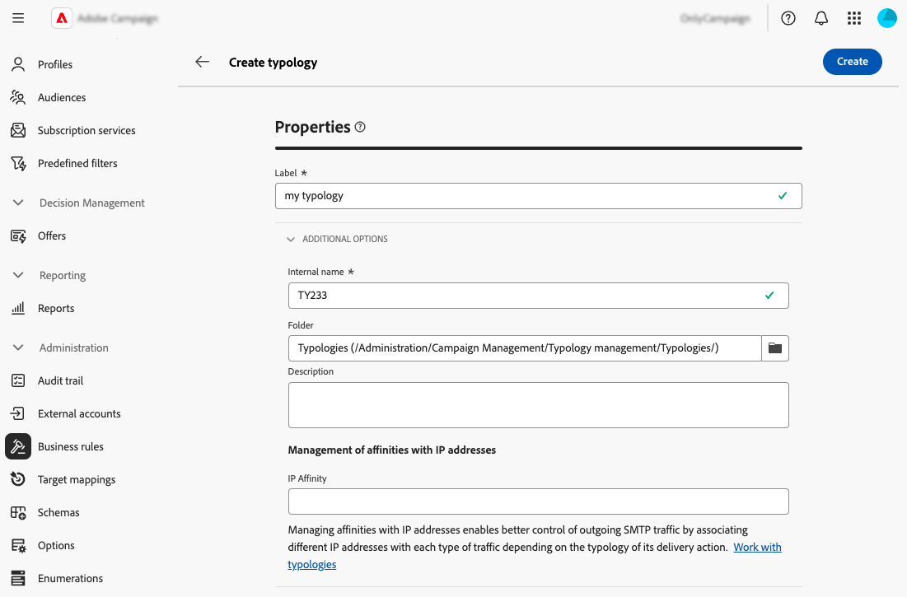

# Utilizzare le tipologie {#typologies}

>[!CONTEXTUALHELP]
>id="acw_business_rules"
>title="Tipologie e regole di tipologia"
>abstract="Le tipologie consentono di standardizzare le pratiche aziendali, su tutte le consegne. Una tipologia è una raccolta di regole di tipologia che ti consentono di controllare, filtrare e assegnare priorità all’invio delle consegne. I profili che corrispondono ai criteri all’interno di una regola di tipologia sono esclusi dai tipi di pubblico di consegna durante la fase di preparazione."

## Informazioni sulle tipologie

Le tipologie consentono di standardizzare le pratiche aziendali, su tutte le consegne. Una **tipologia** è una raccolta di **regole di tipologia** che consente di controllare, filtrare e assegnare priorità all&#39;invio delle consegne. I profili che corrispondono ai criteri all’interno di una regola di tipologia sono esclusi dai tipi di pubblico di consegna durante la fase di preparazione.

Le tipologie garantiscono che le consegne contengano sempre alcuni elementi (come un collegamento per l’annullamento dell’abbonamento o una riga dell’oggetto) o regole di filtro per escludere i gruppi dal target previsto (come utenti non abbonati, concorrenti o clienti non fidelizzati).

Le tipologie sono accessibili tramite il menu **[!UICONTROL Amministrazione]** > **[!UICONTROL Regole aziendali]**. Da questa schermata, puoi accedere a tutte le tipologie e le regole di tipologia esistenti o crearne di nuove in base alle tue esigenze.

>[!NOTE]
>
>Nell&#39;elenco **[!UICONTROL Regole di tipologia]** vengono visualizzate tutte le regole esistenti create finora nell&#39;interfaccia utente Web o nella console client. Tuttavia, nell&#39;interfaccia utente Web è possibile creare solo **regole di controllo** e **regole di filtro**. Per creare altri tipi di regole di tipologia, ad esempio regole di pressione o di capacità, utilizza la console client di Campaign v8. [Scopri come creare regole di tipologia nella console client](https://experienceleague.adobe.com/en/docs/campaign/automation/campaign-optimization/campaign-typologies){target="_blank"}

I passaggi principali per applicare le tipologie ai messaggi sono i seguenti:

1. [Crea una tipologia](#typology).
1. [Creare regole di tipologia](#typology-rules).
1. [Fai riferimento alle regole di tipologia nella tipologia](#add-rules).
1. [Applica la tipologia a un messaggio](#message).

## Creare una tipologia {#typology}

>[!CONTEXTUALHELP]
>id="acw_business_rules_typology_properties"
>title="Proprietà tipologia"
>abstract="Definisci le proprietà della tipologia ed espandi la sezione **[!UICONTROL Opzioni aggiuntive]** per accedere alle impostazioni avanzate. Utilizza il campo **[!UICONTROL Affinità IP]** per associare le affinità IP alle tipologie. Questo consente di controllare meglio il traffico SMTP in uscita, definendo quali indirizzi IP specifici possono essere utilizzati per ogni affinità."

>[!CONTEXTUALHELP]
>id="acw_business_rules_typology_ip_affinity"
>title="Affinità IP"
>abstract="La gestione delle affinità con gli indirizzi IP consente un migliore controllo del traffico SMTP in uscita associando diversi indirizzi IP a ciascun tipo di traffico in base alla tipologia della relativa azione di consegna."

Per creare una tipologia, segui questi passaggi:

1. Passa al menu **[!UICONTROL Regole aziendali]**, quindi seleziona la scheda **[!UICONTROL Tipologia]**.

1. Fai clic sul pulsante **[!UICONTROL Crea tipologia]** e immetti un **[!UICONTROL Etichetta]** per la tipologia.

1. Espandi la sezione **[!UICONTROL Opzioni aggiuntive]** per definire impostazioni avanzate, ad esempio il nome interno della tipologia, la cartella di archiviazione e la descrizione.

   

   >[!NOTE]
   >
   >Il campo **[!UICONTROL Affinità IP]** consente di associare le affinità IP alle tipologie. Questo consente di controllare meglio il traffico SMTP in uscita, definendo quali indirizzi IP specifici possono essere utilizzati per ogni affinità.  Ad esempio, puoi utilizzare un’affinità per paese o sottodominio. Puoi quindi creare una tipologia per paese e collegare ogni affinità alla tipologia corrispondente.

1. Fai clic su **[!UICONTROL Crea]** per confermare la creazione della tipologia.

La tipologia apre i dettagli. Da questa schermata, puoi fare riferimento direttamente alle regole di tipologia esistenti. Puoi anche creare nuove regole di tipologia e farvi riferimento in seguito nella tipologia:
* [Scopri come creare una regola di tipologia](#add-rules)
* [Scopri come fare riferimento alle regole in una tipologia](#add-rules)

## Creare una regola di tipologia {#typology-rule}

>[!CONTEXTUALHELP]
>id="acw_business_rules_typology_rules_properties"
>title="Proprietà regola di tipologia"
>abstract="Definisci le proprietà della regola di tipologia. **Le regole di controllo** verificano la qualità e la validità dei messaggi prima dell&#39;invio, mentre le regole di **filtro** escludono i segmenti del pubblico di destinazione in base a criteri specifici.  È inoltre possibile modificare l&#39;ordine di esecuzione della regola per gestire la sequenza di esecuzione delle regole di tipologia quando più regole dello stesso tipo vengono eseguite durante la stessa fase di elaborazione dei messaggi."

Per creare una regola di tipologia, passa al menu **[!UICONTROL Regole aziendali]**, quindi seleziona la scheda **[!UICONTROL Regole di tipologia]**.

Fai clic sul pulsante **[!UICONTROL Crea regola di tipologia]**, quindi segui i passaggi descritti di seguito.

### Definire le proprietà della regola di tipologia {#properties}

Definisci le proprietà della regola di tipologia:

1. Immetti un **[!UICONTROL Label]** per la regola.

   

1. Seleziona il **[!UICONTROL Tipo]** della regola di tipologia:

   * **Controllo**: assicura la qualità e la validità del messaggio pre-invio (ad esempio visualizzazione dei caratteri, lunghezza dell&#39;SMS, formato dell&#39;indirizzo, abbreviazione dell&#39;URL). Vengono creati utilizzando un’interfaccia di script per definire una logica complessa per i controlli e le modifiche dei contenuti.

   * **Le regole di filtro** escludono i segmenti del pubblico di destinazione in base a criteri specifici (ad esempio, età, posizione, paese, numeri di telefono). Queste regole sono collegate a una dimensione di targeting.

   >[!NOTE]
   >
   >Per il momento, è possibile creare dall&#39;interfaccia utente Web solo le regole di tipologia **Controllo** e **Filtro**. Per creare altri tipi di regole, utilizza la console Client. [Scopri come creare regole di tipologia nella console client](https://experienceleague.adobe.com/en/docs/campaign/automation/campaign-optimization/campaign-typologies){target="_blank"}

1. Selezionare un **[!UICONTROL canale]** da associare alla regola.

1. Disattivare l&#39;opzione **[!UICONTROL Attivo]** se non si desidera che la regola sia attiva subito dopo la creazione.

1. Definisci la regola **[!UICONTROL Ordine di esecuzione]**.

   Per impostazione predefinita, l’ordine delle regole di tipologia è impostato su 50. Puoi adattare questo valore per gestire la sequenza in cui le regole di tipologia verranno eseguite quando più regole dello stesso tipo vengono eseguite durante la stessa fase di elaborazione dei messaggi. Ad esempio, una regola di filtro con un ordine di esecuzione di 20 viene eseguita prima di una regola di filtro con un ordine di esecuzione di 30.

1. Espandi la sezione **[!UICONTROL Opzioni aggiuntive]** per accedere alle impostazioni avanzate, ad esempio il nome interno della regola, l&#39;archiviazione delle cartelle e la descrizione.

1. Per le regole di controllo, nelle opzioni aggiuntive sono disponibili due regole aggiuntive. Ti consentono di specificare quando la regola deve essere applicata e il relativo livello di avviso:

   * **[!UICONTROL Fase]**: questo campo consente di specificare a quale punto del ciclo di vita della consegna verrà applicata la regola. Selezionare il valore da applicare nell&#39;elenco a discesa **[!UICONTROL Fase]**. Espandi la sezione seguente per ulteriori dettagli sui valori possibili.

   +++Fasi delle regole di controllo:

   **[!UICONTROL All&#39;inizio del targeting]**: per evitare che il passaggio di personalizzazione venga eseguito in caso di errori, è possibile applicare la regola di controllo qui.

   **[!UICONTROL Dopo il targeting]**: se è necessario conoscere il volume della destinazione per applicare la regola di controllo, selezionare questa fase. Ad esempio, la regola di controllo Verifica dimensione bozza si applica dopo ogni fase di targeting: questa regola impedisce la personalizzazione dei messaggi se ci sono troppi destinatari bozza.

   **[!UICONTROL All&#39;inizio della personalizzazione]**: questa fase deve essere selezionata se il controllo riguarda l&#39;approvazione della personalizzazione dei messaggi. La personalizzazione dei messaggi viene eseguita durante la fase di analisi.

   **[!UICONTROL Al termine dell&#39;analisi]**: quando un controllo richiede il completamento della personalizzazione dei messaggi, selezionare questa fase.

+++

   * **[!UICONTROL Livello]**: questa opzione consente di specificare il livello di avviso per la regola. Per ulteriori informazioni, espandi la sezione seguente.

   +++Livelli delle regole di controllo:

   **[!UICONTROL Errore]**: arresta la preparazione del messaggio.

   **[!UICONTROL Avviso]**: visualizza un avviso nei registri di preparazione.

   **[!UICONTROL Informazioni]**: visualizza le informazioni nei registri di preparazione.

   <!--**[!UICONTROL Status]**:-->

   **[!UICONTROL Dettagliato]**: visualizza le informazioni nei registri del server.

+++

### Creare il contenuto della regola {#build}

>[!CONTEXTUALHELP]
>id="acw_business_rules_typology_rules_filtering"
>title="Filtro"
>abstract="**Le regole di filtro** escludono i segmenti del pubblico di destinazione in base a criteri specifici (ad esempio, età, posizione, paese, numeri di telefono). Seleziona la dimensione di targeting della regola di tipologia e fai clic sul pulsante **[!UICONTROL Aggiungi regole]** per accedere al modellatore di query e generare la regola."

>[!CONTEXTUALHELP]
>id="acw_business_rules_typology_rules_code"
>title="Codice"
>abstract="**Le regole di controllo** verificano la qualità e la validità del messaggio pre-invio (ad esempio, visualizzazione dei caratteri, lunghezza dell&#39;SMS, formato dell&#39;indirizzo, abbreviazione dell&#39;URL). Vengono creati utilizzando il codice JavaScript."

Una volta definite le proprietà della regola di tipologia, puoi crearne il contenuto.

* Per **Regole di controllo**, fare clic sul pulsante **Modifica codice** e immettere la logica per la regola utilizzando JavaScript. Nell’esempio seguente, stiamo creando una regola per visualizzare un avviso nei registri se la destinazione è vuota.

  

* Per **Regole filtro**, selezionare la dimensione di targeting e fare clic sul pulsante **[!UICONTROL Aggiungi regole]** per definire i criteri di filtro utilizzando [modeler query](../query/query-modeler-overview.md).

  

Quando la regola è pronta, fai clic sul pulsante **[!UICONTROL Crea]** per creare la regola di tipologia. Ora puoi fare riferimento alla regola in una tipologia per applicarla ai messaggi.

## Fare riferimento alle regole di tipologia in una tipologia {#add-rules}

Per fare riferimento a una o più regole in una tipologia, effettua le seguenti operazioni:

1. Passa alla scheda **[!UICONTROL Tipologia]** e apri la tipologia in cui desideri fare riferimento alle regole.

1. Seleziona la scheda **[!UICONTROL Regole di tipologia]** e fai clic sul pulsante **[!UICONTROL Aggiungi regole di tipologia&#39;]**.

   

1. Seleziona una o più regole di tipologia da associare alla tipologia e confermare.

   

1. Fai clic su **[!UICONTROL Salva]**.

Ora puoi applicare la tipologia ai messaggi. Al termine, tutte le regole di tipologia selezionate verranno eseguite per eseguire i controlli definiti.

## Applicare le tipologie ai messaggi {#message}

Per applicare una tipologia a un messaggio o a un modello di messaggio, è necessario selezionarla nelle impostazioni del messaggio. [Scopri come configurare le impostazioni di consegna](../advanced-settings/delivery-settings.md#typology)

Al termine, le regole di tipologia incluse nella tipologia vengono eseguite per verificare la validità della consegna durante la preparazione dei messaggi. I profili che soddisfano i criteri di una regola di tipologia vengono quindi esclusi dai tipi di pubblico di consegna.
