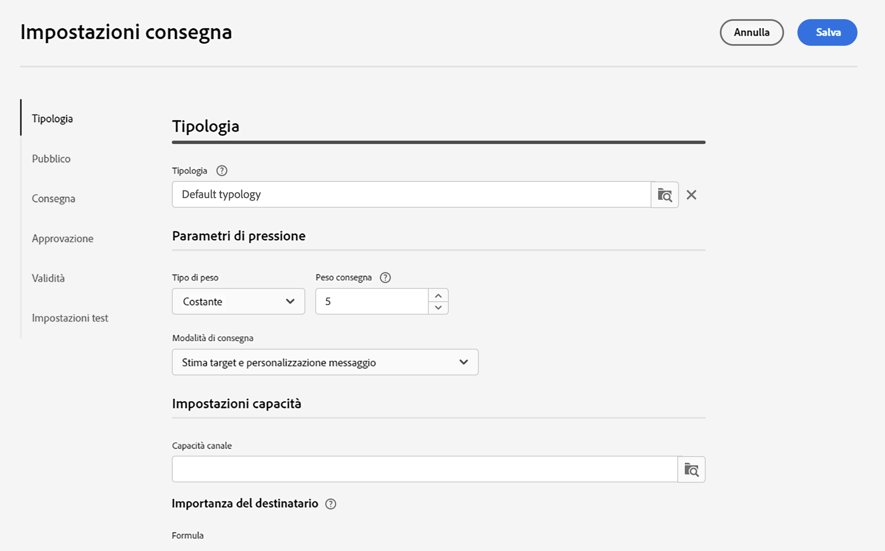
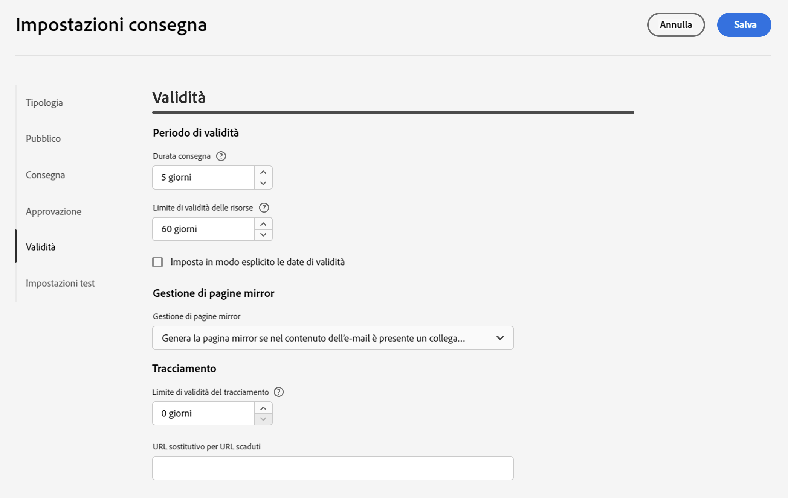

# Impostazioni di consegna e-mail {#email-del-settings}

Queste impostazioni sono **parametri tecnici di consegna** definiti nel modello e-mail. Sono accessibili mediante l’icona **Configura impostazioni di consegna**, disponibile durante la modifica di una consegna e-mail.

## Impostazioni di consegna e-mail {#email-delivery-settings}

>[!CAUTION]
>
> Queste impostazioni sono descritte solo a scopo informativo. Alcune dipendono dalla configurazione e dalle autorizzazioni. In questa versione del prodotto, non devono essere modificate.

## Tipologia {#typology}

>[!CONTEXTUALHELP]
>id="acw_email_settings_typology"
>title="Tipologia"
>abstract="Tiplogia consente di controllare, filtrare e monitorare l’invio delle consegne."

Le tipologie sono insiemi di **regole di tipologia** che vengono eseguite durante la fase di analisi dei messaggi. Consentono di assicurarsi che le e-mail contengano sempre alcuni elementi, come un collegamento per l’annullamento dell’abbonamento o una riga dell’oggetto oppure regole di filtro per escludere i gruppi dal target previsto, ad esempio utenti non abbonati, concorrenti o clienti non fidelizzati.

Durante l’associazione di una tipologia a un messaggio o a un modello di messaggio, le regole di tipologia vengono eseguite per verificare la validità del messaggio.

### Parametri di pressione {#pressure-parameters}

>[!CONTEXTUALHELP]
>id="acw_email_settings_delivery_weight"
>title="Peso consegna"
>abstract="Il “peso” delle consegne consente di individuare le consegne prioritarie nel quadro della gestione della pressione. I messaggi con il peso maggiore hanno priorità."

In questa sezione, i parametri di pressione consentono di definire una **soglia**. Si tratta del numero massimo di messaggi che possono essere inviati a un profilo in un dato periodo di tempo. Una volta raggiunta tale soglia, non potranno più essere effettuate ulteriori consegne fino alla fine del periodo considerato. Questo processo ti consente di escludere automaticamente un profilo da una consegna se un messaggio supera la soglia impostata, evitando in tal modo una sollecitazione eccessiva.

I valori di soglia possono essere costanti o variabili. Ciò significa che per un dato periodo le soglie possono variare da un profilo all’altro, o anche per lo stesso profilo.

Nel campo **Tipo di peso** sono disponibili tre opzioni:

* **Costante**
* **Dipende dal destinatario**
* **Definito in ciascuna regola**

Utilizza il campo **Peso consegna** per definire il livello di priorità della consegna. Ogni consegna ha un peso che rappresenta il suo livello di priorità. Per impostazione predefinita, il peso di una consegna è impostato su 5. Le regole di pressione consentono di definire il peso delle consegne a cui sono applicate. I pesi possono essere impostati o calcolati tramite una formula adatta ai destinatari. Ad esempio, puoi definire il peso di una consegna in base agli interessi dei destinatari.

Utilizza il campo **Modalità di consegna** per selezionare la modalità di valutazione del target. Sono disponibili tre modalità:

* **Stima target e personalizzazione messaggio**
* **Stima e approvazione del target provvisorio**
* **Valutazione del target**

La gestione dell’eccesso di comunicazioni può essere eseguita mediante il componente aggiuntivo **Ottimizzazione di Campaign**. Per ulteriori informazioni sulle regole di pressione e su come configurare la gestione dell’eccesso, consulta la [documentazione di Campaign v8](https://experienceleague.adobe.com/docs/campaign/automation/campaign-optimization/pressure-rules.html?lang=it){target="_blank"}.

### Impostazioni capacità {#capacity-settings}

>[!CONTEXTUALHELP]
>id="acw_email_settings_recipient_importance"
>title="Importanza del destinatario"
>abstract="L’importanza del destinatario è una formula utilizzata per determinare quali destinatari mantenere se vengono superate le regole di tipologia della capacità."

In questa sezione puoi selezionare una regola di capacità definita nella console Adobe Campaign v8. Questa regola è associata al canale e-mail.

Il campo **importanza del destinatario** è una formula utilizzata per determinare quali destinatari vengono mantenuti in caso di superamento delle regole di tipologia della capacità.

Per ulteriori informazioni sulle regole di coerenza e capacità e su come configurarle, consulta la [documentazione di Campaign v8](https://experienceleague.adobe.com/docs/campaign/automation/campaign-optimization/consistency-rules.html?lang=it){target="_blank"}.

## Pubblico {#audience}

In questa sezione puoi selezionare una **mappatura target** tra quelle disponibili. Le mappature target sono definite nella console Adobe Campaign v8.

Per ulteriori informazioni sulle mappature target, consulta la [documentazione di Campaign v8](https://experienceleague.adobe.com/docs/campaign/campaign-v8/audience/add-profiles/target-mappings.html?lang=it){target="_blank"}.

## Consegna {#delivery}

I parametri di consegna sono impostazioni tecniche applicabili alla consegna.

* **Indirizzamento**: l’account esterno di indirizzamento e-mail integrato è fornito per impostazione predefinita. Contiene i parametri tecnici che consentono all’applicazione di effettuare l’invio di e-mail.

* **Test consegna SMTP**: questa opzione viene utilizzata per testare l’invio tramite SMTP. La consegna viene elaborata fino alla connessione al server SMTP, ma non viene inviata: per ogni destinatario della consegna, Campaign si connette al server del provider SMTP, esegue il comando SMTP RCPT TO e chiude la connessione prima del comando SMTP DATA.

* **Invia e-mail in Ccn**: questa opzione viene utilizzata per memorizzare le e-mail su un sistema esterno tramite Ccn, semplicemente aggiungendo un indirizzo e-mail Ccn al target del messaggio. Scopri di più sull’invio in Ccn dell’email nella [documentazione di Campaign v8](https://experienceleague.adobe.com/docs/campaign/campaign-v8/config/configuration/email-settings.html?lang=it){target="_blank"}.

### Nuovi tentativi {#retries}

>[!CONTEXTUALHELP]
>id="acw_email_settings_retries"
>title="Numero massimo di nuovi tentativi"
>abstract="Se un messaggio non riesce a causa di un errore temporaneo, vengono eseguiti nuovi tentativi fino alla fine della durata della consegna."

<!--Temporarily undelivered messages due to a Soft or Ignored error are subject to an automatic retry. By default, five retries are scheduled for the first day of the delivery with a minimum interval of one hour spread out over the 24 hours of the day. -->

Per ulteriori informazioni sulla gestione dei tentativi, conulta la [documentazione di Campaign v8](https://experienceleague.adobe.com/docs/campaign/campaign-v8/config/configuration/email-settings.html?lang=it){target="_blank"}.

## Approvazione {#approval}

>[!CONTEXTUALHELP]
>id="acw_email_settings_approval"
>title="Modalità di approvazione"
>abstract="Ogni fase di una consegna può essere soggetta ad approvazione per garantire il pieno monitoraggio e controllo dei vari processi."

Se durante la preparazione della consegna vengono generate avvertenze, puoi configurare la consegna per definire se dovrà essere eseguita o meno. Per impostazione predefinita, l’utente deve confermare l’invio di messaggi al termine della fase di analisi: si tratta di convalida **manuale**.

Puoi selezionare un’altra modalità di approvazione nel campo appropriato. Le modalità disponibili sono:

* **Manuale**: al termine della fase di analisi, l’utente deve confermare la consegna per iniziare l’invio.

* **Semiautomatico**: l’invio inizia automaticamente se la fase di analisi non genera messaggi di avvertenza.

* **Automatico**: l’invio inizia automaticamente al termine della fase di analisi, indipendentemente dal risultato.

## Validità {#validity}

>[!CONTEXTUALHELP]
>id="acw_email_settings_delivery_duration"
>title="Durata consegna"
>abstract="Il campo Durata consegna consente di specificare il limite per i nuovi tentativi di consegna globali. Questo significa che Adobe Campaign invia i messaggi a partire dalla data di inizio e quindi, per i messaggi che restituiscono un errore, vengono eseguiti nuovi tentativi regolari e configurabili fino al raggiungimento del limite di validità."

>[!CONTEXTUALHELP]
>id="acw_email_settings_resources_validity"
>title="Limite di validità delle risorse"
>abstract="Il campo Limite di validità viene utilizzato per le risorse caricate, come la pagina mirror o le immagini. Queste risorse sono valide per un periodo di tempo limitato: una volta raggiunto il limite, non sono più disponibili."

Il campo **Durata consegna** consente di specificare il limite per i nuovi tentativi di consegna globali. Questo significa che Adobe Campaign invia i messaggi a partire dalla data di inizio e quindi, per i messaggi che restituiscono un errore, vengono eseguiti nuovi tentativi regolari e configurabili fino al raggiungimento del limite di validità.

Puoi anche scegliere di specificare le date. A questo scopo, seleziona **Imposta in modo esplicito le date di validità**. In questo caso, per le date di consegna e del limite validità puoi anche specificare l’ora. Per impostazione predefinita viene utilizzata l’ora corrente, ma puoi modificarla direttamente nel campo di input.

**Limite di validità delle risorse**: questo campo viene utilizzato per le risorse caricate, principalmente per la pagina mirror e le immagini. Le risorse presenti in questa pagina sono valide per un periodo di tempo limitato (per risparmiare spazio su disco). Superato il limite, le risorse non sono più disponibili.

Per ulteriori informazioni sul periodo di validità della consegna, consulta la [documentazione di Campaign v8](https://experienceleague.adobe.com/docs/campaign/campaign-v8/campaigns/send/failures/delivery-failures.html?lang=it#validity-period){target="_blank"}.

### Gestione delle pagine mirror {#mirror}

La pagina mirror è una pagina HTML accessibile online tramite un browser web. Il contenuto è identico a quello dell’e-mail. Per impostazione predefinita, la pagina mirror viene generata se il collegamento viene inserito nel contenuto dell’e-mail.

Oltre alla modalità predefinita, sono disponibili anche le seguenti opzioni:

* **[!UICONTROL Forza la generazione della pagina mirror]**: utilizza questa modalità per generare la pagina mirror anche se nella consegna non è inserito alcun collegamento alla pagina mirror.
* **[!UICONTROL Non generare la pagina mirror]**: utilizza questa modalità per evitare di generare una pagina mirror, anche se il collegamento è presente nella consegna.
* **[!UICONTROL Genera una pagina mirror accessibile utilizzando solo l’identificatore del messaggio]**: quando il collegamento della pagina mirror non è presente nel contenuto dell’e-mail, utilizza questa opzione per abilitare l’accesso al contenuto della pagina mirror, nella finestra del registro di consegna, dalla console client.

### Tracciamento {#tracking}

>[!CONTEXTUALHELP]
>id="acw_email_settings_tracking_validity"
>title="Periodo di validità"
>abstract="Questa opzione definisce la durata per la quale viene attivato il tracciamento degli URL."

I parametri di tracciamento sono definiti nella relativa sezione. Le opzioni possibili sono:

**Limite di validità del tracciamento**: utilizza questa opzione per cambiare la durata per la quale viene attivato il tracciamento degli URL.

**URL sostitutivo per URL scaduti**: utilizza questa opzione per immettere un URL per una pagina web di fallback che viene visualizzata una volta scaduto il tracciamento.

## Impostazioni test {#test-setttings}

In questa sezione puoi impostare i parametri di esclusione. Le opzioni disponibili sono:

* **Mantieni duplicati**: consente di autorizzare più consegne ai destinatari che soddisfano più criteri di targeting.

* **Mantieni indirizzi inseriti nell’elenco Bloccati**: consente di mantenere i profili che non rientrano più nel target della consegna, ad esempio dopo un annullamento dell’iscrizione (rinuncia).

* **Mantieni indirizzi in quarantena**: consente di mantenere i profili del target il cui indirizzo non risponde.

Puoi anche personalizzare il nome delle e-mail di test.

Utilizza l’opzione **Usa il codice di consegna per la bozza** per associare all’e-mail di test lo stesso codice di consegna definito per la consegna a cui si riferisce.

Per impostazione predefinita, l’oggetto dell’e-mail di test è preceduto da &quot;PROOF #&quot; (BOZZA #), dove # è il numero dell’e-mail di test. Puoi cambiare questo prefisso nel campo **Prefisso etichetta**.