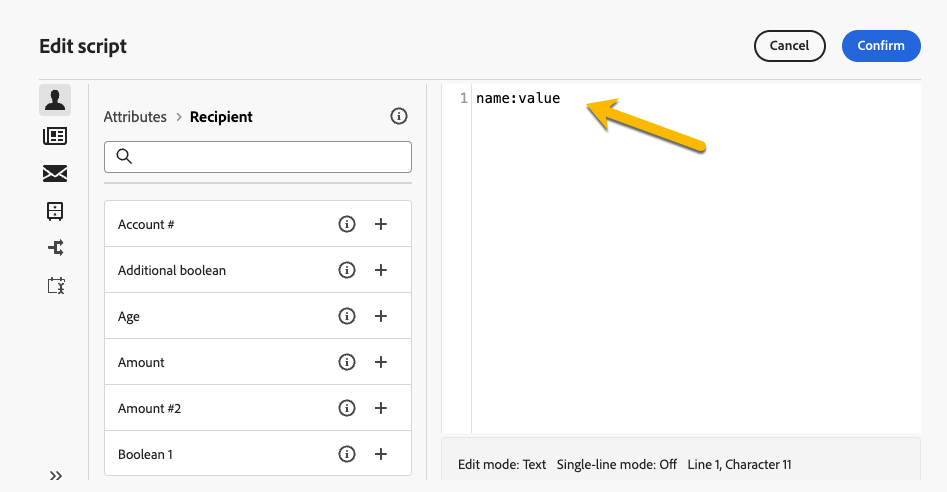

# Configurare le impostazioni di consegna {#del-settings}

Le impostazioni di consegna sono **parametri tecnici di consegna** definiti nel modello di consegna. Possono essere sovraccarichi per ogni consegna. Queste impostazioni sono disponibili tramite il pulsante **Impostazioni** disponibile quando si modifica una consegna o un modello di consegna.

>[!CAUTION]
>
>Queste impostazioni sono descritte solo a scopo informativo. Alcune dipendono dalla configurazione e dalle autorizzazioni. In questa versione del prodotto, non devono essere modificate.

## Impostazioni della tipologia {#typology}

>[!CONTEXTUALHELP]
>id="acw_email_settings_typology"
>title="Tipologia"
>abstract="Le regole di tipologia consentono ai marketer di standardizzare le pratiche aziendali per tutte le consegne. Una tipologia è una raccolta di regole di tipologia che ti consentono di controllare, filtrare e assegnare priorità all’invio delle consegne. I profili che corrispondono ai criteri all’interno di una regola di tipologia sono esclusi dai tipi di pubblico di consegna durante la fase di preparazione. Le tipologie e le relative regole vengono create nella console client di Campaign."

>[!CONTEXTUALHELP]
>id="acw_delivery_template_settings_typology"
>title="Impostazioni della tipologia per la consegna"
>abstract="Le regole di tipologia consentono ai marketer di standardizzare le pratiche aziendali per tutte le consegne. Una tipologia è una raccolta di regole di tipologia che ti consentono di controllare, filtrare e assegnare priorità all’invio delle consegne. I profili che corrispondono ai criteri all’interno di una regola di tipologia sono esclusi dai tipi di pubblico di consegna durante la fase di preparazione. Le tipologie e le relative regole vengono create nella console client di Campaign."

Le tipologie sono insiemi di **regole di tipologia** che vengono eseguite durante la fase di preparazione per applicare facilmente più regole di filtro a una consegna. Consentono ai marketer di standardizzare le pratiche aziendali su tutte le consegne in quanto consentono loro di controllare, filtrare e assegnare priorità all’invio delle consegne.

Quando si associa una tipologia a un messaggio o a un modello di messaggio, le regole di tipologia incluse nella tipologia vengono eseguite per verificare la validità della consegna durante la preparazione dei messaggi. I profili che soddisfano i criteri di una regola di tipologia vengono quindi esclusi dai tipi di pubblico di consegna.

Le tipologie consentono di assicurarsi che le consegne contengano sempre alcuni elementi (come un collegamento per l’annullamento dell’abbonamento o una riga dell’oggetto) o regole di filtro per escludere i gruppi dal target previsto (come utenti non abbonati, concorrenti o clienti non fidelizzati).

{zoomable="yes"}

>[!NOTE]
>
>Le tipologie e le relative regole vengono create nella console client di Campaign. Per ulteriori informazioni sulle regole di pressione e su come configurare la gestione dell’eccesso, consulta la [documentazione di Campaign v8 (console client)](https://experienceleague.adobe.com/docs/campaign/automation/campaign-optimization/campaign-typologies.html?lang=it){target="_blank"}.

### Parametri di pressione {#pressure-parameters}

>[!CONTEXTUALHELP]
>id="acw_email_settings_pressure_parameters"
>title="Parametri di pressione per la consegna"
>abstract="Il peso delle consegne consente di individuare le consegne prioritarie nel quadro della gestione dell’eccesso. I messaggi con il peso maggiore hanno priorità."

>[!CONTEXTUALHELP]
>id="acw_delivery_template_settings_delivery_weight"
>title="Peso consegna"
>abstract="Il peso delle consegne consente di individuare le consegne prioritarie nel quadro della gestione della pressione. I messaggi con il peso maggiore hanno priorità."

In questa sezione, i parametri di pressione ti consentono di definire una **soglia** per impostare le regole di gestione dell&#39;affaticamento, che è il numero massimo di messaggi che possono essere inviati a un profilo in un determinato periodo.

Una volta raggiunta tale soglia, non potranno più essere effettuate ulteriori consegne fino alla fine del periodo considerato. Questo processo ti consente di escludere automaticamente un profilo da una consegna se un messaggio supera la soglia impostata, evitando in tal modo una sollecitazione eccessiva.

I valori di soglia possono essere costanti o variabili. Ciò significa che per un dato periodo le soglie possono variare da un profilo all’altro, o anche per lo stesso profilo.

Nel campo **[!UICONTROL Tipo di peso]** sono disponibili tre opzioni:

* **[!UICONTROL Costante]**
* **[!UICONTROL Dipende dal destinatario]**
* **[!UICONTROL Definito in ciascuna regola]**

Utilizza il campo **[!UICONTROL Peso consegna]** per definire il livello di priorità della consegna. Ogni consegna ha un peso che rappresenta il suo livello di priorità. Per impostazione predefinita, il peso di una consegna è impostato su 5. Le regole di pressione consentono di definire il peso delle consegne a cui sono applicate. I pesi possono essere impostati o calcolati tramite una formula adatta ai destinatari. Ad esempio, puoi definire il peso di una consegna in base agli interessi dei destinatari.

Utilizza il campo **[!UICONTROL Modalità di consegna]** per selezionare la modalità di valutazione di destinazione.

Sono disponibili tre modalità:

* **[!UICONTROL Stima target e personalizzazione messaggio]**
* **[!UICONTROL Stima e approvazione del target provvisorio]**
* **[!UICONTROL Valutazione del target]**

>[!NOTE]
>
>La gestione dell’eccesso e le regole di pressione sono configurate nella console client di Campaign. Per ulteriori informazioni, consulta la [documentazione di Campaign v8 (console client)](https://experienceleague.adobe.com/docs/campaign/automation/campaign-optimization/pressure-rules.html?lang=it){target="_blank"}.

### Impostazioni capacità {#capacity-settings}

>[!CONTEXTUALHELP]
>id="acw_email_settings_capacity_settings"
>title="Impostazioni della capacità per la consegna"
>abstract="Prima di consegnare i messaggi, utilizza le regole di capacità per assicurarti che la tua organizzazione possa elaborare la consegna, i messaggi in entrata che la consegna può generare e il numero di chiamate da effettuare, ad esempio, per contattare chi possiede un abbonamento. Le regole di capacità sono definite nella console Adobe Campaign v8. In questa schermata, seleziona una regola associata al canale."

>[!CONTEXTUALHELP]
>id="acw_delivery_template_settings_recipient_importance"
>title="Importanza del destinatario"
>abstract="L’importanza del destinatario è una formula utilizzata per determinare quali profili mantenere se vengono superate le regole di capacità della tipologia."

In questa sezione puoi selezionare una regola di capacità definita nella console Adobe Campaign v8. Questa regola è associata al canale.

Il campo **[!UICONTROL Importanza del destinatario]** è una formula utilizzata per determinare quali profili vengono conservati quando vengono superate le regole di tipologia della capacità.

>[!NOTE]
>
>Le regole di tipologia sono configurate nella console client di Campaign. Per ulteriori informazioni, consulta la [documentazione di Campaign v8 (console client)](https://experienceleague.adobe.com/docs/campaign/automation/campaign-optimization/consistency-rules.html?lang=it){target="_blank"}.

## Impostazioni pubblico {#audience}

>[!CONTEXTUALHELP]
>id="acw_email_settings_audience"
>title="Impostazioni del pubblico per la consegna"
>abstract="Seleziona una **mappatura target** tra quelle disponibili. Le mappature target sono definite nella console Adobe Campaign v8. Puoi anche impostare i parametri di esclusione per la consegna."

In questa sezione puoi selezionare una **mappatura target** tra quelle disponibili. Le mappature target sono definite nella console Adobe Campaign v8. Il mapping di destinazione è il tipo di dati gestito da un&#39;operazione. Consente di definire la popolazione target: destinatari, beneficiari del contratto, operatori, abbonati, ecc. [Ulteriori informazioni sulle mappature di destinazione](../audience/targeting-dimensions.md).

Nel campo **[!UICONTROL Esclusione]** puoi selezionare di escludere i profili che non desiderano più essere contattati o che sono in quarantena. [Ulteriori informazioni](https://experienceleague.adobe.com/docs/campaign/campaign-v8/send/failures/quarantines.html){target="_blank"}

## Consegna {#delivery}

>[!CONTEXTUALHELP]
>id="acw_email_settings_delivery"
>title="Impostazioni per la consegna"
>abstract="I parametri di consegna sono impostazioni tecniche applicabili alla consegna. Puoi modificare le modalità di consegna e di routine, attivare Ccn per le e-mail, inviare usando scaglioni e scegliere anche il formato dei messaggi e-mail inviati. Queste opzioni sono disponibili solo per utenti esperti."

I parametri **[!UICONTROL Delivery]** sono impostazioni tecniche che si applicano alla consegna.

{zoomable="yes"}

L&#39;account esterno **[!UICONTROL Routing]** integrato è fornito per impostazione predefinita. Contiene i parametri tecnici che consentono all’applicazione di inviare consegne.

Puoi definire le impostazioni **[!UICONTROL Invio]** di seguito.

* **[!UICONTROL Priorità consegna]**: utilizzare questa opzione per modificare l&#39;ordine di invio delle consegne impostandone il livello di priorità: normale, alto o basso.

* **[!UICONTROL Quantità batch messaggi]**: utilizzare questa opzione per definire il numero di messaggi raggruppati nello stesso pacchetto di consegna XML. Se il parametro è impostato su 0, i messaggi vengono raggruppati automaticamente. La dimensione del pacchetto è definita dal calcolo `<delivery size>/1024`, con un minimo di 8 e un massimo di 256 messaggi per pacchetto.

  >[!IMPORTANT]
  >
  >Quando la consegna viene creata duplicandone una esistente, questo parametro viene reimpostato.

* **[!UICONTROL Verifica consegna SMTP]** (canale e-mail): questa opzione viene utilizzata per testare l&#39;invio tramite SMTP. L’e-mail viene elaborata fino alla connessione al server SMTP, ma non viene inviata: per ogni destinatario dell’e-mail, Campaign si connette al server provider SMTP, esegue il comando SMTP RCPT TO e chiude la connessione prima del comando SMTP DATA.

* **[!UICONTROL CCN e-mail]** (canale e-mail): questa opzione viene utilizzata per memorizzare le e-mail su un sistema esterno tramite CCN semplicemente aggiungendo un indirizzo e-mail CCN alla destinazione del messaggio. Per ulteriori informazioni, consulta la [documentazione di Campaign v8 (console client)](https://experienceleague.adobe.com/docs/campaign/campaign-v8/send/emails/email-bcc.html){target="_blank"}.

Nella sezione **[!UICONTROL Definizione ondata]**, selezionare l&#39;opzione **[!UICONTROL Invia con più ondate]** per aumentare progressivamente il volume inviato tramite ondate. In questo modo i messaggi non verranno contrassegnati come spam o quando desideri limitare il numero di messaggi al giorno. Utilizzando le scaglioni è possibile suddividere le consegne in più batch anziché inviare contemporaneamente volumi elevati di messaggi. [Ulteriori informazioni](send-using-waves.md)

Per le e-mail, puoi anche modificare i **[!UICONTROL formati di posta]** dei messaggi inviati come descritto di seguito.

* **[!UICONTROL Usa preferenze destinatario]** (modalità predefinita): il formato e-mail è definito in base ai dati memorizzati nel profilo del destinatario. Se un destinatario desidera ricevere e-mail in un determinato formato, questo è il formato inviato. Se il campo non viene compilato, viene inviata un’e-mail multipart-alternative (vedi sotto).

* **[!UICONTROL Let recipient mail client choose the most appropriate format]**: L&#39;e-mail contiene entrambi i formati: testo e HTML. Il formato visualizzato sulla ricezione dipende dalla configurazione del software di posta del destinatario (multipart-alternative).

  >[!IMPORTANT]
  >
  >Questa opzione include entrambe le versioni del documento. Di conseguenza, influisce sulla velocità di consegna, perché la dimensione dell’e-mail è maggiore.

* **[!UICONTROL Invia tutti i messaggi in formato testo]**: l&#39;e-mail viene inviata in formato testo. Il formato HTML non verrà inviato, ma verrà utilizzato per la pagina speculare solo quando il destinatario farà clic sull’e-mail.

## Analisi web {#web-analytics}

>[!CONTEXTUALHELP]
>id="acw_email_settings_webanalytics"
>title="Impostazioni dell’analisi web per la consegna"
>abstract="Seleziona un account di analisi web. Questo account è configurato nella console client di Campaign. Puoi anche definire i tag condivisi con lo strumento di analisi in uso."

In questa sezione, puoi selezionare un account di analisi web. Questo account è configurato nella console client di Campaign.

Puoi anche definire i tag condivisi con lo strumento di analisi in uso.

>[!NOTE]
>
>Le funzionalità di analisi web sono configurate nella console client di Campaign. Per ulteriori informazioni, consulta la [documentazione di Campaign v8 (console client)](https://experienceleague.adobe.com/docs/campaign/campaign-v8/connect/ac-aa.html#external-account-ac){target="_blank"}.

## Nuovi tentativi {#retries}

>[!CONTEXTUALHELP]
>id="acw_delivery_template_settings_retries"
>title="Numero massimo di nuovi tentativi"
>abstract="Se un messaggio non riesce a causa di un errore temporaneo, vengono eseguiti nuovi tentativi fino alla fine della durata della consegna."

<!--Currently not visible in UI > ??-->

I messaggi temporaneamente non consegnati a causa di un errore di tipo Soft o Ignorato sono soggetti a un nuovo tentativo automatico. Per impostazione predefinita, per il primo giorno della consegna sono pianificati cinque nuovi tentativi con un intervallo minimo di un’ora distribuiti nelle 24 ore del giorno.

## Approvazione (canale e-mail) {#approval}

>[!CONTEXTUALHELP]
>id="acw_email_settings_approval"
>title="Modalità di approvazione per la consegna"
>abstract="Seleziona la modalità di approvazione. Se durante la preparazione della consegna vengono generate avvertenze, puoi configurare la consegna per definire se dovrà essere eseguita o meno."

>[!CONTEXTUALHELP]
>id="acw_delivery_template_settings_approval"
>title="Modalità di approvazione per le consegne"
>abstract="Seleziona la modalità di approvazione per le consegne in base a questo modello. Se durante la preparazione della consegna vengono generate avvertenze, puoi configurare la consegna per definire se dovrà essere eseguita o meno."

Se vengono generati avvisi durante la preparazione di una consegna e-mail, puoi configurarla per definire se deve essere ancora eseguita. Per impostazione predefinita, l&#39;utente deve confermare l&#39;invio di e-mail al termine della fase di analisi: convalida **manuale**.

Puoi selezionare un’altra modalità di approvazione nel campo appropriato. Le modalità disponibili sono:

* **[!UICONTROL Manuale]**: al termine della fase di analisi, l’utente deve confermare la consegna per iniziare l’invio.
* **[!UICONTROL Semiautomatico]**: l’invio inizia automaticamente se la fase di analisi non genera messaggi di avvertenza.
* **[!UICONTROL Automatico]**: l’invio inizia automaticamente al termine della fase di analisi, indipendentemente dal risultato.

## Validità {#validity}

>[!CONTEXTUALHELP]
>id="acw_email_settings_validity"
>title="Validità delle impostazioni"
>abstract="Il campo **Durata consegna** consente di specificare il limite per i nuovi tentativi di consegna globali. Questo significa che Adobe Campaign invia i messaggi a partire dalla data di inizio e quindi, per i messaggi che restituiscono un errore, vengono eseguiti nuovi tentativi regolari e configurabili fino al raggiungimento del limite di validità. Il campo **Limite di validità delle risorse** viene utilizzato per le risorse caricate, come la pagina mirror o le immagini. Una volta raggiunto il limite, le risorse non sono più disponibili."

>[!CONTEXTUALHELP]
>id="acw_delivery_template_settings_resources_validity"
>title="Limite di validità delle risorse"
>abstract="Il campo **Limite di validità delle risorse** viene utilizzato per le risorse caricate, come la pagina mirror e le immagini. Queste risorse sono valide per un periodo di tempo limitato: una volta raggiunto il limite, non sono più disponibili."

>[!CONTEXTUALHELP]
>id="acw_delivery_template_settings_delivery_duration"
>title="Durata consegna"
>abstract="Il campo **Durata consegna** consente di specificare il limite per i nuovi tentativi di consegna globali. Questo significa che Adobe Campaign invia i messaggi a partire dalla data di inizio e quindi, per i messaggi che restituiscono un errore, vengono eseguiti nuovi tentativi regolari e configurabili fino al raggiungimento del limite di validità."

<!--
>[!CONTEXTUALHELP]
>id="acw_email_settings_resources_validity"
>title="Resources validity limit"
>abstract="The Validity limit field is used for uploaded resources, such as the mirror page or images. These resources are valid for a limited time: once the limit is reached, resources are no longer available."
-->

### Periodo di validità {#validity-period}

Il campo **[!UICONTROL Durata consegna]** consente di specificare il limite per i nuovi tentativi di consegna globali. Questo significa che Adobe Campaign invia i messaggi a partire dalla data di inizio e quindi, per i messaggi che restituiscono un errore, vengono eseguiti nuovi tentativi regolari e configurabili fino al raggiungimento del limite di validità.

Puoi anche scegliere di specificare le date. A questo scopo, seleziona **[!UICONTROL Imposta in modo esplicito le date di validità]**. In questo caso, per le date di consegna e del limite validità puoi anche specificare l’ora. Per impostazione predefinita viene utilizzata l’ora corrente, ma puoi modificarla direttamente nel campo di input.

**[!UICONTROL Limite di validità delle risorse]** viene utilizzato per le risorse caricate, principalmente per la pagina speculare e per le immagini. Le risorse presenti in questa pagina sono valide per un periodo di tempo limitato (per risparmiare spazio su disco). Superato il limite, le risorse non sono più disponibili.

{zoomable="yes"}

<!--Change screenshot to be consistent with prod > not sure which version is correct-->

Per ulteriori informazioni sul periodo di validità della consegna, consulta la [documentazione di Campaign v8 (console client)](https://experienceleague.adobe.com/docs/campaign/campaign-v8/campaigns/send/failures/delivery-failures.html?lang=it#validity-period){target="_blank"}.

### Gestione delle pagine mirror (canale e-mail) {#mirror}

La pagina mirror è una pagina HTML accessibile online tramite un browser web. Il contenuto è identico a quello dell’e-mail. Per impostazione predefinita, la pagina speculare viene generata se il collegamento viene inserito nel contenuto dell’e-mail.

Oltre alla modalità predefinita, sono disponibili anche le seguenti opzioni:

* **[!UICONTROL Forza la generazione della pagina mirror]**: utilizza questa modalità per generare la pagina mirror anche se nell&#39;e-mail non è inserito alcun collegamento alla pagina mirror.
* **[!UICONTROL Non generare la pagina mirror]**: utilizzare questa modalità per evitare di generare una pagina mirror, anche se il collegamento è presente nell&#39;e-mail.
* **[!UICONTROL Genera una pagina mirror accessibile utilizzando solo l&#39;identificatore del messaggio]**: se il collegamento alla pagina mirror non è presente nel contenuto dell&#39;e-mail, utilizzare questa opzione per abilitare l&#39;accesso al contenuto della pagina mirror dalla console client nella finestra del registro di consegna.

### Tracciamento {#tracking}

<!--
>[!CONTEXTUALHELP]
>id="acw_email_settings_tracking_validity"
>title="Validity period"
>abstract="This option defines the duration for which the tracking is activated on the URLs."
-->

>[!CONTEXTUALHELP]
>id="acw_delivery_template_settings_tracking_validity"
>title="Periodo di validità"
>abstract="Il periodo di validità stabilisce la durata per la quale viene attivato il tracciamento sugli URL dei messaggi."

**[!UICONTROL I parametri di tracciamento]** sono definiti nella relativa sezione. Le opzioni possibili sono:

* **[!UICONTROL Limite di validità del tracciamento]**: utilizzare questa opzione per modificare la durata per la quale il tracciamento viene attivato sugli URL.
* **[!UICONTROL URL di sostituzione per URL scaduti]**: utilizzare questa opzione per immettere un URL per una pagina Web di fallback: verrà visualizzato una volta scaduto il tracciamento.

## Impostazioni di bozza {#test-setttings}

>[!CONTEXTUALHELP]
>id="acw_email_settings_testsettings"
>title="Definire le impostazioni della bozza per la consegna"
>abstract="Seleziona i parametri di esclusione e personalizza l’etichetta delle bozze."

<!--Test to be replaced with Proof everywhere - currently not consistent within UI > changed to Proof to reflect UI here but not consistent in documentation either-->

In questa sezione puoi impostare i parametri di esclusione. Le opzioni disponibili sono:

* **[!UICONTROL Mantieni duplicati]** consente di autorizzare più consegne a profili che soddisfano diversi criteri di targeting.
* **[!UICONTROL Mantieni indirizzi inseriti nell’elenco Bloccati]**: consente di mantenere i profili che non rientrano più nel target della consegna, ad esempio dopo un annullamento dell’iscrizione (rinuncia).
* **[!UICONTROL Mantieni indirizzi in quarantena]**: consente di mantenere i profili del target il cui indirizzo non risponde.

È inoltre possibile personalizzare l’etichetta delle bozze:

* Utilizza **[!UICONTROL Mantieni il codice di consegna per la bozza]** per associare alla bozza lo stesso codice di consegna definito per la consegna a cui si riferisce.
* Per impostazione predefinita, l’oggetto della bozza è preceduto da &quot;PROOF #&quot; (BOZZA #), dove # è il numero della bozza. Puoi cambiare questo prefisso nel campo **[!UICONTROL Prefisso etichetta]**.

## Impostazioni SMTP per la consegna e-mail {#smtp}

>[!CONTEXTUALHELP]
>id="acw_email_settings_smtp"
>title="Parametri SMTP"
>abstract="Puoi aggiungere parametri SMTP aggiuntivi alla consegna e-mail."

Puoi aggiungere parametri SMTP aggiuntivi alla consegna e-mail. Puoi farlo nella scheda SMTP delle impostazioni di consegna.

{zoomable="yes"}

### Codifica caratteri {#character-encoding}

La sezione **[!UICONTROL Codifica caratteri]** consente di impostare una codifica specifica. La codifica predefinita è UTF-8, che funziona per la maggior parte dei caratteri. Tuttavia, alcuni provider di posta elettronica potrebbero non visualizzare correttamente i caratteri speciali se non supportano la codifica standard UTF-8.

Ad esempio, se desideri inviare un’e-mail con caratteri giapponesi, è meglio utilizzare una codifica che supporti specificamente tali caratteri, in modo che il pubblico in Giappone possa vedere tutto correttamente.

Per eseguire questa operazione, attivare **[!UICONTROL Forza la codifica utilizzata per i messaggi]** e selezionare la codifica corretta dall&#39;elenco che supporta i caratteri speciali.

{zoomable="yes"}

### E-mail non recapitate {#bounce-emails}

La scheda **[!UICONTROL SMTP]** delle impostazioni di consegna consente inoltre di configurare la gestione dei messaggi non recapitati.

* **[!UICONTROL Errori all&#39;indirizzo]**: se si attiva l&#39;interruttore **[!UICONTROL Utilizza l&#39;indirizzo di errore predefinito definito per la piattaforma]**, le e-mail non recapitate vengono ricevute nella casella di errore predefinita della piattaforma. Se non lo attivi, puoi definire un indirizzo di errore specifico per la consegna.

* **[!UICONTROL Indirizzo non recapitato]**: puoi anche definire un altro indirizzo al quale vengono inoltrate le e-mail non recapitate non elaborate. Questo indirizzo consente di indagare i motivi di mancato recapito quando le e-mail non potevano essere qualificate automaticamente dall’applicazione.

Questi due campi possono essere personalizzati come descritto in [questa sezione](../personalization/gs-personalization.md).

{zoomable="yes"}

### Altre intestazioni SMTP {#smtp-headers}

Puoi aggiungere **[!UICONTROL intestazioni SMTP]** alla consegna e-mail nella scheda SMTP delle impostazioni di consegna.

Lo script inserito in questa finestra deve fare riferimento a un&#39;intestazione per riga nel seguente formato: nome:valore.

Se necessario, i valori vengono codificati automaticamente.

{zoomable="yes"}

>[!IMPORTANT]
>
>L’aggiunta di uno script per l’inserimento di intestazioni SMTP aggiuntive è un’operazione riservata agli utenti avanzati. La sintassi di questo script deve essere conforme ai requisiti di questo tipo di contenuto: nessuno spazio inutilizzato, nessuna linea vuota e così via.

## Aggiunta di variabili {#variables-delivery}

>[!CONTEXTUALHELP]
>id="acw_delivery_settings_variable"
>title="Variabili"
>abstract="Variabili"

Puoi aggiungere variabili alla consegna, il che può essere utile per il tracciamento. A tale scopo, passare alla scheda **[!UICONTROL Variabili]** come illustrato di seguito.

{zoomable="yes"}

Fai clic sul pulsante **[!UICONTROL Aggiungi variabili]** per immettere i dettagli della variabile, quindi fai clic su **[!UICONTROL Conferma]** per salvare le modifiche.

{zoomable="yes"}
