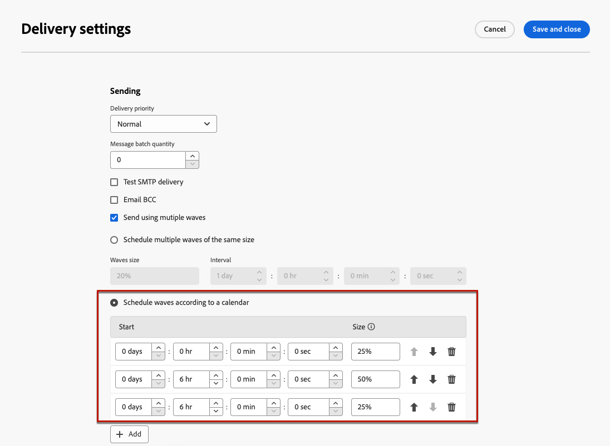

# Inviare utilizzando gli scaglioni {#send-using-waves}

>[!CONTEXTUALHELP]
>id="acw_deliveries_waves_definition"
>title="Dividere le consegne in più batch"
>abstract="Invece di inviare grandi volumi di messaggi contemporaneamente, definisci gli scaglioni per suddividere le consegne in più batch. Puoi configurare più scaglioni della stessa dimensione o impostare un calendario per i diversi scaglioni da inviare."

>[!CONTEXTUALHELP]
>id="acw_deliveries_waves_size"
>title="Definire la dimensione di ogni scaglione"
>abstract="Immetti una dimensione per tutti gli scaglioni che stai aggiungendo. Immetti un valore numerico (numero di messaggi per ogni scaglione) o una percentuale (0-100%)."

Per bilanciare il carico, puoi suddividere le consegne e-mail in più batch. Configura il numero di batch e la loro proporzione rispetto all’intera consegna, nonché l’intervallo tra due ondate.

>[!NOTE]
>
>Puoi definire solo la dimensione e il ritardo tra due scaglioni consecutivi. Non è possibile regolare i criteri di selezione dei destinatari per ogni ondata.

Per inviare le consegne scaglionate, segui la procedura riportata di seguito.

1. Apri le [impostazioni di consegna](delivery-settings.md#retries).

1. Passare alla sezione **[!UICONTROL Consegna]**.

1. Selezionare l&#39;opzione **[!UICONTROL Invia con più scaglioni]**.

1. Per configurare le ondate, puoi effettuare le seguenti operazioni:

   * [Pianifica più scaglioni della stessa dimensione.](#waves-same-size)
   * [Pianifica scaglioni in base a un calendario](#waves-calendar)

1. Prepara e invia la consegna come di consueto. [Ulteriori informazioni](../msg/gs-deliveries.md)

   >[!CAUTION]
   >
   >Assicurati che gli ultimi scaglioni non superino la scadenza di consegna, definita nella scheda [Validità](delivery-settings.md#validity), altrimenti alcuni messaggi potrebbero non essere inviati. Una regola di controllo della tipologia specifica, **[!UICONTROL Controllo pianificazione ondata]**, assicura che l&#39;ultimo ondata sia pianificato prima del limite di validità della consegna. Ulteriori informazioni sulle regole di controllo sono disponibili nella [documentazione di Campaign v8 (console client)](https://experienceleague.adobe.com/docs/campaign/automation/campaign-optimization/control-rules.html?lang=it).
   >
   >È inoltre necessario concedere tempo sufficiente per i nuovi tentativi durante la configurazione degli ultimi scaglioni. [Ulteriori informazioni](delivery-settings.md#retries)

1. Per monitorare gli invii, vai ai [registri di consegna](../monitor/delivery-logs.md). Puoi visualizzare le consegne già inviate negli scaglioni elaborati (**[!UICONTROL Stato inviato]**) e le consegne da inviare negli scaglioni rimanenti (**[!UICONTROL Stato in sospeso]**).

## Pianifica più scaglioni della stessa dimensione. {#waves-same-size}

Se selezionate questa opzione, tutte le onde hanno la stessa dimensione (tranne l&#39;ultima) e il ritardo tra ogni onda è sempre lo stesso.

{zoomable="yes"}

* Specifica la dimensione di tutte le ondate in cui si sta suddividendo la consegna. È possibile immettere una percentuale o un valore numerico. Solo l&#39;ultima ondata può variare in dimensioni in quanto deve includere il numero rimanente di messaggi.

  Ad esempio, se immetti **[!UICONTROL 30%]** nel campo **[!UICONTROL Dimensione scaglioni]**, le prime tre scaglioni rappresentano il 30% di tutti i messaggi inclusi nella consegna e la quarta rappresenta il restante 10%.

* Nella sezione **[!UICONTROL Intervallo]** specificare il ritardo tra l&#39;inizio di due scaglioni consecutivi. Ad esempio, se si immettono **[!UICONTROL 2 giorni]**, la prima ondata inizia immediatamente, la seconda ondata inizierà tra due giorni, la terza ondata tra quattro giorni e così via.

Un caso d’uso comune per l’utilizzo di più scaglioni della stessa dimensione riguarda un call center. Quando gestisci una campagna fedeltà telefonica, la tua organizzazione ha una capacità limitata di elaborare il numero di chiamate per contattare gli abbonati.

Utilizzando le ondate, è possibile limitare il numero di messaggi a 20 al giorno, che rappresenta la capacità di elaborazione giornaliera di un call center.

A tale scopo, selezionare l&#39;opzione **[!UICONTROL Pianifica più scaglioni della stessa dimensione]**. Immetti **[!UICONTROL 20]** come dimensione scaglioni e **[!UICONTROL 1 giorno]** nel campo **[!UICONTROL Intervallo]**.

{zoomable="yes"}

## Pianifica scaglioni in base a un calendario {#waves-calendar}

Se selezioni questa opzione, devi definire il giorno/ora di inizio per ogni scaglione che stai inviando, nonché la dimensione di ogni scaglione.

* Nei campi **[!UICONTROL Inizio]**, specifica il ritardo tra l&#39;inizio di due ondate consecutive.

* Nella colonna **[!UICONTROL Dimensione]** immettere un numero fisso o una percentuale.

Aggiungi tutte le ondate che desideri. Puoi riordinarli in base alle tue esigenze.

>[!NOTE]
>
>Se utilizzi percentuali, il totale per tutte le ondate non deve superare il 100%.

Nell’esempio seguente, la prima ondata rappresenta il 25% del numero totale di messaggi inclusi nella consegna e inizia immediatamente. Le due fasi successive completano la consegna e sono impostate per iniziare a intervalli di sei ore.

{zoomable="yes"}

Un caso d’uso comune per l’utilizzo di più scaglioni secondo un calendario è durante il processo di incremento.

Quando le e-mail vengono inviate utilizzando una nuova piattaforma, i provider di servizi Internet (ISP) sospettano che gli indirizzi IP non siano riconosciuti. Se grandi quantità di e-mail vengono inviate improvvisamente, gli ISP spesso le contrassegnano come spam.

Per evitare di essere contrassegnati come spam, puoi aumentare progressivamente il volume inviato scaglionando. Ciò dovrebbe garantire un regolare sviluppo della fase di avvio e consentirti di ridurre il tasso complessivo di indirizzi non validi.

A tale scopo, utilizzare l&#39;opzione **[!UICONTROL Pianifica ondate in base a un calendario]**. Ad esempio, imposta la prima ondata su 10%, la seconda su 15%, la terza su 20% e così via.

{zoomable="yes"}
