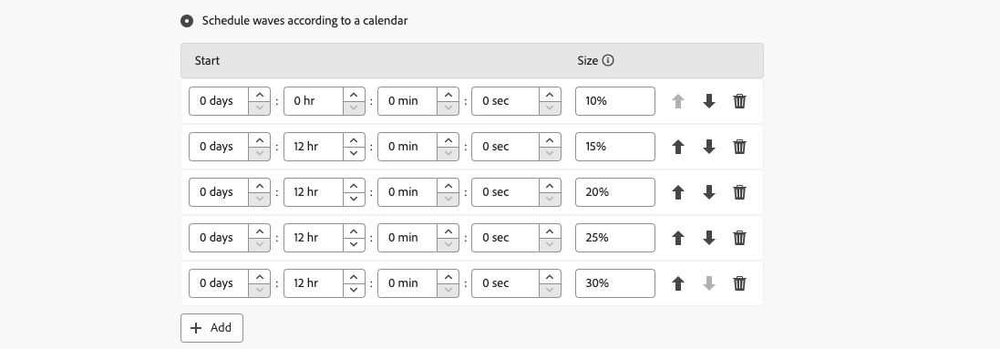

# Invia in ondate {#send-using-waves}

>[!CONTEXTUALHELP]
>id="acw_deliveries_waves_definition"
>title="Definizione scaglioni"
>abstract="Definisci le ondate per suddividere le consegne in più batch invece di inviare contemporaneamente elevati volumi di messaggi."

>[!CONTEXTUALHELP]
>id="acw_deliveries_waves_size"
>title="Dimensione dell&#39;onda"
>abstract="È necessario specificare la dimensione dell&#39;onda. Immetti un valore numerico (numero di messaggi) o una percentuale (0-100%) nel campo dimensione."

Per bilanciare il carico, puoi dividere le consegne in più batch. Configura il numero di batch e la loro proporzione rispetto all’intera consegna.

>[!NOTE]
>
>Puoi definire solo la dimensione e il ritardo tra due scaglioni consecutivi. Non è possibile configurare i criteri di selezione dei destinatari per ogni ondata.

1. Apri [impostazioni di consegna](delivery-settings.md#retries) e vai al **[!UICONTROL Consegna]** scheda.
1. Seleziona la **[!UICONTROL Invia in più ondate]** e fare clic sul pulsante **[!UICONTROL Definisci ondate...]** collegamento.

1. Per configurare le ondate, puoi effettuare le seguenti operazioni:

   * **[!UICONTROL Pianificazione di più scaglioni della stessa dimensione]**.

     Ad esempio, se si immette **[!UICONTROL 30%]** nel campo corrispondente, ogni ondata rappresenterà il 30% dei messaggi inclusi nella consegna, ad eccezione dell’ultimo, che rappresenterà il 10% dei messaggi.

     

     In **[!UICONTROL Interval]** , specificare il ritardo tra l&#39;inizio di due scaglioni consecutivi. Ad esempio, se si immette **[!UICONTROL 2d]**, la prima ondata comincerà immediatamente, la seconda fra due giorni, la terza fra quattro giorni e così via.

   * **[!UICONTROL Pianifica ondate in base a un calendario]**.

     In **[!UICONTROL Inizio]** , specificare il ritardo tra l&#39;inizio di due ondate consecutive. In **[!UICONTROL Dimensione]** , immettere un numero fisso o una percentuale.

     Nell’esempio seguente, la prima ondata rappresenta il 25% del numero totale di messaggi inclusi nella consegna e inizierà immediatamente. Le due fasi successive completano la consegna e sono impostate per iniziare a intervalli di sei ore.

     

     Una regola di controllo specifica per la tipologia, **[!UICONTROL Controllo programmazione ondata]**, assicura che l’ultimo scaglione sia pianificato prima del limite di validità della consegna. Le tipologie di campagne e le relative regole sono configurate in **[!UICONTROL Tipologia]** delle impostazioni di consegna. Ulteriori informazioni sulle regole di controllo in [Documentazione di Campaign v8 (console client)](https://experienceleague.adobe.com/docs/campaign/automation/campaign-optimization/control-rules.html).

     >[!IMPORTANT]
     >
     >Assicurati che gli ultimi scaglioni non superino la scadenza di consegna, definita nella sezione **[!UICONTROL Validità]** scheda. In caso contrario, alcuni messaggi potrebbero non essere inviati. [Ulteriori informazioni](delivery-settings.md#validity)
     >
     >È inoltre necessario concedere tempo sufficiente per i nuovi tentativi durante la configurazione degli ultimi scaglioni. [Ulteriori informazioni](delivery-settings.md#retries)

1. Per monitorare gli invii, vai al [registri di consegna](../monitor/delivery-logs.md).

Puoi visualizzare le consegne già inviate negli scaglioni elaborati (**[!UICONTROL Inviato]** stato) e le consegne da inviare negli scaglioni rimanenti (**[!UICONTROL In sospeso]** stato).

I due esempi seguenti sono i casi d’uso più comuni per l’utilizzo di più scaglioni.

* **Durante il processo di incremento**

  Quando le e-mail vengono inviate utilizzando una nuova piattaforma, i provider di servizi Internet (ISP) sospettano che gli indirizzi IP non siano riconosciuti. Se grandi quantità di e-mail vengono inviate improvvisamente, gli ISP spesso le contrassegnano come spam.

  Per evitare di essere contrassegnati come spam, puoi aumentare progressivamente il volume inviato scaglionando. Ciò dovrebbe garantire un regolare sviluppo della fase di avvio e consentirti di ridurre il tasso complessivo di indirizzi non validi.

  A tale scopo, utilizza **[!UICONTROL Pianifica ondate in base a un calendario]** opzione. Ad esempio, imposta la prima ondata su 10%, la seconda su 15% e così via.

  

* **Campagne che coinvolgono un call center**

  Quando gestisci una campagna fedeltà telefonica, la tua organizzazione ha una capacità limitata di elaborare il numero di chiamate per contattare gli abbonati.

  Utilizzando le ondate, è possibile limitare il numero di messaggi a 20 al giorno, che rappresenta la capacità di elaborazione giornaliera di un call center.

  A questo scopo, seleziona la **[!UICONTROL Pianificazione di più scaglioni della stessa dimensione]** opzione. Invio **[!UICONTROL 20]** come la dimensione dell&#39;onda e **[!UICONTROL 1d]** nel **[!UICONTROL Periodo]** campo.

  