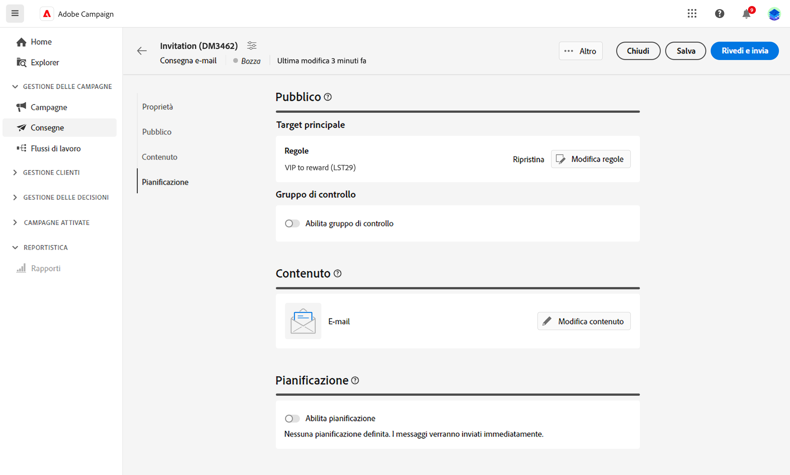

# Introduzione ai tipi di pubblico {#about-audiences}

>[!CONTEXTUALHELP]
>id="acw_homepage_card2"
>title="Introduzione ai tipi di pubblico"
>abstract="Scopri come gestire il pubblico per il contenuto delle e-mail."

<!--
Audience only created for the delivery, not available later-->

<!--
Three ways:
* existing audience

Campaign or AEP Audiences

* create new on the fly

query like AEP segment builder (same component with campaign data)

* import from file

show use case with a new audience creation (or import from file?)

control groups like acc: exract, random, based on attribute
-->

In questa sezione, scopri come definire il pubblico delle e-mail. Il pubblico è il target principale della consegna: i destinatari che riceveranno l’e-mail. Il tipo di pubblico dipende dalla mappatura target definita nel modello di consegna. Consulta questa [sezione](../email/create-email.md).

Per definire il pubblico, puoi procedere nei seguenti modi:

* Utilizzare un pubblico esistente; consulta questa [sezione](add-audience.md).
* Creare un nuovo pubblico; consulta questa [sezione](segment-builder.md).

Puoi anche definire dei gruppi di controllo per evitare di inviare messaggi a una parte del pubblico, in modo da misurare l’impatto delle campagne. Consulta questa [sezione](control-group.md).

