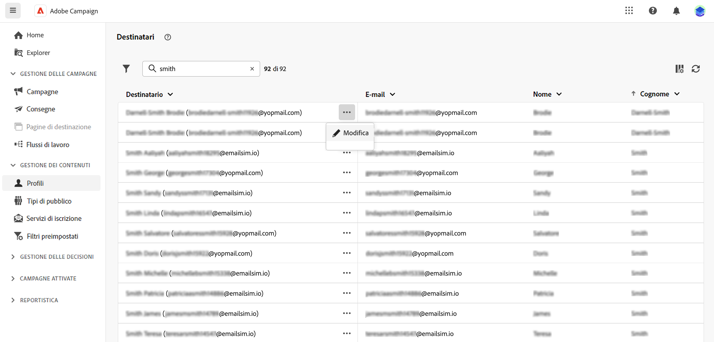
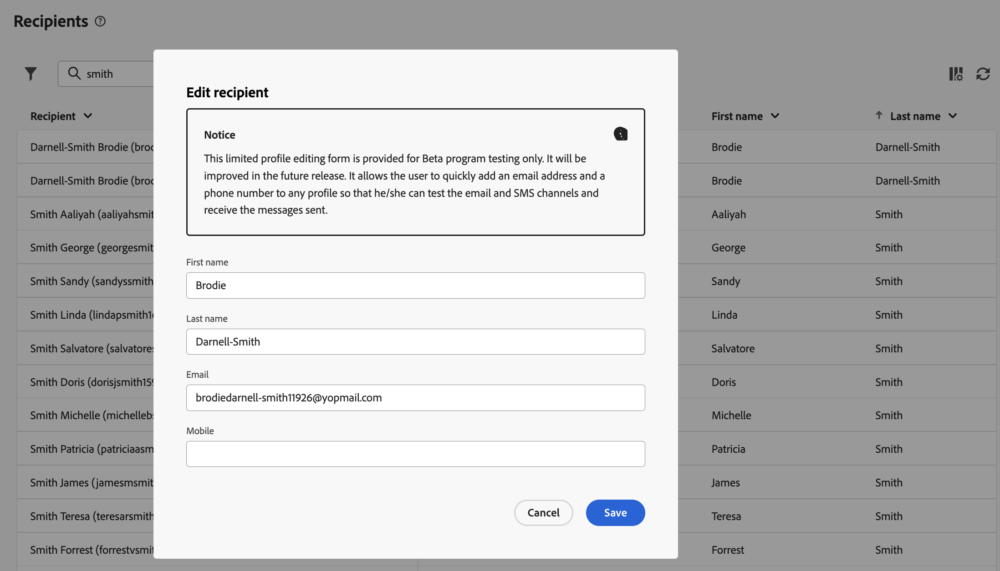
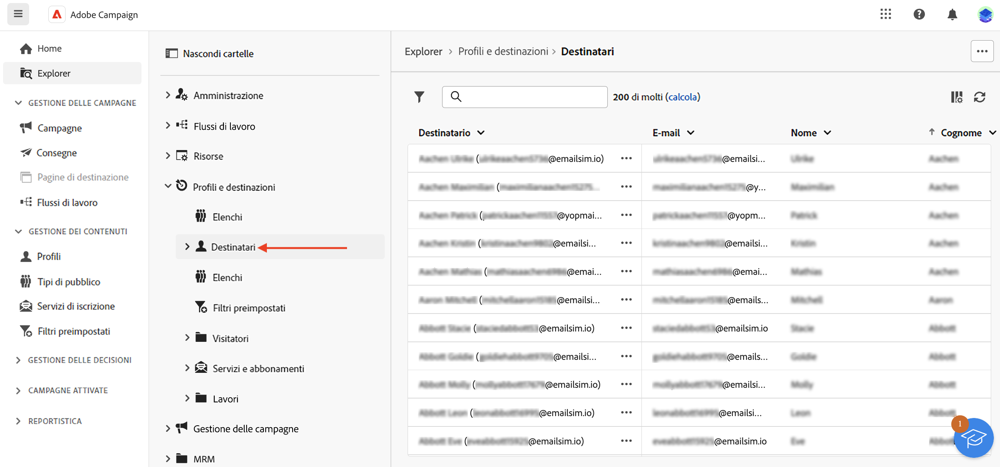

# Utilizzare destinatari e tipi di pubblico {#about-recipients}

In Adobe Campaign, la popolazione target di una consegna è un “pubblico”. Un pubblico è un insieme di persone che condividono comportamenti e/o caratteristiche simili. Questo insieme di persone può essere generato, selezionato o caricato [come descritto di seguito](#audiences). Nella maggior parte dei casi, il pubblico è costituito da profili, memorizzati come [destinatari](#recipients) in Adobe Campaign. Puoi anche lavorare con altre mappature target modificando la dimensione come spiegato [in questa sezione](#targeting-dimensions).

## Cosa sono i destinatari? {#recipients}

>[!CONTEXTUALHELP]
>id="acw_homepage_rn4"
>title="Visualizzazione 360 dei destinatari"
>abstract="Crea nuovi destinatari e monitorali tramite potenti rapporti e strumenti. Accedi agli attributi, alle interazioni e ai registri del destinatario. Utilizza le opzioni di filtro per sfogliare l’elenco dei destinatari, modificarne e aggiornare il profilo."
>additional-url="https://experienceleague.adobe.com/docs/campaign-web/v8/whats-new.html" text="Consulta le note sulla versione"

>[!CONTEXTUALHELP]
>id="acw_recipients_list"
>title="Profili"
>abstract="Un profilo è un soggetto destinato a ricevere i messaggi inviati da Adobe Campaign. In Adobe Campaign, i destinatari sono i profili target predefiniti per l’invio di consegne (e-mail, SMS, ecc). Da questo elenco, in base alle tue autorizzazioni, puoi visualizzare il profilo del destinatario. Utilizza le opzioni di filtro per sfogliare l’elenco. Puoi modificare e aggiornare un piccolo set di attributi del destinatario."

Un destinatario è un profilo destinato a ricevere i messaggi inviati da Adobe Campaign. In Adobe Campaign, i destinatari sono i profili target predefiniti per l’invio di consegne (e-mail, SMS, ecc). I dati dei destinatari memorizzati nel database consentono di creare tipi di pubblico che riceveranno una determinata consegna e di aggiungere dati di personalizzazione al contenuto della consegna. Nel database sono presenti altri tipi di profili. Sono progettati per utilizzi diversi: ad esempio, i profili seed vengono usati per testare le consegne prima di inviarle al pubblico finale.

I destinatari possono essere aggiunti solo dalla console client di Campaign. Tuttavia, sono visibili in Campaign Web dalla voce **Destinatari** nella barra di navigazione a sinistra. Puoi anche modificare gli attributi del destinatario da quella schermata.

Per modificare i dati del destinatario, fai clic sui tre punti accanto al nome e scegli **Modifica...**.

Puoi aggiornare un set limitato di attributi, ovvero: nome, cognome, indirizzo e-mail e numero di telefono.

>[!NOTE]
>
>Questo modulo di modifica del profilo limitato è fornito solo a scopo di test nel programma Beta. Sarà migliorato nella versione successiva. Consente all’utente di aggiungere rapidamente un indirizzo e-mail e un numero di telefono a qualsiasi profilo, in modo da poter testare i canali e-mail e SMS e ricevere i messaggi inviati.

Puoi filtrare i destinatari utilizzando il campo di ricerca, dal pulsante **Mostra filtri**.

Puoi anche accedere ai destinatari dalla vista **Explorer**, sfogliare e creare cartelle e sottocartelle e verificare le autorizzazioni associate.

>[!NOTE]
>
>La possibilità di accedere all’elenco completo dei destinatari archiviati nel database dipende dalle autorizzazioni di cui disponi. Ulteriori informazioni sulle autorizzazioni sono disponibili in [questa sezione](../get-started/permissions.md).

Inoltre, puoi gestire l’iscrizione e l’annullamento dell’iscrizione dei destinatari a servizi quali le newsletter. Scopri come utilizzare i servizi di iscrizione in [questa pagina](manage-services.md)

Puoi creare flussi di lavoro per deduplicare, arricchire, combinare i profili e creare tipi di pubblico. Per ulteriori informazioni, consulta [questa sezione](../workflows/gs-workflows.md).

## Cosa sono i tipi di pubblico? {#audiences}

Il pubblico è il target principale della consegna: i destinatari che ricevono i messaggi. Il tipo di pubblico dipende dalla mappatura target definita nel modello di consegna. Ulteriori informazioni sui modelli di consegna sono disponibili in [questa pagina](../msg/delivery-template.md).

Per definire la popolazione di un pubblico, puoi:

* [Creare nuovi tipi di pubblico](create-audience.md) dal menu **[!UICONTROL Tipi di pubblico]**
* [Selezionare un pubblico esistente](add-audience.md) creato come elenco nella console client o proveniente da Adobe Experience Platform
* [Creare un nuovo pubblico](segment-builder.md) con il generatore di regole definendo e combinando criteri di filtro
* [Utilizzare un pubblico da un file esterno](file-audience.md); questa opzione è disponibile solo per le consegne e-mail autonome e non può essere utilizzata nelle consegne delle campagne.

Nel targeting di un pubblico, puoi definire dei **gruppi di controllo** per evitare di inviare messaggi a una parte del pubblico, in modo da misurare l’impatto delle campagne. [Scopri come impostare un gruppo di controllo](control-group.md)

>[!NOTE]
>
>Quando si inviano messaggi nel contesto del flusso di lavoro di una campagna, il pubblico viene definito in una specifica attività **Crea pubblico** del flusso di lavoro. In questo contesto, non puoi caricare un pubblico da un file per una consegna e-mail e il pubblico è definito solo in questa attività dedicata. Scopri come definire il pubblico della consegna in un flusso di lavoro della campagna in [questa sezione](../workflows/activities/build-audience.md)

## Dimensioni di targeting {#targeting-dimensions}

La dimensione targeting, detta anche mappatura target, è il tipo di dati gestito da un’operazione. Consente di definire la popolazione target: destinatari, beneficiari del contratto, operatori, abbonati, ecc.

La dimensione targeting di un flusso di lavoro è definita dalla prima attività **[!UICONTROL Crea pubblico]** e viene utilizzata in tutte le ulteriori attività fino alla fine del flusso di lavoro. Ad esempio, se esegui una query sui destinatari del database, la transizione in uscita conterrà dati di tipo destinatario e verrà trasmessa all’attività successiva.

Tieni presente che puoi cambiare la dimensione targeting in un flusso di lavoro utilizzando un’attività [Cambia dimensione](../workflows/activities/change-dimension.md). In questo modo, ad esempio, puoi eseguire query sul database per una tabella specifica, come acquisti o abbonamenti, e quindi cambiare la dimensione targeting in Destinatari per inviare le consegne ai destinatari corrispondenti.

Per impostazione predefinita, i modelli di consegna e-mail e SMS hanno come target i **[!UICONTROL Destinatari]**. La loro dimensione target utilizza quindi i campi della tabella **nms:recipient**. Per le notifiche push, la dimensione target predefinita è **Applicazioni in abbonamento nms:appSubscriptionRcp**, collegata alla tabella dei destinatari.

Puoi anche utilizzare altre mappature target integrate nei flussi di lavoro e nelle consegne, elencate di seguito:

| Nome | Utilizza per | Schema |
|---|---|---|
| Destinatari | Consegnare ai destinatari (tabella dei destinatari incorporata) | nms:recipient |
| Visitatori | Consegnare ai visitatori i cui profili sono stati raccolti tramite riferimento (marketing virale) per es. | mns:visitor |
| Abbonamenti | Consegnare ai destinatari abbonati o iscritti a un servizio informativo, ad esempio una newsletter | nms:subscription |
| Abbonamenti visitatore | Consegnare ai visitatori abbonati o iscritti a un servizio informativo | nms:visitorSub |
| Operatori | Consegnare agli operatori Adobe Campaign | nms:operator |
| File esterno | Consegnare tramite un file contenente tutte le informazioni necessarie per la consegna | Nessuno schema collegato, nessuna destinazione immessa |
| Applicazioni in abbonamento | Consegnare ai destinatari abbonati o iscritti a un’applicazione | nms:appSubscriptionRcp |

Inoltre, puoi creare una nuova mappatura target in base alle tue esigenze. Questa operazione viene eseguita dalla console client. Per ulteriori informazioni, consulta la [documentazione di Campaign v8 (console client)](https://experienceleague.adobe.com/docs/campaign/campaign-v8/audience/add-profiles/target-mappings.html?lang=it#new-mapping){target="_blank"}
