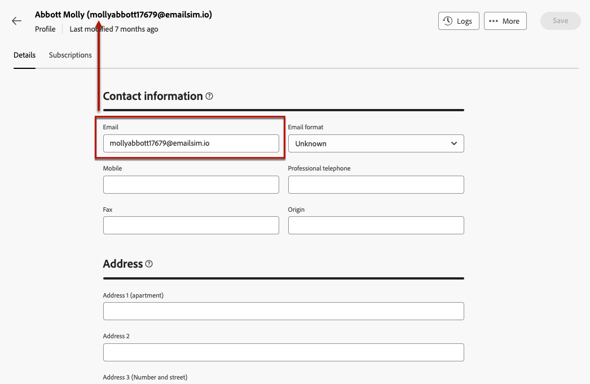

# Monitorare e modificare i profili {#profiles}

>[!CONTEXTUALHELP]
>id="acw_homepage_rn4"
>title="Visualizzazione 360 dei profili"
>abstract="Crea nuovi profili e monitorali tramite rapporti e strumenti potenti. Accedi agli attributi, alle interazioni e ai registri dei profili. Utilizza le opzioni di filtro per sfogliare l’elenco dei profili, modificarne e aggiornarne il profilo."
>additional-url="https://experienceleague.adobe.com/docs/campaign-web/v8/whats-new.html" text="Consulta le note sulla versione"

>[!CONTEXTUALHELP]
>id="acw_recipients_list"
>title="Profili"
>abstract="Un profilo è un soggetto destinato a ricevere i messaggi inviati da Adobe Campaign. Da questo elenco, puoi visualizzare i dettagli dei profili in base alle autorizzazioni di cui disponi. Utilizza le opzioni di filtro per sfogliare l’elenco. Puoi modificare e aggiornare un piccolo set di attributi dei profili."

## Introduzione ai profili {#gs}

Un profilo in Adobe Campaign Web è una persona memorizzata nel database che funge da componente chiave per la creazione di tipi di pubblico per le consegne e l’aggiunta di dati di personalizzazione al contenuto.

Altri tipi di profili vengono memorizzati nel database, ad esempio **[!UICONTROL Profili di test]**, progettati per testare le consegne prima che vengano inviate al pubblico finale. [Scopri come utilizzare i profili di test](test-profiles.md)

I profili possono essere creati solo dalla console client di Adobe Campaign - [scopri come](https://experienceleague.adobe.com/docs/campaign/campaign-v8/audience/add-profiles/create-profiles.html){target="_blank"}. Tuttavia, sono accessibili e modificabili in Adobe Campaign Web dalla sezione **[!UICONTROL Gestione clienti]** > **Profili** nella barra di navigazione a sinistra.

>[!NOTE]
>
>A seconda delle autorizzazioni, potresti non avere accesso all’elenco completo dei profili memorizzati nel database. Ulteriori informazioni sulle autorizzazioni sono disponibili in [questa sezione](../get-started/permissions.md).

* Puoi filtrare i **[!UICONTROL Profili]** utilizzando il campo di ricerca o i filtri disponibili nella **Mostra filtri** pulsante. È possibile limitare i risultati a uno specifico [cartella](../get-started/permissions.md#folders) utilizzando l’elenco a discesa, oppure aggiungi regole utilizzando [query modeler](../query/query-modeler-overview.md).

  

* Per eliminare un profilo, selezionare l&#39;opzione corrispondente dalla **[!UICONTROL Altre azioni]** menu.

* Per modificare un profilo, fai clic sull’elemento desiderato dall’elenco. [Ulteriori informazioni](#access)

Puoi anche accedere ai profili tramite **[!UICONTROL Esplora]** vista, da **[!UICONTROL Profili e destinazioni]** > **[!UICONTROL Destinatari]** nodo.

Da qui è possibile sfogliare, creare e gestire cartelle o sottocartelle, nonché verificare le autorizzazioni associate. [Scopri come creare cartelle](../get-started/permissions.md#folders)

Dalla sezione **[!UICONTROL Esplora]** visualizzazione puoi anche filtrare, eliminare e [modifica](#access) profili.

## Accedere e modificare gli attributi dei profili {#access}

>[!CONTEXTUALHELP]
>id="acw_recipients_creation_details"
>title="Dettagli di base"
>abstract="Questa sezione offre informazioni approfondite sui dettagli di base del profilo. Per modificare qualsiasi informazione, apporta le modifiche direttamente nel rispettivo campo e fai clic sul pulsante **Salva** nell&#39;angolo superiore destro dello schermo."

>[!CONTEXTUALHELP]
>id="acw_recipients_creation_contactinformation"
>title="Dati di contatto"
>abstract="Questa sezione offre informazioni approfondite sulle informazioni di contatto del profilo. Per modificare qualsiasi informazione, apporta le modifiche direttamente nel rispettivo campo e fai clic sul pulsante **Salva** nell&#39;angolo superiore destro dello schermo."

>[!CONTEXTUALHELP]
>id="acw_recipients_creation_address"
>title="Indirizzo"
>abstract="Questa sezione offre informazioni approfondite sull’indirizzo postale del profilo e sulla qualità dell’indirizzo. Per modificare qualsiasi informazione, apporta le modifiche direttamente nel rispettivo campo e fai clic sul pulsante **Salva** nell&#39;angolo superiore destro dello schermo."

>[!CONTEXTUALHELP]
>id="acw_recipients_creation_account"
>title="Dettagli account"
>abstract="Questa sezione offre informazioni approfondite sui dettagli dell’account del profilo. Per modificare qualsiasi informazione, apporta le modifiche direttamente nel rispettivo campo e fai clic sul pulsante **Salva** nell&#39;angolo superiore destro dello schermo."

>[!CONTEXTUALHELP]
>id="acw_recipients_creation_nolongercontact"
>title="Destinatari da non contattare più"
>abstract="Questa sezione offre informazioni approfondite sulle preferenze di contatto del profilo. Per modificare qualsiasi informazione, apporta le modifiche direttamente nel rispettivo campo e fai clic sul pulsante **Salva** nell&#39;angolo superiore destro dello schermo."

>[!CONTEXTUALHELP]
>id="acw_recipients_creation_customfields"
>title="Campi personalizzati"
>abstract="I campi personalizzati sono attributi specifici personalizzati in base alle tue esigenze e configurati per la tua istanza. Per modificare qualsiasi informazione, apporta le modifiche direttamente nel rispettivo campo e fai clic sul pulsante **Salva** nell&#39;angolo superiore destro dello schermo."

>[!CONTEXTUALHELP]
>id="acw_recipients_creation_othersfields"
>title="Altri"
>abstract="Questa sezione fornisce attributi incorporati aggiuntivi. Per modificare qualsiasi informazione, apporta le modifiche direttamente nel rispettivo campo e fai clic sul pulsante **Salva** nell&#39;angolo superiore destro dello schermo."

>[!CONTEXTUALHELP]
>id="acw_recipients_subscription_list"
>title="Elenco iscrizioni dei destinatari"
>abstract="Questa scheda elenca tutti i servizi a cui il profilo è abbonato."

Per accedere ai dettagli di un profilo e modificarli, effettua le seguenti operazioni.

1. Sfoglia per **[!UICONTROL Gestione clienti]** > **[!UICONTROL Profili]**.

1. Fai clic sull’elemento desiderato da **[!UICONTROL Profili]** elenco. Vengono visualizzate le informazioni dettagliate sul profilo.

   

1. Il **[!UICONTROL Dettagli]** Questa scheda ti consente di sfogliare gli attributi incorporati e personalizzati del profilo. Per modificare un attributo, apporta le modifiche desiderate nel campo desiderato e fai clic sul pulsante **[!UICONTROL Salva]** pulsante.

   1. Per impostazione predefinita, i profili sono memorizzati nel **[!UICONTROL Destinatari]** cartella. Puoi modificarlo navigando nella posizione desiderata. [Scopri come utilizzare le cartelle](../get-started/permissions.md#folders)

      

   1. In **[!UICONTROL Informazioni di contatto]** sezione, puoi aggiornare l’indirizzo e-mail e altri dati rilevanti. L’indirizzo e-mail viene visualizzato tra parentesi dopo l’etichetta del profilo.

      

   1. Controlla la **[!UICONTROL Non contattare più]** e aggiornarle, se necessario. Quando si seleziona una di queste opzioni, il profilo viene inserito nell&#39;elenco Bloccati in modalità di controllo. Queste informazioni vengono aggiunte ai dati di contatto se, ad esempio, il destinatario ha fatto clic su un collegamento di annullamento dell’abbonamento in una newsletter. Il destinatario non è più indirizzato ai canali selezionati. [Ulteriori informazioni](https://experienceleague.adobe.com/docs/campaign/campaign-v8/send/failures/quarantines.html){target="_blank"}

      

   1. Se sono presenti **[!UICONTROL Campi personalizzati]**, è possibile aggiornarne i valori in base alle esigenze. I campi personalizzati sono attributi aggiuntivi aggiunti al **[!UICONTROL Profili]** tramite la console Adobe Campaign. [Ulteriori informazioni](https://experienceleague.adobe.com/docs/campaign/campaign-v8/developer/shemas-forms/extend-schema.html){target="_blank"}

      

1. Fai clic su **[!UICONTROL Iscrizioni]** per accedere alle informazioni sui servizi a cui il profilo è abbonato. [Scopri come utilizzare i servizi di iscrizione](manage-services.md)

1. Fai clic su **[!UICONTROL Registri]** Questo pulsante si trova nell’angolo superiore destro della schermata per visualizzare la cronologia delle interazioni del profilo tramite i registri di invio, esclusione e tracciamento, nonché le offerte presentate al profilo. [Ulteriori informazioni sui registri di consegna](../monitor/delivery-logs.md)

   
