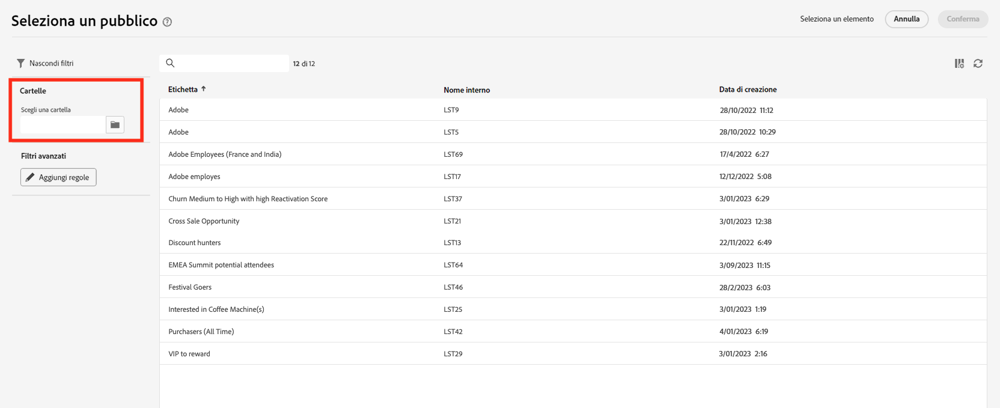
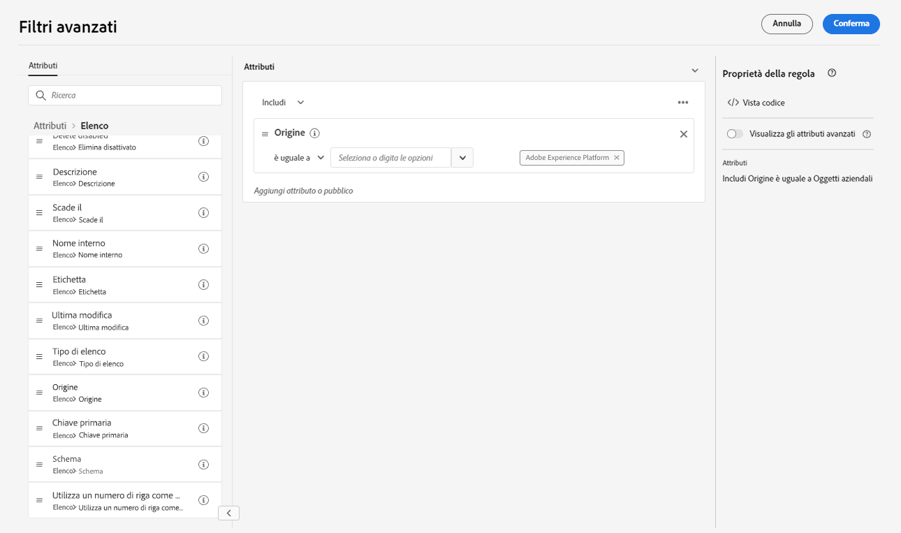
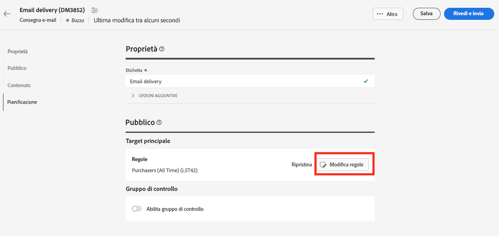

# Selezionare un pubblico esistente {#add-audience}

>[!CONTEXTUALHELP]
>id="acw_deliveries_email_audience_select"
>title="Selezionare un pubblico esistente"
>abstract="Sfoglia l’elenco per selezionare un pubblico esistente. Utilizza l’icona “Mostra filtri” per filtrare l’elenco o seleziona una cartella specifica."

Questa sezione spiega come selezionare un pubblico esistente durante la definizione della popolazione target di una consegna. Quando definisci il target principale di una consegna, puoi anche:
* [Creare un pubblico una tantum](one-time-audience.md) utilizzando il modellatore di query.
* [Caricare un pubblico da un file esterno](file-audience.md) (solo per e-mail).

I tipi di pubblico che possono essere oggetto di targeting nelle consegne sono accessibili dal menu **Pubblico** a sinistra. Provengono da più origini, ad esempio dalla console client, da flussi di lavoro per pubblico di Campaign Web o da Adobe Experience Platform. [Ulteriori informazioni sul pubblico](manage-audience.md)

Per selezionare un pubblico esistente per il messaggio, segui questi passaggi:

1. Dalla sezione **Pubblico** dell’assistente alla creazione della consegna, fai clic su **[!UICONTROL Seleziona pubblico]** quindi scegliere **[!UICONTROL Seleziona pubblico]**.

   {zoomable=&quot;yes&quot;}

1. In questa schermata vengono visualizzati tutti i tipi di pubblico esistenti per la cartella corrente.

   {zoomable=&quot;yes&quot;}

   Per scegliere un pubblico da Adobe Experience Platform, passa a `AEP Audiences folder` dalla sezione filter (filtro) dello schermo. [Ulteriori informazioni sui tipi di pubblico di Adobe Experience Platform](manage-audience.md#monitor)

   {zoomable=&quot;yes&quot;}

1. La sezione dei filtri consente di accedere alle opzioni di filtro per perfezionare l’elenco dei tipi di pubblico. A questo scopo, fai clic su **Aggiungi regole** per accedere a query modeler, che consente di creare filtri avanzati per l’elenco dei tipi di pubblico. [Scopri come utilizzare Query Modeler](../query/query-modeler-overview.md)

   Ad esempio, puoi definire una regola per filtrare in base all’origine dei tipi di pubblico, come illustrato di seguito:

   {zoomable=&quot;yes&quot;}

1. Fai clic su **Conferma** per aggiungere il pubblico come target principale della consegna. Al termine, puoi comunque perfezionare il pubblico utilizzando il modellatore di query facendo clic sul pulsante **Modifica regole** pulsante.

   {zoomable=&quot;yes&quot;}

   Puoi anche impostare un gruppo di controllo per misurare l’impatto delle campagne. Il gruppo di controllo non riceve il messaggio. Ciò consente di confrontare il comportamento di chi ha ricevuto il messaggio con quello dei contatti che non lo hanno ricevuto. [Ulteriori informazioni](control-group.md)
