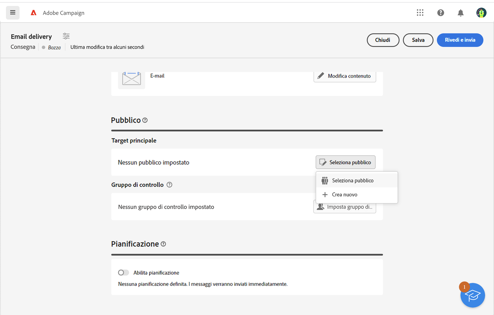
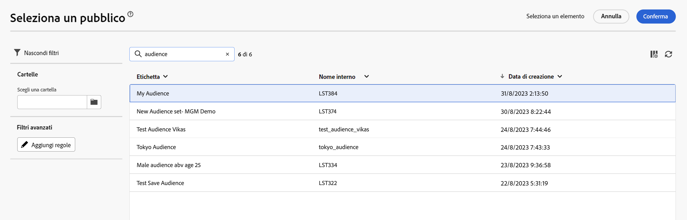
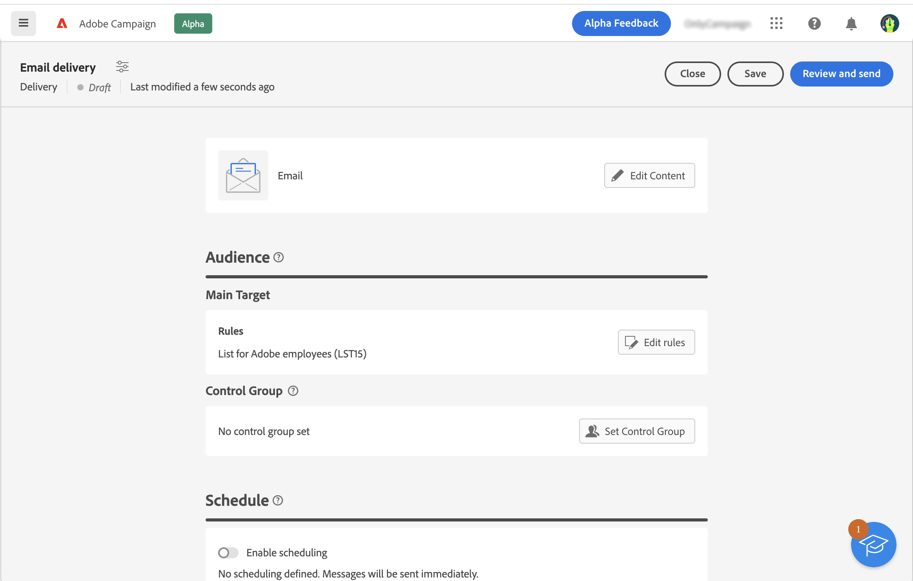
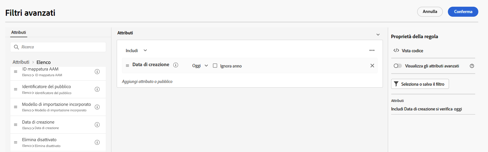

# Selezionare un pubblico esistente {#add-audience}

>[!CONTEXTUALHELP]
>id="acw_deliveries_email_audience_select"
>title="Selezionare un pubblico esistente"
>abstract="I tipi di pubblico sono definiti nella console Adobe Campaign v8. Se disponi di un’integrazione Adobe Experience Platform, dovresti essere in grado di visualizzare anche i tipi di pubblico definiti in Platform."

Questa sezione descrive come selezionare un pubblico esistente durante la definizione della popolazione target di una consegna e-mail.

Puoi anche:

* Creare un nuovo pubblico. [Ulteriori informazioni](segment-builder.md)
* Utilizza un pubblico da un file esterno. [Ulteriori informazioni](file-audience.md)
* Utilizzare un pubblico di Adobe Experience Platform. [Ulteriori informazioni](aep-audience.md).

Per selezionare un pubblico esistente per il messaggio, segui la procedura seguente:

1. Dalla sezione **Pubblico** nell’assistente per la creazione della consegna, fai clic sul pulsante **[!UICONTROL Seleziona pubblico]**.

   

1. Scegli **[!UICONTROL Seleziona pubblico]** per utilizzare un pubblico esistente. Per creare un nuovo pubblico da utilizzare in questo messaggio e-mail, scegli **Crea nuovo**. Fai riferimento a questa [sezione](segment-builder.md).

   In questa schermata vengono visualizzati tutti i tipi di pubblico esistenti definiti nella console Adobe Campaign o provenienti da Adobe Experience Platform.

   

   >[!NOTE]
   >
   >Per sfruttare i tipi di pubblico di Adobe Experience Platform, devi configurare l’integrazione con le destinazioni. Consulta la [documentazione sulle destinazioni](https://experienceleague.adobe.com/docs/experience-platform/destinations/home.html?lang=it){target="_blank"}.

1. Scegli un pubblico e fai clic su **Seleziona**.

1. Per perfezionare il pubblico, fai clic su **Modifica regole**.

   

1. Utilizzando il generatore di regole, puoi arricchire il pubblico con filtri aggiuntivi o combinando diversi tipi di pubblico. Consulta questa [sezione](segment-builder.md).

   

1. Fai clic su **Salva**.

Puoi anche impostare un gruppo di controllo per misurare l’impatto delle campagne. Il gruppo di controllo non riceve il messaggio. Ciò consente di confrontare il comportamento di chi ha ricevuto il messaggio con quello dei contatti che non lo hanno ricevuto. Consulta questa [sezione](control-group.md).