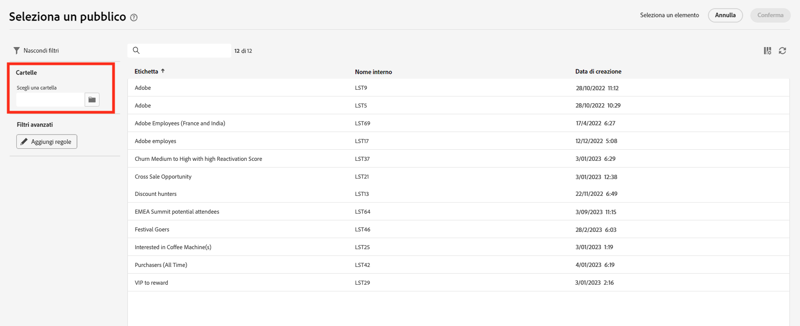
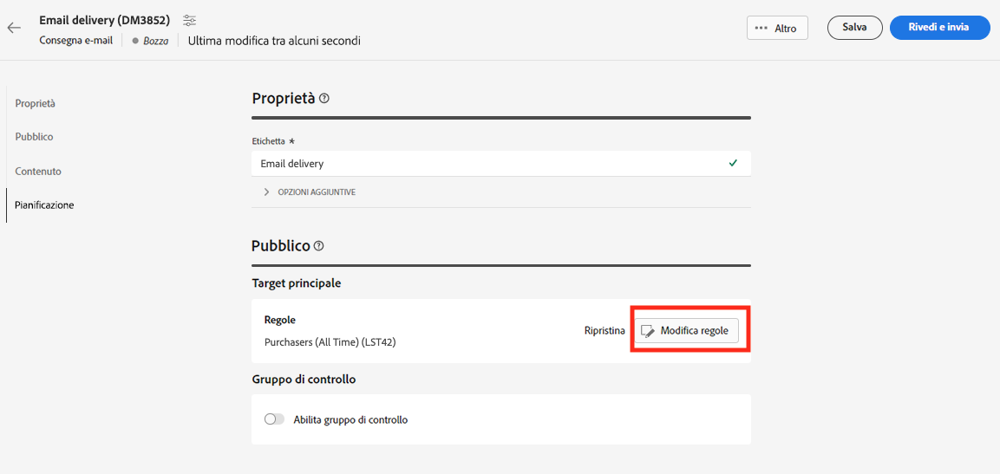

# Utilizzare un pubblico di Adobe Experience Platform{#aep-audience}

I connettori di origine e destinazione del Cloud Service gestito di Adobe Campaign consentono un’integrazione ottimizzata tra Adobe Campaign e Adobe Experience Platform.

Dopo aver creato un pubblico di Adobe Experience Platform e averlo reso disponibile nella console client, puoi utilizzarlo nello stesso modo in cui lo useresti per un pubblico di Campaign per personalizzare e inviare messaggi.

>[!NOTE]
>
>Per utilizzare i tipi di pubblico di Adobe Experience Platform in Campaign, devi configurare l’integrazione con origini e destinazioni di Adobe. Fai riferimento a [Documentazione di Campaign v8 (console client)](https://experienceleague.adobe.com/docs/campaign/campaign-v8/connect/ac-aep.html?lang=it){target="_blank"}.

Per selezionare il pubblico di una consegna, puoi anche:

* Creare un nuovo pubblico. [Ulteriori informazioni](segment-builder.md)
* Caricare un pubblico da un file esterno. [Ulteriori informazioni](file-audience.md)
* Utilizzare un pubblico esistente di Campaign. [Ulteriori informazioni](add-audience.md).

Per selezionare un pubblico di Adobe Experience Platform per la consegna, segui questi passaggi:

1. Dalla sezione **Pubblico** nell’assistente per la creazione della consegna, fai clic sul pulsante **[!UICONTROL Seleziona pubblico]**.

   

1. Scegli **[!UICONTROL Seleziona pubblico]** per utilizzare un pubblico esistente. Per creare un nuovo pubblico da utilizzare in questo messaggio e-mail, scegli **Crea nuovo**. Fai riferimento a questa [sezione](segment-builder.md).

   In questa schermata vengono visualizzati tutti i tipi di pubblico esistenti che sono stati definiti nella console client di Adobe Campaign per la cartella corrente. Per scegliere un pubblico da Adobe Experience Platform, passa a `AEP Audiences folder` dalla sezione filtro dello schermo.

   

   Puoi anche definire una regola per filtrare in base all’origine dei tipi di pubblico, nel modo seguente:

   

1. Scegli un pubblico e fai clic su **Seleziona**.

1. Per perfezionare il pubblico, fai clic su **Modifica regole**.

   

1. Utilizzando il generatore di regole, puoi arricchire il pubblico con filtri aggiuntivi o combinando diversi tipi di pubblico. Consulta questa [sezione](segment-builder.md).

1. Fai clic su **Salva**.

