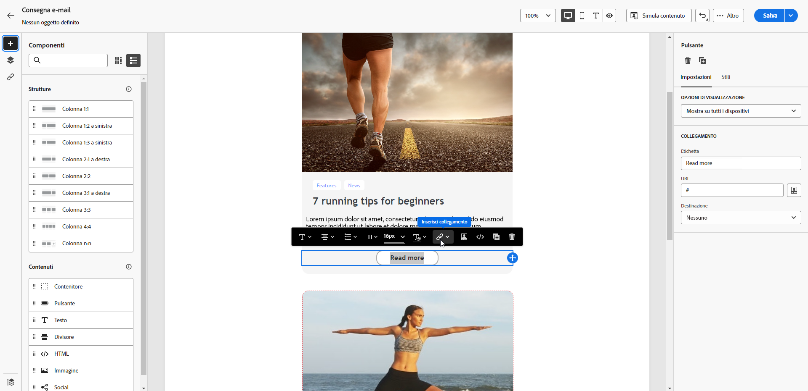
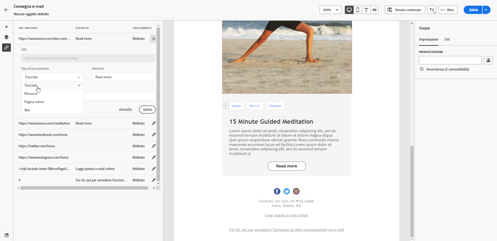

# Gestire il consenso {#manage-consent}

## Raccomandazioni generali {#general-recommendations}

 Adobe Campaign ti consente di raccogliere dati, incluse informazioni personali e riservate. È essenziale ottenere e monitorare il consenso dei destinatari in conformità alle normative sulla protezione dei dati, come il GDPR (Regolamento generale sulla protezione dei dati) e altre leggi sulla privacy applicabili.

* Innanzitutto, evita di inviare e-mail, notifiche push e messaggi SMS non richiesti (&quot;spam&quot;). Adobe supporta fortemente i principi del permission marketing per promuovere la fedeltà e il valore del ciclo di vita del cliente. Adobe vieta severamente l’utilizzo di Adobe Campaign per l’invio di messaggi non richiesti. [Ulteriori informazioni](#denylisted-profiles)

* Assicurati sempre che i destinatari accettino di ricevere comunicazioni consentendo loro di rinunciare alle tue consegne<!-- and keep honoring opt-out requests as quickly as possible-->. [Ulteriori informazioni](#opt-out)

* Utilizza il processo di gestione degli abbonamenti per gestire le preferenze dei destinatari e tenere traccia dei destinatari che hanno acconsentito a tipi specifici di abbonamenti. [Ulteriori informazioni](../../delivery/using/about-services-and-subscriptions.md)

## Gestire la rinuncia {#opt-out}

Come requisito legale, è necessario dare ai destinatari la possibilità di annullare l’abbonamento alla ricezione di comunicazioni da un marchio. È anche necessario garantire che questa scelta sia rispettata. <!--Learn more about the applicable legislation in the [Adobe Campaign Classic v7 documentation](https://experienceleague.adobe.com/docs/campaign-classic/using/getting-started/privacy/privacy-and-recommendations.html?lang=it#privacy-regulations){target="_blank"}.-->

**Perché è importante?**

* Il mancato rispetto di queste normative introduce rischi legali normativi per il tuo marchio.
* Consente di evitare l’invio di comunicazioni non richieste ai destinatari, che potrebbero contrassegnarli come spam e danneggiare la tua reputazione.

Quando invii consegne tramite Adobe Campaign Web, assicurati che i clienti possano annullare l’abbonamento a comunicazioni future. Una volta annullata l’iscrizione, i profili vengono rimossi automaticamente dal pubblico dei messaggi di marketing futuri.

### Rinuncia e-mail {#email-opt-out}

Per consentire ai destinatari di annullare l&#39;abbonamento alla ricezione di comunicazioni e-mail, includi un **collegamento per annullare l&#39;abbonamento** in ogni e-mail inviata ai destinatari.

Segui questi passaggi:

1. Crea una pagina di destinazione esterna e ospitala sul sistema di terze parti desiderato.

1. Creare una consegna e-mail. [Scopri come](../email/create-email.md)

1. Inserisci un collegamento nel contenuto dell’e-mail. [Scopri come](../email/message-tracking.md#insert-links)

   

1. Nel campo **[!UICONTROL Url]**, incolla il collegamento alla pagina di destinazione delle terze parti.

1. Fai clic sull&#39;icona **[!UICONTROL Collegamenti]** nel riquadro a sinistra per visualizzare l&#39;elenco di tutti gli URL nel contenuto da tracciare.

1. Fai clic sull’icona a forma di matita accanto al nuovo collegamento per modificarlo.

1. Modifica il **[!UICONTROL Tipo di tracciamento]** e impostalo su **[!UICONTROL Rinuncia]**.

   

1. Fai clic su **[!UICONTROL Salva]** e invia il messaggio. [Ulteriori informazioni](../monitor/prepare-send.md)

1. Una volta ricevuto il messaggio, se il destinatario fa clic sul collegamento per annullare l’abbonamento, viene visualizzata la pagina di destinazione.

1. Quando il destinatario invia il modulo della pagina di destinazione, i dati del profilo vengono aggiornati. [Ulteriori informazioni](#denylisted-profiles)

<!--Any other option available such as one-click opt-out link or List-Unsubscribe (to include an unsubscribe link in the email header) to enable opt-out in a delivery?-->

## Inserire nell&#39;elenco Bloccati Profili {#denylisted-profiles}

Dopo l&#39;annullamento dell&#39;abbonamento (rinuncia), i profili vengono aggiunti al **inserisco nell&#39;elenco Bloccati di** per un determinato canale. Ciò significa che non sono più oggetto di targeting da alcuna consegna.

>[!NOTE]
>
>Se un profilo nel inserisco nell&#39;elenco Bloccati di per il canale e-mail ha due indirizzi e-mail, entrambi gli indirizzi sono esclusi dalla consegna.

Puoi verificare se un profilo si trova nel inserisco nell&#39;elenco Bloccati di per uno o più canali nella sezione **[!UICONTROL Non contattare più]** della scheda **[!UICONTROL Dettagli]** del profilo. [Ulteriori informazioni](../audience/about-recipients.md#access)

<!--Denylisted status on quarantine list

Additionally, when recipients report your message as spam, or reply to an SMS message with a keyword such as "STOP", their address or phone number is quarantined with the **[!UICONTROL Denylisted]** status. Their profile is updated accordingly.

QUESTION: When a user marks an email as spam, is the profile's No longer contact section also updated? Apparently no (not the same = quarantine vs denylist)

>[!NOTE]
>
>The **[!UICONTROL Denylisted]** status refers to the address only, the profile is not on the denylist, so that the user continues receiving SMS messages and push notifications.

Learn more about Feedback loops in the [Delivery Best Practices Guide](https://experienceleague.adobe.com/docs/deliverability-learn/deliverability-best-practice-guide/transition-process/infrastructure.html?lang=it#feedback-loops){target="_blank"}.

Learn more about quarantine in the [Campaign v8 (client console) documentation](https://experienceleague.adobe.com/docs/campaign/campaign-v8/send/failures/quarantines.html?lang=it#non-deliverable-bounces){target="_blank"}.-->