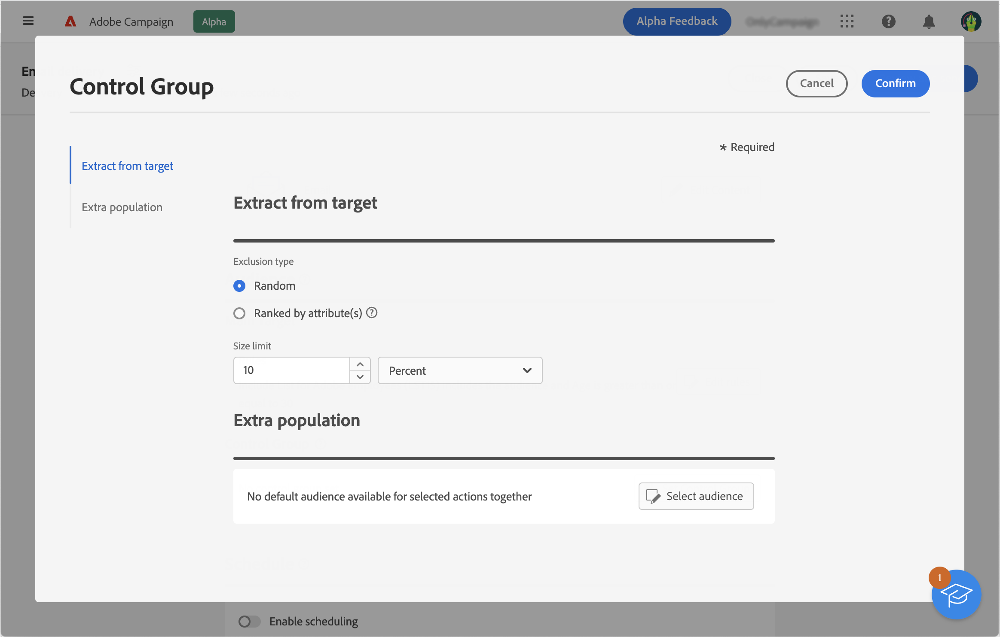

# Impostare un gruppo di controllo {#control-group}

Puoi utilizzare i gruppi di controllo per evitare di inviare messaggi a una parte del pubblico, in modo da misurare l’impatto delle campagne.

A tale scopo, crea un gruppo di controllo mentre definisci il pubblico della consegna. I profili vengono aggiunti al gruppo di controllo in modo casuale, filtrati o meno oppure in base a alcuni criteri. Puoi quindi confrontare il comportamento della popolazione target che ha ricevuto il messaggio con il comportamento dei contatti che non lo hanno ricevuto.

Il gruppo di controllo può essere estratto in modo casuale dal target principale e/o selezionato da una popolazione specifica. Ci sono quindi due vie principali per definire un gruppo di controllo:

* Estrarre un certo numero di profili dal target principale.
* Escludere alcuni profili in base ai criteri definiti in una query.

È possibile ricorrere a entrambi i metodi.

Tutti i profili che fanno parte del gruppo di controllo nella fase di preparazione della consegna verranno rimossi dal target principale e non riceveranno il messaggio.

Per creare un gruppo di controllo, fai clic sul pulsante **[!UICONTROL Imposta gruppo di controllo]** nella sezione **Pubblico** dell’assistente per la creazione della consegna.

## Estrarre dal target {#extract-target}

>[!CONTEXTUALHELP]
>id="acw_deliveries_email_controlgroup_target"
>title="Estrarre dal target"
>abstract="TBC"

Per definire un gruppo di controllo, puoi scegliere di estrarre dalla popolazione target una percentuale o un numero fisso di profili, in modo casuale o in base a un ordinamento.

Innanzitutto, definisci il modo in cui i profili verranno estratti dal target: in modo casuale o in base a un ordinamento.

Nella sezione **Estrai da target**, scegli un **Tipo di esclusione**:

* **Casuale**: durante la preparazione della consegna, Adobe Campaign estrarrà in modo casuale un numero di profili corrispondente alla percentuale o al numero massimo che verrà impostato come limite di dimensione.

   

* **Classificato per attributo/i**: questa opzione consente di escludere un set di profili in base ad attributi specifici in uno o più ordini specifici.

   

Poi definisci il **Limite dimensione**: è necessario impostare il modo in cui limitare il numero di profili estratti dal target principale.

**Esempio**

Puoi visualizzare i registri per controllare e identificare i profili esclusi. Prendiamo l’esempio di un’esclusione casuale su cinque profili.

Dopo la preparazione della consegna, puoi visualizzare le esclusioni nelle seguenti schermate:

* Il KPI **Da escludere** nella dashboard di consegna, prima dell’invio.

   

* I **Registri di esclusione** mostrano ciascun profilo e il relativo **Motivo** di esclusione.

   

* Le **Cause di esclusione** mostrano il numero di profili esclusi per ogni regola di tipologia.

   

Per ulteriori informazioni sui registri di consegna, consulta questa [sezione](../monitor/delivery-logs.md).

## Popolazione aggiuntiva {#extra-population}

>[!CONTEXTUALHELP]
>id="acw_deliveries_email_controlgroup_extra"
>title="Popolazione aggiuntiva"
>abstract="TBC"

Un altro modo per definire un gruppo di controllo consiste nell’escludere una popolazione specifica dal target utilizzando un pubblico esistente o definendo una query.

Nella sezione **Popolazione aggiuntiva** della schermata di definizione del **Gruppo di controllo**, fai clic sul pulsante **[!UICONTROL Seleziona pubblico]**.

* Per utilizzare un pubblico esistente, fai clic su **Seleziona pubblico**. Consulta questa [sezione](add-audience.md).

* Per definire una nuova query, seleziona **Crea nuovo** e definisci i criteri di esclusione utilizzando il generatore di regole. Consulta questa [sezione](segment-builder.md).

I profili inclusi nel pubblico o che corrispondono al risultato della query vengono esclusi dal target.