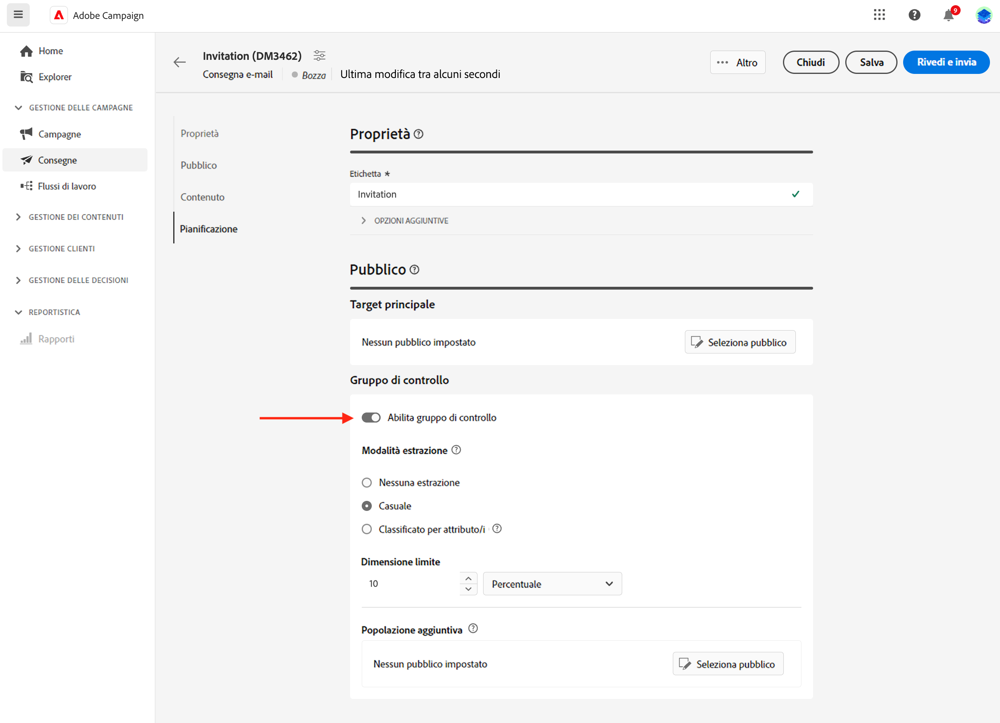
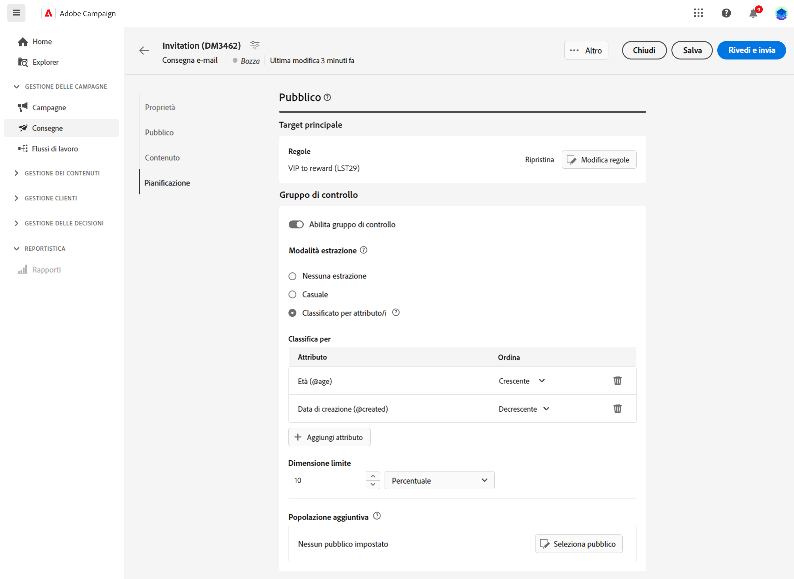
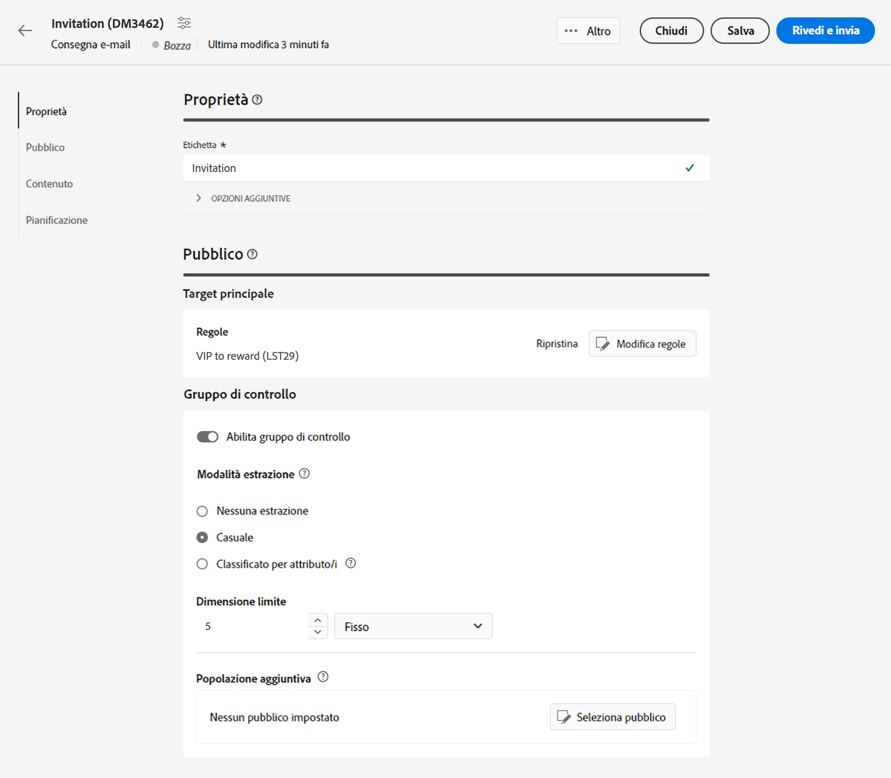
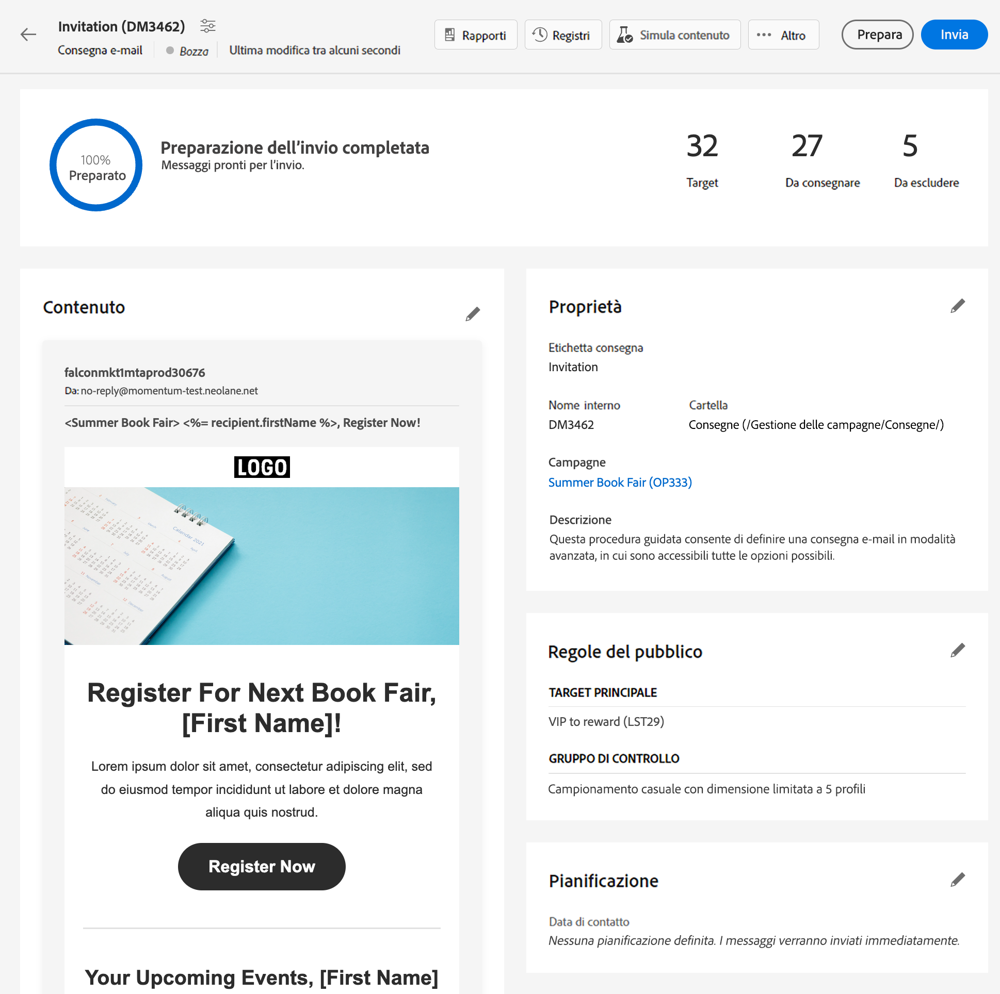
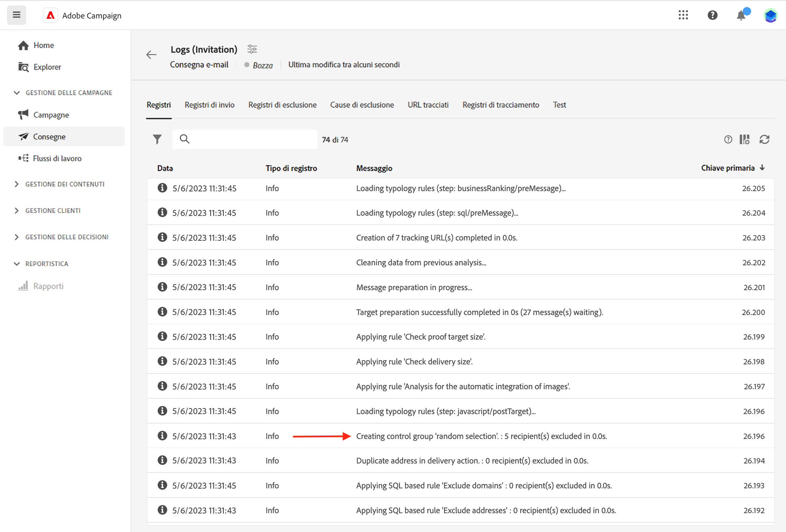
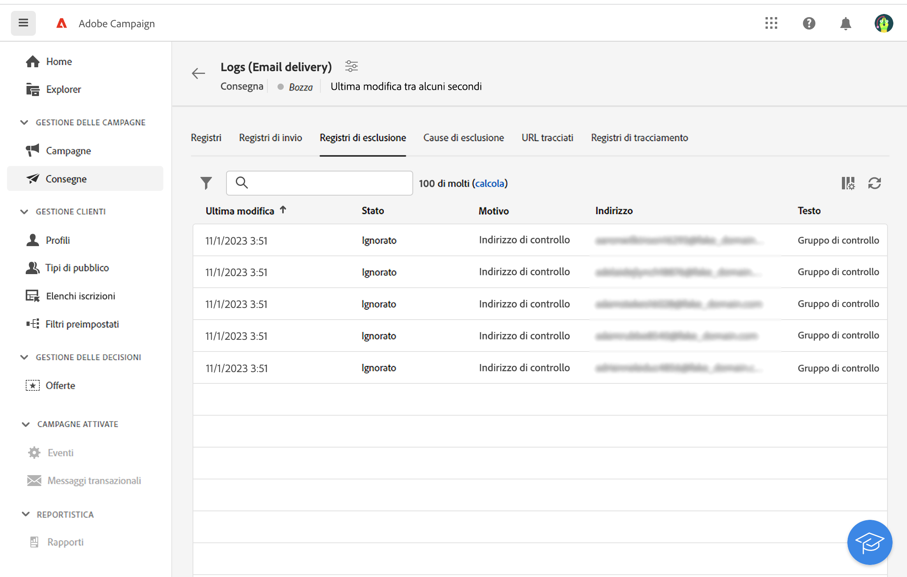
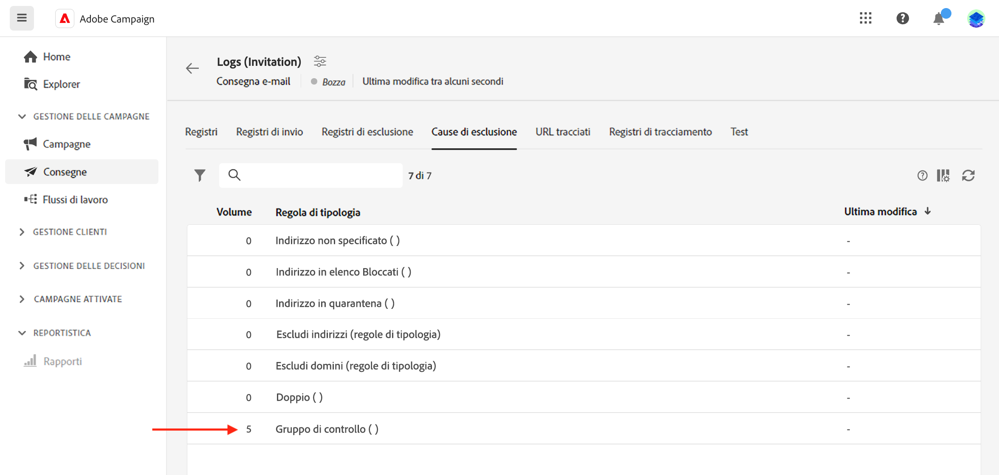
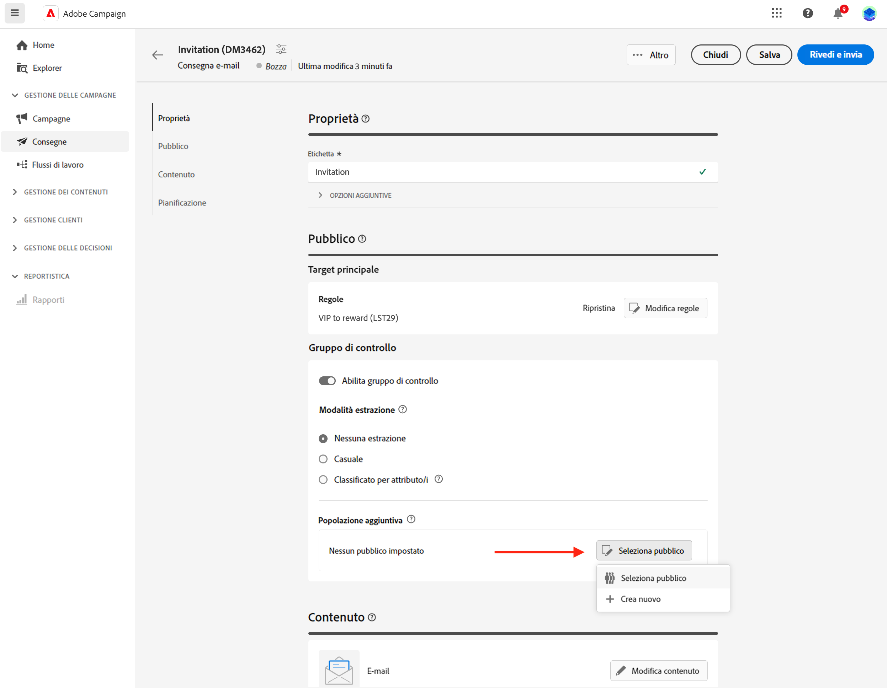

# Impostare un gruppo di controllo {#control-group}

Un gruppo di controllo è una sottopopolazione esclusa dalla consegna. Puoi definire un gruppo di controllo per evitare di inviare messaggi a una parte del pubblico e confrontare il comportamento successivo alla consegna con il target principale. Questa opzione consente di misurare l’impatto della campagna.

## Abilita gruppo di controllo{#add-a-control-group}

Per aggiungere un gruppo di controllo, abilita l’opzione durante la definizione del pubblico della consegna. Il gruppo di controllo può essere estratto in modo casuale dal target principale e/o selezionato da una popolazione specifica. Ci sono quindi due vie principali per definire un gruppo di controllo:

* Estrarre un certo numero di profili dal target principale.
* Escludi alcuni profili da un elenco o in base ai criteri definiti in una query.

È possibile combinare entrambi i metodi durante la definizione di un gruppo di controllo.

Tutti i profili che fanno parte del gruppo di controllo nella fase di preparazione della consegna verranno rimossi dal target principale e non riceveranno il messaggio.

>[!CAUTION]
>
>Non è possibile utilizzare i gruppi di controllo durante il caricamento della popolazione target [da un file esterno](file-audience.md).

Per aggiungere un gruppo di controllo a una consegna, attiva il **[!UICONTROL Abilita gruppo di controllo]** , dalla **Pubblico** sezione della schermata di creazione della consegna.

## Estrarre dal target {#extract-target}

>[!CONTEXTUALHELP]
>id="acw_deliveries_email_controlgroup_target"
>title="Modalità estrazione"
>abstract="Per definire un gruppo di controllo, puoi scegliere di estrarre dalla popolazione target una percentuale o un numero fisso di profili, in modo casuale o in base a un ordinamento."

### Creare un gruppo di controllo {#build-extract-target}

Per definire un gruppo di controllo, puoi scegliere di estrarre dalla popolazione target una percentuale o un numero fisso di profili, in modo casuale o in base a un ordinamento. Se preferisci aggiungere una popolazione aggiuntiva, scegli la **Nessuna estrazione** e selezionare la popolazione aggiuntiva [come descritto qui](#extra-population).

Innanzitutto, definisci il modo in cui i profili vengono estratti dal target: in modo casuale o in base a un ordinamento.

Sotto **Gruppo di controllo** , scegli un&#39; **Modalità di estrazione**:

* **Casuale**: durante la preparazione della consegna, Adobe Campaign estrarrà in modo casuale un numero di profili corrispondente alla percentuale o al numero massimo che verrà impostato come limite di dimensione.

* **Classificato per attributo/i**: questa opzione consente di escludere un set di profili in base ad attributi specifici in uno o più ordini specifici.

Quindi utilizza **Limite di dimensioni** per impostare il numero di profili da estrarre dal target principale. Può essere un numero non elaborato (ad esempio 50 profili da escludere) o una percentuale del pubblico iniziale (ad esempio il 5% del target principale).

### Esempio di gruppo di controllo{#control-group-sample}

Ad esempio, per creare un gruppo di controllo con i 100 nuovi destinatari più giovani, effettua le seguenti operazioni:

1. Seleziona la **Età** come criterio di ordinamento. Lascia **Crescente** opzione di ordinamento.
1. Aggiungi il **Data di creazione** campo. Cambia in **Decrescente** opzione di ordinamento.
1. Definisci 100 come soglia nella **Limite di dimensioni** sezione.

   

Questi 100 nuovi destinatari più giovani sono quindi esclusi dall&#39;obiettivo principale.

### Verifica il gruppo di controllo {#check-control-group}

Puoi visualizzare i registri per controllare e identificare i profili esclusi. Prendiamo l’esempio di un’esclusione casuale su cinque profili.

Dopo la preparazione della consegna, puoi rivedere come sono state applicate le esclusioni:

* Nel dashboard di consegna, prima dell’invio, controlla **Da escludere** KPI.

  

* Nei registri di consegna, la scheda Registri mostra il passaggio di esclusione.

  
<!--

 * The **Exclusion logs** tab displays each profile and the related exclusion **Reason**.

    
-->

* Il **Cause di esclusione** Nella scheda viene visualizzato il numero di profili esclusi per ogni regola di tipologia.

  

Per ulteriori informazioni sui registri di consegna, consulta questa [sezione](../monitor/delivery-logs.md).

## Aggiungi una popolazione aggiuntiva {#extra-population}

>[!CONTEXTUALHELP]
>id="acw_deliveries_email_controlgroup_extra"
>title="Popolazione aggiuntiva"
>abstract="Puoi escludere una popolazione specifica dal pubblico di consegna selezionando un pubblico esistente o definendo una query."

Un altro modo per definire un gruppo di controllo consiste nel selezionare una popolazione specifica in un pubblico esistente o nel definire una query.

Nella sezione **Popolazione aggiuntiva** della schermata di definizione del **Gruppo di controllo**, fai clic sul pulsante **[!UICONTROL Seleziona pubblico]**.

* Per utilizzare un pubblico esistente, fai clic su **Seleziona pubblico**. Per ulteriori informazioni, consulta [questa sezione](add-audience.md).

* Per definire una nuova query, seleziona **Crea nuovo** e definisci i criteri di esclusione utilizzando il generatore di regole. Per ulteriori informazioni, consulta [questa sezione](segment-builder.md).

I profili inclusi nel pubblico o che corrispondono al risultato della query sono **escluso** dal target di consegna: non ricevono alcun messaggio.

## Confrontare i risultati{#control-group-results}

Una volta inviata la consegna, puoi estrarre i registri di invio per confrontare il comportamento tra i profili che non hanno ricevuto la comunicazione e il target effettivo. Puoi anche utilizzare i registri di consegna per generare un nuovo targeting.

Per vedere quali profili sono stati rimossi dal target, seleziona la **Registri di consegna**. Ulteriori informazioni [in questa sezione](#check-control-group).

