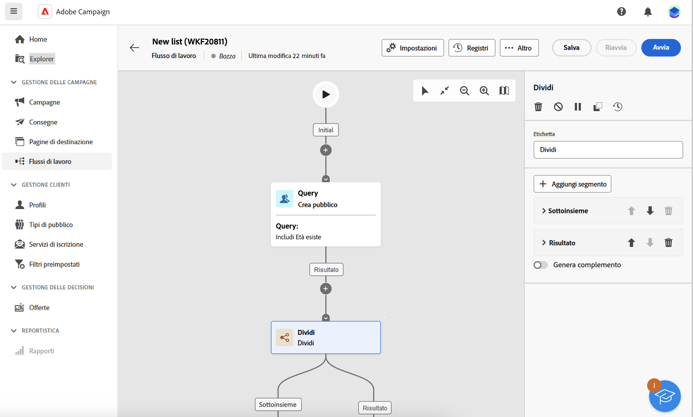
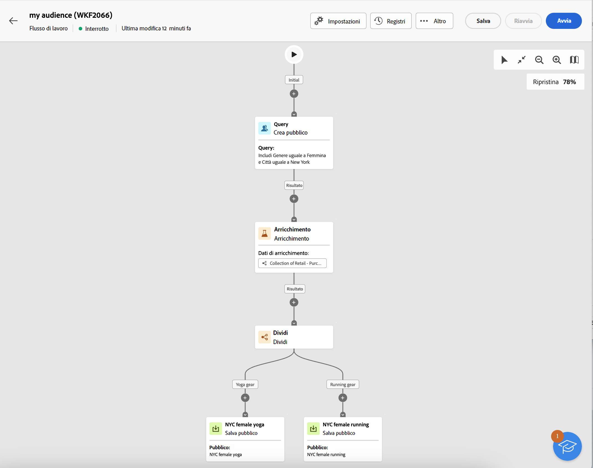

# Creare tipi di pubblico {#create-audiences}

>[!CONTEXTUALHELP]
>id="acw_audiences_list"
>title="Tipi di pubblico"
>abstract="Da questa schermata, puoi accedere all’elenco di tutti i tipi di pubblico a cui è possibile indirizzare i flussi di lavoro e le consegne. Fai clic su **Crea** per creare un nuovo pubblico in un’area di lavoro visiva.  Oltre a iniziare da zero per creare un pubblico semplice, puoi anche perfezionare il pubblico sfruttando le attività del flusso di lavoro. Ad esempio, puoi combinare più tipi di pubblico in un unico pubblico, arricchirlo con attributi esterni o suddividerlo in più tipi di pubblico in base alle regole scelte."

<!--
[!CONTEXTUALHELP]
>id="acw_audiences_create_settings"
>title="Audience settings"
>abstract="Enter the name of the audience and additional options, then click the **Create Audience** button."-->

Campaign Web consente di creare nuovi tipi di pubblico in un’area di lavoro del flusso di lavoro visiva. Oltre a iniziare da zero per creare un pubblico semplice, puoi anche perfezionare il pubblico sfruttando le attività del flusso di lavoro. Ad esempio, puoi combinare più tipi di pubblico in un unico pubblico, arricchirlo con attributi esterni o suddividerlo in più tipi di pubblico in base alle regole scelte.

Una volta creato il flusso di lavoro, i tipi di pubblico risultanti vengono automaticamente memorizzati nel database di Campaign insieme a quelli esistenti. Questi tipi di pubblico possono quindi essere utilizzati come target nei flussi di lavoro o nelle consegne autonome.

La colonna **[!UICONTROL Origin]** indica le origini dei tipi di pubblico: **[!UICONTROL I tipi di pubblico di Adobe Campaign]** vengono creati nella console Adobe Campaign v8 o nell&#39;interfaccia utente Web, mentre i tipi di pubblico di **[!UICONTROL Adobe Experience Platform:]** vengono creati in Adobe Experience Platform e integrati in Campaign utilizzando l&#39;integrazione di Adobe Sources and Destinations.

➡️ [Guarda il video su questa funzione](#video)

## Creare il primo pubblico {#create}

Per creare un pubblico, segui questi passaggi:

1. Passa al menu **[!UICONTROL Tipi di pubblico]** e fai clic sul pulsante **[!UICONTROL Crea pubblico]** nell&#39;angolo in alto a destra.

1. Viene creato automaticamente un nuovo flusso di lavoro, che consente di combinare le attività per generare il pubblico. Per impostazione predefinita, l’area di lavoro contiene due attività principali:

   * L&#39;attività &quot;Query&quot; **[!UICONTROL Genera pubblico]** è il punto iniziale del flusso di lavoro. Consente di creare un pubblico e utilizzarlo come base per il flusso di lavoro.

   * L&#39;attività &quot;Nuovo pubblico&quot; **[!UICONTROL Salva pubblico]** rappresenta il passaggio finale nel flusso di lavoro. Ti consente di salvare i risultati come nuovo pubblico.

   {zoomable="yes"}

   >[!IMPORTANT]
   >
   >I flussi di lavoro del pubblico sono memorizzati nel menu **Flussi di lavoro**, insieme agli altri flussi di lavoro di Campaign. Sono progettati specificamente per creare tipi di pubblico e sono identificabili dalla loro area di lavoro verticale.

1. Per una migliore leggibilità, modifica il nome del flusso di lavoro nel campo **Etichetta** delle impostazioni del flusso di lavoro. [Scopri come configurare le impostazioni del flusso di lavoro](../workflows/workflow-settings.md)

1. Apri l&#39;attività **[!UICONTROL Genera pubblico]** e utilizza il modellatore di query per definire la popolazione da includere nel pubblico filtrando i dati contenuti nel database. [Scopri come configurare un’attività Crea pubblico](../workflows/activities/build-audience.md)

1. Se desideri eseguire operazioni aggiuntive sulla popolazione di destinazione nel flusso di lavoro, aggiungi tutte le attività necessarie e collegale tra loro. Per ulteriori informazioni su come configurare le attività del flusso di lavoro, consulta la [documentazione sui flussi di lavoro](../workflows/activities/about-activities.md).

   >[!NOTE]
   >
   >Le attività del canale non sono disponibili per l’utilizzo nei flussi di lavoro relativi al pubblico.

   {zoomable="yes"}

1. Configura l’attività **[!UICONTROL Salva pubblico]** per specificare come salvare la popolazione calcolata a monte nel flusso di lavoro. [Scopri come configurare un’attività Salva pubblico](../workflows/activities/save-audience.md)

1. Quando il flusso di lavoro è pronto, fai clic su **[!UICONTROL Avvia]** per eseguirlo.

Il flusso di lavoro viene salvato nell&#39;elenco **[!UICONTROL Flussi di lavoro]**, mentre i tipi di pubblico risultanti sono accessibili nell&#39;elenco **[!UICONTROL Tipi di pubblico]** con l&#39;etichetta definita nell&#39;attività **Salva pubblico**. Scopri come monitorare e gestire il pubblico in [questa sezione](manage-audience.md)

Ora puoi utilizzare questo pubblico come target principale di una consegna. [Ulteriori informazioni](add-audience.md)

## Esempio di flusso di lavoro del pubblico {#example}

L’esempio seguente mostra un flusso di lavoro del pubblico configurato per rivolgersi alle clienti di sesso femminile che vivono a New York e creare due nuovi tipi di pubblico in base al loro ultimo acquisto (articoli da yoga o da corsa).

{zoomable="yes"}

1. L’attività **[!UICONTROL Crea pubblico]** è indirizzata a tutti i profili femminili che vivono a New York.
1. L’attività **[!UICONTROL Arricchimento]** arricchisce il pubblico con le informazioni contenute nella tabella Acquisti per identificare quale tipo di prodotto hanno acquistato le clienti.
1. L’attività **[!UICONTROL Dividi]** separa il flusso di lavoro in due percorsi in base all’ultimo acquisto effettuato dalla cliente.
1. Le attività **[!UICONTROL Save audience]** alla fine di ogni percorso creano due nuovi tipi di pubblico nel database, inclusa la popolazione calcolata in ogni percorso.

## Modificare un pubblico {#edit}

Puoi modificare un pubblico generato da un flusso di lavoro ogni volta che sia necessario rieseguendo il flusso di lavoro corrispondente. Questo consente di aggiornare i dati sul pubblico o di perfezionarlo regolando la query in base alle tue esigenze.

1. Passa al menu **Tipi di pubblico** e apri il pubblico da modificare.
1. Nella scheda **Panoramica**, la sezione **Ultimo flusso di lavoro** fornisce un collegamento al flusso di lavoro utilizzato per generare il pubblico. Fai clic su di esso per accedere al flusso di lavoro.
1. Apportare le modifiche desiderate e fare clic sul pulsante **Avvia** per eseguire nuovamente il flusso di lavoro. Al termine, il pubblico risultante dal flusso di lavoro viene aggiornato automaticamente con i risultati del flusso di lavoro più recenti.

Per impostazione predefinita, l’esecuzione ripetuta di un flusso di lavoro per un pubblico sostituisce l’intero contenuto del pubblico con nuovi dati, causando la perdita di dati precedenti.

Se preferisci non sostituire i risultati del pubblico esistenti, configura le attività **Salva pubblico** in modo che siano in linea con le tue esigenze. Ad esempio, puoi modificare il campo **Etichetta pubblico** per memorizzare i nuovi risultati in un nuovo pubblico o aggiungere i nuovi risultati al contenuto del pubblico esistente senza cancellare i dati precedenti. [Scopri come configurare un’attività Salva pubblico](../workflows/activities/save-audience.md)

{zoomable="yes"}

## Video dimostrativo {#video}

Scopri come creare e gestire i tipi di pubblico, come selezionare i tipi di pubblico per una consegna e definire gruppi di controllo.

>[!VIDEO](https://video.tv.adobe.com/v/3453210?quality=12&captions=ita)