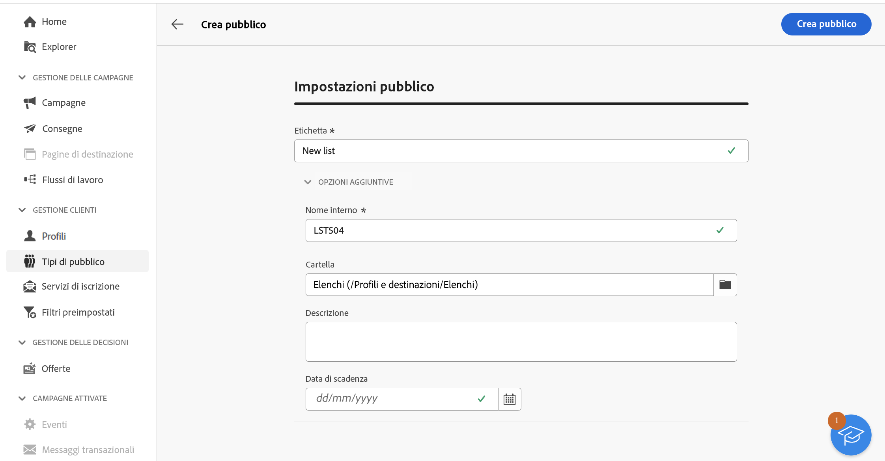

# Creare tipi di pubblico {#create-audiences}

>[!CONTEXTUALHELP]
>id="acw_homepage_welcome_rn1"
>title="Composizione del pubblico"
>abstract="Crea nuovi tipi di pubblico in un’area di lavoro del flusso di lavoro visivo. Oltre a iniziare da zero per creare un pubblico semplice, puoi anche perfezionare il pubblico sfruttando le attività del flusso di lavoro. Combina più tipi di pubblico in un unico pubblico, arricchisci il pubblico con attributi esterni o dividilo in più tipi di pubblico in base alle regole scelte."
>additional-url="https://experienceleague.adobe.com/docs/campaign-web/v8/whats-new.html" text="Consulta le note sulla versione"

<!--TO REMOVE BELOW-->

>[!CONTEXTUALHELP]
>id="acw_homepage_rn1"
>title="Composizione del pubblico"
>abstract="Crea nuovi tipi di pubblico in un’area di lavoro del flusso di lavoro visivo. Oltre a iniziare da zero per creare un pubblico semplice, puoi anche perfezionare il pubblico sfruttando le attività del flusso di lavoro. Combina più tipi di pubblico in un unico pubblico, arricchisci il pubblico con attributi esterni o dividilo in più tipi di pubblico in base alle regole scelte."
>additional-url="https://experienceleague.adobe.com/docs/campaign-web/v8/whats-new.html" text="Consulta le note sulla versione"

<!--TO REMOVE ABOVE-->

>[!CONTEXTUALHELP]
>id="acw_audiences_list"
>title="Tipi di pubblico"
>abstract="Da questa schermata, puoi accedere all’elenco di tutti i tipi di pubblico a cui è possibile indirizzare le consegne. Fai clic su **Crea** per creare nuovi tipi di pubblico in un’area di lavoro visiva utilizzando varie attività del flusso di lavoro, ad esempio **Dividi** o **Escludi**."

>[!CONTEXTUALHELP]
>id="acw_audiences_create_settings"
>title="Impostazioni pubblico"
>abstract="Immetti il nome del pubblico ed eventuali opzioni aggiuntive, quindi fai clic sul pulsante **Crea pubblico**."

Campaign Web consente di creare nuovi tipi di pubblico in un’area di lavoro visiva per i flussi di lavoro. Oltre a iniziare da zero per creare un pubblico semplice, puoi anche perfezionare il pubblico sfruttando le attività del flusso di lavoro. Ad esempio, puoi combinare più tipi di pubblico in un unico pubblico, arricchirlo con attributi esterni o suddividerlo in più tipi di pubblico in base alle regole scelte

Dopo aver creato il flusso di lavoro, i tipi di pubblico risultanti vengono automaticamente memorizzati nel database di Campaign insieme a quelli esistenti. Questi tipi di pubblico possono quindi essere utilizzati come target nei flussi di lavoro o nelle consegne autonome.

## Creare il primo pubblico {#create}

Per creare un pubblico, segui questi passaggi:

1. Passa al menu **[!UICONTROL Tipi di pubblico]** e fai clic sul pulsante **[!UICONTROL Crea pubblico]** in alto a destra.
1. Specifica l’etichetta da assegnare al pubblico.
1. Espandi la sezione **[!UICONTROL Opzioni aggiuntive]** per configurare parametri di pubblico avanzati.

   Per impostazione predefinita, i tipi di pubblico vengono creati dal menu **[!UICONTROL Profili e destinazioni]** / **[!UICONTROL Elenchi]** di Explorer. È possibile modificare il percorso di archiviazione predefinito utilizzando il campo **[!UICONTROL Cartella]**.

   

1. Dopo aver configurato le impostazioni per il pubblico, fai clic sul pulsante **[!UICONTROL Crea pubblico]**. Viene visualizzata un’area di lavoro per flussi di lavoro con due attività predefinite:

   * **[!UICONTROL Crea pubblico]**: questo è il punto di partenza del flusso di lavoro; consente di creare un pubblico e utilizzarlo come base per il flusso di lavoro.

   * **[!UICONTROL Salva pubblico]**: questo rappresenta il passaggio finale nel flusso di lavoro; consente di salvare i risultati del flusso di lavoro come un nuovo pubblico.

1. Apri **[!UICONTROL Creare un pubblico]** e utilizza Query Modeler per definire la popolazione da includere nel pubblico filtrando i dati contenuti nel database. [Scopri come configurare un’attività Crea pubblico](../workflows/activities/build-audience.md)

1. Se desideri eseguire operazioni aggiuntive sulla popolazione target nel flusso di lavoro, aggiungi tutte le attività necessarie e collegale tra loro. Per ulteriori informazioni su come configurare le attività del flusso di lavoro, consulta la [documentazione sui flussi di lavoro](../workflows/activities/about-activities.md).

   >[!NOTE]
   >
   >Le attività del canale non sono disponibili per l’utilizzo nei flussi di lavoro relativi al pubblico.

   

1. Configura l’attività **[!UICONTROL Salva pubblico]** per specificare come salvare la popolazione calcolata a monte nel flusso di lavoro. [Scopri come configurare un’attività Salva pubblico](../workflows/activities/save-audience.md)

1. Quando il flusso di lavoro è pronto, fai clic su **[!UICONTROL Avvia]** per eseguirlo.

Il flusso di lavoro viene salvato nell’elenco **[!UICONTROL Flussi di lavoro]**, mentre i tipi di pubblico risultanti si trovano nell’elenco **[!UICONTROL Tipi di pubblico]**. Scopri come monitorare e gestire il pubblico in [questa sezione](manage-audience.md)

Ora puoi utilizzare questo pubblico come target principale di una consegna. [Ulteriori informazioni](add-audience.md)

## Esempio di flusso di lavoro del pubblico {#example}

L’esempio seguente mostra un flusso di lavoro del pubblico configurato per rivolgersi alle clienti di sesso femminile che vivono a New York e creare due nuovi tipi di pubblico in base al loro ultimo acquisto (articoli da yoga o da corsa).

1. L’attività **[!UICONTROL Crea pubblico]** è indirizzata a tutti i profili femminili che vivono a New York.
1. L’attività **[!UICONTROL Arricchimento]** arricchisce il pubblico con le informazioni contenute nella tabella Acquisti per identificare quale tipo di prodotto hanno acquistato le clienti.
1. L’attività **[!UICONTROL Dividi]** separa il flusso di lavoro in due percorsi in base all’ultimo acquisto effettuato dalla cliente.
1. Le attività **[!UICONTROL Salva pubblico]** alla fine di ciascun percorso creano due nuovi tipi di pubblico nel database, che includono la popolazione calcolata in ciascun percorso.
