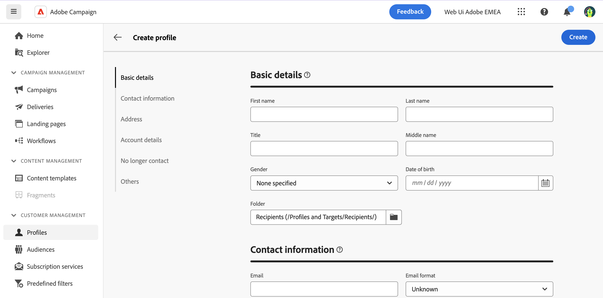

# Creare un profilo {#profiles}

>[!CONTEXTUALHELP]
>id="acw_recipients_creation_details"
>title="Dettagli di base"
>abstract="Questa sezione offre informazioni approfondite sui dettagli di base del profilo. Per modificare qualsiasi informazione, apporta le modifiche direttamente nel rispettivo campo e fai clic sul pulsante **Salva** nell&#39;angolo superiore destro dello schermo."

>[!CONTEXTUALHELP]
>id="acw_recipients_creation_contactinformation"
>title="Dati di contatto"
>abstract="Questa sezione offre informazioni approfondite sulle informazioni di contatto del profilo. Per modificare qualsiasi informazione, apporta le modifiche direttamente nel rispettivo campo e fai clic sul pulsante **Salva** nell&#39;angolo superiore destro dello schermo."

>[!CONTEXTUALHELP]
>id="acw_recipients_creation_address"
>title="Indirizzo"
>abstract="Questa sezione offre informazioni approfondite sull’indirizzo postale del profilo e sulla qualità dell’indirizzo. Per modificare qualsiasi informazione, apporta le modifiche direttamente nel rispettivo campo e fai clic sul pulsante **Salva** nell&#39;angolo superiore destro dello schermo."

>[!CONTEXTUALHELP]
>id="acw_recipients_creation_account"
>title="Dettagli account"
>abstract="Questa sezione offre informazioni approfondite sui dettagli dell’account del profilo. Per modificare qualsiasi informazione, apporta le modifiche direttamente nel rispettivo campo e fai clic sul pulsante **Salva** nell&#39;angolo superiore destro dello schermo."

>[!CONTEXTUALHELP]
>id="acw_recipients_creation_nolongercontact"
>title="Destinatari da non contattare più"
>abstract="Questa sezione offre informazioni approfondite sulle preferenze di contatto del profilo. Per modificare qualsiasi informazione, apporta le modifiche direttamente nel rispettivo campo e fai clic sul pulsante **Salva** nell&#39;angolo superiore destro dello schermo."

>[!CONTEXTUALHELP]
>id="acw_recipients_creation_customfields"
>title="Campi personalizzati"
>abstract="I campi personalizzati sono attributi specifici personalizzati in base alle tue esigenze e configurati per la tua istanza. Per modificare qualsiasi informazione, apporta le modifiche direttamente nel rispettivo campo e fai clic sul pulsante **Salva** nell&#39;angolo superiore destro dello schermo."

>[!CONTEXTUALHELP]
>id="acw_recipients_creation_othersfields"
>title="Altri"
>abstract="Questa sezione fornisce attributi incorporati aggiuntivi. Per modificare qualsiasi informazione, apporta le modifiche direttamente nel rispettivo campo e fai clic sul pulsante **Salva** nell&#39;angolo superiore destro dello schermo."

Per creare un profilo, effettua le seguenti operazioni:

1. Accedi a **[!UICONTROL Gestione clienti]** > **[!UICONTROL Profili]** e fai clic su **[!UICONTROL Crea profilo]** nell&#39;angolo superiore destro dello schermo.

1. L’elenco degli attributi disponibili per la visualizzazione del profilo, organizzato in diverse sezioni descritte nella tabella seguente.

   

   | Sezione Attributi | Descrizione |
   |  ---  |  ---  |
   | **Dettagli di base** | Informazioni di base sul profilo, ad esempio nome o data di nascita. Per impostazione predefinita, i profili sono memorizzati nel **[!UICONTROL Destinatari]** cartella. Puoi modificarlo navigando nella posizione desiderata. [Scopri come utilizzare le cartelle](../get-started/permissions.md#folders) |
   | **Informazioni di contatto** | Le informazioni di contatto del profilo, ad esempio l’indirizzo e-mail o il numero di telefono. |
   | **Indirizzo** | Indirizzo postale del profilo. In questa sezione viene inoltre fornita una valutazione della qualità dell&#39;indirizzo. L’indirizzo di un profilo è considerato valido se sono specificati i campi &quot;Cognome&quot;, &quot;Città&quot; e &quot;CAP&quot;. |
   | **Dettagli account** | Informazioni sull’account del profilo, ad esempio lo stato o il numero di account. |
   | **Non contattare più** | Preferenze di contatto del profilo. Quando si seleziona una di queste opzioni, il profilo viene inserito nell&#39;elenco Bloccati in modalità di controllo. Ad esempio, se il destinatario ha fatto clic su un collegamento di annullamento dell’abbonamento in una newsletter, queste informazioni vengono aggiunte ai dati di contatto. Il destinatario non è più indirizzato ai canali selezionati. Ulteriori informazioni sulla gestione della quarantena in [Documentazione di Adobe Campaign v8](https://experienceleague.adobe.com/docs/campaign/campaign-v8/send/failures/quarantines.html){target="_blank"} |
   | **Campi personalizzati** | Se i campi personalizzati sono stati configurati, vengono visualizzati in questa sezione. I campi personalizzati sono attributi aggiuntivi aggiunti al **[!UICONTROL Profili]** tramite la console Adobe Campaign. Per ulteriori informazioni, consulta [Documentazione di Adobe Campaign v8](https://experienceleague.adobe.com/docs/campaign/campaign-v8/developer/shemas-forms/extend-schema.html){target="_blank"} |
   | **Altro** | Attributi incorporati aggiuntivi. |

1. Dopo aver configurato il profilo, fai clic su **[!UICONTROL Crea]** per salvarlo nel database.

   Al termine, puoi modificare il profilo in qualsiasi momento aprendolo dall’elenco dei profili. [Scopri come esplorare i dettagli dei profili](profile-view.md)
