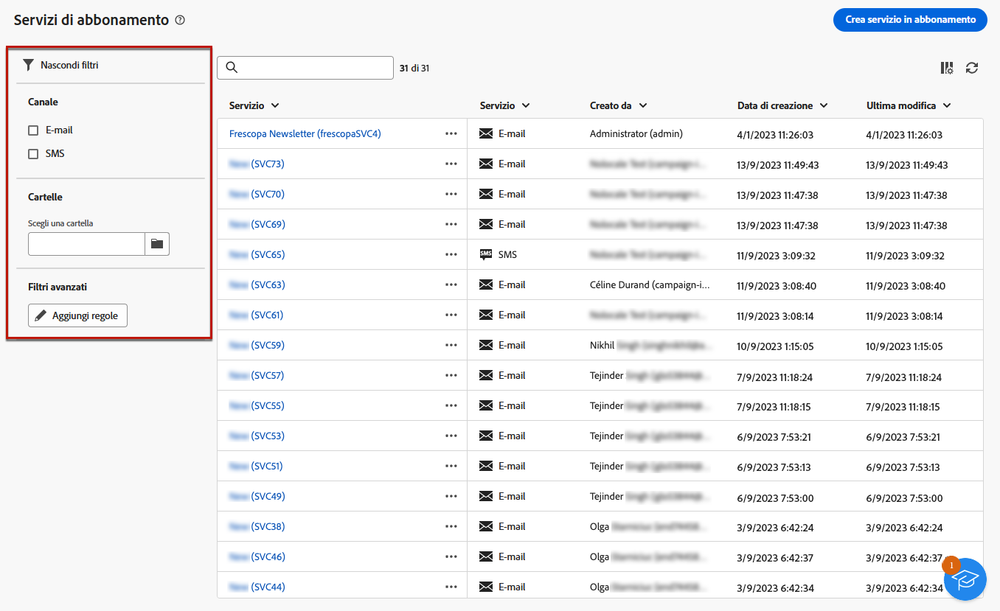

# Creare servizi {#create-services}

Utilizza Adobe Campaign per creare e monitorare i servizi di informazioni, come le newsletter, e per verificare gli abbonamenti o i loro annullamenti.

È possibile definire in parallelo diversi servizi, ad esempio newsletter specializzate per determinate categorie di prodotti, temi o aree di un sito Web, abbonamenti a vari tipi di messaggi di avviso e notifiche in tempo reale.

Per ulteriori informazioni sulla gestione degli abbonamenti e sul loro annullamento, consulta [Documentazione di Campaign v8 (console client)](https://experienceleague.adobe.com/docs/campaign/campaign-v8/audience/subscriptions.html){target="_blank"}.

## Accedere ai servizi di abbonamento {#access-services}

1. Vai a **[!UICONTROL Gestione degli accessi]** > **[!UICONTROL Servizi di abbonamento]** menu.

   

1. Viene visualizzato l’elenco di tutti i servizi creati finora. Puoi cercare i servizi e filtrare in base al canale, alla cartella o utilizzare filtri avanzati.

   

## Crea il primo servizio {#create-service}

1. Seleziona la **[!UICONTROL Crea servizio di abbonamento]** pulsante.

   

1. Seleziona un canale. **[!UICONTROL E-mail]** e **[!UICONTROL SMS]** sono disponibili.

1. Nelle proprietà del servizio, immetti un’etichetta e definisci le opzioni aggiuntive, se necessario.

   

1. Seleziona i messaggi di conferma.

   

1. Clic **[!UICONTROL Salva e rivedi]**.

