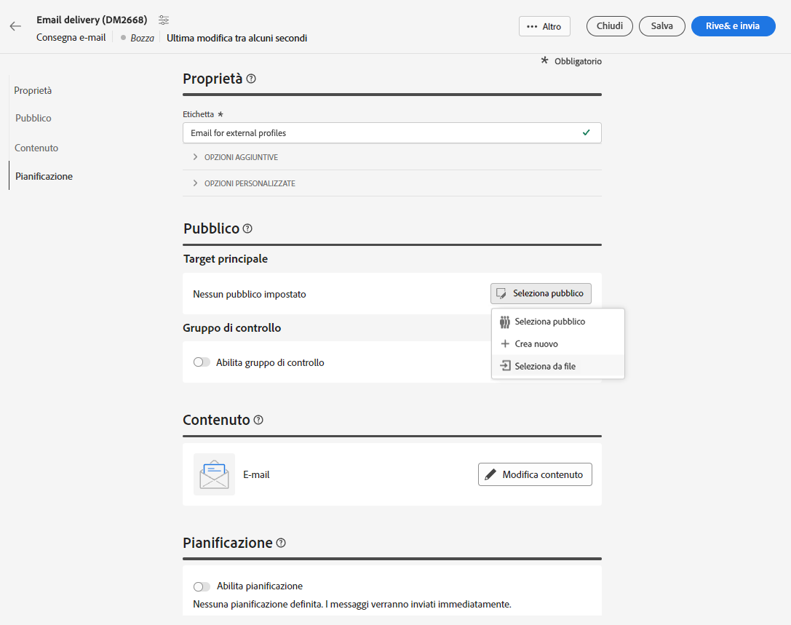
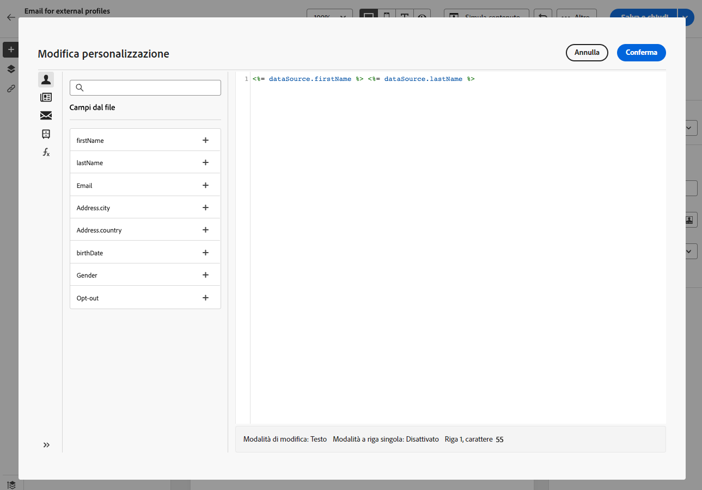
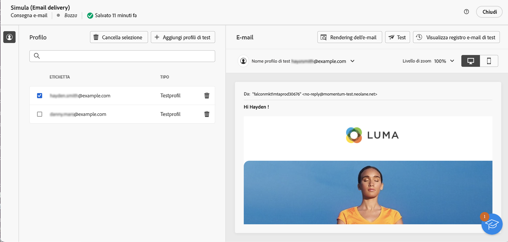
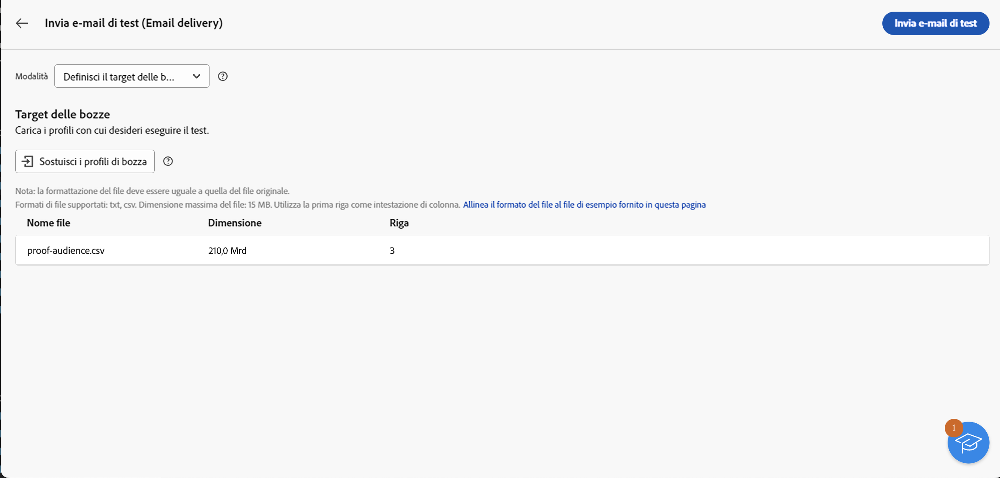

# Caricare un pubblico dell’email da un file {#audience-from-file}

>[!CONTEXTUALHELP]
>id="acw_audience_fromfile_select"
>title="Selezione file"
>abstract="Seleziona il file locale da caricare. Sono supportati i formati TXT e CSV. Allinea il formato del file con il file di esempio collegato di seguito."

>[!CONTEXTUALHELP]
>id="acw_audience_fromfile_columns"
>title="Definizione colonne"
>abstract="Verifica il formato delle colonne da inserire dal file locale."

>[!CONTEXTUALHELP]
>id="acw_audience_fromfile_formatting"
>title="Formattazione dei parametri"
>abstract="Verifica i parametri di formattazione per il file."


>[!CONTEXTUALHELP]
>id="acw_audience_fromfile_preview"
>title="Anteprima del file"
>abstract="Verifica l’anteprima del file. Questa schermata mostra solo un massimo di 30 record."


Non è possibile caricare profili direttamente in Campaign dall’interfaccia, ma è possibile eseguire il targeting dei profili memorizzati in un file esterno. I profili non vengono aggiunti al database, ma tutti i campi nel file di input sono disponibili per la [personalizzazione](../personalization/gs-personalization.md). Sono supportati i formati di file di testo (TXT) e i valori separati da virgole (CSV).

>[!CAUTION]
>
>* Questa funzionalità è disponibile solo per le **consegne e-mail autonome**. Non può essere utilizzata nei flussi di lavoro, né con le consegne SMS o push.
>
>* Non è possibile utilizzare i [gruppi di controllo](control-group.md) durante il caricamento della popolazione target da un file esterno.
>
>* I profili non vengono aggiunti al database ma vengono caricati e sono disponibili solo per questa consegna e-mail autonoma specifica.

## Selezionare e configurare il file {#upload}

Per eseguire il targeting dei profili da un file locale direttamente dall’interfaccia e-mail, segui questi passaggi:

1. Apri una consegna e-mail esistente oppure [crea una nuova consegna e-mail](../email/create-email.md).
1. Nella finestra di creazione della consegna e-mail, dalla sezione **Pubblico**, fai clic sul pulsante **Seleziona pubblico** e scegli l’opzione **Seleziona da file**.

   

1. Seleziona il file locale da usare. Il formato deve essere allineato con il [file di esempio](#sample-file).
1. Visualizza in anteprima e verifica la modalità di mappatura dei dati nella sezione centrale dello schermo.
1. Scegli la colonna che contiene l’indirizzo e-mail dall’elenco a discesa **Campo indirizzo**. Se tali informazioni sono presenti nel file di input, è inoltre possibile selezionare la colonna dell’elenco bloccati.
1. Regola le impostazioni delle colonne e il formato dei dati dalle opzioni disponibili.
1. Fai clic su **Conferma** una volta che le impostazioni sono corrette.

Durante la creazione e la personalizzazione del contenuto del messaggio, puoi selezionare i campi dal file di input nell’[editor di personalizzazione](../personalization/gs-personalization.md).



## File di esempio {#sample-file}

>[!CONTEXTUALHELP]
>id="acw_audience_fromfile_samplefile"
>title="Caricare un pubblico da un file"
>abstract="Sono supportati i formati di file TXT e CSV. Utilizza la prima riga come intestazione di colonna. Allinea il formato del file con il file di esempio fornito nel collegamento seguente."

Sono supportati i formati TXT e CSV. La prima riga è l’intestazione della colonna.

Allinea il formato del file con il file di esempio di seguito:

```javascript
{
lastname,firstname,city,birthdate,email,denylist
Smith,Hayden,Paris,23/05/1985,hayden.smith@example.com,0
Mars,Daniel,London,17/11/1999,danny.mars@example.com,0
Smith,Clara,Roma,08/02/1979,clara.smith@example.com,0
Durance,Allison,San Francisco,15/12/2000,allison.durance@example.com,1
}
```

## Anteprima e test dell’e-mail {#test}

Quando si utilizza un pubblico caricato da un file, Campaign Web consente di visualizzare in anteprima e inviare e-mail di test. Per farlo, segui questi passaggi:

1. Fai clic sul **[!UICONTROL pulsante Simula contenuto]** dalla schermata di modifica dei contenuti della consegna e sul pulsante **[!UICONTROL Aggiungi profili di test]**.

1. Vengono visualizzati i profili contenuti nel file caricato. Seleziona i profili da utilizzare per l’anteprima del contenuto e fai clic su **[!UICONTROL Seleziona]**.

1. Viene visualizzata un’anteprima del contenuto della consegna nel riquadro a destra della schermata. Gli elementi personalizzati vengono sostituiti dai dati del profilo selezionato nel riquadro a sinistra. [Ulteriori informazioni sull’anteprima dei contenuti della consegna](../preview-test/preview-content.md)

   

1. Per inviare e-mail di test, fai clic sul pulsante **[!UICONTROL Test]**.

1. Fai clic sul pulsante **[!UICONTROL Carica i profili di bozza]** e seleziona il file .txt o .csv che contiene i destinatari della bozza.

   >[!CAUTION]
   >
   >Assicurati che il formato del file corrisponda a quello utilizzato per caricare il pubblico. Per eventuali errori di formato verrà visualizzato un avviso.

1. Quando i destinatari della bozza vengono aggiunti ed è tutto pronto per inviare le bozze, fai clic sul pulsante **[!UICONTROL Invia e-mail di test]** e conferma l’invio.

   

1. Puoi monitorare l’invio dell’e-mail di test utilizzando il pulsante Visualizza registro e-mail di test in qualsiasi momento. [Ulteriori informazioni sul monitoraggio delle e-mail di test](../preview-test/test-deliveries.md#access-sent-test-deliveries-access-proofs)
