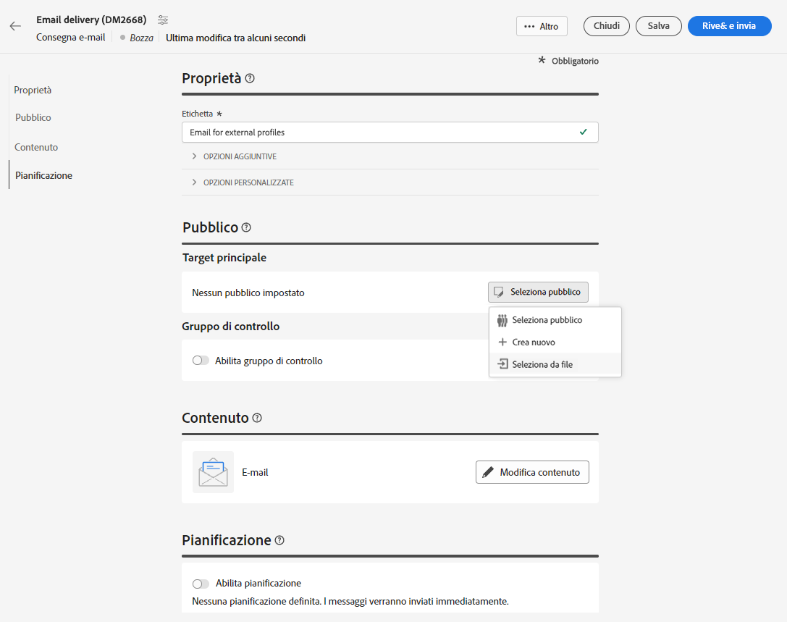
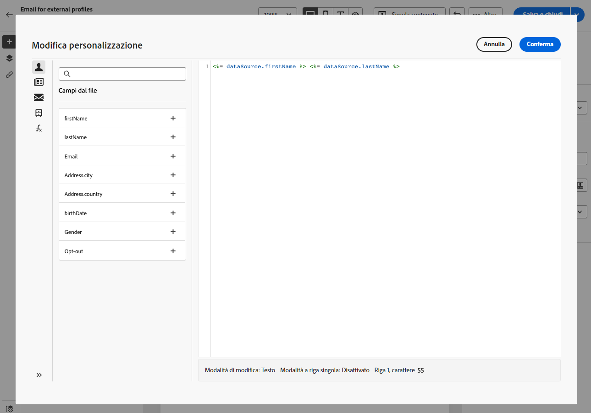
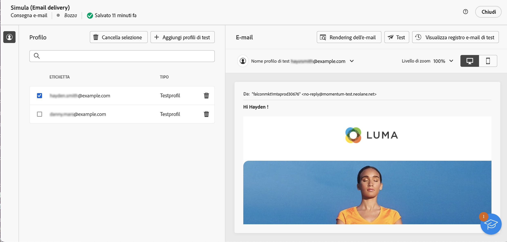
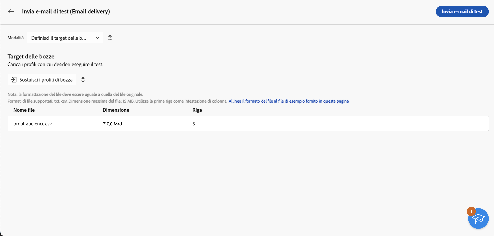

# Caricare un pubblico dell’email da un file {#audience-from-file}

>[!CONTEXTUALHELP]
>id="acw_audience_fromfile_select"
>title="Selezione file"
>abstract="Seleziona il file locale da caricare. Sono supportati i formati TXT e CSV. Allinea il formato del file con il file di esempio collegato di seguito."

>[!CONTEXTUALHELP]
>id="acw_audience_fromfile_columns"
>title="Definizione colonne"
>abstract="Controlla il formato delle colonne nel file esterno."

>[!CONTEXTUALHELP]
>id="acw_audience_fromfile_formatting"
>title="Formattazione dei parametri"
>abstract="Specifica la formattazione del file esterno per garantire che i dati vengano importati correttamente."

>[!CONTEXTUALHELP]
>id="acw_audience_fromfile_preview"
>title="Anteprima del file"
>abstract="Controlla l’anteprima delle colonne del file esterno. Questa schermata mostra solo un massimo di 30 record."

L’interfaccia utente web di Adobe Campaign consente di eseguire il targeting dei profili memorizzati in un file esterno. Una volta caricati i profili, tutti i campi del file di input sono disponibili per l&#39;utilizzo per personalizzare la consegna [Scopri come personalizzare il contenuto](../personalization/personalize.md).

Puoi scegliere di caricare solo i profili per questa consegna e-mail indipendente specifica, senza aggiungerli al database, oppure di importarli e riconciliarli nel database. [Ulteriori informazioni](#upload).

>[!NOTE]
>
>Questa pagina descrive come caricare profili esterni da un file durante la creazione di una consegna e-mail autonoma. Per caricare dati da un file nel contesto di un flusso di lavoro, fare riferimento a [questa pagina](../workflows/activities/load-file.md).

## Da leggere {#must-read}

* Questa funzionalità è disponibile solo per **consegne e-mail**.
* Sono supportati i formati di file di testo (TXT) e i valori separati da virgole (CSV).
* Non è possibile utilizzare i [gruppi di controllo](control-group.md) durante il caricamento della popolazione target da un file esterno.

## Seleziona e configura il file di input {#upload}

Per eseguire il targeting dei profili da un file nelle e-mail, effettua le seguenti operazioni:

1. Apri una consegna e-mail esistente oppure [crea una nuova consegna e-mail](../email/create-email.md).
1. Nella sezione **Pubblico**, fai clic sul pulsante **Seleziona pubblico**, quindi scegli **Seleziona dal file**.

   {zoomable="yes"}

1. Selezionare il file locale da caricare. Il formato del file deve essere allineato al [file di esempio](#sample-file).
1. Visualizza in anteprima e verifica la modalità di mappatura dei dati nella sezione centrale dello schermo.

   

1. Specificare la colonna contenente l&#39;indirizzo di posta elettronica dall&#39;elenco a discesa **Campo indirizzo**. Se tali informazioni sono presenti nel file di input, è inoltre possibile selezionare la colonna di inserita nell&#39;elenco Bloccati del.
1. Nella sezione **[!UICONTROL Colonne]**, espandi una colonna per modificarne le impostazioni e definisci come formattare i dati utilizzando le opzioni disponibili. Per ogni colonna da utilizzare per la riconciliazione, utilizzare **[!UICONTROL Seleziona campo di destinazione]** per eseguire il mapping a un attributo dello schema del destinatario.

1. Utilizzare l&#39;opzione **[!UICONTROL Non importare i destinatari nel database]** per controllare se i profili del file vengono importati e riconciliati nel database. Se scegli di importarli, viene visualizzata una sezione **[!UICONTROL Mappatura campi e riconciliazione]**. Configura i seguenti parametri:

   

   +++**[!UICONTROL Operazione]**

   Scegliere l&#39;azione da eseguire sul database:

   * **[!UICONTROL Aggiorna o inserisci]**: aggiorna il record se esiste nel database e, in caso contrario, lo crea.
   * **[!UICONTROL Inserisci]**: inserisce i record nel database.
   * **[!UICONTROL Aggiorna]**: aggiorna solo i record esistenti.
   * **[!UICONTROL Solo riconciliazione]**: cerca il record nel database, ma non esegue un aggiornamento.
   * **[!UICONTROL Elimina]**: elimina i record dal database.

   +++

   +++**[!UICONTROL Gestione dei duplicati]**

   Scegliere la modalità di gestione di un record presente sia nel file che nel database:

   * **[!UICONTROL Aggiorna]** (impostazione predefinita): aggiorna il record.
   * **[!UICONTROL Rifiuta entità]**: la esclude e registra un errore.
   * **[!UICONTROL Ignora]**: la esclude senza mantenere una traccia.

   +++

   +++**[!UICONTROL Gestione dei duplicati]**

   Scegliere la modalità di gestione di un record visualizzato più di una volta nel file stesso:

   * **[!UICONTROL Aggiornamento]** (impostazione predefinita): non deduplica; l&#39;ultimo record corrispondente ha la priorità.
   * **[!UICONTROL Rifiuta entità]**: esclude i record aggiuntivi e registra un errore.
   * **[!UICONTROL Ignora]**: esclude i record aggiuntivi senza mantenere una traccia.

   +++

   +++**[!UICONTROL Tipo rifiutato]**

   Scegli come gestire un errore a livello di campo durante la riconciliazione:

   * **[!UICONTROL Ignora e registra un avviso]**: importa tutti gli altri campi e registra l&#39;errore.
   * **[!UICONTROL Rifiuta elemento padre]**: rifiuta l&#39;intero record.
   * **[!UICONTROL Rifiuta tutti gli elementi]**: interrompe l&#39;importazione e rifiuta tutto.

   +++

   +++**[!UICONTROL Campi chiave riconciliazione]**

   Nella sezione **[!UICONTROL Colonne]** hai mappato alcune colonne a un campo di destinazione. In questo caso, seleziona quale di questi campi mappati deve essere utilizzato per identificare un record.

   +++

1. Nella sezione **[!UICONTROL Formattazione]** specificare la codifica, il delimitatore di stringa e il separatore di colonna utilizzati dal file.
1. Fai clic su **Conferma** una volta che le impostazioni sono corrette.

Durante la creazione del contenuto del messaggio, aggiungi la personalizzazione sfruttando i campi del file di input. [Scopri come personalizzare il contenuto](../personalization/personalize.md)

{zoomable="yes"}

## File di esempio {#sample-file}

>[!CONTEXTUALHELP]
>id="acw_audience_fromfile_samplefile"
>title="Caricare un pubblico da un file"
>abstract="Sono supportati i formati di file TXT e CSV. Utilizza la prima riga come intestazione di colonna. Allinea il formato del file con il file di esempio fornito nel collegamento seguente."

Quando carichi un file esterno per eseguire il targeting dei profili nelle consegne, assicurati che il file di input corrisponda ai consigli seguenti:

* Sono supportati i formati TXT e CSV.
* La prima riga del file è l’intestazione della colonna.
* Allinea il formato del file con il file di esempio di seguito:

  ```
  lastname,firstname,city,birthdate,email,denylist
  Smith,Hayden,Paris,23/05/1985,hayden.smith@example.com,0
  Mars,Daniel,London,17/11/1999,danny.mars@example.com,0
  Smith,Clara,Roma,08/02/1979,clara.smith@example.com,0
  Durance,Allison,San Francisco,15/12/2000,allison.durance@example.com,1
  ```

## Anteprima e verifica dell’e-mail {#test}

Campaign Web consente di visualizzare in anteprima e inviare bozze quando si utilizza un pubblico caricato da un file. Per farlo, segui questi passaggi:

1. Fai clic sul pulsante **[!UICONTROL Simula contenuto]** nella schermata di modifica del contenuto della consegna e fai clic sul pulsante **[!UICONTROL Aggiungi profili di test]**.

1. Vengono visualizzati i profili contenuti nel file caricato. Seleziona i profili da utilizzare per l&#39;anteprima del contenuto e fai clic su **[!UICONTROL Seleziona]**.

1. Viene visualizzata un’anteprima del contenuto della consegna nel riquadro a destra della schermata. Gli elementi personalizzati vengono sostituiti dai dati del profilo selezionato nel riquadro a sinistra. [Ulteriori informazioni sull&#39;anteprima del contenuto della consegna](../preview-test/preview-content.md)

   {zoomable="yes"}

1. Per inviare bozze, fare clic sul pulsante **[!UICONTROL Invia bozza]**.

1. Fai clic sul pulsante **[!UICONTROL Carica profili bozza]** e seleziona il file .txt o .csv che contiene i destinatari della bozza.

   >[!CAUTION]
   >
   >Assicurati che il formato del file corrisponda a quello utilizzato per caricare il pubblico. Per eventuali errori di formato verrà visualizzato un avviso.

1. Quando i profili di bozza vengono aggiunti e sei pronto per inviare le bozze, fai clic sul pulsante **[!UICONTROL Invia bozza]** e conferma l&#39;invio.

   {zoomable="yes"}

1. Monitora l&#39;invio della bozza utilizzando il pulsante **[!UICONTROL Visualizza bozze]** in qualsiasi momento. [Ulteriori informazioni sul monitoraggio delle bozze](../preview-test/test-deliveries.md#access-test-deliveries)