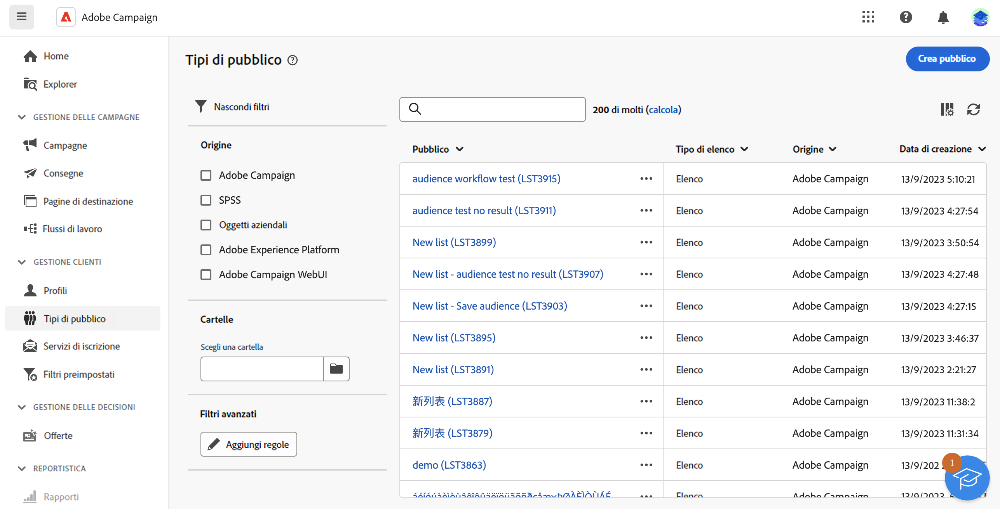
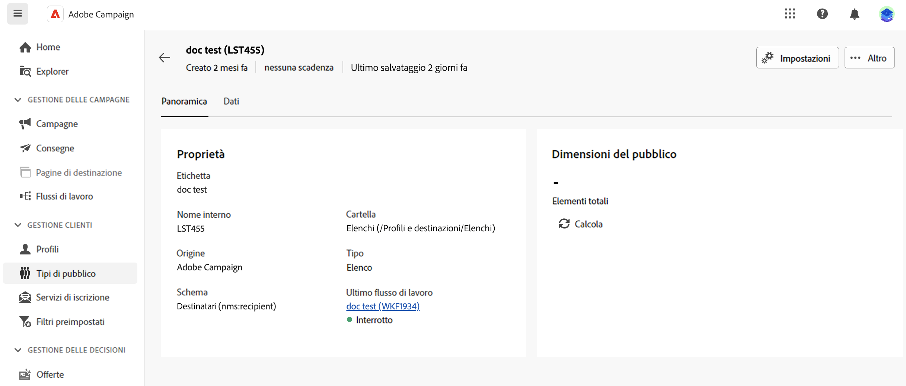

# Introduzione ai tipi di pubblico {#monitor-manage}

>[!CONTEXTUALHELP]
>id="acw_audiences_properties"
>title="Proprietà"
>abstract="Qui è disponibile un riepilogo delle proprietà del pubblico, come l’origine o la cartella di archiviazione. Fai clic sul collegamento nella sezione **Ultimo flusso di lavoro** per aprire il flusso di lavoro utilizzato per creare il pubblico."

>[!CONTEXTUALHELP]
>id="acw_audiences_count"
>title="Dimensione del pubblico"
>abstract="Qui è disponibile il numero totale di profili all’interno del pubblico. Fai clic sul pulsante **Calcola** per aggiornare e ricalcolare i risultati del pubblico."

>[!CONTEXTUALHELP]
>id="acw_audiences_targeting"
>title="Targeting"
>abstract="Targeting"

>[!CONTEXTUALHELP]
>id="acw_audiences_workflow_error_data_execution"
>title="Errore pubblico"
>abstract="Dati del pubblico non disponibili. Attendi la fine dell’esecuzione del flusso di lavoro."

Il pubblico è il target principale della consegna: i profili che ricevono i messaggi. L’elenco dei tipi di pubblico disponibili per l’utilizzo in Campaign Web è accessibile dal menu **[!UICONTROL Tipi di pubblico]**.

{zoomable="yes"}

I tipi di pubblico possono provenire da più origini. Le colonne **[!UICONTROL Origine]** indicano dove è stato creato un determinato pubblico:

* **[!UICONTROL Adobe Campaign]**: questi tipi di pubblico sono stati creati in [Interfaccia utente Web Adobe Campaign](create-audience.md) o nella [console client Adobe Campaign v8](https://experienceleague.adobe.com/docs/campaign/campaign-v8/audience/create-audiences/create-audiences.html?lang=it){target="_blank"}.

* **[!UICONTROL Adobe Experience Platform:]** questi tipi di pubblico sono stati creati in Adobe Experience Platform e sono integrati in Campaign Web tramite l&#39;integrazione di Adobe Sources e Destinations. Per ulteriori informazioni su come impostare questa integrazione, consulta la [Documentazione su Campaign v8 (console del client)](https://experienceleague.adobe.com/docs/campaign/campaign-v8/connect/ac-aep/ac-aep.html?lang=it){target="_blank"}.

  ➡️ [Scopri questa funzione nel video](#video)

Per ottenere ulteriori informazioni su un pubblico, aprilo dall’elenco. Vengono visualizzate le proprietà del pubblico, insieme al numero di profili inclusi nel pubblico. Puoi aggiornare il conteggio del pubblico in qualsiasi momento utilizzando il pulsante **[!UICONTROL Calcola]**.

La scheda **[!UICONTROL Dati]** consente di visualizzare i profili che fanno parte del pubblico. Puoi personalizzare questa vista aggiungendo più colonne o sfruttando filtri avanzati per ottimizzare i dati visualizzati.

{zoomable="yes"}

Per duplicare o eliminare un pubblico, fai clic sul pulsante **[!UICONTROL Altre azioni]** disponibile nell’elenco dei tipi di pubblico accanto al nome del pubblico o all’interno della schermata dei dettagli del pubblico.

## Video dimostrativo {#video}

Scopri come creare una destinazione per utilizzare un pubblico di Experienci Platform nell’interfaccia utente web di Adobe Campaign.

>[!VIDEO](https://video.tv.adobe.com/v/3427635?quality=12)

Informazioni dettagliate su come impostare l&#39;integrazione di Adobe Sources e Destinations sono disponibili nella [documentazione di Campaign v8 (console client)](https://experienceleague.adobe.com/docs/campaign/campaign-v8/connect/ac-aep/ac-aep.html?lang=it){target="_blank"}.
