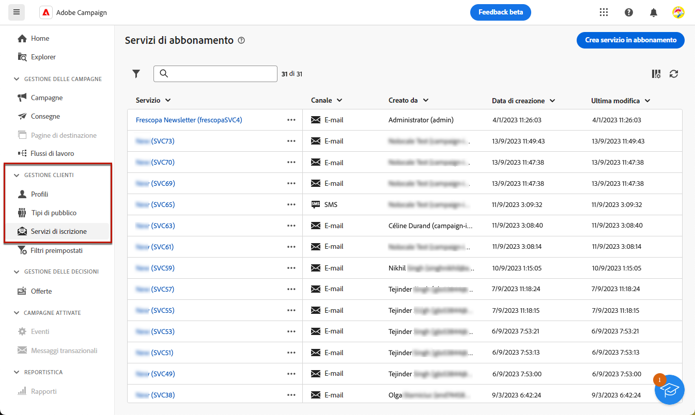
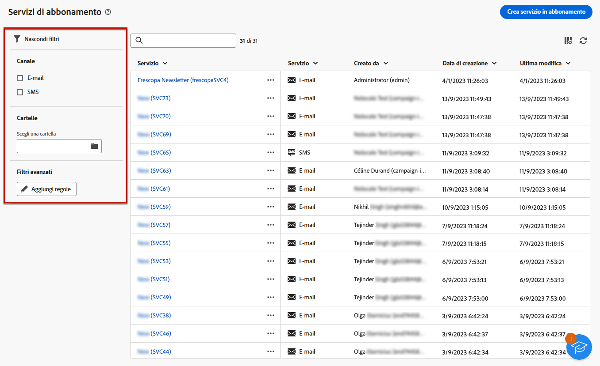
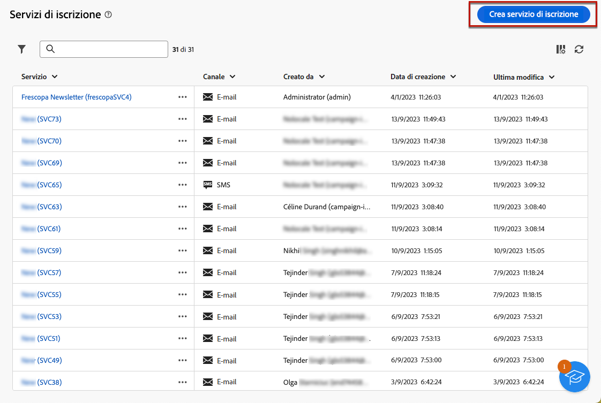
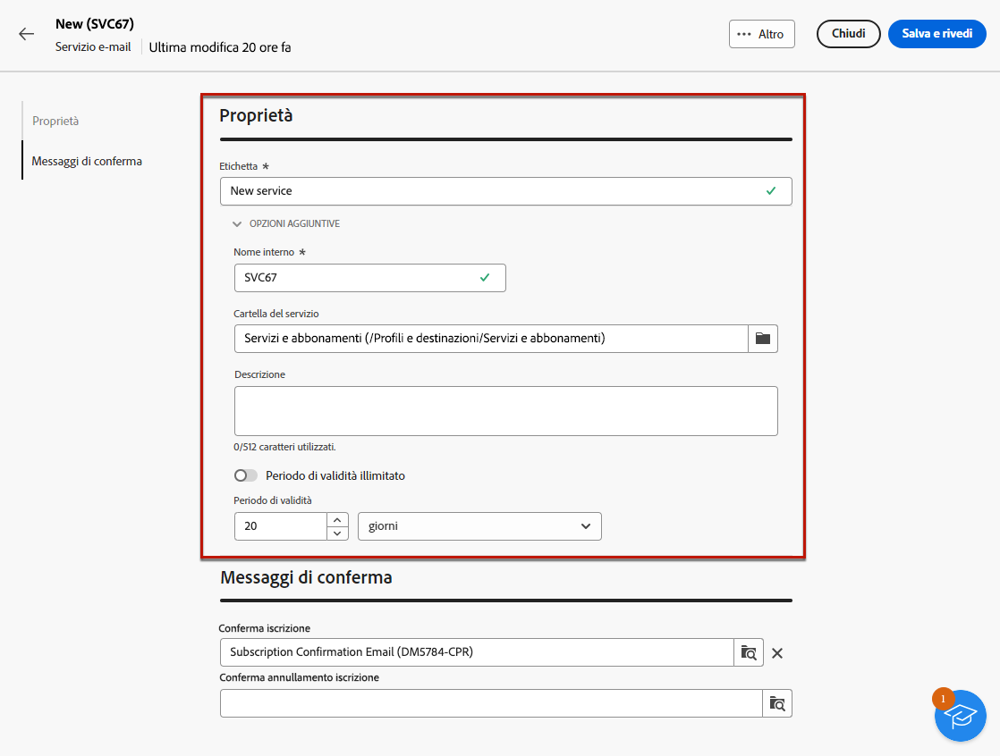
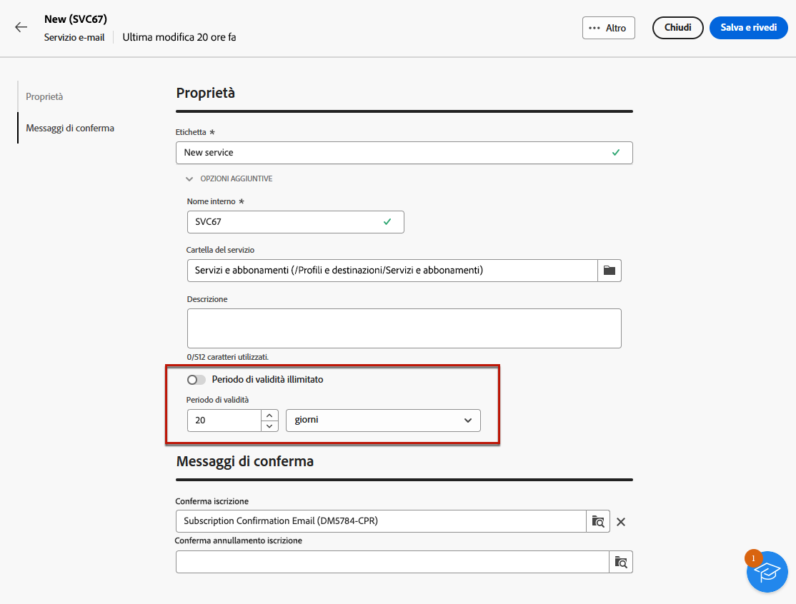
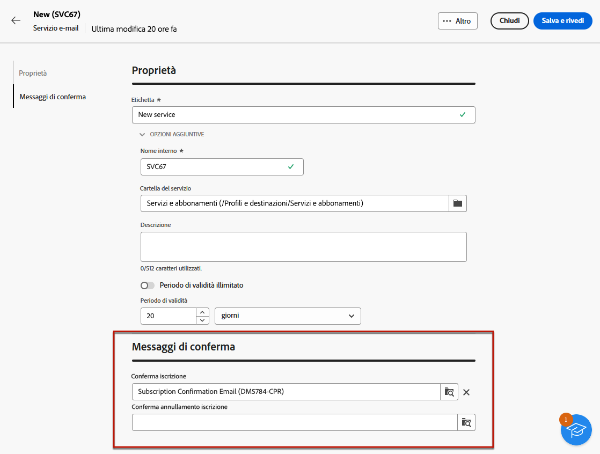
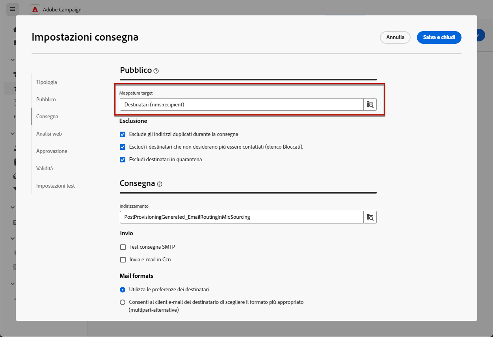
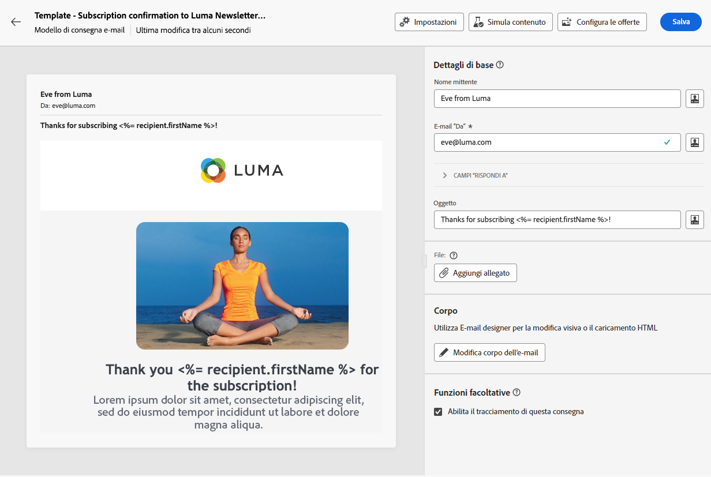
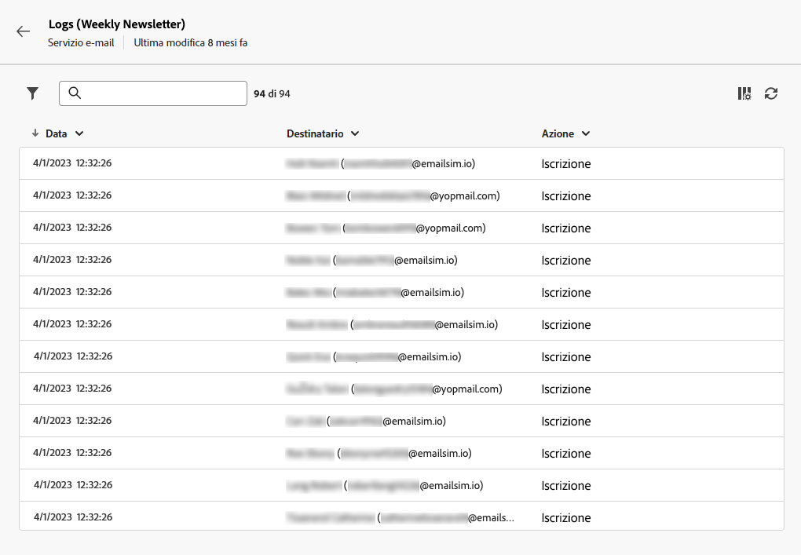
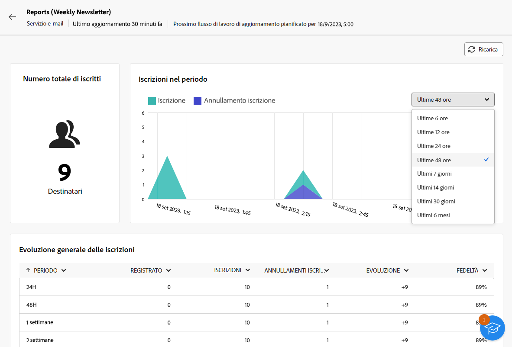

# Creare e gestire i servizi di abbonamento {#manage-services}

>[!CONTEXTUALHELP]
>id="acw_subscriptions_list"
>title="Creare e gestire i servizi"
>abstract="Utilizza Adobe Campaign per creare e monitorare servizi come le newsletter e per verificare le iscrizioni o i loro annullamenti. Le iscrizioni si applicano solo alla consegna di e-mail e SMS."

Utilizza Adobe Campaign Web per gestire e creare i tuoi servizi, ad esempio le newsletter, e per controllare gli abbonamenti o i loro annullamenti.

Possono essere definiti in parallelo diversi servizi, ad esempio: newsletter per specifiche categorie di prodotti, temi o aree di un sito web, iscrizioni a vari tipi di messaggi di avviso e notifiche in tempo reale.

>[!NOTE]
>
>Le iscrizioni si applicano solo alla consegna di e-mail e SMS.

## Accedere ai servizi di iscrizione {#access-services}

Per accedere ai servizi di iscrizione disponibili per la tua piattaforma, segui i passaggi riportati di seguito.

1. Accedi al menu **[!UICONTROL Servizi di iscrizione]** nella barra di navigazione a sinistra.

   {zoomable=&quot;yes&quot;}

1. Viene mostrato l’elenco di tutti i servizi di iscrizione esistenti. Puoi cercare i servizi e filtrare per canale, cartella o aggiungere regole utilizzando [query modeler](../query/query-modeler-overview.md).

   {zoomable=&quot;yes&quot;}

1. Per modificare un servizio esistente, fai clic sul suo nome.

1. Puoi eliminare o duplicare qualsiasi servizio utilizzando l’icona dei tre punti accanto al nome del servizio.<!--so all subscribers are unsubscribed - need to mention?-->

## Creare il primo servizio di iscrizione {#create-service}

>[!CONTEXTUALHELP]
>id="acw_subscriptions_list_properties"
>title="Definire le proprietà del servizio"
>abstract="Inserisci l’etichetta del servizio di iscrizione e definisci le opzioni aggiuntive, ad esempio un periodo di validità per il servizio."

>[!CONTEXTUALHELP]
>id="acw_subscriptions_list_confirm"
>title="Selezionare un messaggio di conferma"
>abstract="Quando un utente si iscrive o annulla l’iscrizione a un servizio, puoi inviare un messaggio di conferma. Seleziona i modelli da utilizzare per tale messaggio."

Per creare un servizio di iscrizione, segui i passaggi riportati di seguito.

1. Seleziona il pulsante **[!UICONTROL Crea servizio iscrizione]**.

   {zoomable=&quot;yes&quot;}

1. Seleziona un canale: **[!UICONTROL E-mail]** o **[!UICONTROL SMS]**.

1. Nelle proprietà del servizio, immetti un’etichetta e definisci **[!UICONTROL Opzioni aggiuntive]** come desiderato.

   {zoomable=&quot;yes&quot;}

1. Per impostazione predefinita, i servizi sono archiviati in **[!UICONTROL Servizi e abbonamenti]** cartella. Puoi modificarlo navigando nella posizione desiderata. [Scopri come utilizzare le cartelle](../get-started/permissions.md#folders)

1. Per impostazione predefinita, gli abbonamenti sono illimitati.

   È possibile disattivare la **[!UICONTROL Periodo di validità illimitato]** per definire una durata di validità per il servizio. Al termine del periodo di validità:
   * Nessun destinatario può più abbonarsi a questo servizio
   * Tutti gli abbonati a questo servizio verranno automaticamente annullati

   {zoomable=&quot;yes&quot;}

1. Quando un utente si iscrive o annulla l’iscrizione a un servizio, puoi inviare un messaggio di conferma. Seleziona i modelli da utilizzare per tale messaggio in base al tuo caso d’uso. Questi modelli devono essere configurati con la mappatura target **[!UICONTROL Iscrizioni]**. [Ulteriori informazioni](#create-confirmation-message)

   {zoomable=&quot;yes&quot;}

1. Fai clic su **[!UICONTROL Salva e rivedi]**. Il nuovo servizio viene aggiunto all’elenco **[!UICONTROL Servizi di iscrizione]**.

Ora puoi:

* Aggiungi abbonati a questo servizio e annulla l’abbonamento dei destinatari. [Ulteriori informazioni](../msg/send-to-subscribers.md)

* Invia messaggi agli abbonati al servizio. [Scopri come](../msg/send-to-subscribers.md)

## Creare un messaggio di conferma {#create-confirmation-message}

>[!CONTEXTUALHELP]
>id="acw_subscriptions_delivery_template"
>title="Selezionare il modello di consegna delle iscrizioni"
>abstract="Per inviare messaggi di conferma agli utenti che si iscrivono al servizio, devi selezionare un modello di consegna specifico con mappatura target **[!UICONTROL Iscrizioni]**, senza un target definito."

>[!CONTEXTUALHELP]
>id="acw_unsubscriptions_delivery_template"
>title="Selezionare il modello di consegna per annullare le iscrizioni"
>abstract="Per inviare messaggi di conferma agli utenti che annullano l’iscrizione al servizio, devi selezionare un modello di consegna specifico con mappatura target **[!UICONTROL Iscrizioni]**, senza un target definito."

Per inviare messaggi di conferma agli utenti che si iscrivono o annullano l’iscrizione al servizio, devi creare un modello di consegna con mappatura target **[!UICONTROL Iscrizioni]**, senza un target definito. A questo scopo, segui i passaggi riportati qui sotto:

1. Crea un modello di consegna per la conferma dell’iscrizione. [Scopri come creare un modello](../msg/delivery-template.md)

1. Non selezionare un pubblico per questa consegna. Al contrario, accedi alla consegna **[!UICONTROL Impostazioni]**, passare alla [Pubblico](../advanced-settings/delivery-settings.md#audience) e seleziona la scheda **[!UICONTROL Iscrizioni]** mappatura target dall’elenco.

   {zoomable=&quot;yes&quot;}

   >[!NOTE]
   >
   >Se non selezioni la mappatura target **[!UICONTROL Iscrizioni]**, gli utenti iscritti non riceveranno il messaggio di conferma. Ulteriori informazioni sulle mappature di destinazione in [questa sezione](../audience/targeting-dimensions.md) .

1. Modifica il contenuto del modello di consegna, salvalo e chiudilo.

   {zoomable=&quot;yes&quot;}

   >[!NOTE]
   >
   >Ulteriori informazioni sui canali di consegna e su come definire un contenuto di consegna sono disponibili nelle sezioni [Canale e-mail](../email/create-email.md) e [Canale SMS](../sms/create-sms.md).

1. Ripeti i passaggi precedenti per creare un modello di consegna per la conferma dell’annullamento dell’iscrizione.

Ora puoi selezionare questi messaggi durante la [creazione di un servizio di iscrizione](#create-service). Chi si iscrive o annulla l’iscrizione a tale servizio riceverà i messaggi di conferma selezionati.

## Monitorare i servizi di iscrizione {#logs-and-reports}

>[!CONTEXTUALHELP]
>id="acw_subscriptions_totalnumber_subscribers"
>title="Numero totale di iscritti"
>abstract="Fai clic su **Calcola** per ottenere il numero totale di iscritti a questo servizio."

>[!CONTEXTUALHELP]
>id="acw_subscriptions_overtheperiod_subscribers"
>title="Numero di iscritti per il periodo"
>abstract="Utilizza l’elenco a discesa per modificare l’intervallo di tempo e visualizzare il numero di iscrizioni e annullamenti di iscrizione nel periodo selezionato."

>[!CONTEXTUALHELP]
>id="acw_subscriptions_overallevolution_subscribers"
>title="Evoluzione complessiva delle iscrizioni"
>abstract="Il grafico mostra il raggruppamento per periodo, inclusi iscrizioni, annullamenti di iscrizione, evoluzione in termini numerici e percentuale di fedeltà."

Per misurare l’efficacia dei servizi di iscrizione per i canali SMS e E-mail, puoi accedere ai registri e ai rapporti per un determinato servizio.

1. Seleziona un servizio dall’elenco **[!UICONTROL Servizi di iscrizione]**. Clic **[!UICONTROL Calcola]** il ottiene il numero totale di abbonati.

   {zoomable=&quot;yes&quot;}

1. Dal dashboard del servizio, seleziona **[!UICONTROL Registri]** per visualizzare l’elenco degli abbonati a questo servizio.

   Puoi controllare il numero totale di abbonati, il nome e l’indirizzo di ciascun destinatario e quando ha effettuato o annullato l’abbonamento. Puoi anche applicare dei filtri.

   {zoomable=&quot;yes&quot;}

1. Dalla dashboard del servizio, seleziona **[!UICONTROL Rapporti]**. Verifica i seguenti indicatori:

   * Viene visualizzato il **[!UICONTROL Numero totale di iscritti]**.

   * Puoi visualizzare il numero di iscrizioni e annullamenti di iscrizione in un dato periodo. Utilizza l’elenco a discesa per modificare l’intervallo di tempo.

     {zoomable=&quot;yes&quot;}

   * Il grafico **[!UICONTROL Evoluzione complessiva delle iscrizioni]** mostra il raggruppamento per periodo, inclusi iscrizioni, annullamenti di iscrizione, evoluzione in termini numerici e percentuale di fedeltà.<!--what is Registered?-->

1. Utilizza il pulsante **[!UICONTROL Ricarica]** per recuperare gli ultimi valori dall’esecuzione e dalla pianificazione del flusso di lavoro di tracciamento.
