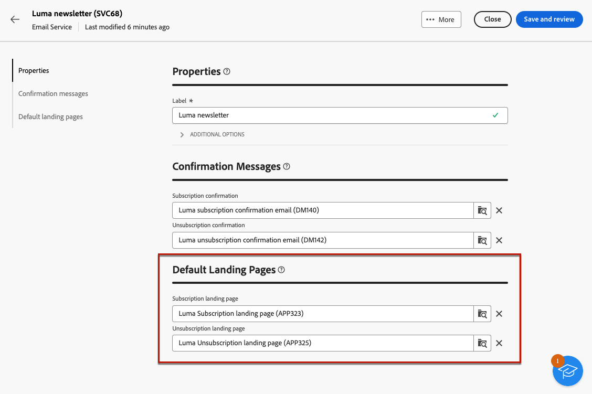

# Creare e gestire i servizi di abbonamento {#manage-services}

>[!CONTEXTUALHELP]
>id="acw_subscriptions_list"
>title="Creare e gestire i servizi"
>abstract="Utilizza Adobe Campaign per creare e monitorare servizi come le newsletter e per verificarne le iscrizioni o i relativi annullamenti. Le iscrizioni si applicano solo alla consegna di e-mail e SMS."

Utilizza Adobe Campaign Web per gestire e creare i tuoi servizi, ad esempio le newsletter, e per controllare gli abbonamenti o i loro annullamenti.

Diversi servizi possono essere definiti in parallelo, ad esempio: newsletter per specifiche categorie di prodotti, temi o aree di un sito web, abbonamenti a vari tipi di messaggi di avviso e notifiche in tempo reale.

>[!NOTE]
>
>Le iscrizioni si applicano solo alla consegna di e-mail e SMS.

## Accedere ai servizi di iscrizione {#access-services}

Per accedere ai servizi di iscrizione disponibili per la tua piattaforma, segui i passaggi riportati di seguito.

1. Passa al menu **[!UICONTROL Servizi di abbonamento]** nella barra di navigazione a sinistra, in **[!UICONTROL Gestione clienti]**.

   {zoomable="yes"}

1. Viene mostrato l’elenco di tutti i servizi di iscrizione esistenti. Puoi cercare i servizi e filtrare per canale, cartella o aggiungere regole utilizzando [modellatore query](../query/query-modeler-overview.md).

   {zoomable="yes"}

1. Per modificare un servizio esistente, fai clic sul suo nome.

1. Eliminare o duplicare un servizio utilizzando l&#39;icona a tre punti accanto al nome del servizio.<!--so all subscribers are unsubscribed - need to mention?-->

## Creare il primo servizio di iscrizione {#create-service}

>[!CONTEXTUALHELP]
>id="acw_subscriptions_list_properties"
>title="Definire le proprietà del servizio"
>abstract="Inserisci l’etichetta del servizio di iscrizione e definisci le opzioni aggiuntive, ad esempio un periodo di validità per il servizio."

>[!CONTEXTUALHELP]
>id="acw_subscriptions_list_confirm"
>title="Selezionare un messaggio di conferma"
>abstract="Quando un utente si iscrive o annulla l’iscrizione a un servizio, puoi inviare un messaggio di conferma. Seleziona i modelli da utilizzare per tale messaggio."

>[!CONTEXTUALHELP]
>id="acw_subscriptions_defaultlp"
>title="Pagina di destinazione predefinita"
>abstract="Seleziona le pagine di destinazione predefinite associate a questo servizio."

Per creare un servizio di iscrizione, segui i passaggi riportati di seguito.

1. Seleziona il pulsante **[!UICONTROL Crea servizio iscrizione]**.

   {zoomable="yes"}

1. Seleziona un canale: **[!UICONTROL E-mail]** o **[!UICONTROL SMS]**.

1. Nelle proprietà del servizio, immetti un&#39;etichetta e definisci **[!UICONTROL Opzioni aggiuntive]** in base alle esigenze.

   {zoomable="yes"}

1. Per impostazione predefinita, i servizi sono archiviati nella cartella **[!UICONTROL Servizi e sottoscrizioni]**. Puoi modificarlo navigando nella posizione desiderata. [Scopri come utilizzare le cartelle](../get-started/permissions.md#folders)

1. Per impostazione predefinita, gli abbonamenti sono illimitati.

   Disattiva l&#39;opzione **[!UICONTROL Periodo di validità illimitato]** per definire una durata di validità per il servizio. Al termine del periodo di validità:
   * Nessun profilo può più abbonarsi a questo servizio.
   * Tutti gli abbonati a questo servizio verranno automaticamente annullati.

   {zoomable="yes"}

1. Quando un utente si iscrive o annulla l’iscrizione a un servizio, puoi inviare un messaggio di conferma. Seleziona i modelli da utilizzare per tale messaggio in base al tuo caso d’uso. Questi modelli devono essere configurati con la mappatura target **[!UICONTROL Iscrizioni]**. [Ulteriori informazioni](#create-confirmation-message)

   {zoomable="yes"}

1. Fai clic su **[!UICONTROL Salva e rivedi]**. Il nuovo servizio viene aggiunto all’elenco **[!UICONTROL Servizi di iscrizione]**.

1. Seleziona le pagine di destinazione predefinite per l’abbonamento e il suo annullamento associate a questo servizio.

   >[!AVAILABILITY]
   >
   >Questa funzionalità è a disponibilità limitata (LA). È limitata ai clienti che eseguono la migrazione **da Adobe Campaign Standard ad Adobe Campaign v8** e non possono essere distribuiti in nessun altro ambiente.

   {zoomable="yes"}

   Al termine, quando [inserisci un collegamento](../email/message-tracking.md) in un&#39;e-mail, seleziona **[!UICONTROL Collegamento abbonamento]** o **[!UICONTROL Collegamento annullamento abbonamento]**. Facendo clic su tale collegamento, gli utenti verranno indirizzati alla pagina di destinazione per l’abbonamento o il suo annullamento a cui si fa riferimento nel servizio. <!--After submitting the form, they will be subscribed to / unsubscribed from the service.-->

   {zoomable="yes"}

1. Salva e rivedi le modifiche.

Ora puoi:

* Aggiungi manualmente gli abbonati a questo servizio e annulla l’abbonamento dei profili. [Ulteriori informazioni](../audience/manage-subscribers.md)

* Invita i tuoi clienti ad abbonarsi a questo servizio tramite una pagina di destinazione. [Ulteriori informazioni](../landing-pages/lp-use-cases.md#lp-subscription)

* Invia messaggi agli abbonati al servizio. [Scopri come](../msg/send-to-subscribers.md)

## Creare un messaggio di conferma {#create-confirmation-message}

>[!CONTEXTUALHELP]
>id="acw_subscriptions_delivery_template"
>title="Selezionare il modello di consegna delle iscrizioni"
>abstract="Per inviare messaggi di conferma agli utenti che si iscrivono al servizio, devi selezionare un modello di consegna specifico con mappatura target **[!UICONTROL Iscrizioni]**, senza un target definito."

>[!CONTEXTUALHELP]
>id="acw_unsubscriptions_delivery_template"
>title="Selezionare il modello di consegna per annullare le iscrizioni"
>abstract="Per inviare messaggi di conferma agli utenti che annullano l’iscrizione al servizio, devi selezionare un modello di consegna specifico con mappatura target **[!UICONTROL Iscrizioni]**, senza un target definito."

Per inviare messaggi di conferma agli utenti che si abbonano o annullano l&#39;abbonamento al servizio, crea un modello di consegna con la mappatura di destinazione **[!UICONTROL Abbonamenti]**, senza una destinazione definita. Segui i passaggi seguenti:

1. Crea un modello di consegna per la conferma dell’abbonamento. [Scopri come creare un modello](../msg/delivery-template.md)

1. Non selezionare un pubblico per questa consegna. Accedi invece alla consegna **[!UICONTROL Impostazioni]**, passa alla scheda [Pubblico](../advanced-settings/delivery-settings.md#audience) e seleziona la mappatura di destinazione **[!UICONTROL Sottoscrizioni]** dall&#39;elenco.

   {zoomable="yes"}

   >[!NOTE]
   >
   >Se non si seleziona la mappatura di destinazione **[!UICONTROL Sottoscrizioni]**, i sottoscrittori non riceveranno il messaggio di conferma. Per ulteriori informazioni sulle mappature target, consulta [questa sezione](../audience/targeting-dimensions.md).

1. Modifica il contenuto del modello di consegna, salvalo e chiudilo.

   {zoomable="yes"}

   >[!NOTE]
   >
   >Ulteriori informazioni sui canali di consegna e su come definire i contenuti di consegna nelle sezioni [Canale e-mail](../email/create-email.md) e [Canale SMS](../sms/create-sms.md).

1. Ripeti i passaggi precedenti per creare un modello di consegna per la conferma dell’annullamento dell’abbonamento.

Ora puoi selezionare questi messaggi durante la [creazione di un servizio di iscrizione](#create-service). Chi si iscrive o annulla l’iscrizione a tale servizio riceverà i messaggi di conferma selezionati.

## Monitorare i servizi di iscrizione {#logs-and-reports}

>[!CONTEXTUALHELP]
>id="acw_subscriptions_totalnumber_subscribers"
>title="Conteggio abbonati"
>abstract="Fai clic su **Calcola** per ottenere il numero totale di iscritti a questo servizio."

>[!CONTEXTUALHELP]
>id="acw_subscriptions_totalnumber_subscribers_report"
>title="Numero totale di iscritti"
>abstract="L’indicatore di prestazioni chiave (KPI, Key Performance Indicator) fornisce una panoramica completa della base di abbonati, mostrando il numero totale di singoli utenti che si sono iscritti a questo servizio."

>[!CONTEXTUALHELP]
>id="acw_subscriptions_overtheperiod_subscribers"
>title="Numero di iscritti per il periodo"
>abstract="Utilizza l’elenco a discesa per modificare l’intervallo di tempo e visualizzare il numero di iscrizioni e annullamenti di iscrizione nel periodo selezionato."

>[!CONTEXTUALHELP]
>id="acw_subscriptions_overallevolution_subscribers"
>title="Evoluzione complessiva delle iscrizioni"
>abstract="Il grafico mostra il raggruppamento per periodo, inclusi iscrizioni, annullamenti di iscrizione, evoluzione in termini numerici e percentuale di fidelizzazione."

Per misurare l’efficacia dei servizi in abbonamento per i canali SMS ed e-mail, accedi ai registri e ai rapporti per un determinato servizio.

1. Seleziona un servizio dall’elenco **[!UICONTROL Servizi di iscrizione]**. Fare clic su **[!UICONTROL Calcola]** per ottenere il numero totale di sottoscrittori.

   {zoomable="yes"}

1. Dal dashboard del servizio, seleziona **[!UICONTROL Registri]** per visualizzare l&#39;elenco degli abbonati al servizio.

   Puoi controllare il numero totale di abbonati, il nome e l’indirizzo di ciascun destinatario e quando si è abbonato o annullato l’abbonamento. Puoi anche filtrarli.

   {zoomable="yes"}

1. Dalla dashboard del servizio, seleziona **[!UICONTROL Rapporti]**. Verifica i seguenti indicatori:

   * Viene visualizzato il **[!UICONTROL Numero totale di iscritti]**.

   * Visualizza il numero di abbonamenti e annullamenti di abbonamenti in un periodo selezionato. Utilizza l’elenco a discesa per modificare l’intervallo di tempo.

     {zoomable="yes"}

   * Il grafico **[!UICONTROL Evoluzione complessiva degli abbonamenti]** mostra la suddivisione per periodo, inclusi abbonamenti, annullamenti di abbonamenti, evoluzione dei numeri e percentuale di fedeltà.<!--what is Registered?-->

1. Utilizza il pulsante **[!UICONTROL Ricarica]** per recuperare i valori più recenti dall&#39;esecuzione e dalla pianificazione del flusso di lavoro di tracciamento.