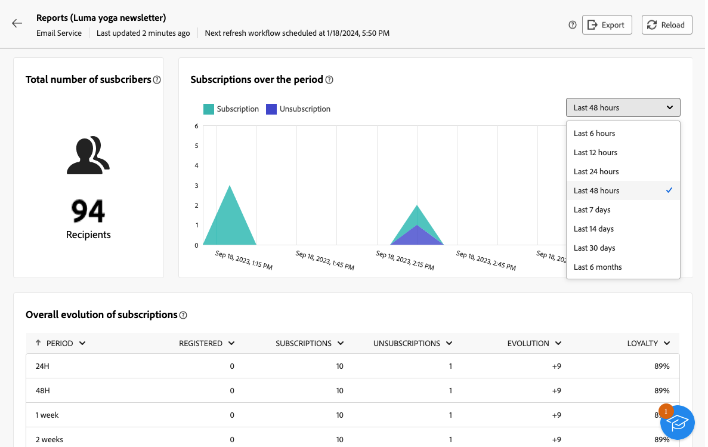

# Utilizzare i servizi di abbonamento {#manage-services}

>[!CONTEXTUALHELP]
>id="acw_subscriptions_list"
>title="Creare e gestire i servizi"
>abstract="Utilizza Adobe Campaign per creare e monitorare servizi come le newsletter e per verificare gli abbonamenti o i loro annullamenti. Gli abbonamenti si applicano solo alla consegna di e-mail e SMS."

Utilizza Adobe Campaign Web per gestire e creare servizi come le newsletter e per controllare gli abbonamenti o i loro annullamenti.

>[!NOTE]
>
>Gli abbonamenti si applicano solo alla consegna di e-mail e SMS.

Diversi servizi possono essere definiti in parallelo, ad esempio: newsletter per specifiche categorie di prodotti, temi o aree di un sito web, abbonamenti a vari tipi di messaggi di avviso e notifiche in tempo reale.

Per ulteriori informazioni sulla gestione degli abbonamenti e sul loro annullamento, consulta [Documentazione di Campaign v8 (console client)](https://experienceleague.adobe.com/docs/campaign/campaign-v8/audience/subscriptions.html){target="_blank"}.

## Accedere ai servizi di abbonamento {#access-services}

Per accedere ai servizi di abbonamento disponibili per la tua piattaforma, segui i passaggi indicati di seguito.

1. Accedi a **[!UICONTROL Servizi di abbonamento]** menu nella barra di navigazione a sinistra.

   

1. Viene visualizzato l’elenco di tutti i servizi di abbonamento esistenti. Puoi cercare i servizi e filtrare in base al canale, alla cartella o utilizzare filtri avanzati.

   

1. Per modificare un servizio esistente, fare clic sul relativo nome.

1. Puoi eliminare o duplicare qualsiasi servizio utilizzando l’icona a tre punti accanto al nome del servizio.<!--so all subscribers are unsuibscribed - need to mention?-->

## Creare il primo servizio di abbonamento {#create-service}

>[!CONTEXTUALHELP]
>id="acw_subscriptions_list_properties"
>title="Definire le proprietà del servizio"
>abstract="Inserisci l’etichetta del servizio di abbonamento e definisci le opzioni aggiuntive, ad esempio un periodo di validità per il servizio."

>[!CONTEXTUALHELP]
>id="acw_subscriptions_list_confirm"
>title="Seleziona un messaggio di conferma"
>abstract="Quando un utente si abbona o annulla l’abbonamento a un servizio, puoi inviare un messaggio di conferma. Seleziona i modelli da utilizzare per il messaggio."

Per creare un servizio di abbonamento, segui i passaggi indicati di seguito.

1. Seleziona la **[!UICONTROL Crea servizio di abbonamento]** pulsante.

   

1. Seleziona un canale: **[!UICONTROL E-mail]** o **[!UICONTROL SMS]**.

1. Nelle proprietà del servizio, immetti un’etichetta e definisci le opzioni aggiuntive in base alle tue esigenze.

   

1. Per impostazione predefinita, gli abbonamenti sono illimitati. È possibile disattivare la **[!UICONTROL Periodo di validità illimitato]** per definire una durata di validità per il servizio.

   Nell’esempio seguente, dopo 20 giorni:
   * Nessun destinatario potrà più abbonarsi a questo servizio.
   * Tutti gli abbonati a questo servizio verranno automaticamente cancellati dopo 20 giorni. [Ulteriori informazioni](#automatic-unsubscription)

   

1. Quando un utente si abbona o annulla l’abbonamento a un servizio, puoi inviare un messaggio di conferma. Seleziona i modelli da utilizzare per quel messaggio in base al tuo caso d’uso. Questi modelli devono essere configurati con **[!UICONTROL Iscrizioni]** mappatura target. [Ulteriori informazioni](#create-confirmation-message)

   

1. Clic **[!UICONTROL Salva e rivedi]**. Il nuovo servizio viene aggiunto al **[!UICONTROL Servizi di abbonamento]** elenco.

## Creare un messaggio di conferma {#create-confirmation-message}

Per inviare messaggi di conferma agli utenti che si abbonano o annullano l’abbonamento al servizio, devi creare un modello di consegna con **[!UICONTROL Iscrizioni]** mappatura del target, senza un target definito. A questo scopo, segui questi passaggi.

1. Crea un modello di consegna per la conferma dell’abbonamento. [Scopri come](../msg/delivery-template.md)

1. Non selezionare un pubblico per questa consegna. Invece, accedi a **[!UICONTROL Impostazioni di consegna]**, passare alla [Pubblico](../advanced-settings/delivery-settings.md#audience) e seleziona la scheda **[!UICONTROL Iscrizioni]** mappatura target dall’elenco.

   

   >[!NOTE]
   >
   >Se non si seleziona la  **[!UICONTROL Iscrizioni]** mappatura target, gli abbonati non riceveranno il messaggio di conferma. Le mappature target sono definite nella console Campaign v8. Ulteriori informazioni [Documentazione di Adobe Campaign v8](https://experienceleague.adobe.com/docs/campaign/campaign-v8/audience/add-profiles/target-mappings.html?lang=it){target="_blank"}.

1. Modifica il contenuto del modello di consegna, salvalo e chiudilo.

   

   >[!NOTE]
   >
   >Ulteriori informazioni sui canali di consegna e su come definirne i contenuti in [Canale e-mail](../email/create-email.md) e [Canale SMS](../sms/create-sms.md) sezioni.

1. Ripeti i passaggi precedenti per creare un modello di consegna per la conferma dell’annullamento dell’abbonamento.

Ora puoi selezionare questi messaggi quando [creazione di un servizio di abbonamento](#create-service). Gli utenti che si abbonano o annullano l’abbonamento a tale servizio riceveranno i messaggi di conferma selezionati.

## Monitorare i servizi di abbonamento {#logs-and-reports}

Per misurare l’efficacia dei servizi in abbonamento per i canali SMS ed e-mail, puoi accedere ai registri e ai rapporti per un determinato servizio.

1. Seleziona un servizio esistente da **[!UICONTROL Servizi di abbonamento]** elenco. Clic **[!UICONTROL Calcola]** il ottiene il numero di abbonati totali.

   

1. Dal dashboard del servizio, seleziona **[!UICONTROL Registri]** per visualizzare l’elenco degli abbonati a questo servizio. Puoi controllare il numero totale di abbonati, il nome e l’indirizzo di ciascun destinatario e quando ha effettuato o annullato l’abbonamento. Puoi anche filtrarli.

   

1. Dal dashboard del servizio, seleziona **[!UICONTROL Rapporti]**. Controllare i seguenti indicatori:

   * Il **[!UICONTROL Numero totale di abbonati]** viene visualizzato.

   * Puoi visualizzare il numero di abbonamenti e annullamenti di abbonamenti in un periodo selezionato. Utilizza l’elenco a discesa per modificare l’intervallo di tempo.

     

   * Il **[!UICONTROL Evoluzione complessiva degli abbonamenti]** il grafico mostra la suddivisione per periodo, inclusi abbonamenti, annullamenti di abbonamenti, evoluzione dei numeri e percentuale di fedeltà.<!--what is Registered?-->

1. Utilizza il **[!UICONTROL Ricarica]** per recuperare gli ultimi valori dall’esecuzione e dalla pianificazione del flusso di lavoro di tracciamento.

