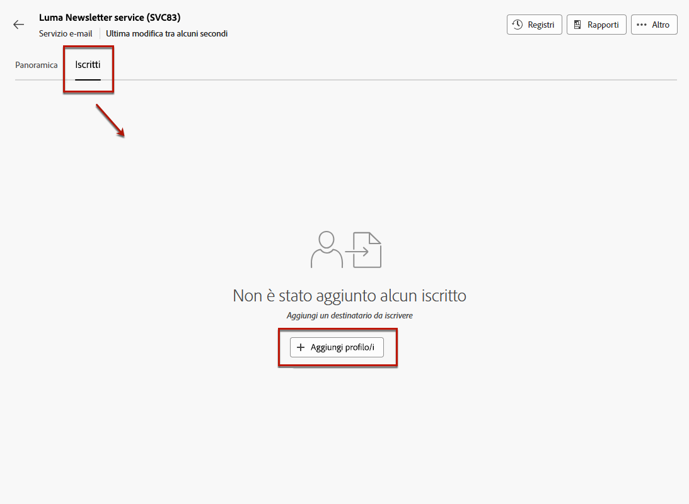
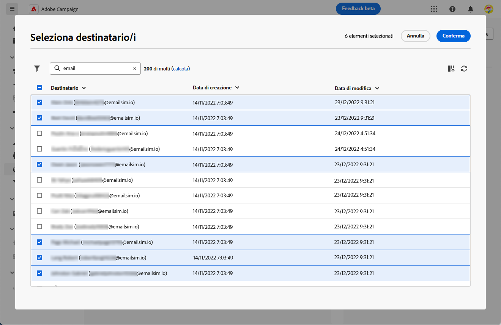
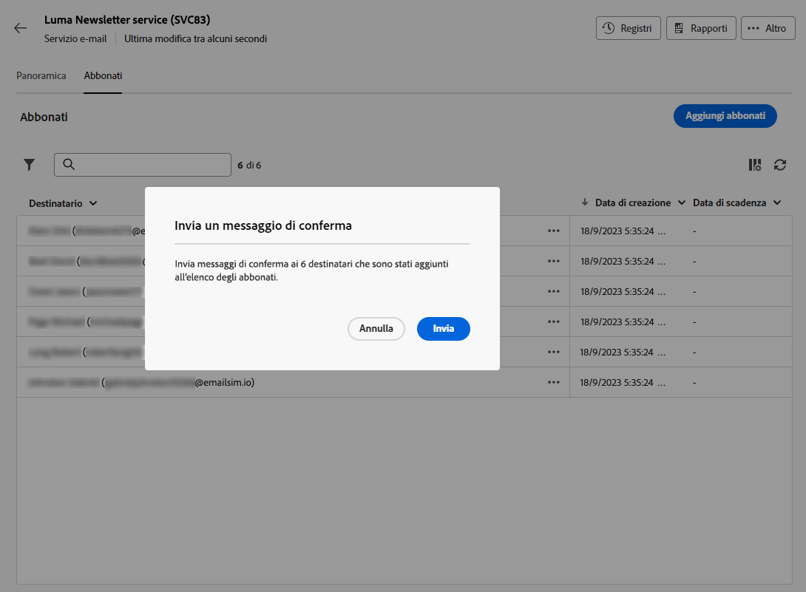
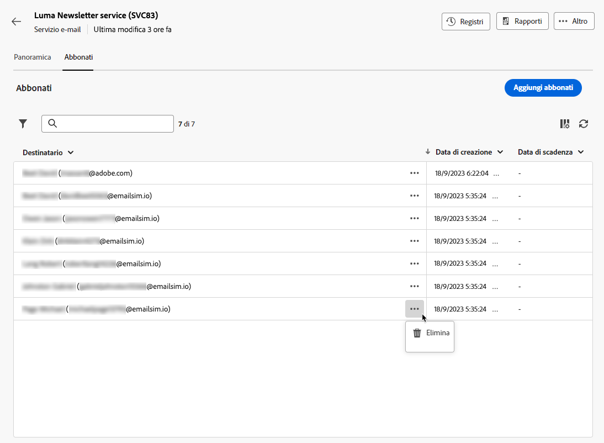
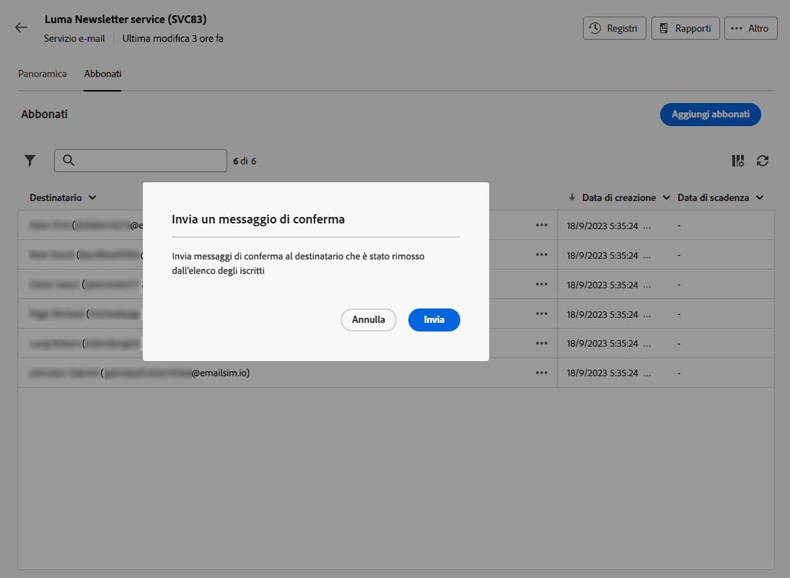

# Gestire gli abbonati a un servizio {#manage-subscribers}

Una volta [ha creato un servizio](manage-services.md#create-service), puoi aggiungere abbonati, annullare l’abbonamento dei destinatari e inviare messaggi agli abbonati di tale servizio.

La gestione degli abbonati è descritta in questa pagina. Per informazioni su come inviare messaggi agli abbonati, consulta [questa sezione](../content/send-to-subscribers.md).

## Aggiungere abbonati al servizio {#add-subscribers}

Per aggiungere manualmente gli abbonati, segui la procedura riportata di seguito.

1. Seleziona un servizio esistente da **[!UICONTROL Servizi di abbonamento]** elenco.

1. Seleziona la **[!UICONTROL Abbonati]** e fai clic su **[!UICONTROL Aggiungere profili]**.

   

1. Seleziona i profili da aggiungere dall’elenco e fai clic su **[!UICONTROL Conferma]**.

   

1. Clic **[!UICONTROL Invia]**.<!--if you click cancel, does it mean that no message is sent but recipients are still subscribed, or they are not subscribed? it's 2 different actions in the console)--> I destinatari selezionati riceveranno la sottoscrizione [messaggio di conferma](manage-services.md#create-confirmation-message) selezionato quando [creazione del servizio](manage-services.md#create-service).

   

I profili aggiunti vengono visualizzati nel **[!UICONTROL Abbonati]** elenco. Sono ora abbonati al tuo servizio.

## Rimuovere gli abbonati dal servizio {#remove-subscribers}

### Annullare manualmente l’abbonamento dei destinatari {#manual-unsubscription}

Una volta [abbonati aggiunti](#add-subscribers) al servizio, puoi annullare manualmente l’abbonamento a ciascuno di essi. Segui i passaggi seguenti.

1. Seleziona un servizio esistente da **[!UICONTROL Servizi di abbonamento]** elenco.

1. Fai clic sull’icona dei tre punti accanto al nome del destinatario desiderato e seleziona **[!UICONTROL Elimina]**.

   

1. Conferma eliminazione e fai clic su **[!UICONTROL Invia]**. Il destinatario selezionato riceverà l’annullamento dell’abbonamento [messaggio di conferma](manage-services.md#create-confirmation-message) selezionato quando [creazione del servizio](manage-services.md#create-service).

   

Il destinatario viene rimosso dal **[!UICONTROL Abbonati]** e non è più abbonato al servizio.

### Annulla automaticamente l’abbonamento dei destinatari {#automatic-unsubscription}

Un servizio di abbonamento può avere una durata limitata. L’abbonamento dei destinatari viene automaticamente annullato alla scadenza del periodo di validità.

Questo periodo viene specificato quando [creazione del servizio](manage-services.md#create-service). Dalla sezione **[!UICONTROL Opzioni aggiuntive]**, disattiva la **[!UICONTROL Periodo di validità illimitato]** e definire un periodo di validità per il servizio.

Alla scadenza della durata specificata, tutti gli abbonati verranno automaticamente cancellati da tale servizio.
