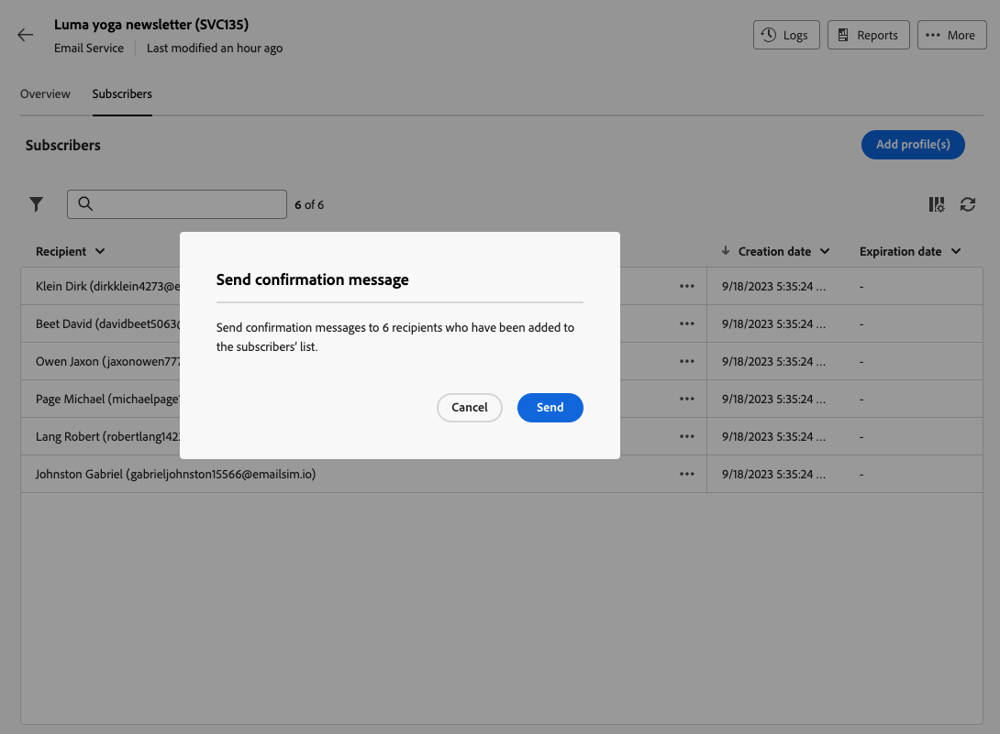

# Gestire gli iscritti a un servizio {#manage-subscribers}

Dopo aver [creato un servizio](manage-services.md#create-service), puoi aggiungere utenti iscritti, annullare l’iscrizione dei destinatari e inviare messaggi agli iscritti al servizio.

La gestione degli utenti iscritti è descritta in questa pagina. Per informazioni su come inviare messaggi alle persone iscritte, consulta [questa sezione](../content/send-to-subscribers.md).

## Aggiungere iscritti al servizio {#add-subscribers}

Per aggiungere manualmente degli utenti iscritti, segui i passaggi seguenti.

1. Seleziona un servizio esistente dall’elenco **[!UICONTROL Servizi di iscrizione]**.

1. Seleziona la scheda **[!UICONTROL Iscritti]** e fai clic su **[!UICONTROL Aggiungi profili]**.

   

1. Seleziona nell’elenco i profili da aggiungere e fai clic su **[!UICONTROL Conferma]**.

   

1. Fai clic su **[!UICONTROL Invia]**.<!--if you click cancel, does it mean that no message is sent but recipients are still subscribed, or they are not subscribed? it's 2 different actions in the console)--> I destinatari selezionati verranno avvisati dell’avvenuta iscrizione tramite il [messaggio di conferma](manage-services.md#create-confirmation-message) che avevi selezionato al momento della [creazione del servizio](manage-services.md#create-service).

   

I profili aggiunti vengono visualizzati nell’elenco **[!UICONTROL Iscritti]**. Questi sono ora iscritti al servizio.

## Rimuovere degli iscritti dal servizio {#remove-subscribers}

### Annullare manualmente l’iscrizione dei destinatari {#manual-unsubscription}

Dopo aver [aggiunto iscritti](#add-subscribers) al servizio, puoi annullare manualmente l’iscrizione di ciascuno di essi. Segui i passaggi seguenti.

1. Seleziona un servizio esistente dall’elenco **[!UICONTROL Servizi di iscrizione]**.

1. Fai clic sull’icona con i tre punti accanto al nome del destinatario desiderato e seleziona **[!UICONTROL Elimina]**.

   

1. Conferma l’eliminazione e fai clic su **[!UICONTROL Invia]**. Il destinatario selezionato verrà avvisato dell’annullamento dell’iscrizione tramite il [messaggio di conferma](manage-services.md#create-confirmation-message) che avevi selezionato al momento della [creazione del servizio](manage-services.md#create-service).

   

Il destinatario viene rimosso dall’elenco **[!UICONTROL Iscritti]** e non è più iscritto al servizio.

### Annullare automaticamente l’iscrizione dei destinatari {#automatic-unsubscription}

Un servizio di iscrizione può avere una durata limitata. L’iscrizione dei destinatari viene automaticamente annullata alla scadenza di tale periodo di validità.

Questo periodo viene specificato durante la [creazione del servizio](manage-services.md#create-service). Dalle **[!UICONTROL Opzioni aggiuntive]**, disabilita l’opzione **[!UICONTROL Periodo di validità illimitato]** e definisci un periodo di validità per il servizio.

Alla scadenza della durata specificata, per tutti gli iscritti verrà automaticamente annullata l’iscrizione a tale servizio.
