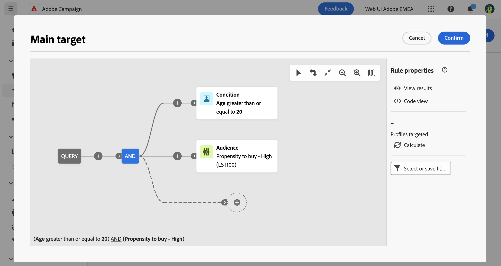

# Creare un pubblico una tantum {#one-time}

Questa sezione descrive come creare un pubblico durante la creazione di una nuova consegna. In questo caso, il targeting dei profili da includere nel pubblico di consegna viene eseguito interrogando il database con il modellatore di query. Il pubblico risultante viene utilizzato una sola volta per questa consegna. Non viene salvato nell’elenco dei tipi di pubblico.

Quando definisci il target principale di una consegna, puoi anche:
* [Selezionare un pubblico esistente](add-audience.md) dall’elenco **[!UICONTROL Tipi di pubblico]**.
* [Caricare un pubblico da un file esterno](file-audience.md) (solo per e-mail).

Per creare un nuovo pubblico una tantum per una consegna, segui questi passaggi:

1. Nella sezione **Pubblico** dell’assistente alla creazione di consegne, fai clic sul pulsante **[!UICONTROL Seleziona pubblico]**.

   {zoomable=&quot;yes&quot;}

1. Seleziona **Crea il tuo** per aprire Query Modeler, che consente di definire la popolazione target filtrando i dati contenuti nel database. [Scopri come utilizzare Query Modeler](../query/query-modeler-overview.md)

   {zoomable=&quot;yes&quot;}

1. Quando la query è pronta, fai clic su **Conferma** per utilizzare il pubblico risultante come target principale della consegna.

   Puoi anche impostare un gruppo di controllo per misurare l’impatto delle campagne. Il gruppo di controllo non riceve il messaggio. Ciò consente di confrontare il comportamento di chi ha ricevuto il messaggio con quello dei contatti che non lo hanno ricevuto. [Ulteriori informazioni](control-group.md)
