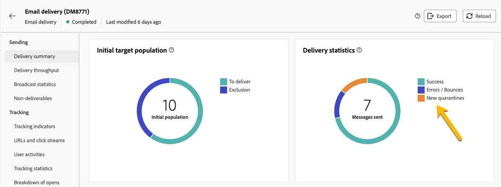

# Quarantena

Adobe Campaign gestisce gli indirizzi in quarantena (e-mail, SMS, notifiche push).

La quarantena si applica solo a un **indirizzo e-mail**, a **numero di telefono** o un **token dispositivo**, ma non al profilo stesso. Ad esempio, un profilo con un indirizzo e-mail messo in quarantena può aggiornare il profilo e immettere un nuovo indirizzo, per poi essere nuovamente indirizzato mediante azioni di consegna. Allo stesso modo, se due profili hanno lo stesso numero di telefono, saranno entrambi interessati se il numero viene messo in quarantena.

>[!CAUTION]
>
>In Adobe Campaign la quarantena distingue tra maiuscole e minuscole.

## Che cos&#39;è la quarantena?

La quarantena è il modo per **gestire gli indirizzi non validi nelle consegne**.

Se una consegna ha un’alta percentuale di indirizzi non validi, può essere considerata come spam. Inserire nell&#39;elenco Bloccati La gestione di tali indirizzi con quarantena evita di essere dai provider Internet. Questo è importante per la tua reputazione.

Quando un indirizzo viene messo in quarantena in Adobe Campaign, il profilo viene escluso automaticamente dal target durante l’analisi della consegna.

La quarantena ti aiuterà a ridurre i costi di invio degli SMS escludendo numeri di telefono errati dalle consegne.

## Perché un indirizzo viene messo in quarantena

Molti motivi possono mettere un indirizzo in quarantena :

- Per gli SMS, numeri di telefono errati
- Per gli SMS, quando il profilo risponde a un messaggio SMS con una parola chiave come &quot;STOP&quot;
- Per l’e-mail, quando il messaggio viene segnalato come spam. Il messaggio viene automaticamente reindirizzato a una casella di posta tecnica gestita dall’Adobe. Inserire nell&#39;elenco Bloccati L’indirizzo e-mail dell’utente viene quindi messo automaticamente in quarantena con lo stato di.
- Un indirizzo e-mail può essere messo in quarantena, ad esempio, quando la cassetta postale è piena, se l’indirizzo non esiste o se il server e-mail non è disponibile.

[Ulteriori informazioni sugli errori di consegna](https://experienceleague.adobe.com/en/docs/campaign-classic/using/sending-messages/monitoring-deliveries/understanding-delivery-failures)

## Dove trovare gli indirizzi di quarantena

Puoi visualizzare tutti gli indirizzi in quarantena della tua istanza in **[!UICONTROL Esplora]** > **[!UICONTROL Amministrazione]** > **[!UICONTROL Campaign Management]** > **[!UICONTROL Gestione non consegnabili]** > **[!UICONTROL Non consegnabili e indirizzi]**. In questa sezione sono elencati gli elementi messi in quarantena per i canali e-mail, SMS e di notifiche push.

{zoomable="yes"}

Puoi anche avere il rapporto sulla quarantena nella tua istanza:

{zoomable="yes"}

Per ogni consegna, puoi anche controllare il rapporto di riepilogo della consegna: mostra il numero di indirizzi in quarantena nel target della consegna:

{zoomable="yes"}

Puoi avere più possibilità di gestire gli indirizzi in quarantena nella console Adobe Campaign. [Ulteriori informazioni](https://experienceleague.adobe.com/en/docs/campaign/campaign-v8/send/failures/quarantines#access-quarantined-addresses)
