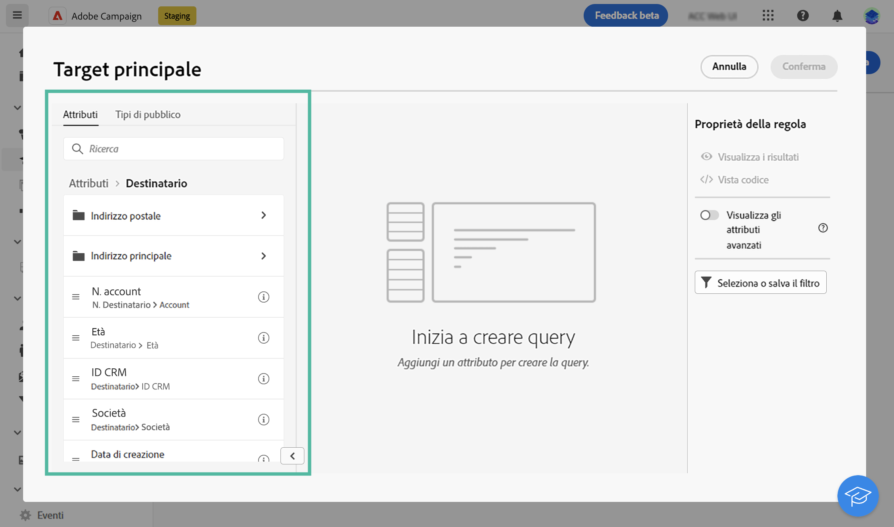
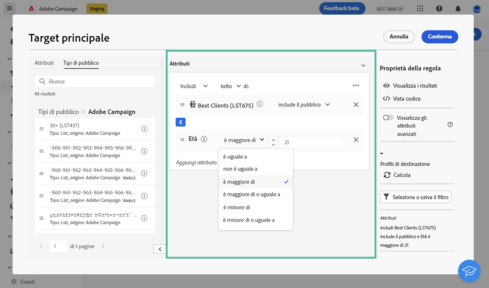
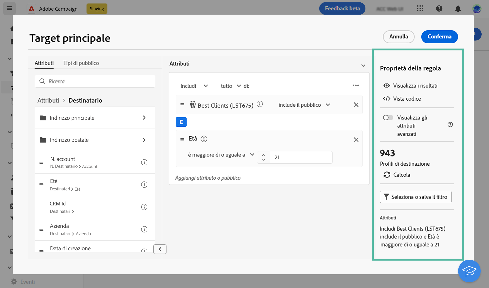
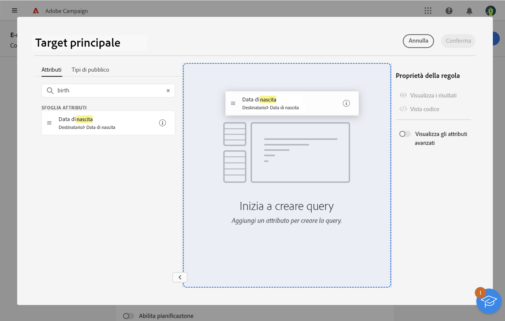
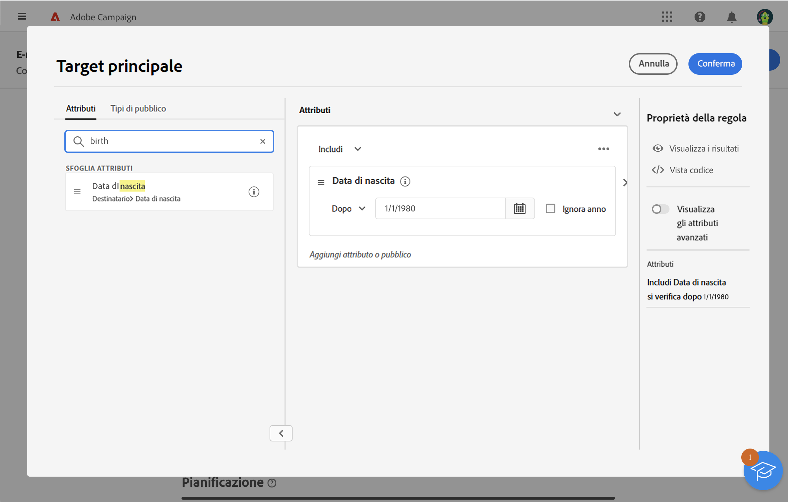
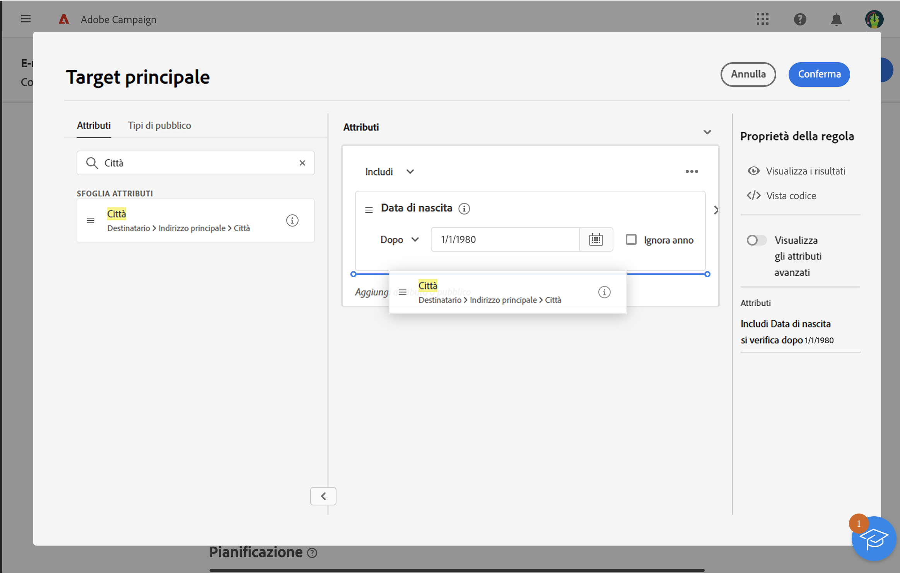
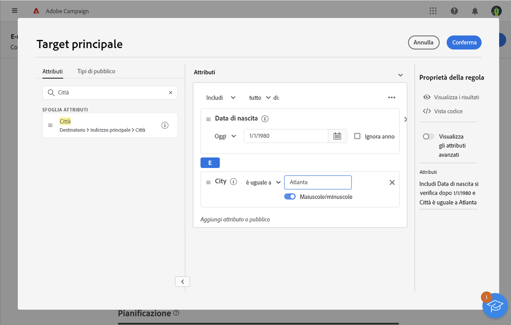
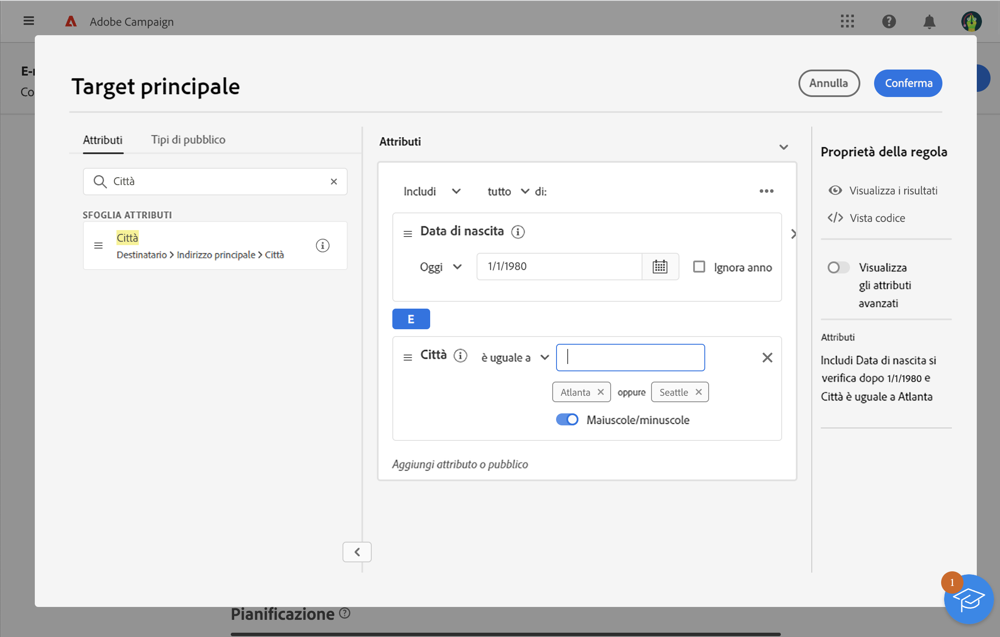
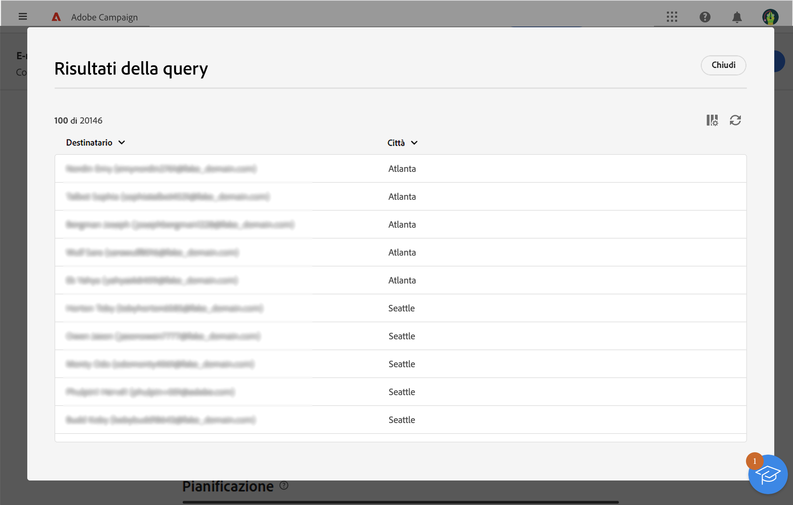

# Utilizzare il generatore di regole {#segment-builder}

Il generatore di regole consente di definire la popolazione target della consegna filtrando i dati contenuti nel database. Puoi utilizzarlo per creare un pubblico da un flusso di lavoro utilizzando l’attività **[!UICONTROL Crea pubblico]** o direttamente durante la creazione di una consegna per creare un pubblico una tantum.

* [Scopri come creare e salvare un pubblico](create-audience.md)
* [Scopri come creare un pubblico una tantum per una consegna](one-time-audience.md)

## La palette

La palette, situata a sinistra, contiene tutti gli elementi in base a cui applicare un filtro per creare un pubblico. Puoi usare la barra di ricerca per trovare rapidamente gli elementi. Per poter essere configurate e prese in considerazione, le sezioni della palette devono essere spostate nell’area di lavoro centrale.

{zoomable=&quot;yes&quot;}{width="70%" align="left"}

La palette è divisa in due schede:

* **Attributi**: questa scheda consente di accedere a tutti i campi disponibili provenienti dallo schema. L’elenco dei campi dipende dallo schema di targeting definito nel modello e-mail.

* **Tipi di pubblico**: questa scheda consente di filtrare utilizzando uno dei tipi di pubblico esistenti definiti nella console Campaign Classic o da Adobe Experience Platform. Scopri come monitorare e gestire i tipi di pubblico in [questa sezione](manage-audience.md)

  >[!NOTE]
  >
  >Per sfruttare i tipi di pubblico di Adobe Experience Platform, devi configurare l’integrazione con le destinazioni. Consulta la sezione [Documentazione sulle destinazioni di Adobe Experience Platform](https://experienceleague.adobe.com/docs/experience-platform/destinations/home.html?lang=it){target="_blank"}.

## L’area di lavoro

L’area di lavoro è la zona centrale dove puoi configurare e combinare le regole in base agli elementi aggiunti dalla palette. Per aggiungere una nuova regola, trascina una sezione dalla palette e rilasciala nell’area di lavoro. Puoi quindi visualizzare opzioni specifiche per il contesto in base al tipo di dati aggiunti.

{zoomable=&quot;yes&quot;}{width="70%" align="left"}

## Il riquadro delle proprietà delle regole

Sul lato destro, il riquadro **Proprietà delle regole** consente di eseguire le azioni elencate di seguito.

{zoomable=&quot;yes&quot;}{width="70%" align="left"}

* **Visualizza i risultati:** visualizza l’elenco dei destinatari target del pubblico.
* **Vista codice**: visualizza una versione del pubblico basata su codice in SQL.
* **Visualizza gli attributi avanzati**: seleziona questa opzione per visualizzare l’elenco completo degli attributi nella palette a sinistra: nodi, raggruppamenti, collegamenti 1-1, collegamenti 1-N.
* **Calcola**: aggiorna e visualizza il numero di profili interessati dalla query.
* **Seleziona o salva il filtro**: utilizza un filtro predefinito per filtrare la query oppure salvala come nuovo filtro per riutilizzarla in futuro. [Scopri come utilizzare i filtri preimpostati](../get-started/predefined-filters.md)

  >[!IMPORTANT]
  >
  >In tale versione del prodotto, alcuni filtri preimpostati non sono disponibili nell’interfaccia utente. Tuttavia, puoi ancora usarli. [Ulteriori informazioni](../get-started/guardrails.md#predefined-filters-filters-guardrails-limitations)

* **Attributi**: visualizza una descrizione del pubblico creato.

## Esempio

In questo esempio, creiamo un pubblico per impostare come target tutti i clienti che vivono ad Atlanta o a Seattle e sono nati dopo il 1980.

1. Nella scheda **Attributi** della palette, cerca il campo **Data di nascita**. Trascina la sezione e rilasciala sull’area di lavoro.

   {zoomable=&quot;yes&quot;}

1. Nell’area di lavoro, scegli l’operatore **Dopo** e immetti la data desiderata.

   {zoomable=&quot;yes&quot;}

1. Nella palette, cerca il campo **Città** e aggiungilo all’area di lavoro sotto la prima regola.

   {zoomable=&quot;yes&quot;}

1. Nel campo di testo, immetti il nome della prima città, quindi premi Invio.

   {zoomable=&quot;yes&quot;}

1. Ripeti questa azione per il nome della seconda città.

   {zoomable=&quot;yes&quot;}

1. Fai clic su **Visualizza i risultati** per visualizzare l’elenco e il numero di destinatari corrispondenti alla query. Puoi anche aggiungere delle colonne per visualizzare e controllare i dati. Nel nostro esempio, aggiungi la colonna **Città** e dovresti vedere Atlanta e Seattle.

   {zoomable=&quot;yes&quot;}

1. Fai clic su **Conferma**.