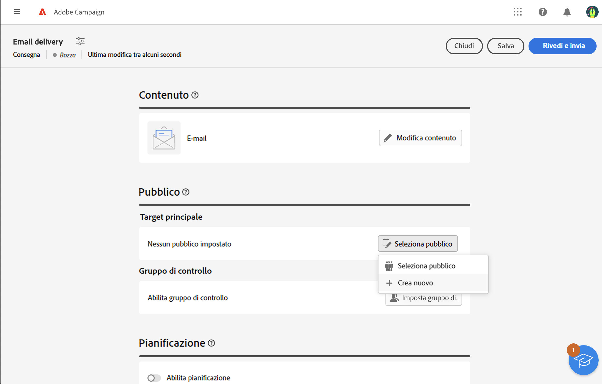

# Definire un pubblico con il generatore di regole {#segment-builder}

Questa sezione descrive come creare un pubblico durante la progettazione di un nuovo messaggio e-mail. Il pubblico creato può essere utilizzato solo in questa e-mail.

Il generatore di regole consente di definire la popolazione target del messaggio filtrando i dati contenuti nel database. Per selezionare un pubblico esistente, consulta questa [sezione](add-audience.md).

Per ulteriori informazioni sul generatore di regole, consulta la [Documentazione del servizio di segmentazione](https://experienceleague.adobe.com/docs/experience-platform/segmentation/ui/segment-builder.html?lang=it).

Per creare un nuovo pubblico durante la progettazione di un’e-mail, effettua le seguenti operazioni:

1. Nella sezione **Pubblico** dell’assistente alla creazione di consegne, fai clic sul pulsante **[!UICONTROL Seleziona pubblico]**.

   

1. Seleziona **Crea nuovo**. Viene visualizzato il generatore di regole.

   

## La palette

La palette, situata a sinistra, contiene tutti gli elementi in base a cui applicare un filtro per creare un pubblico. Per poter essere configurate e prese in considerazione, le sezioni della palette devono essere spostate nell’area di lavoro centrale. La palette è divisa in due schede:

* **Attributi**: questa scheda consente di accedere a tutti i campi disponibili provenienti dallo schema. L’elenco dei campi dipende dallo schema di targeting definito nel modello e-mail.

   {width="70%" align="left"}

* **Tipi di pubblico**: questa scheda consente di filtrare utilizzando uno dei tipi di pubblico esistenti definiti nella console Campaign Classic o da Adobe Experience Platform.

   {width="70%" align="left"}

   >[!NOTE]
   >
   >Per sfruttare i tipi di pubblico di Adobe Experience Platform, devi configurare l’integrazione con le destinazioni. Consulta la [documentazione sulle destinazioni](https://experienceleague.adobe.com/docs/experience-platform/destinations/home.html?lang=it){target="_blank"}.

Puoi usare la barra di ricerca per trovare rapidamente gli elementi.

## L’area di lavoro

L’area di lavoro è la zona centrale dove puoi configurare e combinare le regole in base agli elementi aggiunti dalla palette. Per aggiungere una nuova regola, trascina una sezione dalla palette e rilasciala nell’area di lavoro. Puoi quindi visualizzare opzioni specifiche per il contesto in base al tipo di dati aggiunti.

{width="70%" align="left"}

## Il riquadro delle proprietà delle regole

Sul lato destro, il riquadro **Proprietà delle regole** consente di eseguire le azioni seguenti:

{width="70%" align="left"}

* **Visualizza i risultati:** visualizza l’elenco dei destinatari target del pubblico.
* **Vista codice**: visualizza una versione del pubblico basata su codice in SQL.
* **Visualizza gli attributi avanzati**: seleziona questa opzione per visualizzare l’elenco completo degli attributi nella palette a sinistra: nodi, raggruppamenti, collegamenti 1-1, collegamenti 1-N.
* **Attributi**: visualizza una descrizione del pubblico creato.

## Esempio

In questo esempio, creiamo un pubblico per impostare come target tutti i clienti che vivono ad Atlanta o a Seattle e sono nati dopo il 1980.

1. Nella scheda **Attributi** della palette, cerca il campo **Data di nascita**. Trascina la sezione e rilasciala sull’area di lavoro.

   

1. Nell’area di lavoro, scegli l’operatore **Dopo** e immetti la data desiderata.

   

1. Nella palette, cerca il campo **Città** e aggiungilo all’area di lavoro sotto la prima regola.

   

1. Nel campo di testo, immetti il nome della prima città, quindi premi Invio.

   

1. Ripeti questa azione per il nome della seconda città.

   

1. Fai clic su **Visualizza i risultati** per visualizzare l’elenco e il numero di destinatari corrispondenti alla query. Puoi anche aggiungere delle colonne per visualizzare e controllare i dati. Nel nostro esempio, aggiungi la colonna **Città** e dovresti vedere Atlanta e Seattle.

   

1. Fai clic su **Conferma**.

Il pubblico è definito e pronto per essere utilizzato nell’e-mail.