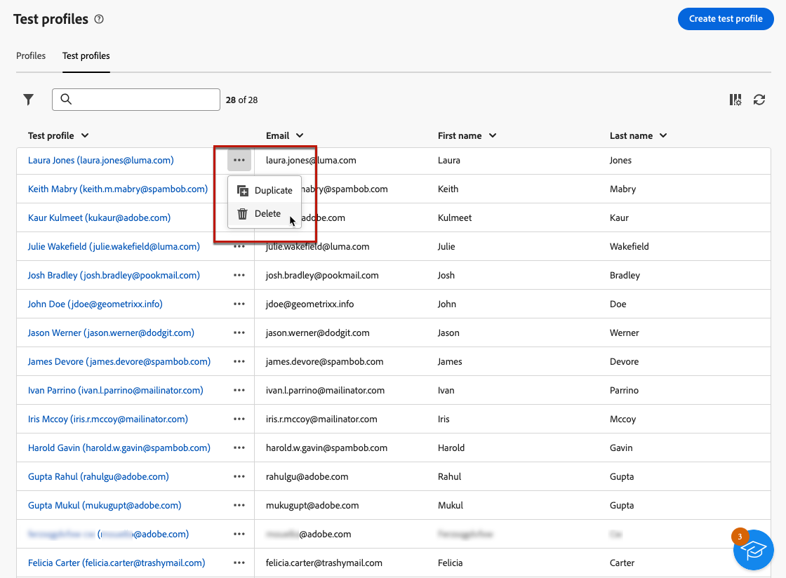

# Creare e gestire profili di test {#create-test-profiles}

>[!CONTEXTUALHELP]
>id="acw_recipients_testprofiles_menu"
>title="Creare profili di test"
>abstract="I profili di test sono destinatari aggiuntivi che ti consentono di visualizzare in anteprima e testare la personalizzazione e il rendering prima di inviare i messaggi. Puoi selezionare un profilo di test quando visualizzi l’anteprima del contenuto di un messaggio e inviare bozze ai profili di test per controllare e convalidare il contenuto e le impostazioni del messaggio."

I profili di test vengono utilizzati per inviare bozze e convalidare il contenuto e le impostazioni del messaggio. Questi profili sono destinatari aggiuntivi che ti consentono di visualizzare in anteprima e testare la personalizzazione e il rendering prima di inviare i messaggi. Puoi selezionare un profilo di test durante l’anteprima di un messaggio e inviare bozze ai profili di test per controllare e convalidare il contenuto e le impostazioni del messaggio.

➡️ [Guarda il video su questa funzione](#video)

<!--Learn more about test profiles in the [Campaign v8 (client console) documentation](https://experienceleague.adobe.com/docs/campaign/campaign-v8/audience/add-profiles/test-profiles.html?lang=it){target="_blank"}.-->

I passaggi per inviare bozze ai profili di test sono descritti in [questa sezione](../preview-test/test-deliveries.md#test-profiles).

>[!NOTE]
>
>* I profili di test vengono creati come indirizzi di seed nella console Client.
>
>* I profili di test vengono automaticamente esclusi dai rapporti sulle seguenti statistiche di consegna: **[!UICONTROL Clic]**, **[!UICONTROL Aperture]**, **[!UICONTROL Annullamenti abbonamenti]**.

## Accedere e gestire i profili di test {#access-test-profiles}

Per accedere all&#39;elenco dei profili di test, seleziona **[!UICONTROL Gestione clienti]** > **[!UICONTROL Profili]** dal menu a sinistra e fai clic sulla scheda **[!UICONTROL Profili di test]**.

{zoomable="yes"}

* Puoi filtrare in base a una [cartella](../get-started/permissions.md#folders) specifica utilizzando l&#39;elenco a discesa oppure aggiungere regole utilizzando [modellatore query](../query/query-modeler-overview.md).

  {zoomable="yes"}

* Puoi duplicare qualsiasi profilo di test e aggiornarlo in base alle esigenze. I passaggi per modificare un profilo di test sono gli stessi di quando [si crea un profilo di test](#create-test-profile).

* Per eliminare un profilo di test, selezionare l&#39;opzione corrispondente dal menu **[!UICONTROL Altre azioni]**.

  {zoomable="yes"}

* Per modificare un profilo di test, fai clic sull’elemento desiderato dall’elenco. I passaggi per modificare un profilo di test sono gli stessi di quando [si crea un profilo di test](#create-test-profile).

Puoi anche accedere ai profili di test tramite la visualizzazione **[!UICONTROL Explorer]** dal nodo **[!UICONTROL Risorse]** > **[!UICONTROL Gestione campagne]** > **[!UICONTROL Indirizzi seed]**.

Da qui è possibile sfogliare, creare e gestire cartelle o sottocartelle, nonché verificare le autorizzazioni associate. [Scopri come creare le cartelle](../get-started/permissions.md#folders)

{zoomable="yes"}

Dalla visualizzazione **[!UICONTROL Explorer]**, è inoltre possibile filtrare, eliminare, modificare e [creare](#create-test-profile) profili di test.

## Creare un profilo di test {#create-test-profile}

>[!CONTEXTUALHELP]
>id="acw_recipients_testprofiles_additionaldata"
>title="Dati aggiuntivi dei profili di test"
>abstract="Immetti i dati di personalizzazione utilizzati per le consegne create nei flussi di lavoro di gestione dati a cui desideri assegnare un valore specifico."

Per creare un profilo di test, effettua le seguenti operazioni:

1. Selezionare **[!UICONTROL Gestione clienti]** > **[!UICONTROL Profili]** e selezionare la scheda **[!UICONTROL Profili di test]**.

1. Fare clic sul pulsante **[!UICONTROL Crea profilo di test]**.

   {zoomable="yes"}

1. Compila i dettagli del profilo di test, se necessario. <!--Most of the fields are the same as when creating profiles. [Learn more]-->

   {zoomable="yes"}

   >[!NOTE]
   >
   >Il campo **[!UICONTROL Etichetta]** viene compilato automaticamente con il nome e il cognome definiti.

1. Per impostazione predefinita, i profili di test sono archiviati nella cartella **[!UICONTROL Indirizzi seed]**. Puoi modificarlo navigando nella posizione desiderata. [Scopri come utilizzare le cartelle](../get-started/permissions.md#folders)

   <!--{zoomable="yes"}-->

<!--
You do not need to enter all fields of each tab when creating a seed address. Missing personalization elements are entered randomly during delivery analysis. (Not valid?)
-->

1. Nella sezione **[!UICONTROL Informazioni di contatto]** immettere l&#39;indirizzo di posta elettronica e altri dati rilevanti. L’indirizzo e-mail viene visualizzato tra parentesi dopo l’etichetta del profilo di test.

   {zoomable="yes"}

1. Se si seleziona la casella di controllo **[!UICONTROL Non contattare più (tramite alcun canale)]**, il profilo di test è in fase di inserisco nell&#39;elenco Bloccati di test di. Tale destinatario non è più destinatario di alcun canale (e-mail, SMS, ecc.).

1. Nella scheda **[!UICONTROL Dati aggiuntivi]**, immetti i dati di personalizzazione utilizzati per le consegne create nei flussi di lavoro di gestione dei dati e a cui desideri assegnare un valore specifico. [Ulteriori informazioni sui workflow](../workflows/gs-workflows.md)

   {zoomable="yes"}

   Verificare che siano stati definiti dati di destinazione aggiuntivi con un alias che inizia con &#39;@&#39; nell&#39;attività del flusso di lavoro **[!UICONTROL Arricchimento]**. In caso contrario, non puoi utilizzarlo correttamente con gli indirizzi seed nell’attività di consegna. [Ulteriori informazioni sull&#39;attività Enrichment](../workflows/activities/enrichment.md)

1. Fai clic sul pulsante **[!UICONTROL Salva]**.

Il profilo di test appena creato è ora pronto per essere utilizzato per inviare una bozza. [Ulteriori informazioni](../preview-test/test-deliveries.md#test-profiles)

<!--Use test profiles in Direct mail? cf v7/v8-->

## Video dimostrativo {#video}

Scopri come creare e gestire i profili di test utilizzando l’interfaccia utente web di Campaign.

>[!VIDEO](https://video.tv.adobe.com/v/3442844?quality=12)