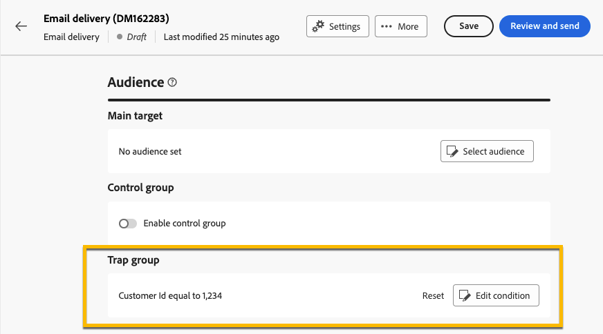
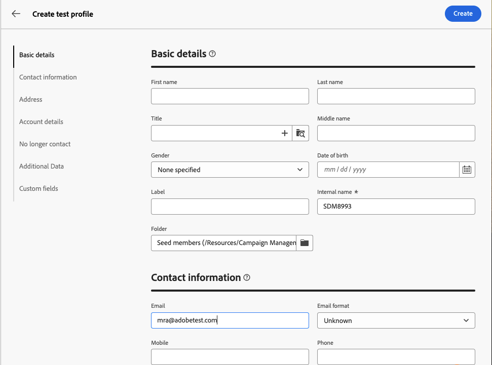

# Utilizzare un gruppo di trappole {#trap-group}

>[!CONTEXTUALHELP]
>id="acw_homepage_welcome_rn2"
>title="Gruppo spia"
>abstract="Puoi utilizzare un gruppo di trappole per includere indirizzi specifici nelle consegne per monitorare e verificare il processo di distribuzione eseguendo il targeting di profili che non corrispondono ai criteri di destinazione definiti."
>additional-url="https://experienceleague.adobe.com/docs/campaign-web/v8/release-notes/release-notes.html?lang=it" text="Consulta le note sulla versione"

Un **[!UICONTROL gruppo trap]** (noto anche come **[!UICONTROL elenco seed]**) viene utilizzato per includere indirizzi specifici nelle consegne per monitorare e verificare il processo di distribuzione eseguendo il targeting di profili che non corrispondono ai criteri di destinazione definiti. In questo modo, i destinatari che non rientrano nell’ambito di consegna possono ricevere la consegna, come farebbe qualsiasi altro destinatario.

Un **[!UICONTROL gruppo trap]** è un gruppo di **[!UICONTROL indirizzi seed]**, denominato **[!UICONTROL Profilo di test]** nell&#39;interfaccia utente Web di Campaign.

## Perché utilizzare un gruppo di trappole {#why-trap-group}

È possibile utilizzare **[!UICONTROL gruppo trap]**:

1. **Come prova**: ogni membro del **[!UICONTROL gruppo di trap]** riceverà la consegna come se facesse parte del pubblico.

1. **Per proteggere la tua mailing list**: ricevendo ciò che il pubblico riceverà, ogni **[!UICONTROL profilo di test]** del **[!UICONTROL gruppo di trap]** verrà notato se la mailing list viene utilizzata da una terza parte.

>[!NOTE]
>
>Oltre a [inviare bozze durante la creazione della consegna](../email/create-email.md#preview-test) e dal [gruppo di controllo](control-group.md), l&#39;aggiunta di un gruppo di trap è un buon modo per testare il pubblico.

## Informazioni sui gruppi di trap {#about-trap-group}

I profili di test vengono automaticamente esclusi dai rapporti sulle seguenti statistiche di consegna: **Clic**, **Aperture**, **Annullamenti abbonamenti**. I rapporti riguardano solo il pubblico reale.

Per una consegna e-mail, è necessario solo l&#39;indirizzo e-mail per il **[!UICONTROL gruppo di trap]**; la personalizzazione degli altri campi verrà compilata in modo casuale da Campaign.

## Aggiungere un gruppo di trappole in una consegna {#trap-group-in-delivery}

Per impostare un **[!UICONTROL gruppo di trap]**, vai alle impostazioni **[!UICONTROL Pubblico]** della consegna. Sono disponibili 2 opzioni:

* [Selezionare i profili di test](#select-test-profile)
* [Creare una condizione](#create-condition)

{zoomable="yes"}

### Selezionare i profili di test {#select-test-profiles}

Quando scegli **Seleziona profili di test**, puoi utilizzare il pulsante **Aggiungi profili di test** come illustrato di seguito:

{zoomable="yes"}

Quando fai clic sul pulsante, puoi accedere ai profili di test e aggiungere il **[!UICONTROL gruppo di trap]**. Seleziona quelli che desideri utilizzare.

Puoi anche creare nuovi profili di test. [Ulteriori informazioni](#create-seed)

{zoomable="yes"}

Quando confermi i profili di test, verifica di disporre del numero corretto in **[!UICONTROL Gruppo di trap]**.

{zoomable="yes"}

### Creare una condizione {#create-condition}

Con l&#39;opzione **[!UICONTROL Crea condizione]**, puoi creare una query per definire i profili di test che desideri utilizzare:

{zoomable="yes"}

La query viene visualizzata in **[!UICONTROL Gruppo di trap]**.

{zoomable="yes"}

## Creare un nuovo profilo di test {#create-seed}

È possibile creare un nuovo **[!UICONTROL profilo di test]** dalla cartella **[!UICONTROL Explorer]** > **[!UICONTROL Risorse]** > **[!UICONTROL Campaign Management]** > **[!UICONTROL Membri seed]**.

{zoomable="yes"}

Configura tutte le impostazioni relative al **[!UICONTROL profilo di test]** come per qualsiasi profilo:

{zoomable="yes"}