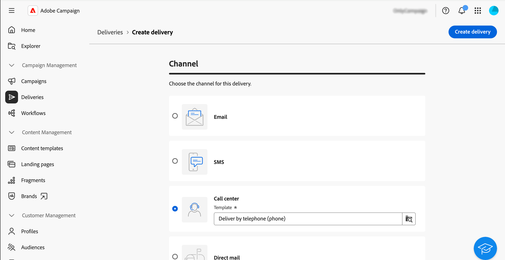

# Creare e inviare una consegna al call center {#create-call-center}

Puoi creare una consegna di call center indipendente o nel contesto di un flusso di lavoro della campagna. I passaggi seguenti descrivono la procedura per una consegna autonoma (una tantum). Se lavori nel contesto di un flusso di lavoro della campagna, i passaggi di creazione sono descritti in [questa sezione](../workflows/activities/channels.md#create-a-delivery-in-a-campaign-workflow).

Per creare e inviare una nuova consegna standalone di call center, segui questi passaggi principali:

1. Crea la consegna, [ulteriori informazioni](#create-delivery)
1. Seleziona il pubblico, [ulteriori informazioni](#select-audience)
1. Modifica il contenuto, [leggi tutto](#edit-content)
1. Anteprima e invio della consegna, [ulteriori informazioni](#preview-send)

## Creare la consegna{#create-delivery}

Per creare la consegna e configurarne le proprietà, segui i passaggi seguenti:

1. Seleziona il menu **[!UICONTROL Consegne]** e fai clic sul pulsante **[!UICONTROL Crea consegna]**.

1. Scegli **[!UICONTROL Call center]** come canale e fai clic su **[!UICONTROL Crea consegna]** per confermare.

   {zoomable="yes"}

   >[!NOTE]
   >
   >Se desideri selezionare un modello diverso, fai riferimento a questa [pagina](../msg/delivery-template.md).

1. In **[!UICONTROL Proprietà]**, immetti un **[!UICONTROL Etichetta]** per la consegna. Ulteriori opzioni sono descritte in questa [sezione](../email/create-email.md#create-email).

   {zoomable="yes"}

>[!NOTE]
>
>Puoi pianificare la consegna in modo che venga inviata in una data specifica. Per ulteriori informazioni, consulta questa [sezione](../msg/gs-deliveries.md#gs-schedule).

## Selezionare il pubblico{#select-audience}

Ora devi definire il pubblico di destinazione per il file di estrazione.

1. Dalla sezione **[!UICONTROL Pubblico]** della pagina di consegna, fai clic su **[!UICONTROL Seleziona pubblico]**.

   {zoomable="yes"}

1. Scegli un pubblico esistente o creane uno tuo.

   * [Scopri come selezionare un pubblico esistente](../audience/add-audience.md)
   * [Scopri come creare un nuovo pubblico](../audience/one-time-audience.md)

   {zoomable="yes"}

>[!NOTE]
>
>I destinatari del call center devono contenere almeno i propri nomi e numeri di telefono. Tutti i destinatari con informazioni incomplete saranno esclusi dalle consegne del call center.
>
>Per informazioni su come configurare i gruppi di controllo, consulta questa [pagina](../audience/control-group.md)

## Modificare il contenuto{#edit-content}

Ora, progettiamo il contenuto del file di estrazione che verrà generato dalla consegna del call center.

1. Dalla pagina di consegna, fai clic sul pulsante **[!UICONTROL Modifica contenuto]**.

   {zoomable="yes"}

1. Specificare il campo **[!UICONTROL Nome file]**. Per informazioni su come personalizzare il nome del file, consulta questa [pagina](../personalization/personalize.md).

1. Seleziona un **[!UICONTROL Formato file]**: **Testo**, **Testo tramite colonne a larghezza fissa**, **CSV (Excel)** o **XML**.

   {zoomable="yes"}

   >[!NOTE]
   >
   >Le opzioni del formato di estrazione sono descritte dettagliatamente in questa [pagina](../direct-mail/content-direct-mail.md#properties).

1. Attiva l&#39;opzione **[!UICONTROL Quantità richiesta]** se non puoi limitare il numero di destinatari per la consegna.

1. Nella sezione **[!UICONTROL Contenuto]**, fai clic sul pulsante **[!UICONTROL Aggiungi attributo]** per creare una nuova colonna da visualizzare nel file di estrazione.

1. Scegli l’attributo da visualizzare nella colonna, quindi conferma. Per ulteriori informazioni su come selezionare gli attributi e aggiungerli ai preferiti, consulta questa [pagina](../get-started/attributes.md).

   

1. Ripeti questi passaggi per aggiungere tutte le colonne necessarie per il file di estrazione.

   Puoi quindi modificare gli attributi, ordinare il file di estrazione o modificare la posizione delle colonne. Per ulteriori informazioni, consulta questa [pagina](../direct-mail/content-direct-mail.md#content).

   

## Anteprima e invio della consegna{#preview-send}

Quando il contenuto della consegna è pronto, puoi visualizzarlo in anteprima utilizzando i profili di test e inviare le bozze. Puoi quindi inviare la consegna al call center per generare il file di estrazione.

I passaggi principali per visualizzare in anteprima e inviare il file di estrazione sono i seguenti. Ulteriori dettagli sono disponibili in [questa pagina](../direct-mail/send-direct-mail.md).

1. Dalla pagina del contenuto della consegna, utilizza **[!UICONTROL Simula contenuto]**.

   {zoomable="yes"}

1. Seleziona uno o più profili di test per visualizzare in anteprima il contenuto personalizzato. Puoi anche inviare delle bozze. [Ulteriori informazioni](../direct-mail/send-direct-mail.md#preview-dm)

   {zoomable="yes"}

1. Dalla pagina di consegna, fai clic su **[!UICONTROL Rivedi e invia]**.

   {zoomable="yes"}

1. Fai clic su **[!UICONTROL Prepara]** e controlla l&#39;avanzamento e le statistiche fornite, quindi conferma.

   {zoomable="yes"}

1. Fai clic su **[!UICONTROL Invia]** per procedere con il processo di invio finale, quindi conferma.

Una volta inviata la consegna, il file di estrazione viene generato ed esportato automaticamente nella posizione specificata nell&#39;account esterno **[!UICONTROL Routing]** selezionato nelle [impostazioni avanzate](../advanced-settings/delivery-settings.md) del modello di consegna.

Tieni traccia dei dati KPI (Key Performance Indicator) dalla pagina di consegna e dei dati dal menu **[!UICONTROL Registri]**.

Inizia a misurare l’impatto del messaggio con i rapporti incorporati. [Ulteriori informazioni](../reporting/direct-mail.md)

