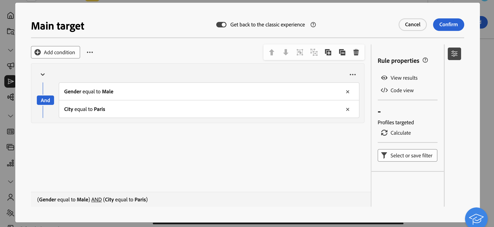

# Introduzione ai canali personalizzati {#gs-custom-channel}

Puoi orchestrare ed eseguire le consegne direttamente dall’interfaccia utente web di Adobe Campaign, in base ai canali personalizzati integrati con terze parti. La configurazione del canale personalizzato viene eseguita nella console client.

Sono supportati due tipi di canali personalizzati: esterno e API. Con i canali esterni, Campaign genera file di esportazione personalizzabili con tutti i dati di contatto e personalizzazione necessari. Con i canali API, i messaggi vengono inviati ai profili di destinazione tramite l’API configurata.

Puoi aggiungere consegne di canale personalizzate nei flussi di lavoro o semplicemente utilizzarle come consegne autonome.

I passaggi seguenti descrivono la procedura per una consegna autonoma (una tantum). La maggior parte dei passaggi è simile alle consegne del call center. Per ulteriori dettagli, consulta questa [pagina](../call-center/create-call-center.md).

Per inviare una nuova consegna personalizzata autonoma, segui i passaggi principali seguenti:

1. Configura il canale personalizzato, [ulteriori informazioni](#create-channel)
1. Crea la consegna, [ulteriori informazioni](#create-delivery)
1. Definisci il pubblico, [ulteriori informazioni](#select-audience)
1. Modifica il contenuto, [leggi tutto](#edit-content)
1. Anteprima e invio della consegna, [ulteriori informazioni](#preview-send)

## Configurare il canale personalizzato{#create-channel}

Innanzitutto, devi configurare il canale personalizzato. Di seguito sono riportati i passaggi principali da eseguire nella console client. Questi passaggi sono comuni ai canali esterni e API personalizzati:

1. Configura lo schema per aggiungere il nuovo canale all’elenco dei canali disponibili. [Ulteriori informazioni](https://experienceleague.adobe.com/docs/campaign/campaign-v8/send/custom-channel.html?lang=it#configure-schema){target="_blank"}
1. Crea un nuovo account esterno di indirizzamento. [Ulteriori informazioni](https://experienceleague.adobe.com/docs/campaign/campaign-v8/send/custom-channel.html?lang=it#reate-ext-account){target="_blank"}
1. Crea un nuovo modello di consegna associato al nuovo canale. [Ulteriori informazioni](https://experienceleague.adobe.com/docs/campaign/campaign-v8/send/custom-channel.html?lang=it#create-template){target="_blank"}

I canali API personalizzati richiedono una configurazione aggiuntiva. [Ulteriori informazioni](https://experienceleague.adobe.com/docs/campaign/campaign-v8/send/custom-channel.html?lang=it#api-additional){target="_blank"}

## Creare la consegna{#create-delivery}

Per creare la consegna e configurarne le proprietà, segui i passaggi seguenti:

1. Seleziona il menu **[!UICONTROL Consegne]** e fai clic sul pulsante **[!UICONTROL Crea consegna]**.

1. Scegli il canale personalizzato desiderato, seleziona il modello associato e fai clic su **[!UICONTROL Crea consegna]** per confermare.

   {zoomable="yes"}

1. In **[!UICONTROL Proprietà]**, immetti un **[!UICONTROL Etichetta]** per la consegna.

   {zoomable="yes"}

Per ulteriori dettagli sulla creazione della consegna, consulta la [documentazione](../call-center/create-call-center.md#create-delivery) del call center.

## Definire il pubblico{#select-audience}

Ora devi definire il pubblico di destinazione.

1. Dalla sezione **[!UICONTROL Pubblico]** del dashboard di consegna, fai clic su **[!UICONTROL Seleziona pubblico]**.

1. Scegli un pubblico esistente o creane uno tuo.

   {zoomable="yes"}

Per ulteriori dettagli sulla definizione del pubblico, consulta la [documentazione](../call-center/create-call-center.md#select-audience) del call center.

## Modificare il contenuto{#edit-content}

Ora modifichiamo il contenuto della consegna.

>[!BEGINTABS]

>[!TAB Canale esterno personalizzato]

1. Dal dashboard di consegna, fai clic sul pulsante **[!UICONTROL Modifica contenuto]**.

1. Specifica un **[!UICONTROL nome file]**, seleziona un **[!UICONTROL formato file]** e aggiungi tutte le colonne necessarie per il file di estrazione.

   

>[!TAB Canale API personalizzato]

1. Dal dashboard di consegna, fai clic sul pulsante **[!UICONTROL Modifica contenuto]**.

1. Compila i campi in base alle tue esigenze. Per informazioni su come impostare questa schermata, consulta questa [pagina](https://experienceleague.adobe.com/docs/campaign/campaign-v8/send/custom-channel.html?lang=it#api-additional-screen){target="_blank"}.

   

>[!ENDTABS]

Per ulteriori dettagli sull&#39;edizione dei contenuti, consulta la [documentazione](../call-center/create-call-center.md#edit-content) del call center.

## Anteprima e invio della consegna{#preview-send}

Quando il contenuto della consegna è pronto, puoi visualizzarlo in anteprima utilizzando i profili di test. Puoi quindi inviare la consegna per generare il file di estrazione o inviare il messaggio tramite API.

>[!BEGINTABS]

>[!TAB Canale esterno personalizzato]

1. Dal dashboard di consegna, fai clic sul pulsante **[!UICONTROL Modifica contenuto]**.

1. Dalla pagina del contenuto della consegna, fai clic sul pulsante **[!UICONTROL Simula contenuto]** e seleziona i profili di test.

   {zoomable="yes"}

>[!TAB Canale API personalizzato]

1. Dal dashboard di consegna, fai clic sul pulsante **[!UICONTROL Modifica contenuto]**.

1. Dalla pagina del contenuto della consegna, fai clic sul pulsante **[!UICONTROL Simula contenuto]** e seleziona i profili di test.

1. Sul lato destro, fare clic su **Apri anteprima**. Questa funzionalità deve essere configurata utilizzando JSSP. Consulta [questa pagina](https://experienceleague.adobe.com/docs/campaign/campaign-v8/send/custom-channel.html?lang=it#api-additional-preview){target="_blank"}.

   {zoomable="yes"}

>[!ENDTABS]

Dal dashboard di consegna, fai clic su **[!UICONTROL Rivedi e invia]** e poi su **[!UICONTROL Prepara]**. Quindi, conferma. Fai clic su **[!UICONTROL Invia]** per procedere con il processo di invio finale, quindi conferma.

{zoomable="yes"}

Per ulteriori dettagli sull&#39;anteprima e l&#39;invio, consulta la [documentazione](../call-center/create-call-center.md#preview-send) del call center.
