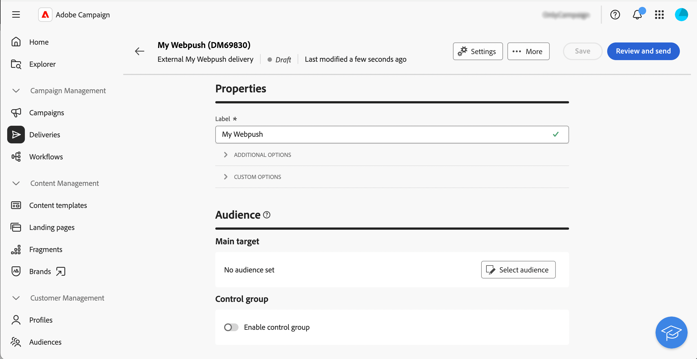

# Introduzione ai canali esterni personalizzati {#gs-custom-channel}

Puoi orchestrare ed eseguire le consegne direttamente dall’interfaccia utente web di Adobe Campaign, in base a canali esterni personalizzati integrati con terze parti. La creazione del canale esterno personalizzato viene eseguita nella console client.

Puoi configurare le consegne esterne di canale personalizzate nei flussi di lavoro o come consegne autonome, definire il pubblico e generare file di esportazione personalizzabili con tutti i dati di contatto e personalizzazione necessari.

>[!NOTE]
>
>Il reporting non è disponibile nell’interfaccia web per le consegne esterne di canale personalizzate. Per accedere ai rapporti, devi passare alla console client.

I passaggi seguenti descrivono la procedura per una consegna autonoma (una tantum). La maggior parte dei passaggi è simile alle consegne del call center. Per ulteriori dettagli, consulta questa [pagina](../call-center/create-call-center.md).

Per creare e inviare una nuova consegna esterna personalizzata autonoma, segui i passaggi principali seguenti:

1. Crea il canale esterno personalizzato, [ulteriori informazioni](#create-channel)
1. Crea la consegna, [ulteriori informazioni](#create-delivery)
1. Definisci il pubblico, [ulteriori informazioni](#select-audience)
1. Modifica il contenuto, [leggi tutto](#edit-content)
1. Anteprima e invio della consegna, [ulteriori informazioni](#preview-send)

## Creare il canale esterno personalizzato{#create-channel}

Innanzitutto, devi configurare il canale esterno personalizzato. Di seguito sono riportati i passaggi principali da eseguire nella console client:

1. Configura lo schema per aggiungere il nuovo canale all’elenco dei canali disponibili.
1. Crea un nuovo account esterno di indirizzamento.
1. Crea un nuovo modello di consegna associato al nuovo canale.

Per ulteriori dettagli, consulta la [documentazione della console client](https://experienceleague.adobe.com/docs/campaign/campaign-v8/send/custom-channel.html?lang=it)

## Creare la consegna{#create-delivery}

Per creare la consegna e configurarne le proprietà, segui i passaggi seguenti:

1. Seleziona il menu **[!UICONTROL Consegne]** e fai clic sul pulsante **[!UICONTROL Crea consegna]**.

1. Scegli il canale esterno personalizzato desiderato, seleziona il modello associato e fai clic su **[!UICONTROL Crea consegna]** per confermare.

   {zoomable="yes"}

1. In **[!UICONTROL Proprietà]**, immetti un **[!UICONTROL Etichetta]** per la consegna.

   {zoomable="yes"}

Per ulteriori dettagli sulla creazione della consegna, consulta la [documentazione](../call-center/create-call-center.md#create-delivery) del call center.

## Definire il pubblico{#select-audience}

Ora devi definire il pubblico di destinazione per il file di estrazione.

1. Dalla sezione **[!UICONTROL Pubblico]** della pagina di consegna, fai clic su **[!UICONTROL Seleziona pubblico]**.

1. Scegli un pubblico esistente o creane uno tuo.

   {zoomable="yes"}

Per ulteriori dettagli sulla definizione del pubblico, consulta la [documentazione](../call-center/create-call-center.md#select-audience) del call center.

## Modificare il contenuto{#edit-content}

Ora, modifichiamo il contenuto del file di estrazione che verrà generato dalla consegna del canale personalizzato.

1. Dalla pagina di consegna, fai clic sul pulsante **[!UICONTROL Modifica contenuto]**.

1. Specifica un **[!UICONTROL nome file]**, seleziona un **[!UICONTROL formato file]** e aggiungi tutte le colonne necessarie per il file di estrazione.

   

Per ulteriori dettagli sull&#39;edizione dei contenuti, consulta la [documentazione](../call-center/create-call-center.md#edit-content) del call center.

## Anteprima e invio della consegna{#preview-send}

Quando il contenuto della consegna è pronto, puoi visualizzarlo in anteprima utilizzando i profili di test e inviare le bozze. Puoi quindi inviare la consegna per generare il file di estrazione.

1. Dalla pagina del contenuto della consegna, fai clic sul pulsante **[!UICONTROL Simula contenuto]** e seleziona i profili di test.

   {zoomable="yes"}

1. Dalla pagina di consegna, fai clic su **[!UICONTROL Rivedi e invia]** e poi su **[!UICONTROL Prepara]**. Quindi, conferma.

   {zoomable="yes"}

1. Fai clic su **[!UICONTROL Invia]** per procedere con il processo di invio finale, quindi conferma.

Per ulteriori dettagli sull&#39;anteprima e l&#39;invio, consulta la [documentazione](../call-center/create-call-center.md#preview-send) del call center.
